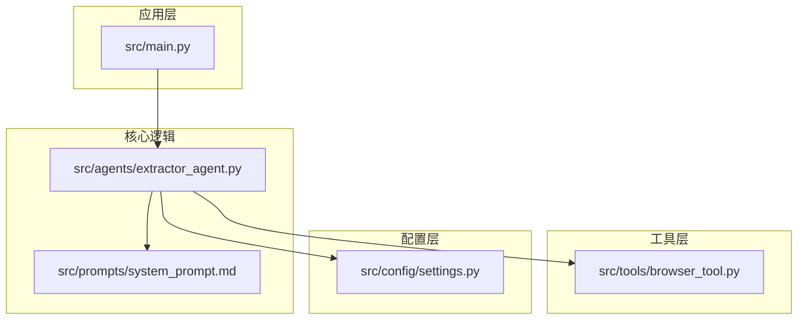
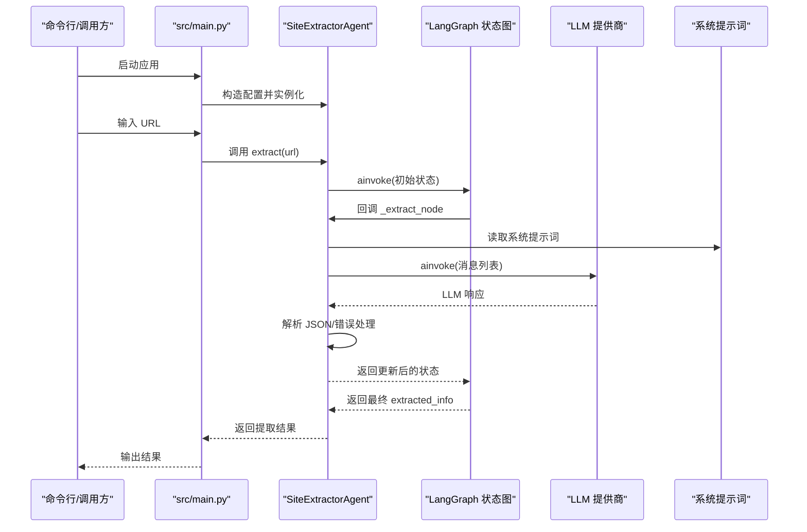
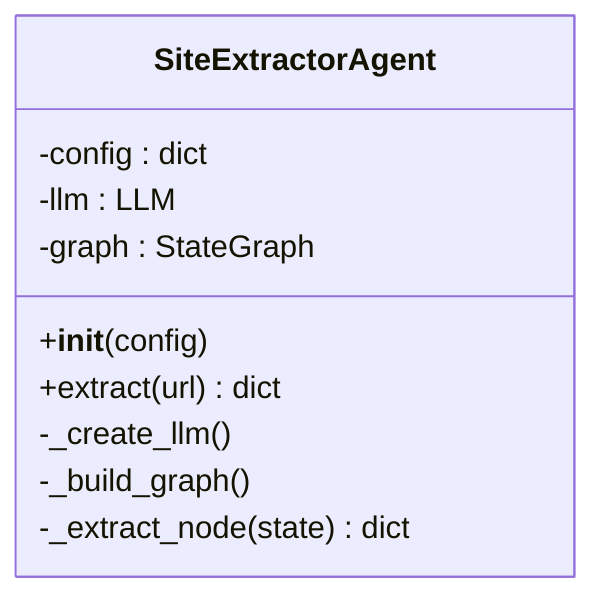
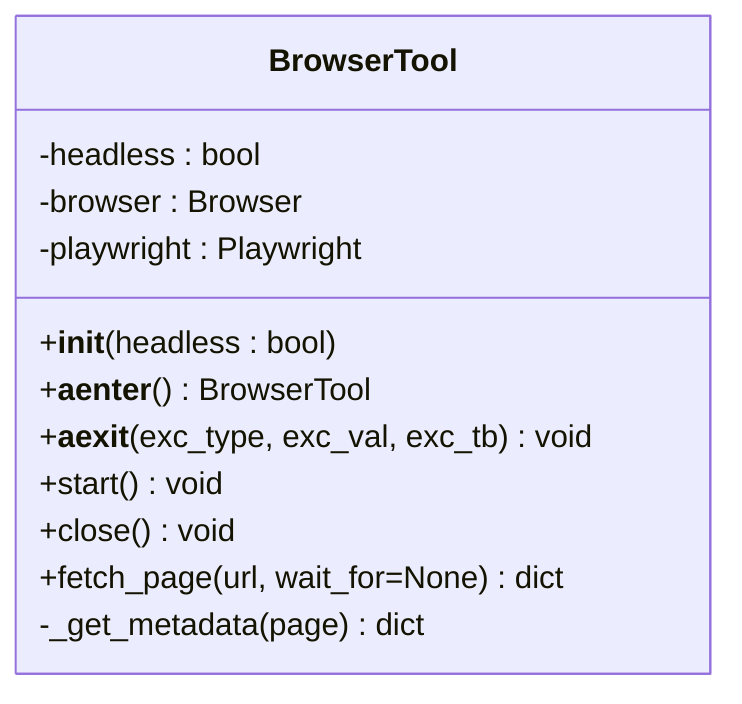
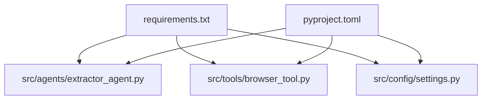

# API 参考

<cite>
**本文引用的文件**
- [src/agents/extractor_agent.py](file://src/agents/extractor_agent.py)
- [src/tools/browser_tool.py](file://src/tools/browser_tool.py)
- [src/config/settings.py](file://src/config/settings.py)
- [src/main.py](file://src/main.py)
- [src/prompts/system_prompt.md](file://src/prompts/system_prompt.md)
- [tests/test_agent.py](file://tests/test_agent.py)
- [README.md](file://README.md)
- [requirements.txt](file://requirements.txt)
- [pyproject.toml](file://pyproject.toml)
- [.env.example](file://.env.example)
</cite>

## 目录
1. [简介](#简介)
2. [项目结构](#项目结构)
3. [核心组件](#核心组件)
4. [架构总览](#架构总览)
5. [详细组件分析](#详细组件分析)
6. [依赖关系分析](#依赖关系分析)
7. [性能考量](#性能考量)
8. [故障排查指南](#故障排查指南)
9. [结论](#结论)
10. [附录](#附录)

## 简介
本参考文档面向 Site Info Extractor Agent 的使用者与维护者，系统梳理以下内容：
- SiteExtractorAgent 类的公共 API，重点说明 extract 方法的参数、返回值、异常处理与最佳实践
- BrowserTool 类的接口设计、异步生命周期管理、错误类型与使用建议
- Settings 类的配置项、类型、默认值、取值范围与环境变量映射
- 方法调用示例与参数组合建议
- 类继承关系、接口契约、线程安全性与 API 版本兼容性策略

## 项目结构
该项目采用按功能域分层的模块化组织方式：
- agents：核心 Agent 实现与状态机工作流
- tools：外部工具封装（浏览器访问）
- config：配置管理（Pydantic Settings）
- prompts：系统提示词资源
- main.py：命令行入口与交互式运行
- tests：单元测试样例
- README、requirements、pyproject 等：项目说明与依赖声明

图表来源
- [src/main.py](file://src/main.py#L1-L254)
- [src/agents/extractor_agent.py](file://src/agents/extractor_agent.py#L1-L330)
- [src/tools/browser_tool.py](file://src/tools/browser_tool.py#L1-L108)
- [src/config/settings.py](file://src/config/settings.py#L1-L56)

章节来源
- [README.md](file://README.md#L57-L72)
- [src/main.py](file://src/main.py#L1-L254)

## 核心组件
本节聚焦三个关键组件：SiteExtractorAgent、BrowserTool、Settings，并给出它们的职责边界与交互关系。

- SiteExtractorAgent
  - 基于 LangGraph 的状态机式 Agent，负责构建与执行提取工作流
  - 支持多种 LLM 提供商（Google Gemini、OpenAI、Anthropic、Groq、SiliconFlow、讯飞、Cerebras）
  - 提供异步提取接口，内部通过 LLM 生成结构化结果并进行 JSON 解析与错误处理

- BrowserTool
  - 封装 Playwright，提供异步生命周期管理与页面抓取能力
  - 支持无头/有头模式，提供页面标题、内容、文本与元数据获取

- Settings
  - 使用 Pydantic Settings 管理配置，支持从 .env 文件加载
  - 统一管理 API Key、模型名称、温度、最大令牌、浏览器模式等

章节来源
- [src/agents/extractor_agent.py](file://src/agents/extractor_agent.py#L90-L330)
- [src/tools/browser_tool.py](file://src/tools/browser_tool.py#L10-L108)
- [src/config/settings.py](file://src/config/settings.py#L9-L56)

## 架构总览
下图展示从入口到提取执行的关键调用链路与组件协作关系。

图表来源
- [src/main.py](file://src/main.py#L230-L246)
- [src/agents/extractor_agent.py](file://src/agents/extractor_agent.py#L219-L330)
- [src/prompts/system_prompt.md](file://src/prompts/system_prompt.md#L1-L212)

## 详细组件分析

### SiteExtractorAgent API 参考
- 类定位：网站信息提取 Agent，基于 LangGraph 的状态机工作流
- 主要职责
  - 根据配置动态选择 LLM 提供商并创建实例
  - 构建 LangGraph 工作流，定义“提取”节点
  - 异步执行提取任务，解析 LLM 响应为结构化 JSON，并处理解析失败与执行异常

- 公共方法
  - 构造函数
    - 参数
      - config: dict[str, Any]
        - model_name: str
        - temperature: float
        - max_tokens: int
        - google_api_key: str | None
        - openai_api_key: str | None
        - anthropic_api_key: str | None
        - groq_api_key: str | None
        - siliconflow_api_key: str | None
        - xunfei_api_key: str | None
        - cerebras_api_key: str | None
    - 行为
      - 保存配置
      - 调用内部方法创建 LLM 实例
      - 构建并编译 LangGraph 工作流
    - 异常
      - 当未提供任一有效 API Key 时抛出异常
    - 线程安全
      - 仅使用不可变配置与线程安全的异步调用；实例内不持有共享可变状态
    - 版本兼容性
      - 通过条件导入与降级策略适配多个 LLM SDK；当某提供商不可用时自动跳过

  - 异步提取方法
    - 方法签名
      - async extract(url: str) -> dict[str, Any]
    - 参数
      - url: 目标网站 URL（字符串）
    - 返回值
      - 字典，包含：
        - url: str
        - status: "success" | "error" | "parsed_error"
        - 若解析成功：包含从 JSON 中提取的字段（例如标题、描述、链接、图片、元数据、联系方式、结构化数据、提取时间等）
        - 若解析失败：包含 raw_response、parse_error
        - 若执行异常：包含 error
    - 异常处理
      - LLM 调用异常：捕获并返回包含 error 的状态
      - JSON 解析异常：捕获并返回包含 parse_error 的状态，同时保留原始响应
    - 最佳实践
      - 在调用前确保已正确配置 API Key 与模型名称
      - 对于动态内容页面，建议结合 BrowserTool 获取页面后再交给 Agent 提取
      - 对于解析失败的场景，可读取 raw_response 进行二次处理
    - 示例（路径）
      - 单元测试中对 extract 的调用与断言：[tests/test_agent.py](file://tests/test_agent.py#L54-L66)
      - 交互式入口中对 extract 的调用与输出：[src/main.py](file://src/main.py#L210-L212)

- 内部方法
  - _create_llm
    - 优先级：Google Gemini → OpenAI → Anthropic → Groq → SiliconFlow → 讯飞 → Cerebras
    - 未提供有效 API Key 时抛出异常
  - _build_graph
    - 创建 StateGraph，添加“extractor”节点，设置入口点与边
  - _extract_node
    - 组装消息（系统提示词 + 历史消息）
    - 调用 LLM 执行提取
    - 解析响应为 JSON，若包含代码块标记则提取其中 JSON
    - 更新状态并返回

- 类关系与接口契约
  - 继承关系：无显式继承
  - 接口契约：对外暴露 async extract(url)，内部通过 LangGraph 状态机驱动
  - 依赖关系：依赖 LangChain/LangGraph、LLM SDK（按可用性动态导入）

- 线程安全性
  - 仅使用不可变配置与异步调用；实例内不持有共享可变状态，适合并发调用

- 版本兼容性与废弃策略
  - 通过 try/except 条件导入各 LLM SDK，避免缺失依赖导致崩溃
  - 当某提供商不可用时自动跳过，不影响其他提供商
  - 未发现明确的废弃字段或版本号标注，建议关注上游 SDK 的变更

章节来源
- [src/agents/extractor_agent.py](file://src/agents/extractor_agent.py#L97-L194)
- [src/agents/extractor_agent.py](file://src/agents/extractor_agent.py#L195-L217)
- [src/agents/extractor_agent.py](file://src/agents/extractor_agent.py#L219-L239)
- [src/agents/extractor_agent.py](file://src/agents/extractor_agent.py#L241-L329)
- [src/prompts/system_prompt.md](file://src/prompts/system_prompt.md#L1-L212)
- [tests/test_agent.py](file://tests/test_agent.py#L54-L66)
- [src/main.py](file://src/main.py#L210-L212)

#### SiteExtractorAgent 类图

图表来源
- [src/agents/extractor_agent.py](file://src/agents/extractor_agent.py#L90-L330)

### BrowserTool API 参考
- 类定位：基于 Playwright 的异步浏览器工具，用于网页访问与内容获取
- 生命周期
  - 支持异步上下文管理器（__aenter__/__aexit__），推荐使用 async with
  - start/close 显式控制启动与关闭
- 公共方法
  - 构造函数
    - 参数
      - headless: bool（默认 True）
    - 行为
      - 保存 headless 标志，初始化浏览器与 Playwright 实例为 None
  - 异步上下文管理器
    - __aenter__: 调用 start 并返回自身
    - __aexit__: 调用 close
  - start
    - 启动 Playwright 并以 Chromium 启动浏览器（根据 headless）
  - close
    - 关闭浏览器与停止 Playwright
  - 异步获取页面内容
    - 方法签名
      - async fetch_page(url: str, wait_for: str | None = None) -> dict[str, Any]
    - 参数
      - url: 目标 URL
      - wait_for: 等待的元素选择器（可选）
    - 返回值
      - 字典，包含：
        - url: str
        - title: str
        - content: str（HTML）
        - text: str（body 文本）
        - metadata: dict[str, str]（描述、关键词、OG 标签等）
    - 异常
      - 若未启动浏览器而直接调用 fetch_page，抛出运行时异常
    - 最佳实践
      - 使用异步上下文管理器确保资源释放
      - 对动态页面可传入 wait_for 以等待关键元素出现
      - 对需要等待网络空闲的页面，内部已设置 wait_until="networkidle"

- 错误类型与处理
  - Runtime error：未启动浏览器时调用 fetch_page
  - Playwright/网络异常：由底层 SDK 抛出，调用方需捕获并处理

- 线程安全性
  - 未提供跨线程共享状态的保护；建议每个线程独立实例化使用

- 版本兼容性
  - 依赖 Playwright>=1.48.0；建议与项目依赖保持一致

章节来源
- [src/tools/browser_tool.py](file://src/tools/browser_tool.py#L10-L108)

#### BrowserTool 类图

图表来源
- [src/tools/browser_tool.py](file://src/tools/browser_tool.py#L10-L108)

### Settings 配置参考
- 类定位：应用配置管理，使用 Pydantic Settings 从 .env 文件加载
- 配置项（字段名: 类型 = 默认值）
  - API Key
    - google_api_key: str | None = None
    - openai_api_key: str | None = None
    - anthropic_api_key: str | None = None
    - groq_api_key: str | None = None
    - siliconflow_api_key: str | None = None
    - xunfei_api_key: str | None = None
    - cerebras_api_key: str | None = None
  - 模型配置
    - model_name: str = "gemini-2.5-flash"
    - temperature: float = 0.0
    - max_tokens: int = 2000
  - 各提供商特定模型名称（默认值）
    - gemini_model_name: str = "gemini-2.5-flash"
    - groq_model_name: str = "llama-3.3-70b-versatile"
    - siliconflow_model_name: str = "tencent/Hunyuan-MT-7B"
    - xunfei_model_name: str = "Qwen3-1.7B"
    - cerebras_model_name: str = "gpt-oss-120b"
    - openai_model_name: str = "gpt-4o-mini"
    - anthropic_model_name: str = "claude-3-5-sonnet-20241022"
  - 浏览器配置
    - browser_headless: bool = True
- 环境变量映射
  - 通过 .env 文件加载，大小写不敏感，忽略多余字段
- 取值范围与约束
  - temperature: 建议 0.0~1.0（具体取决于 LLM 提供商）
  - max_tokens: 正整数，受 LLM 提供商限制
  - 模型名称：需在对应提供商平台有效
- 使用建议
  - 优先配置 google_api_key 以启用 Google Gemini
  - 如需付费模型，配置对应提供商的 API Key 与模型名称
  - 通过 browser_headless 控制是否使用无头模式

章节来源
- [src/config/settings.py](file://src/config/settings.py#L9-L56)
- [.env.example](file://.env.example#L1-L9)

## 依赖关系分析
- 语言与框架
  - Python >= 3.10
  - LangChain、LangGraph、Playwright 等
- 依赖清单（节选）
  - langchain>=1.2.3、langgraph>=1.0.0、playwright>=1.48.0、pydantic>=2.8.0、pydantic-settings>=2.0.0
- 项目脚本
  - 提供命令行入口 site-extractor，指向 src.main:main

图表来源
- [requirements.txt](file://requirements.txt#L1-L36)
- [pyproject.toml](file://pyproject.toml#L28-L47)
- [src/agents/extractor_agent.py](file://src/agents/extractor_agent.py#L1-L330)
- [src/tools/browser_tool.py](file://src/tools/browser_tool.py#L1-L108)
- [src/config/settings.py](file://src/config/settings.py#L1-L56)

章节来源
- [requirements.txt](file://requirements.txt#L1-L36)
- [pyproject.toml](file://pyproject.toml#L1-L75)

## 性能考量
- 异步执行
  - Agent 与 BrowserTool 均采用异步实现，适合高并发场景
- 资源管理
  - 建议使用异步上下文管理器确保浏览器资源及时释放
- 模型选择
  - 免费模型（如 Google Gemini、Groq）适合快速原型与低负载
  - 付费模型（如 OpenAI、Anthropic）在复杂任务上表现更优
- 网络与等待
  - 对动态页面，合理设置 wait_for 与等待策略，避免过度等待
- JSON 解析
  - LLM 返回可能包含代码块标记，Agent 已内置提取逻辑；仍建议对解析失败进行兜底处理

## 故障排查指南
- 未检测到 API Key
  - 现象：交互式模式提示未检测到 API Key
  - 处理：在 .env 文件中配置至少一个提供商的 API Key
  - 参考：[src/main.py](file://src/main.py#L235-L239)
- LLM 初始化失败
  - 现象：抛出缺少有效 API Key 的异常
  - 处理：确认对应提供商 API Key 已正确配置且可用
  - 参考：[src/agents/extractor_agent.py](file://src/agents/extractor_agent.py#L187-L193)
- JSON 解析失败
  - 现象：返回 parsed_error，包含 parse_error 字段
  - 处理：读取 raw_response 进行人工校验或二次解析
  - 参考：[src/agents/extractor_agent.py](file://src/agents/extractor_agent.py#L299-L303)
- 浏览器未启动
  - 现象：调用 fetch_page 抛出运行时异常
  - 处理：使用异步上下文管理器或显式调用 start
  - 参考：[src/tools/browser_tool.py](file://src/tools/browser_tool.py#L54-L55)
- 动态页面加载问题
  - 现象：页面内容不完整
  - 处理：传入 wait_for 等待关键元素出现，或调整等待策略
  - 参考：[src/tools/browser_tool.py](file://src/tools/browser_tool.py#L61-L62)

章节来源
- [src/main.py](file://src/main.py#L235-L239)
- [src/agents/extractor_agent.py](file://src/agents/extractor_agent.py#L187-L193)
- [src/agents/extractor_agent.py](file://src/agents/extractor_agent.py#L299-L303)
- [src/tools/browser_tool.py](file://src/tools/browser_tool.py#L54-L55)
- [src/tools/browser_tool.py](file://src/tools/browser_tool.py#L61-L62)

## 结论
Site Info Extractor Agent 提供了清晰的异步 API 与稳健的错误处理机制，结合 BrowserTool 与 Settings，能够灵活适配多种 LLM 提供商与浏览器场景。建议在生产环境中：
- 使用异步上下文管理器管理浏览器资源
- 针对动态页面合理设置等待策略
- 对 LLM 返回进行 JSON 解析兜底处理
- 通过 Settings 统一管理配置与 API Key

## 附录

### 方法调用示例与最佳实践（路径）
- 使用 SiteExtractorAgent 提取网站信息
  - 单元测试示例：[tests/test_agent.py](file://tests/test_agent.py#L54-L66)
  - 交互式入口示例：[src/main.py](file://src/main.py#L210-L212)
- 使用 BrowserTool 获取页面内容
  - 异步上下文管理器示例：[tests/test_agent.py](file://tests/test_agent.py#L29-L35)
  - fetch_page 调用示例：[src/tools/browser_tool.py](file://src/tools/browser_tool.py#L44-L81)
- 配置与运行
  - 环境变量示例：[.env.example](file://.env.example#L1-L9)
  - 项目安装与运行：[README.md](file://README.md#L11-L56)

### API 版本兼容性与废弃策略
- 依赖版本
  - Python >= 3.10
  - LangChain、LangGraph、Playwright、Pydantic、Pydantic Settings 等
- 兼容策略
  - 通过条件导入适配多个 LLM SDK，缺失时不强制依赖
  - 未发现明确的废弃字段或版本号标注，建议关注上游 SDK 的变更与弃用通知

章节来源
- [requirements.txt](file://requirements.txt#L1-L36)
- [pyproject.toml](file://pyproject.toml#L10-L26)
- [src/agents/extractor_agent.py](file://src/agents/extractor_agent.py#L44-L74)
- [README.md](file://README.md#L83-L92)