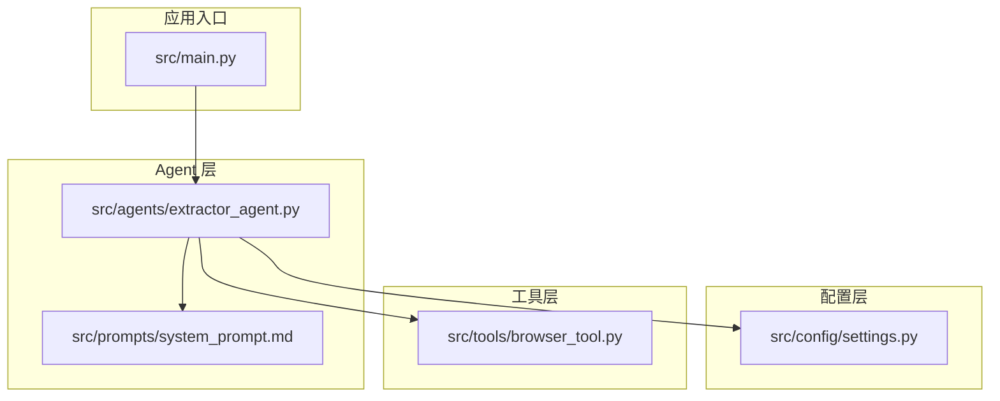
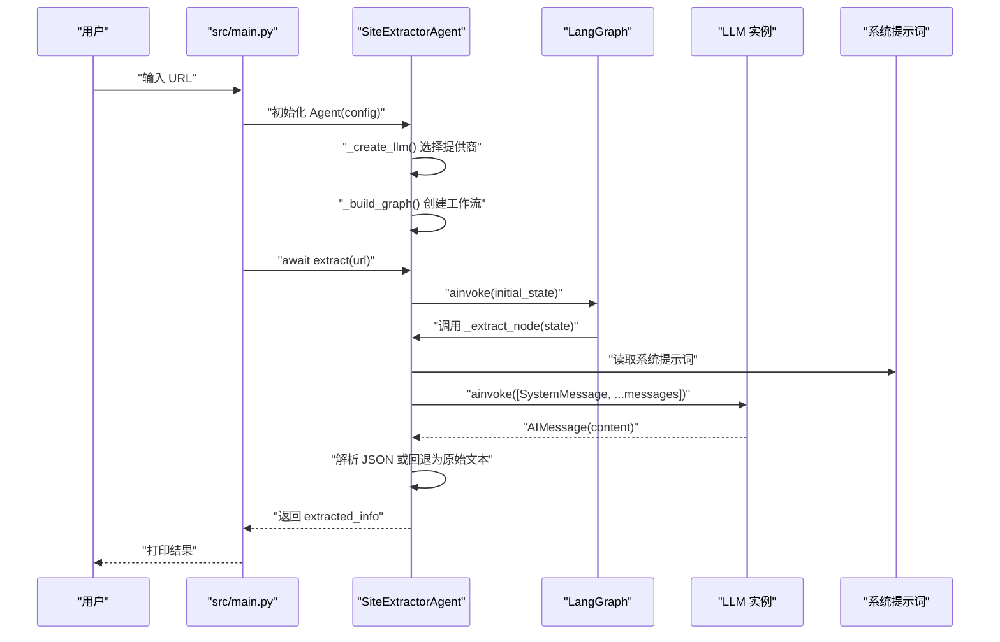
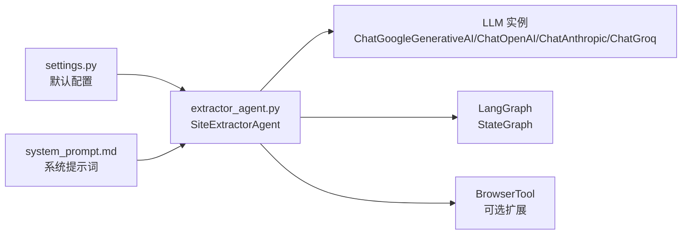

# Agent API

<cite>
**本文引用的文件**
- [src/agents/extractor_agent.py](file://src/agents/extractor_agent.py)
- [src/config/settings.py](file://src/config/settings.py)
- [src/prompts/system_prompt.md](file://src/prompts/system_prompt.md)
- [src/main.py](file://src/main.py)
- [src/tools/browser_tool.py](file://src/tools/browser_tool.py)
- [tests/test_agent.py](file://tests/test_agent.py)
- [README.md](file://README.md)
- [.env.example](file://.env.example)
</cite>

## 目录
1. [简介](#简介)
2. [项目结构](#项目结构)
3. [核心组件](#核心组件)
4. [架构总览](#架构总览)
5. [详细组件分析](#详细组件分析)
6. [依赖分析](#依赖分析)
7. [性能考虑](#性能考虑)
8. [故障排查指南](#故障排查指南)
9. [结论](#结论)
10. [附录](#附录)

## 简介
本文件为 SiteExtractorAgent 类的详细 API 文档，覆盖构造函数参数、异步提取方法、内部实现细节、状态结构、消息传递机制、异常处理以及使用示例与最佳实践。该 Agent 基于 LangGraph 构建状态机式工作流，支持多种 LLM 提供商，并通过系统提示词驱动结构化信息抽取。

## 项目结构
该项目采用分层与按功能划分的组织方式：
- agents：核心 Agent 实现与工作流
- config：Pydantic 驱动的配置管理
- prompts：系统提示词资源
- tools：浏览器工具（Playwright 封装）
- main.py：交互式 CLI 入口
- tests：单元测试与示例



图表来源
- [src/main.py](file://src/main.py#L1-L254)
- [src/agents/extractor_agent.py](file://src/agents/extractor_agent.py#L1-L330)
- [src/config/settings.py](file://src/config/settings.py#L1-L56)
- [src/prompts/system_prompt.md](file://src/prompts/system_prompt.md#L1-L212)
- [src/tools/browser_tool.py](file://src/tools/browser_tool.py#L1-L108)

章节来源
- [README.md](file://README.md#L57-L72)

## 核心组件
- SiteExtractorAgent：主 Agent，负责根据配置创建 LLM、构建 LangGraph 工作流、执行异步提取、解析 LLM 响应并维护状态。
- AgentState：LangGraph 状态结构，包含消息历史、已提取信息、目标 URL。
- BrowserTool：异步浏览器工具，封装 Playwright，用于页面抓取与基础元数据提取（当前 Agent 内部节点直接调用 LLM，不显式使用该工具，但可作为扩展点）。

章节来源
- [src/agents/extractor_agent.py](file://src/agents/extractor_agent.py#L77-L88)
- [src/agents/extractor_agent.py](file://src/agents/extractor_agent.py#L90-L330)
- [src/tools/browser_tool.py](file://src/tools/browser_tool.py#L10-L108)

## 架构总览
Agent 基于 LangGraph 的状态机工作流，当前实现为单节点“提取”流程。系统提示词由资源文件注入，LLM 由配置动态选择。



图表来源
- [src/agents/extractor_agent.py](file://src/agents/extractor_agent.py#L97-L115)
- [src/agents/extractor_agent.py](file://src/agents/extractor_agent.py#L195-L218)
- [src/agents/extractor_agent.py](file://src/agents/extractor_agent.py#L219-L239)
- [src/agents/extractor_agent.py](file://src/agents/extractor_agent.py#L241-L330)
- [src/prompts/system_prompt.md](file://src/prompts/system_prompt.md#L1-L212)
- [src/main.py](file://src/main.py#L182-L212)

## 详细组件分析

### SiteExtractorAgent 类 API

- 类名：SiteExtractorAgent
- 作用：基于 LangGraph 的状态机式网站信息提取 Agent，支持多提供商 LLM，动态构建工作流并执行异步提取。

#### 构造函数 __init__(config: dict[str, Any])
- 参数 config（必填）：
  - model_name：字符串，LLM 模型名称
  - temperature：浮点数，生成温度
  - max_tokens：整数，最大令牌数
  - google_api_key：字符串，可选
  - openai_api_key：字符串，可选
  - anthropic_api_key：字符串，可选
  - groq_api_key：字符串，可选
  - siliconflow_api_key：字符串，可选
  - xunfei_api_key：字符串，可选
  - cerebras_api_key：字符串，可选
- 行为：
  - 保存配置
  - 调用 _create_llm() 创建 LLM 实例
  - 调用 _build_graph() 构建并编译 LangGraph 工作流
- 异常：
  - 若未提供任一有效 API Key 且相应提供商不可用，抛出 ValueError

章节来源
- [src/agents/extractor_agent.py](file://src/agents/extractor_agent.py#L97-L115)

#### 异步方法 extract(url: str) -> dict[str, Any]
- 参数 url：
  - 格式要求：标准 HTTP/HTTPS URL 字符串
  - 用途：作为提取任务的目标页面
- 返回值：
  - 字典，包含提取结果与状态信息
  - 字段示例（以系统提示词为准）：
    - url：目标 URL
    - 标题：页面标题
    - 描述：页面描述
    - 主要内容：包含文本与标题层级
    - 链接：链接数组（文本、地址）
    - 图片：图片数组（地址、描述）
    - 元数据：作者、日期、标签等
    - 联系方式：邮箱、电话
    - 结构化数据：结构化数据数组
    - 提取时间：提取时间戳
    - 状态：success/parsed_error/error
  - 若 JSON 解析失败，会包含 raw_response、parse_error；若执行异常，包含 error
- 行为：
  - 初始化 AgentState（包含 HumanMessage 任务）
  - 调用 graph.ainvoke 执行工作流
  - 返回 state["extracted_info"]

章节来源
- [src/agents/extractor_agent.py](file://src/agents/extractor_agent.py#L219-L239)
- [src/prompts/system_prompt.md](file://src/prompts/system_prompt.md#L109-L146)

#### 内部方法 _create_llm()
- 作用：根据配置与可用性动态创建 LLM 实例
- 优先级（首选到备选）：
  - Google Gemini（google_api_key + GEMINI_AVAILABLE）
  - OpenAI（openai_api_key + OPENAI_AVAILABLE）
  - Anthropic（anthropic_api_key + ANTHROPIC_AVAILABLE）
  - Groq（groq_api_key + GROQ_AVAILABLE）
  - SiliconFlow（siliconflow_api_key + SILICONFLOW_AVAILABLE）
  - 讯飞（xunfei_api_key + XUNFEI_AVAILABLE）
  - Cerebras（cerebras_api_key + CEREBRAS_AVAILABLE）
- 返回：对应提供商的 LLM 实例
- 异常：当无可用 API Key 时抛出 ValueError

章节来源
- [src/agents/extractor_agent.py](file://src/agents/extractor_agent.py#L116-L194)

#### 内部方法 _build_graph()
- 作用：构建 LangGraph 状态图
- 实现要点：
  - 定义 AgentState 类型
  - 添加节点 "extractor"，绑定 _extract_node
  - 设置入口点为 "extractor"
  - 添加边至 END
  - 编译返回 StateGraph
- 返回：编译后的 StateGraph 实例

章节来源
- [src/agents/extractor_agent.py](file://src/agents/extractor_agent.py#L195-L218)

#### 内部方法 _extract_node(state: AgentState) -> AgentState
- 作用：执行提取节点逻辑
- 步骤：
  - 组合消息：SystemMessage（系统提示词）+ 历史 messages
  - 异步调用 LLM.ainvoke 获取响应
  - 初始化 extracted_info：包含 url、status
  - 解析响应：
    - 若响应包含 ```json 或 ```，提取其中 JSON 片段
    - 否则直接解析响应内容
    - 解析成功则合并到 extracted_info
    - 解析失败则记录 raw_response、parse_error、status=parsed_error
  - 更新 messages 历史
  - 返回新状态
- 异常处理：
  - LLM 调用或解析异常时，构造 AIMessage 错误消息，设置 status="error"，返回错误状态

章节来源
- [src/agents/extractor_agent.py](file://src/agents/extractor_agent.py#L241-L330)
- [src/prompts/system_prompt.md](file://src/prompts/system_prompt.md#L1-L212)

#### AgentState 状态结构
- 字段：
  - messages：消息序列（HumanMessage、AIMessage、SystemMessage 等）
  - extracted_info：提取结果字典
  - url：目标 URL（可为 None）

章节来源
- [src/agents/extractor_agent.py](file://src/agents/extractor_agent.py#L77-L88)

#### 消息传递机制
- 初始消息：包含 HumanMessage 的任务提示
- 中间消息：LLM 响应作为 AIMessage 追加到 messages
- 状态更新：每次节点执行后返回包含更新后的 messages、extracted_info、url 的新状态

章节来源
- [src/agents/extractor_agent.py](file://src/agents/extractor_agent.py#L231-L235)
- [src/agents/extractor_agent.py](file://src/agents/extractor_agent.py#L256-L313)

### 使用示例与最佳实践

- 初始化 Agent 与配置
  - 从配置模块读取默认设置，构建 config 字典，包含 model_name、temperature、max_tokens 以及所需提供商的 API Key
  - 示例参考：[src/main.py](file://src/main.py#L48-L181)

- 执行提取任务
  - 调用 agent.extract(url) 获取结构化结果
  - 示例参考：[src/main.py](file://src/main.py#L210-L212)

- 测试用例参考
  - 单测中使用 Mock LLM 验证 extract 返回结构
  - 参考：[tests/test_agent.py](file://tests/test_agent.py#L54-L66)

章节来源
- [src/main.py](file://src/main.py#L48-L181)
- [tests/test_agent.py](file://tests/test_agent.py#L54-L66)

## 依赖分析
- LLM 提供商可用性检测：通过 try/except 动态导入，标记可用性布尔值
- 配置来源：settings.py 提供默认模型名、温度、最大令牌数及各提供商 API Key
- 系统提示词：system_prompt.md 作为系统消息注入到消息历史
- 工具依赖：BrowserTool 为独立工具类，当前 Agent 的 _extract_node 直接调用 LLM，未显式使用该工具



图表来源
- [src/config/settings.py](file://src/config/settings.py#L9-L56)
- [src/agents/extractor_agent.py](file://src/agents/extractor_agent.py#L34-L74)
- [src/agents/extractor_agent.py](file://src/agents/extractor_agent.py#L97-L115)
- [src/prompts/system_prompt.md](file://src/prompts/system_prompt.md#L1-L212)
- [src/tools/browser_tool.py](file://src/tools/browser_tool.py#L10-L108)

章节来源
- [src/agents/extractor_agent.py](file://src/agents/extractor_agent.py#L34-L74)
- [src/config/settings.py](file://src/config/settings.py#L9-L56)

## 性能考虑
- LLM 调用为异步，适合高并发场景
- 通过 max_tokens 控制上下文长度，避免过长响应导致成本与耗时上升
- 选择合适模型与温度：默认温度较低，适合结构化抽取
- 网络与解析失败时的回退策略：保留原始响应以便后续处理

[本节为通用建议，无需特定文件来源]

## 故障排查指南

- API Key 缺失
  - 现象：初始化时报错，提示需要至少一个 API Key
  - 排查：检查 .env 文件与环境变量是否正确设置
  - 参考：[src/agents/extractor_agent.py](file://src/agents/extractor_agent.py#L189-L193)，[README.md](file://README.md#L29-L50)，[.env.example](file://.env.example#L1-L9)

- 网络错误或 LLM 调用异常
  - 现象：_extract_node 捕获异常，返回 status="error"，并记录 error
  - 排查：检查网络连通性、代理设置、提供商服务状态
  - 参考：[src/agents/extractor_agent.py](file://src/agents/extractor_agent.py#L315-L329)

- JSON 解析失败
  - 现象：响应中未包含标准 JSON 片段，返回 status="parsed_error"，并记录 parse_error 与 raw_response
  - 排查：确认 LLM 输出格式符合预期；必要时调整系统提示词
  - 参考：[src/agents/extractor_agent.py](file://src/agents/extractor_agent.py#L299-L304)，[src/prompts/system_prompt.md](file://src/prompts/system_prompt.md#L105-L146)

- 模型不可用或 404
  - 现象：调用 LLM 时出现模型未找到错误
  - 排查：更换可用模型名称；参考 README 中支持的模型列表
  - 参考：[README.md](file://README.md#L83-L92)

- 交互式运行问题
  - 现象：未检测到 API Key，无法进入交互模式
  - 排查：确保至少配置一个提供商的 API Key
  - 参考：[src/main.py](file://src/main.py#L235-L241)

章节来源
- [src/agents/extractor_agent.py](file://src/agents/extractor_agent.py#L189-L193)
- [src/agents/extractor_agent.py](file://src/agents/extractor_agent.py#L299-L304)
- [src/agents/extractor_agent.py](file://src/agents/extractor_agent.py#L315-L329)
- [README.md](file://README.md#L29-L50)
- [README.md](file://README.md#L83-L92)
- [src/main.py](file://src/main.py#L235-L241)
- [.env.example](file://.env.example#L1-L9)

## 结论
SiteExtractorAgent 提供了简洁而强大的异步提取能力，通过可插拔的 LLM 提供商与结构化的状态机工作流，能够稳定地从网页中抽取结构化信息。结合系统提示词与完善的异常处理，适用于生产级的网站信息提取任务。建议在实际部署中：
- 明确配置 API Key 与模型
- 控制 max_tokens 与温度
- 在解析失败时保留原始响应便于二次处理
- 根据业务场景扩展工具链（如引入 BrowserTool）

[本节为总结，无需特定文件来源]

## 附录

### 配置项与默认值（来自 settings.py）
- API Key：google_api_key、openai_api_key、anthropic_api_key、groq_api_key、siliconflow_api_key、xunfei_api_key、cerebras_api_key（均为可选）
- 模型配置：model_name、temperature、max_tokens（默认值见下表）

章节来源
- [src/config/settings.py](file://src/config/settings.py#L12-L24)

### 支持的模型（来自 README）
- Google Gemini：gemini-2.5-flash-exp（默认）、gemini-1.5-flash、gemini-1.5-pro、gemini-pro
- OpenAI：gpt-4o-mini、gpt-4o、gpt-3.5-turbo
- Anthropic：claude-3-5-sonnet-20241022、claude-3-opus-20240229

章节来源
- [README.md](file://README.md#L83-L92)

### 输出字段规范（来自 system_prompt.md）
- 必须字段：url、标题、描述、主要内容（含文本与标题层级）、链接、图片、元数据、联系方式、结构化数据、提取时间、状态
- 可选字段：作者、发布时间、社交媒体链接、标签、分类等

章节来源
- [src/prompts/system_prompt.md](file://src/prompts/system_prompt.md#L109-L146)