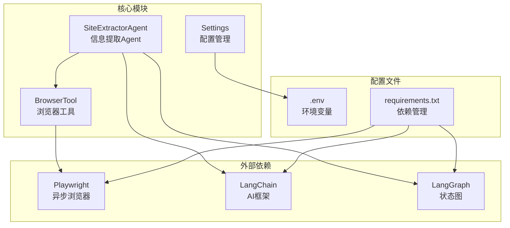
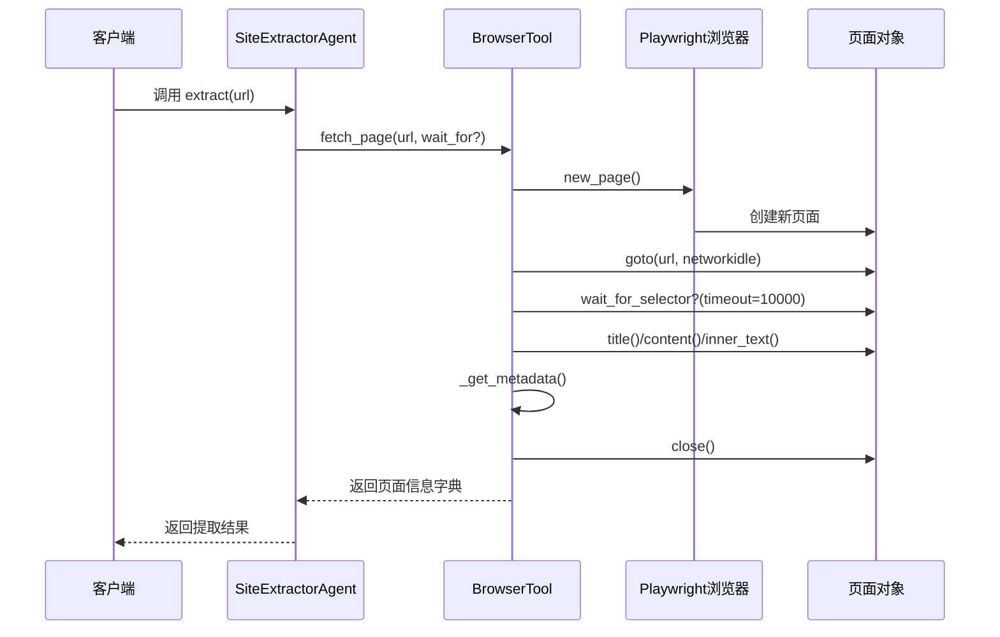
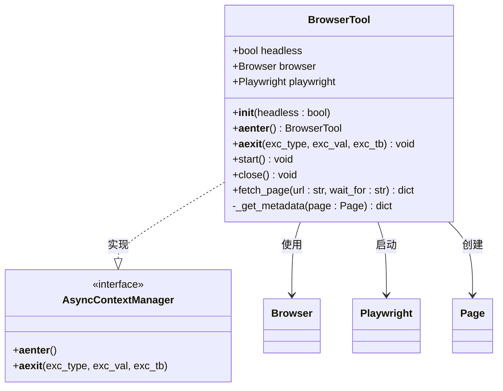
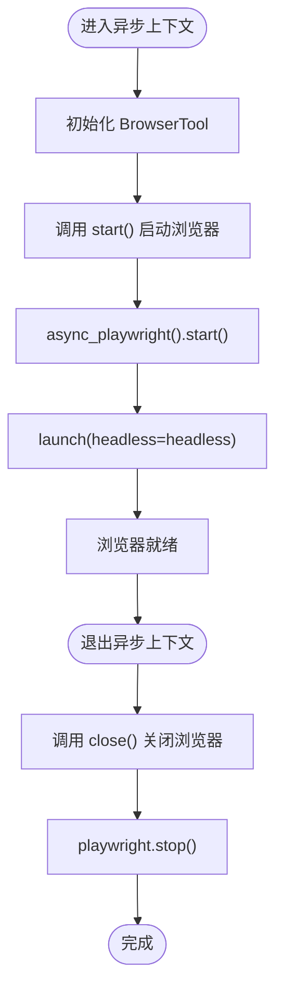
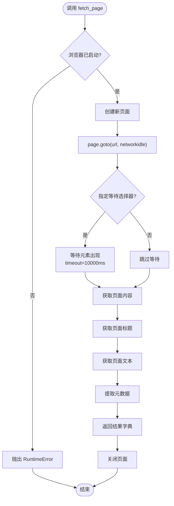
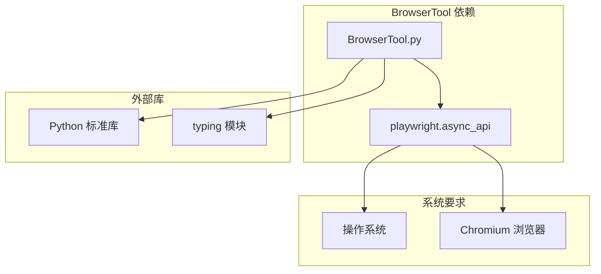
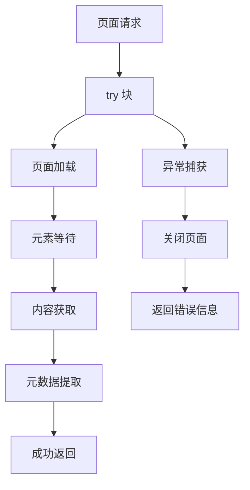

# 工具 API

<cite>
**本文引用的文件**
- [browser_tool.py](file://src/tools/browser_tool.py)
- [extractor_agent.py](file://src/agents/extractor_agent.py)
- [settings.py](file://src/config/settings.py)
- [main.py](file://src/main.py)
- [requirements.txt](file://requirements.txt)
- [README.md](file://README.md)
- [test_agent.py](file://tests/test_agent.py)
</cite>

## 目录
1. [简介](#简介)
2. [项目结构](#项目结构)
3. [核心组件](#核心组件)
4. [架构概览](#架构概览)
5. [详细组件分析](#详细组件分析)
6. [依赖关系分析](#依赖关系分析)
7. [性能考虑](#性能考虑)
8. [故障排除指南](#故障排除指南)
9. [结论](#结论)
10. [附录](#附录)

## 简介

BrowserTool 是一个基于 Playwright 的异步浏览器工具类，专门用于网页内容抓取和信息提取。该工具提供了完整的异步生命周期管理、页面内容获取、元数据提取等功能，是 SiteExtractorAgent 系统的重要组成部分。

BrowserTool 的设计遵循异步编程最佳实践，支持无头模式运行，具备完善的错误处理机制和资源清理能力。通过异步上下文管理器，确保浏览器实例的正确启动和关闭。

## 项目结构

该项目采用模块化架构，主要包含以下关键组件：



**图表来源**
- [browser_tool.py](file://src/tools/browser_tool.py#L1-L108)
- [extractor_agent.py](file://src/agents/extractor_agent.py#L1-L330)
- [settings.py](file://src/config/settings.py#L1-L56)

**章节来源**
- [browser_tool.py](file://src/tools/browser_tool.py#L1-L108)
- [extractor_agent.py](file://src/agents/extractor_agent.py#L1-L330)
- [settings.py](file://src/config/settings.py#L1-L56)

## 核心组件

BrowserTool 类是本项目的核心组件，提供了完整的异步浏览器功能。其主要特性包括：

### 主要功能
- **异步浏览器管理**：支持 Playwright 异步启动和关闭
- **页面内容获取**：支持等待特定元素加载后获取页面内容
- **元数据提取**：自动提取常见的网页元数据标签
- **资源清理**：确保浏览器实例和页面对象的正确释放

### 关键特性
- **无头模式支持**：可通过构造函数参数控制是否使用无头模式
- **异步上下文管理**：支持 `async with` 语法进行自动资源管理
- **超时控制**：内置超时机制，防止长时间等待
- **错误处理**：完善的异常处理和错误恢复机制

**章节来源**
- [browser_tool.py](file://src/tools/browser_tool.py#L10-L108)

## 架构概览

BrowserTool 在整个系统架构中扮演着关键的数据采集角色，与 SiteExtractorAgent 形成清晰的职责分离：



**图表来源**
- [extractor_agent.py](file://src/agents/extractor_agent.py#L219-L239)
- [browser_tool.py](file://src/tools/browser_tool.py#L44-L80)

## 详细组件分析

### BrowserTool 类结构



**图表来源**
- [browser_tool.py](file://src/tools/browser_tool.py#L10-L108)

### 初始化配置

BrowserTool 的初始化过程相对简单，主要负责设置运行模式：

| 参数名 | 类型 | 默认值 | 描述 |
|--------|------|--------|------|
| headless | bool | True | 是否使用无头模式运行浏览器 |

初始化时会设置以下属性：
- `headless`: 控制浏览器运行模式
- `browser`: 存储浏览器实例（初始为 None）
- `playwright`: 存储 Playwright 实例（初始为 None）

### 异步生命周期管理

BrowserTool 实现了完整的异步上下文管理器接口：



**图表来源**
- [browser_tool.py](file://src/tools/browser_tool.py#L23-L42)

### 页面内容获取方法

fetch_page 方法是 BrowserTool 的核心功能，提供了完整的页面抓取能力：



**图表来源**
- [browser_tool.py](file://src/tools/browser_tool.py#L44-L80)

### 返回值格式

fetch_page 方法返回一个包含完整页面信息的字典：

| 字段名 | 类型 | 描述 |
|--------|------|------|
| url | str | 原始请求的 URL |
| title | str | 页面标题 |
| content | str | 完整的 HTML 内容 |
| text | str | 页面纯文本内容 |
| metadata | dict | 元数据字典 |

元数据字典包含以下字段：

| 元数据键 | 描述 | 示例值 |
|----------|------|--------|
| description | 页面描述 | "这是一个示例网站" |
| keywords | 页面关键词 | "技术,开发,教程" |
| og:title | Open Graph 标题 | "示例页面" |
| og:description | Open Graph 描述 | "页面的 Open Graph 描述" |
| og:image | Open Graph 图像 | "https://example.com/image.jpg" |

### 超时设置和重试机制

BrowserTool 的超时设置相对简单，主要体现在页面等待机制中：

- **元素等待超时**: 10000 毫秒（10 秒）
- **网络空闲等待**: 自动等待网络连接稳定
- **无内置重试机制**: 当前版本不包含自动重试逻辑

### 浏览器启动参数

BrowserTool 使用 Playwright 的默认启动参数，主要配置包括：

- **浏览器类型**: Chromium
- **运行模式**: 由 headless 参数控制
- **无头模式**: True（默认）时隐藏浏览器界面
- **有头模式**: False 时显示完整浏览器界面

### 用户代理和请求头配置

当前版本的 BrowserTool 不提供自定义用户代理和请求头的配置选项。它使用 Playwright 的默认设置，这通常意味着使用标准的浏览器用户代理字符串。

### 异步操作最佳实践

BrowserTool 遵循了多项异步编程最佳实践：

#### 事件循环处理
- 使用 `async with` 语法确保正确的异步上下文管理
- 所有 Playwright 操作都是异步的
- 自动资源清理，防止内存泄漏

#### 并发限制
- 单个 BrowserTool 实例在同一时间只能处理一个页面请求
- 建议在高并发场景下创建多个 BrowserTool 实例
- 每个实例独立管理自己的浏览器进程

#### 资源清理
- 异步上下文管理器确保浏览器正确关闭
- 每个页面使用后自动关闭
- Playwright 实例在上下文退出时停止

**章节来源**
- [browser_tool.py](file://src/tools/browser_tool.py#L10-L108)

## 依赖关系分析

BrowserTool 的依赖关系相对简洁，主要依赖于 Playwright 库：



**图表来源**
- [browser_tool.py](file://src/tools/browser_tool.py#L6-L7)
- [requirements.txt](file://requirements.txt#L17)

### 外部依赖

BrowserTool 主要依赖以下外部组件：

| 依赖包 | 版本要求 | 用途 |
|--------|----------|------|
| playwright | >=1.48.0 | 异步浏览器自动化 |
| typing | Python 标准库 | 类型注解支持 |

### 系统要求

- **操作系统**: 支持 Windows、macOS、Linux
- **Python 版本**: >=3.10（推荐 3.11+）
- **Chromium**: 通过 Playwright 自动安装

**章节来源**
- [requirements.txt](file://requirements.txt#L1-L36)
- [README.md](file://README.md#L7-L25)

## 性能考虑

### 内存管理
- 每个页面对象在使用后立即关闭
- 浏览器实例通过异步上下文管理器自动清理
- 建议在高并发场景下限制同时运行的页面数量

### 网络性能
- 使用 `wait_until="networkidle"` 确保页面完全加载
- 元素等待超时设置为 10000ms，平衡性能和可靠性
- 避免不必要的重复页面加载

### 并发优化建议
- 为每个 CPU 核心创建一个 BrowserTool 实例
- 使用连接池管理多个实例
- 实施适当的请求队列和限流机制

## 故障排除指南

### 常见问题及解决方案

#### 浏览器启动失败
**症状**: `RuntimeError: Browser not started. Call start() or use async context manager.`

**原因**: 未正确启动浏览器或使用了错误的调用方式

**解决方案**:
```python
# 正确的使用方式
async with BrowserTool() as browser:
    result = await browser.fetch_page("https://example.com")
```

#### 页面加载超时
**症状**: 页面在指定时间内未完全加载

**解决方案**:
- 检查网络连接稳定性
- 调整等待条件（如果适用）
- 考虑增加超时时间

#### 元素选择器不存在
**症状**: `wait_for` 参数指定的选择器在页面中不存在

**解决方案**:
- 验证选择器的正确性
- 检查页面结构变化
- 使用更通用的选择器

### 错误处理策略

BrowserTool 采用了分层的错误处理策略：



**图表来源**
- [browser_tool.py](file://src/tools/browser_tool.py#L58-L80)

**章节来源**
- [browser_tool.py](file://src/tools/browser_tool.py#L44-L108)

## 结论

BrowserTool 作为一个专门的网页内容抓取工具，具有以下优势：

1. **设计简洁**: API 设计直观，易于理解和使用
2. **异步友好**: 完全基于异步编程模型，适合高并发场景
3. **资源管理**: 自动化的资源清理机制，防止内存泄漏
4. **错误处理**: 完善的异常处理和恢复机制

在实际使用中，建议结合 SiteExtractorAgent 的工作流模式，充分利用其异步特性和资源管理能力。对于生产环境，建议实施适当的并发控制和错误重试机制。

## 附录

### 使用示例

#### 基本使用方式
```python
# 方式1: 使用异步上下文管理器
async with BrowserTool() as browser:
    result = await browser.fetch_page("https://example.com")
    print(result["title"])

# 方式2: 手动管理生命周期
browser = BrowserTool()
await browser.start()
try:
    result = await browser.fetch_page("https://example.com")
finally:
    await browser.close()
```

#### 高级使用方式
```python
# 使用等待选择器
async with BrowserTool() as browser:
    result = await browser.fetch_page(
        "https://example.com", 
        wait_for=".content-loaded"
    )
    print(result["metadata"]["description"])
```

### 集成 SiteExtractorAgent

BrowserTool 与 SiteExtractorAgent 的集成非常自然，主要体现在以下几个方面：

1. **职责分离**: BrowserTool 负责数据采集，Agent 负责数据分析
2. **异步协作**: 两者都基于异步编程模型，天然兼容
3. **错误隔离**: BrowserTool 的错误不会影响 Agent 的整体流程

### 配置选项

BrowserTool 的配置相对简单，主要通过构造函数参数控制：

| 配置项 | 默认值 | 说明 |
|--------|--------|------|
| headless | True | 是否使用无头模式 |
| wait_for | None | 等待的元素选择器 |
| timeout | 10000ms | 元素等待超时时间 |

**章节来源**
- [browser_tool.py](file://src/tools/browser_tool.py#L13-L62)
- [extractor_agent.py](file://src/agents/extractor_agent.py#L219-L239)