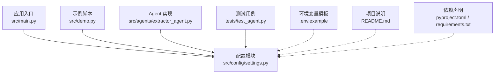
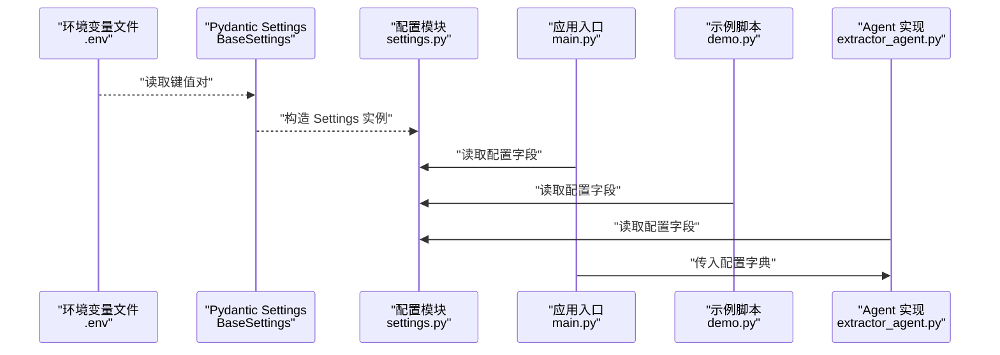
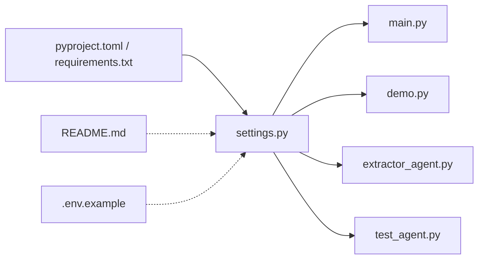

# 配置 API

<cite>
**本文引用的文件**
- [settings.py](file://src/config/settings.py)
- [main.py](file://src/main.py)
- [demo.py](file://src/demo.py)
- [.env.example](file://.env.example)
- [README.md](file://README.md)
- [pyproject.toml](file://pyproject.toml)
- [requirements.txt](file://requirements.txt)
- [extractor_agent.py](file://src/agents/extractor_agent.py)
- [test_agent.py](file://tests/test_agent.py)
</cite>

## 目录
1. [简介](#简介)
2. [项目结构](#项目结构)
3. [核心组件](#核心组件)
4. [架构总览](#架构总览)
5. [详细组件分析](#详细组件分析)
6. [依赖分析](#依赖分析)
7. [性能考虑](#性能考虑)
8. [故障排查指南](#故障排查指南)
9. [结论](#结论)
10. [附录](#附录)

## 简介
本文件为 Settings 类的配置 API 文档，面向开发者与运维人员，系统性说明配置字段、类型、默认值、取值范围与验证规则；解释 Pydantic Settings 的配置加载机制（环境变量、系统环境变量、文件覆盖）；提供开发/测试/生产三类场景的配置示例；并说明配置变更的生效机制与热重载支持现状，以及配置文件格式与错误处理方式。

## 项目结构
配置系统围绕 Settings 类展开，位于配置模块中，并由应用入口与 Agent 使用方共享访问。主要涉及以下文件：
- 配置定义：src/config/settings.py
- 应用入口：src/main.py
- 示例脚本：src/demo.py
- 环境变量模板：.env.example
- 项目说明：README.md
- 依赖声明：pyproject.toml、requirements.txt
- Agent 使用配置：src/agents/extractor_agent.py
- 测试用例：tests/test_agent.py

图表来源
- [settings.py](file://src/config/settings.py#L1-L56)
- [main.py](file://src/main.py#L1-L254)
- [demo.py](file://src/demo.py#L1-L51)
- [extractor_agent.py](file://src/agents/extractor_agent.py#L1-L330)
- [test_agent.py](file://tests/test_agent.py#L1-L80)
- [.env.example](file://.env.example#L1-L9)
- [README.md](file://README.md#L1-L101)
- [pyproject.toml](file://pyproject.toml#L1-L75)
- [requirements.txt](file://requirements.txt#L1-L36)

章节来源
- [settings.py](file://src/config/settings.py#L1-L56)
- [main.py](file://src/main.py#L1-L254)
- [demo.py](file://src/demo.py#L1-L51)
- [extractor_agent.py](file://src/agents/extractor_agent.py#L1-L330)
- [test_agent.py](file://tests/test_agent.py#L1-L80)
- [.env.example](file://.env.example#L1-L9)
- [README.md](file://README.md#L1-L101)
- [pyproject.toml](file://pyproject.toml#L1-L75)
- [requirements.txt](file://requirements.txt#L1-L36)

## 核心组件
- Settings 类：集中定义所有可配置字段及其默认值，继承自 Pydantic Settings，通过 Config 内部类控制环境变量文件、编码、大小写敏感与额外字段处理策略。
- 全局 settings 实例：在模块加载时创建，供应用各处按需读取。

章节来源
- [settings.py](file://src/config/settings.py#L9-L55)

## 架构总览
Settings 的加载与使用贯穿应用生命周期：应用启动时加载 .env，随后在运行时由入口与 Agent 读取配置，用于模型选择、API Key 注入与运行参数传递。

图表来源
- [settings.py](file://src/config/settings.py#L46-L55)
- [main.py](file://src/main.py#L20-L21)
- [demo.py](file://src/demo.py#L15-L15)
- [extractor_agent.py](file://src/agents/extractor_agent.py#L97-L114)

## 详细组件分析

### Settings 字段清单与验证规则
- 字段分组与用途
  - API Key 分组：用于接入不同 LLM 提供商的密钥，均为字符串类型，允许为空（None）。
  - 模型通用参数：模型名、温度、最大令牌数，用于统一控制推理行为。
  - 提供商特定模型名：针对免费/付费提供商的默认模型名，便于快速切换。
  - 浏览器配置：是否以无头模式运行浏览器工具。

- 字段类型与默认值
  - API Key：字符串或空，无默认值（None），需在运行前显式提供。
  - 模型通用参数：
    - model_name：字符串，默认值为“gemini-2.5-flash”
    - temperature：浮点数，默认值为 0.0
    - max_tokens：整数，默认值为 2000
  - 提供商特定模型名（默认值见源码注释）：
    - gemini_model_name：默认值为“gemini-2.5-flash”
    - groq_model_name：默认值为“llama-3.3-70b-versatile”
    - siliconflow_model_name：默认值为“tencent/Hunyuan-MT-7B”
    - xunfei_model_name：默认值为“Qwen3-1.7B”
    - cerebras_model_name：默认值为“gpt-oss-120b”
    - openai_model_name：默认值为“gpt-4o-mini”
    - anthropic_model_name：默认值为“claude-3-5-sonnet-20241022”
  - 浏览器配置：
    - browser_headless：布尔值，默认 True

- 验证与约束
  - 类型检查：Pydantic 自动进行字段类型校验，不匹配将抛出异常。
  - 必填字段：当前实现中未声明必填字段，API Key 默认 None，可通过业务逻辑在使用前校验。
  - 默认值处理：未提供时使用类中定义的默认值。
  - 额外字段：Config.extra 设置为忽略，多余字段不会导致加载失败。

- 环境变量映射
  - Settings.Config.env_file 指定 .env 文件；Config.case_sensitive=False 表示环境变量键不区分大小写。
  - 字段名与环境变量键的映射遵循 Pydantic Settings 的命名约定（大小写不敏感）。

章节来源
- [settings.py](file://src/config/settings.py#L12-L44)
- [settings.py](file://src/config/settings.py#L46-L51)

### Pydantic Settings 配置加载机制
- 加载顺序与优先级
  - 文件加载：从 .env 文件读取键值对。
  - 系统环境变量：覆盖 .env 中的同名键（大小写不敏感）。
  - 运行时覆盖：若在程序中动态修改 settings 实例的属性，将影响后续读取（但不会持久化回 .env）。
- 关键配置项
  - env_file：".env"
  - env_file_encoding："utf-8"
  - case_sensitive：False
  - extra："ignore"

- 生效机制
  - settings 实例在模块导入时创建，此后对同一进程内的所有模块可见。
  - 若需在运行时刷新配置，建议重新创建实例或在上层逻辑中注入新配置字典（如 Agent 的构造参数）。

章节来源
- [settings.py](file://src/config/settings.py#L46-L55)
- [main.py](file://src/main.py#L235-L240)
- [demo.py](file://src/demo.py#L22-L26)

### 环境变量加载顺序与覆盖关系
- 顺序
  1) 读取 .env 文件
  2) 读取系统环境变量（覆盖 .env 同名键）
  3) 运行时代码修改（仅影响当前进程）
- 覆盖关系
  - 系统环境变量优先于 .env 文件
  - 运行时修改优先于系统环境变量（仅限当前进程）

章节来源
- [settings.py](file://src/config/settings.py#L46-L51)
- [README.md](file://README.md#L27-L39)

### 配置示例与场景差异
- 开发环境
  - 目标：最小化成本，快速验证功能
  - 推荐：仅配置 GOOGLE_API_KEY；使用默认模型名与较低温度
  - 参考字段：google_api_key、model_name、temperature、max_tokens
- 测试环境
  - 目标：稳定复现，便于自动化
  - 推荐：固定模型名与温度，确保输出一致性；可设置 browser_headless 控制浏览器行为
  - 参考字段：model_name、temperature、max_tokens、browser_headless
- 生产环境
  - 目标：高可用与高性能
  - 推荐：配置所需提供商的 API Key；根据负载选择更稳定的模型；合理设置 max_tokens
  - 参考字段：各提供商 API Key、各提供商模型名、max_tokens

章节来源
- [settings.py](file://src/config/settings.py#L12-L44)
- [settings.py](file://src/config/settings.py#L22-L44)
- [README.md](file://README.md#L27-L39)

### 配置变更生效与热重载
- 现状
  - settings 实例在模块导入时创建，属于进程级单例。
  - 修改 .env 或系统环境变量不会自动刷新已加载的 settings 实例。
  - 如需“热重载”，可在上层逻辑中：
    - 重新创建 Settings 实例（需谨慎处理依赖该实例的对象）
    - 或在调用链中注入新的配置字典（如 Agent 的构造参数）
- 建议
  - 在应用启动阶段完成配置加载，运行期尽量避免直接修改 settings 实例。
  - 对需要动态调整的参数，优先通过函数参数或上下文传递。

章节来源
- [settings.py](file://src/config/settings.py#L54-L55)
- [extractor_agent.py](file://src/agents/extractor_agent.py#L97-L114)

### 配置文件格式与验证错误处理
- .env 文件格式
  - 键值对形式：KEY=value
  - 大小写不敏感（Config.case_sensitive=False）
  - 编码：UTF-8（Config.env_file_encoding）
- 验证错误处理
  - 类型不匹配：Pydantic 将抛出异常，需修正 .env 或系统环境变量中的值。
  - 额外字段：Config.extra="ignore"，不会导致加载失败。
  - API Key 缺失：入口会在运行时提示未检测到可用 API Key，建议在 .env 中补齐。

章节来源
- [settings.py](file://src/config/settings.py#L46-L51)
- [main.py](file://src/main.py#L235-L240)
- [.env.example](file://.env.example#L1-L9)

## 依赖分析
- 依赖关系
  - settings.py 依赖 pydantic-settings（BaseSettings）
  - main.py、demo.py、extractor_agent.py、test_agent.py 依赖 settings 实例
  - README.md 与 .env.example 提供环境变量配置说明
  - pyproject.toml/requirements.txt 声明 pydantic 与 pydantic-settings 版本

图表来源
- [pyproject.toml](file://pyproject.toml#L28-L47)
- [requirements.txt](file://requirements.txt#L10-L13)
- [settings.py](file://src/config/settings.py#L6-L6)
- [main.py](file://src/main.py#L20-L21)
- [demo.py](file://src/demo.py#L15-L15)
- [extractor_agent.py](file://src/agents/extractor_agent.py#L97-L114)
- [test_agent.py](file://tests/test_agent.py#L15-L16)
- [README.md](file://README.md#L27-L39)
- [.env.example](file://.env.example#L1-L9)

章节来源
- [pyproject.toml](file://pyproject.toml#L28-L47)
- [requirements.txt](file://requirements.txt#L10-L13)
- [settings.py](file://src/config/settings.py#L6-L6)
- [main.py](file://src/main.py#L20-L21)
- [demo.py](file://src/demo.py#L15-L15)
- [extractor_agent.py](file://src/agents/extractor_agent.py#L97-L114)
- [test_agent.py](file://tests/test_agent.py#L15-L16)
- [README.md](file://README.md#L27-L39)
- [.env.example](file://.env.example#L1-L9)

## 性能考虑
- 配置读取开销：Settings 在模块导入时一次性加载，后续读取为常量时间访问，开销极低。
- 环境变量覆盖：系统环境变量覆盖 .env 的成本与键数量成正比，通常可忽略。
- 建议：避免在热路径频繁读取大量配置，可在启动时缓存必要配置到局部变量。

## 故障排查指南
- 未检测到 API Key
  - 现象：入口打印警告，提示未检测到可用 API Key
  - 处理：在 .env 中补齐至少一个提供商的 API Key
- 模型不可用或 404
  - 现象：调用 LLM 时报错
  - 处理：更换为可用的提供商默认模型名或在 .env 中设置对应提供商模型名
- 配置类型错误
  - 现象：Pydantic 抛出类型校验异常
  - 处理：检查 .env 或系统环境变量中的值类型，确保与字段类型一致
- 额外字段导致的困惑
  - 说明：Config.extra="ignore"，多余字段不会报错，但也不会生效

章节来源
- [main.py](file://src/main.py#L235-L240)
- [README.md](file://README.md#L89-L92)
- [settings.py](file://src/config/settings.py#L46-L51)

## 结论
Settings 类提供了简洁、强类型且易于扩展的配置管理能力。通过 .env 文件与系统环境变量的灵活组合，满足开发、测试与生产的差异化需求。建议在启动阶段完成配置加载，运行期通过参数注入实现动态调整，避免直接修改全局 settings 实例。

## 附录

### 字段与默认值一览表
- API Key 分组
  - google_api_key：字符串或空，默认 None
  - openai_api_key：字符串或空，默认 None
  - anthropic_api_key：字符串或空，默认 None
  - groq_api_key：字符串或空，默认 None
  - siliconflow_api_key：字符串或空，默认 None
  - xunfei_api_key：字符串或空，默认 None
  - cerebras_api_key：字符串或空，默认 None
- 模型通用参数
  - model_name：字符串，默认 “gemini-2.5-flash”
  - temperature：浮点数，默认 0.0
  - max_tokens：整数，默认 2000
- 提供商特定模型名（默认值）
  - gemini_model_name：默认 “gemini-2.5-flash”
  - groq_model_name：默认 “llama-3.3-70b-versatile”
  - siliconflow_model_name：默认 “tencent/Hunyuan-MT-7B”
  - xunfei_model_name：默认 “Qwen3-1.7B”
  - cerebras_model_name：默认 “gpt-oss-120b”
  - openai_model_name：默认 “gpt-4o-mini”
  - anthropic_model_name：默认 “claude-3-5-sonnet-20241022”
- 浏览器配置
  - browser_headless：布尔值，默认 True

章节来源
- [settings.py](file://src/config/settings.py#L12-L44)

### 环境变量与字段映射参考
- 环境变量文件：.env
- 编码：utf-8
- 大小写：不敏感
- 额外字段：忽略

章节来源
- [settings.py](file://src/config/settings.py#L46-L51)
- [.env.example](file://.env.example#L1-L9)