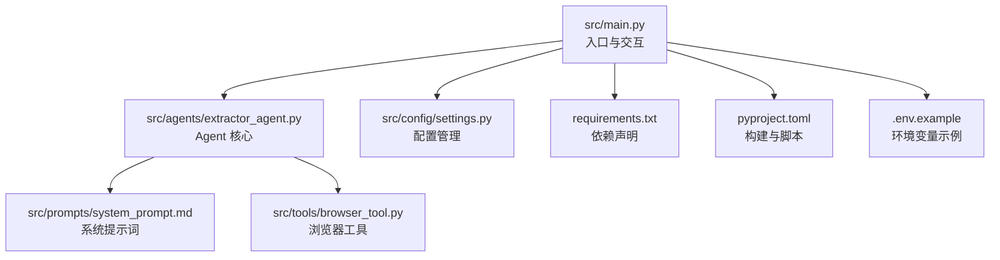
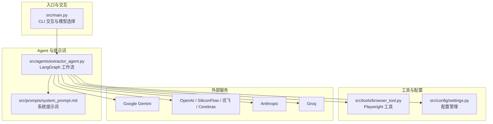
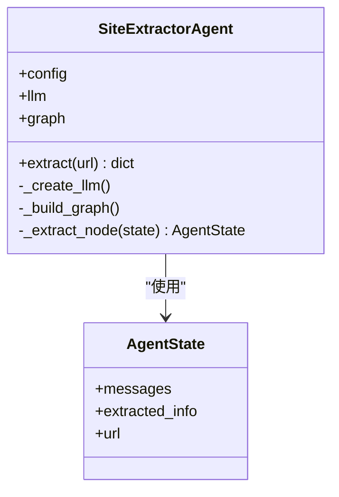
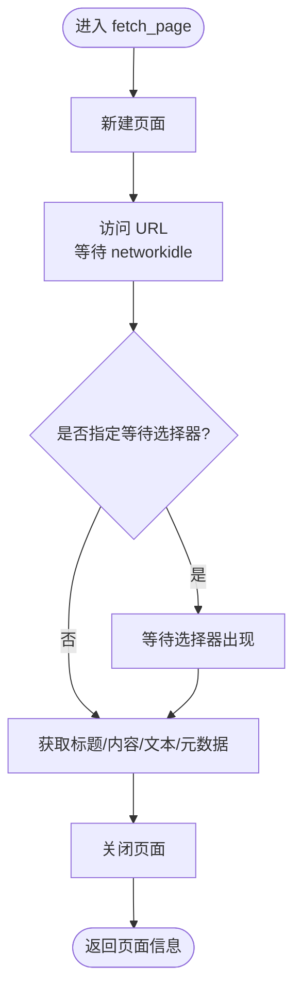
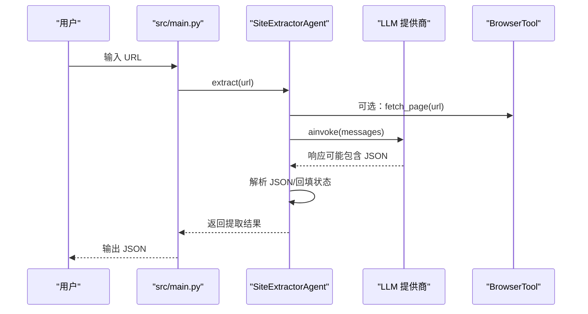
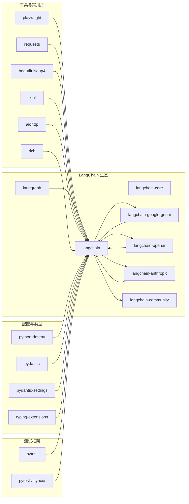

# 功能特性

<cite>
**本文引用的文件**
- [README.md](file://README.md)
- [src/main.py](file://src/main.py)
- [src/demo.py](file://src/demo.py)
- [src/config/settings.py](file://src/config/settings.py)
- [src/agents/extractor_agent.py](file://src/agents/extractor_agent.py)
- [src/prompts/system_prompt.md](file://src/prompts/system_prompt.md)
- [src/tools/browser_tool.py](file://src/tools/browser_tool.py)
- [requirements.txt](file://requirements.txt)
- [.env.example](file://.env.example)
- [tests/test_agent.py](file://tests/test_agent.py)
- [pyproject.toml](file://pyproject.toml)
</cite>

## 目录
1. [简介](#简介)
2. [项目结构](#项目结构)
3. [核心组件](#核心组件)
4. [架构总览](#架构总览)
5. [详细组件分析](#详细组件分析)
6. [依赖分析](#依赖分析)
7. [性能考虑](#性能考虑)
8. [故障排查指南](#故障排查指南)
9. [结论](#结论)
10. [附录](#附录)

## 简介
本项目是一个基于 LangChain 与 LangGraph 的网站信息提取智能 Agent 系统，支持通过多种 LLM 提供商（Google Gemini、OpenAI、Anthropic、Groq、SiliconFlow、讯飞、Cerebras）进行异步信息抽取，并内置浏览器工具以支持动态页面内容抓取。系统提供交互式 CLI、配置化模型选择、结构化输出以及完善的错误处理与恢复策略，适合用于网站元数据、文本、链接、图片等信息的自动化提取与结构化输出。

## 项目结构
项目采用按功能分层的组织方式，核心模块包括：
- 入口与交互：src/main.py 提供 CLI 交互与模型选择
- 配置管理：src/config/settings.py 使用 Pydantic Settings 管理环境变量与默认参数
- Agent 核心：src/agents/extractor_agent.py 实现基于 LangGraph 的状态机式提取流程
- 系统提示词：src/prompts/system_prompt.md 定义提取规则与输出格式
- 浏览器工具：src/tools/browser_tool.py 封装 Playwright 异步访问与内容获取
- 示例与演示：src/demo.py 展示直接调用 Gemini 的方式
- 依赖与脚本：requirements.txt、pyproject.toml 管理第三方依赖与命令入口

图表来源
- [src/main.py](file://src/main.py#L1-L254)
- [src/agents/extractor_agent.py](file://src/agents/extractor_agent.py#L1-L330)
- [src/config/settings.py](file://src/config/settings.py#L1-L56)
- [src/prompts/system_prompt.md](file://src/prompts/system_prompt.md#L1-L212)
- [src/tools/browser_tool.py](file://src/tools/browser_tool.py#L1-L108)
- [requirements.txt](file://requirements.txt#L1-L36)
- [pyproject.toml](file://pyproject.toml#L1-L75)
- [.env.example](file://.env.example#L1-L9)

章节来源
- [README.md](file://README.md#L57-L72)
- [src/main.py](file://src/main.py#L1-L254)
- [src/config/settings.py](file://src/config/settings.py#L1-L56)

## 核心组件
- 配置与环境变量：集中管理 API Key、模型名称、温度、最大令牌、浏览器模式等，支持从 .env 文件加载。
- 提示词系统：定义提取职责、工作流程、提取规则、输出格式与异常处理策略，保证 LLM 输出结构化与一致。
- Agent 与 LangGraph：以状态机形式编排提取流程，支持异步调用 LLM 并解析 JSON 结果。
- 浏览器工具：基于 Playwright 的异步页面访问、内容与元数据获取，支持无头模式与网络空闲等待。
- 交互式 CLI：支持多提供商模型选择、非阻塞输入、信号处理与 JSON 输出。

章节来源
- [src/config/settings.py](file://src/config/settings.py#L9-L56)
- [src/prompts/system_prompt.md](file://src/prompts/system_prompt.md#L1-L212)
- [src/agents/extractor_agent.py](file://src/agents/extractor_agent.py#L77-L330)
- [src/tools/browser_tool.py](file://src/tools/browser_tool.py#L10-L108)
- [src/main.py](file://src/main.py#L44-L228)

## 架构总览
系统采用“配置驱动 + LangGraph 工作流 + 多提供商 LLM + 异步浏览器工具”的架构。入口负责模型选择与交互；Agent 负责构建消息、调用 LLM、解析 JSON、维护状态；浏览器工具负责页面加载与内容采集；配置模块负责环境变量与默认值。

图表来源
- [src/main.py](file://src/main.py#L44-L182)
- [src/agents/extractor_agent.py](file://src/agents/extractor_agent.py#L116-L194)
- [src/prompts/system_prompt.md](file://src/prompts/system_prompt.md#L1-L212)
- [src/tools/browser_tool.py](file://src/tools/browser_tool.py#L10-L108)
- [src/config/settings.py](file://src/config/settings.py#L9-L56)

## 详细组件分析

### 提示词与提取规则
- 职责范围：网页内容理解、信息提取、内容分析、数据结构化。
- 提取清单：标题、描述、主要内容、链接、图片、元数据、联系方式、结构化数据等。
- 输出格式：严格要求中文字段名与值，提供标准 JSON 结构示例。
- 异常处理：页面加载失败、内容为空、编码问题、反爬虫应对等策略。
- 性能与可扩展性：避免不必要资源加载、合理超时、控制并发、容错与重试、可扩展的提取规则与工具。

章节来源
- [src/prompts/system_prompt.md](file://src/prompts/system_prompt.md#L1-L212)

### 配置与模型选择
- 配置项：API Key（Google、OpenAI、Anthropic、Groq、SiliconFlow、讯飞、Cerebras）、模型名称、温度、最大令牌、浏览器模式。
- 默认模型：Google Gemini 为主，其余为 OpenAI/Anthropic/付费模型或兼容厂商模型。
- 环境变量：通过 .env.example 提供示例，运行时从 .env 加载。
- CLI 交互：根据已配置的 API Key 动态展示可用模型并允许用户选择。

章节来源
- [src/config/settings.py](file://src/config/settings.py#L9-L56)
- [.env.example](file://.env.example#L1-L9)
- [src/main.py](file://src/main.py#L55-L181)

### Agent 与 LangGraph 工作流
- 状态结构：messages（消息历史）、extracted_info（提取结果）、url（目标 URL）。
- LLM 选择：优先 Google Gemini，其次 OpenAI/兼容厂商，再 Anthropic/Groq/SiliconFlow/讯飞/Cerebras。
- 提取节点：构建系统提示 + 历史消息，调用 LLM，解析 JSON，回填状态。
- 错误处理：捕获解析错误与执行异常，记录状态与错误信息。

图表来源
- [src/agents/extractor_agent.py](file://src/agents/extractor_agent.py#L77-L330)

章节来源
- [src/agents/extractor_agent.py](file://src/agents/extractor_agent.py#L77-L330)

### 浏览器工具（Playwright）
- 异步生命周期：支持异步上下文管理器，自动启动/关闭浏览器与 Playwright。
- 页面访问：无头/有头模式切换，等待网络空闲，获取标题、HTML 内容、纯文本与元数据。
- 元数据提取：支持 description、keywords、og:* 等常用 meta 标签。

图表来源
- [src/tools/browser_tool.py](file://src/tools/browser_tool.py#L44-L81)

章节来源
- [src/tools/browser_tool.py](file://src/tools/browser_tool.py#L10-L108)

### 交互式 CLI 与事件循环
- 模型选择：根据 API Key 可用性动态列出可用提供商与默认模型。
- 非阻塞输入：使用 select 实现键盘输入轮询，支持 Ctrl+C 优雅退出。
- 信号处理：注册 SIGINT，立即退出避免继续执行。
- 结果输出：JSON 格式化输出，包含状态与提取结果。

图表来源
- [src/main.py](file://src/main.py#L182-L228)
- [src/agents/extractor_agent.py](file://src/agents/extractor_agent.py#L219-L330)
- [src/tools/browser_tool.py](file://src/tools/browser_tool.py#L44-L81)

章节来源
- [src/main.py](file://src/main.py#L44-L228)
- [src/agents/extractor_agent.py](file://src/agents/extractor_agent.py#L219-L330)

### 多模型支持机制与配置
- Google Gemini：默认首选，使用 langchain-google-genai。
- OpenAI/兼容厂商：SiliconFlow、讯飞、Cerebras 均通过 OpenAI 兼容接口接入，分别设置 base_url。
- Anthropic：使用 langchain-anthropic。
- Groq：使用 langchain-groq。
- 配置优先级：入口 CLI 与 Agent 内部均按上述顺序选择可用提供商。

章节来源
- [src/agents/extractor_agent.py](file://src/agents/extractor_agent.py#L116-L194)
- [src/main.py](file://src/main.py#L55-L181)
- [README.md](file://README.md#L83-L92)

### 异步处理架构与并发
- 异步调用：LLM 使用 ainvoke，浏览器工具使用异步上下文与异步 API。
- 事件循环：入口使用 asyncio.run，支持信号中断与非阻塞输入。
- 并发与资源管理：浏览器工具通过上下文管理器确保资源释放；LangGraph 工作流在单次提取中串行执行，避免过度并发。

章节来源
- [src/main.py](file://src/main.py#L1-L254)
- [src/agents/extractor_agent.py](file://src/agents/extractor_agent.py#L219-L330)
- [src/tools/browser_tool.py](file://src/tools/browser_tool.py#L23-L42)

### 错误处理与恢复机制
- LLM 解析错误：当响应不是有效 JSON 时，记录原始响应与解析错误，状态标记为 parsed_error。
- 执行异常：捕获 LLM 调用异常，构造错误消息并返回 error 状态。
- 网络与浏览器错误：浏览器 fetch_page 在未启动时抛出运行时错误；建议在调用前确保已启动。
- CLI 交互：Ctrl+C 优雅退出；非阻塞输入避免阻塞主线程。

章节来源
- [src/agents/extractor_agent.py](file://src/agents/extractor_agent.py#L299-L329)
- [src/tools/browser_tool.py](file://src/tools/browser_tool.py#L54-L55)
- [src/main.py](file://src/main.py#L79-L85)

### 使用示例与最佳实践
- 快速开始：安装依赖、安装 Playwright 浏览器、复制 .env.example 并填写 API Key、运行入口脚本。
- 模型选择：在交互模式下选择所需提供商与模型；若仅配置一个 API Key，将自动使用默认模型。
- 输出格式：遵循系统提示词的 JSON 结构，包含标题、描述、链接、图片、元数据、联系方式等字段。
- 最佳实践：
  - 优先使用 Google Gemini（免费额度高），在需要更强推理能力时切换付费模型。
  - 对于动态页面，确保等待网络空闲后再提取。
  - 控制并发与请求频率，避免触发反爬虫机制。
  - 在生产环境中为 .env 文件设置最小权限与定期轮换密钥。

章节来源
- [README.md](file://README.md#L5-L56)
- [src/prompts/system_prompt.md](file://src/prompts/system_prompt.md#L105-L146)
- [src/main.py](file://src/main.py#L230-L246)

## 依赖分析
- LangChain 生态：langchain、langchain-core、langgraph、langchain-google-genai、langchain-openai、langchain-anthropic、langchain-community。
- 工具与实用库：playwright、requests、beautifulsoup4、lxml、aiohttp、rich。
- 配置与类型：python-dotenv、pydantic、pydantic-settings、typing-extensions。
- 测试框架：pytest、pytest-asyncio。

图表来源
- [requirements.txt](file://requirements.txt#L1-L36)
- [pyproject.toml](file://pyproject.toml#L28-L47)

章节来源
- [requirements.txt](file://requirements.txt#L1-L36)
- [pyproject.toml](file://pyproject.toml#L28-L47)

## 性能考虑
- 模型选择：优先使用免费模型（如 Google Gemini）以降低延迟与成本；在需要更强能力时切换付费模型。
- 浏览器模式：默认无头模式减少资源占用；仅在调试时开启有头模式。
- 超时与等待：浏览器等待 networkidle，避免过早提取导致内容不完整。
- 并发控制：当前工作流为单节点串行执行，避免过度并发；如需批量处理，建议在上层控制并发度。
- 输出解析：优先解析 LLM 返回的 JSON，若失败保留原始响应便于诊断。

章节来源
- [src/config/settings.py](file://src/config/settings.py#L44-L44)
- [src/tools/browser_tool.py](file://src/tools/browser_tool.py#L59-L62)
- [src/agents/extractor_agent.py](file://src/agents/extractor_agent.py#L271-L304)

## 故障排查指南
- 未检测到 API Key：检查 .env 文件是否正确配置，或在交互模式下确认可用提供商列表。
- 模型未找到（404）：尝试更换模型名称，参考提供商官方模型列表。
- 解析错误：当 LLM 返回非 JSON 文本时，系统会记录原始响应与解析错误，可据此调整提示词或模型。
- 浏览器未启动：确保在调用 fetch_page 前已启动浏览器或使用异步上下文管理器。
- 交互卡顿：非阻塞输入依赖 select，若平台不支持可考虑升级系统或使用替代方案。

章节来源
- [src/main.py](file://src/main.py#L235-L239)
- [README.md](file://README.md#L89-L92)
- [src/agents/extractor_agent.py](file://src/agents/extractor_agent.py#L299-L304)
- [src/tools/browser_tool.py](file://src/tools/browser_tool.py#L54-L55)

## 结论
本项目通过 LangChain/LangGraph 提供了可扩展、可配置的网站信息提取 Agent，结合多提供商 LLM 与异步浏览器工具，能够稳定地完成文本、链接、图片与元数据的提取与结构化输出。其交互式 CLI、完善的错误处理与配置体系，使其易于部署与维护。建议在生产环境中配合限流、重试与日志监控，持续优化提取质量与稳定性。

## 附录
- 模型支持与默认值：Google Gemini（默认）、OpenAI（付费）、Anthropic（付费）、Groq、SiliconFlow、讯飞、Cerebras。
- 环境变量：GOOGLE_API_KEY、OPENAI_API_KEY、ANTHROPIC_API_KEY 等。
- 运行方式：python src/main.py，或通过命令入口 site-extractor。

章节来源
- [README.md](file://README.md#L83-L92)
- [.env.example](file://.env.example#L1-L9)
- [pyproject.toml](file://pyproject.toml#L58-L59)