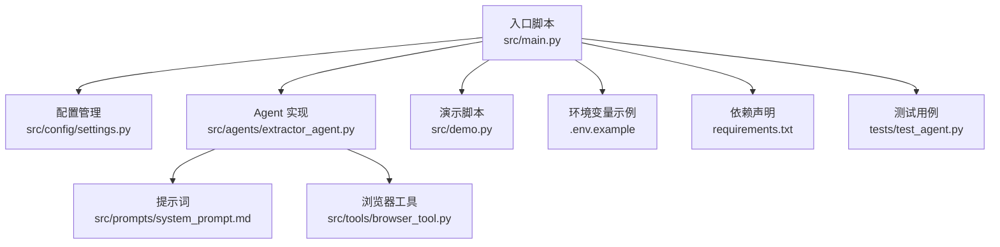
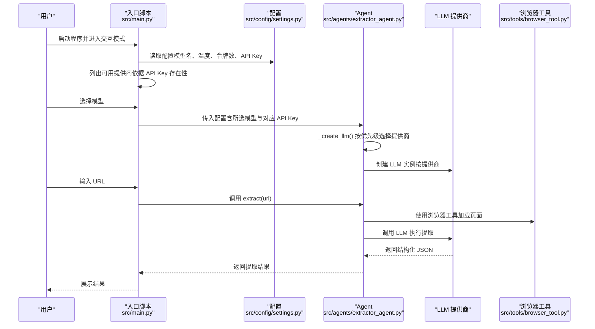
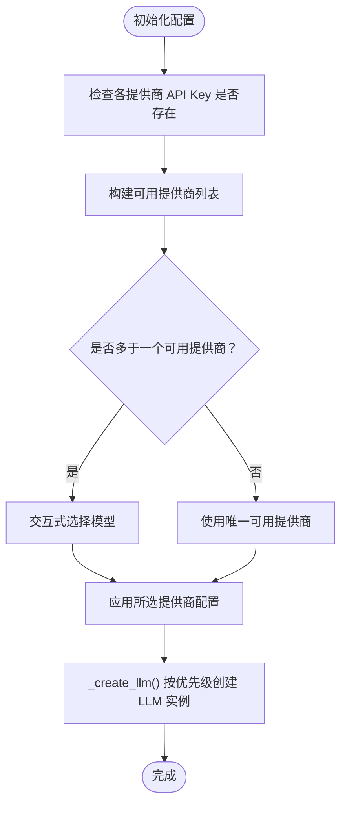
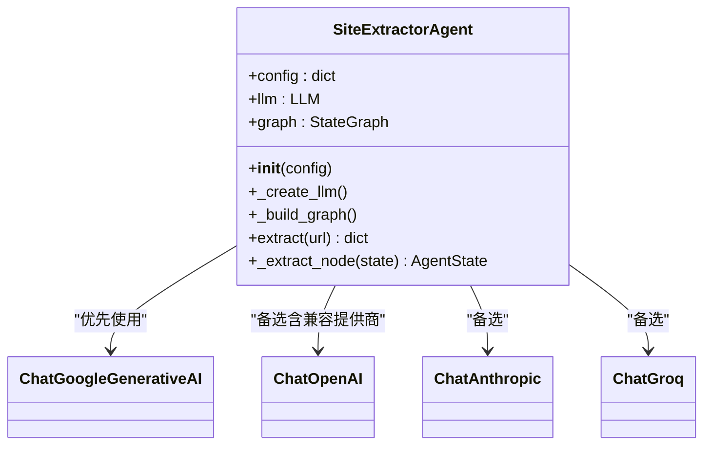
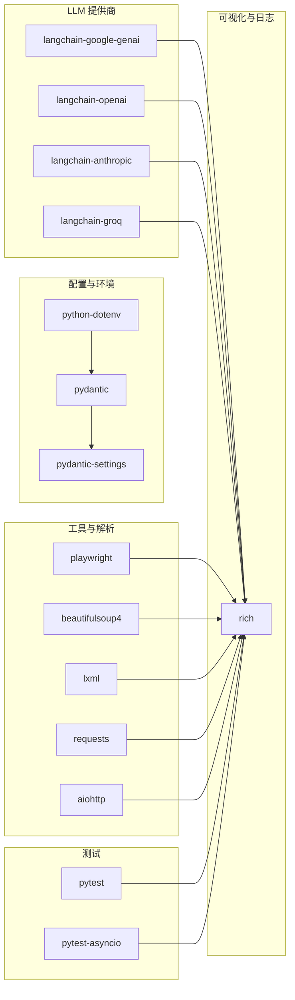

# 多模型支持

<cite>
**本文引用的文件**
- [README.md](file://README.md)
- [.env.example](file://.env.example)
- [requirements.txt](file://requirements.txt)
- [src/config/settings.py](file://src/config/settings.py)
- [src/main.py](file://src/main.py)
- [src/demo.py](file://src/demo.py)
- [src/agents/extractor_agent.py](file://src/agents/extractor_agent.py)
- [src/prompts/system_prompt.md](file://src/prompts/system_prompt.md)
- [src/tools/browser_tool.py](file://src/tools/browser_tool.py)
- [tests/test_agent.py](file://tests/test_agent.py)
</cite>

## 更新摘要
**变更内容**
- 新增 SiliconFlow、讯飞（Xunfei）、Cerebras 三个 LLM 提供商支持
- 扩展多模型架构，支持更多提供商选择
- 更新提供商优先级和配置管理机制
- 增强 OpenAI 兼容接口支持，包括 SiliconFlow、讯飞、Cerebras
- 完善环境变量配置和 API 密钥管理

## 目录
1. [简介](#简介)
2. [项目结构](#项目结构)
3. [核心组件](#核心组件)
4. [架构总览](#架构总览)
5. [详细组件分析](#详细组件分析)
6. [依赖分析](#依赖分析)
7. [性能与成本考量](#性能与成本考量)
8. [故障排查指南](#故障排查指南)
9. [结论](#结论)
10. [附录](#附录)

## 简介
本项目是一个基于 LangChain/LangGraph 的网站信息提取智能 Agent 系统，支持多 LLM 提供商与多模型选择策略。当前已支持的提供商包括：Google Gemini、OpenAI、Anthropic、Groq、SiliconFlow、讯飞（Xunfei）、Cerebras。系统通过配置驱动的模型选择与优先级机制，在可用密钥存在时自动选择合适的模型；同时提供交互式模型选择界面与默认模型配置，便于快速上手与灵活切换。

**更新** 新增对 SiliconFlow、讯飞、Cerebras 三个中国本土 LLM 提供商的支持，扩展了多模型架构的能力范围。

## 项目结构
项目采用模块化设计，核心围绕配置、Agent、提示词与工具展开，并通过入口脚本提供交互式体验与模型选择。

**图表来源**
- [src/main.py](file://src/main.py#L1-L254)
- [src/config/settings.py](file://src/config/settings.py#L1-L56)
- [src/agents/extractor_agent.py](file://src/agents/extractor_agent.py#L1-L352)
- [src/prompts/system_prompt.md](file://src/prompts/system_prompt.md#L1-L212)
- [src/tools/browser_tool.py](file://src/tools/browser_tool.py#L1-L108)
- [src/demo.py](file://src/demo.py#L1-L51)
- [.env.example](file://.env.example#L1-L21)
- [requirements.txt](file://requirements.txt#L1-L36)
- [tests/test_agent.py](file://tests/test_agent.py#L1-L80)

**章节来源**
- [README.md](file://README.md#L61-L76)
- [src/main.py](file://src/main.py#L1-L254)
- [src/config/settings.py](file://src/config/settings.py#L1-L56)

## 核心组件
- **配置模块**：集中管理 API Key、模型名称、温度、最大令牌数、浏览器模式等参数，支持从环境变量加载。现已扩展支持 SiliconFlow、讯飞、Cerebras 的 API Key 配置。
- **Agent 实现**：根据配置与可用性动态创建 LLM 实例，构建 LangGraph 工作流，执行信息提取。支持七种提供商的优先级选择。
- **提示词**：定义系统提示词模板，指导 LLM 以结构化 JSON 形式输出提取结果。
- **工具**：封装 Playwright 的浏览器访问能力，用于页面加载、内容抓取与元数据提取。
- **入口脚本**：提供交互式模型选择、运行时配置展示与 URL 提取循环。
- **演示脚本**：最小化示例，直接调用 Google Gemini 模型进行对话演示。
- **测试**：覆盖浏览器工具与 Agent 初始化的基本行为，以及使用 Mock 的提取流程测试。

**章节来源**
- [src/config/settings.py](file://src/config/settings.py#L9-L56)
- [src/agents/extractor_agent.py](file://src/agents/extractor_agent.py#L93-L197)
- [src/prompts/system_prompt.md](file://src/prompts/system_prompt.md#L1-L212)
- [src/tools/browser_tool.py](file://src/tools/browser_tool.py#L10-L108)
- [src/main.py](file://src/main.py#L44-L228)
- [src/demo.py](file://src/demo.py#L1-L51)
- [tests/test_agent.py](file://tests/test_agent.py#L26-L66)

## 架构总览
系统采用"配置驱动 + 动态导入 + 优先级选择"的多模型支持架构。Agent 在初始化时根据配置与可用性动态创建 LLM 实例，优先使用 Google Gemini，其次为 OpenAI、Anthropic、Groq、SiliconFlow、讯飞、Cerebras。LangGraph 工作流负责编排提取节点，结合系统提示词与浏览器工具完成端到端的信息提取。

**图表来源**
- [src/main.py](file://src/main.py#L44-L228)
- [src/config/settings.py](file://src/config/settings.py#L9-L56)
- [src/agents/extractor_agent.py](file://src/agents/extractor_agent.py#L119-L197)
- [src/tools/browser_tool.py](file://src/tools/browser_tool.py#L44-L81)

## 详细组件分析

### 配置与模型选择策略
- **配置来源**：通过 Pydantic Settings 从 .env 文件加载，支持大小写不敏感与额外字段忽略。
- **模型优先级**：Google Gemini → OpenAI → Anthropic → Groq → SiliconFlow → 讯飞 → Cerebras。
- **默认模型**：settings 中为各提供商设置了默认模型名，可在 .env 中覆盖。
- **交互式选择**：入口脚本会根据已配置的 API Key 动态列出可用提供商，允许用户选择或直接使用默认。

**更新** 新增 SiliconFlow、讯飞、Cerebras 的配置项，包括各自的 API Key 和默认模型名。

**图表来源**
- [src/config/settings.py](file://src/config/settings.py#L9-L56)
- [src/main.py](file://src/main.py#L55-L181)
- [src/agents/extractor_agent.py](file://src/agents/extractor_agent.py#L119-L197)

**章节来源**
- [src/config/settings.py](file://src/config/settings.py#L9-L56)
- [src/main.py](file://src/main.py#L55-L181)
- [src/agents/extractor_agent.py](file://src/agents/extractor_agent.py#L119-L197)

### Agent 与 LLM 提供商适配
- **动态导入**：根据可用性标记各提供商可用状态，仅在依赖安装后才视为可用。
- **优先级创建**：_create_llm() 按 Google → OpenAI → Anthropic → Groq → SiliconFlow → 讯飞 → Cerebras 的顺序尝试创建实例。
- **OpenAI 兼容**：SiliconFlow、讯飞、Cerebras 均通过 OpenAI 兼容接口访问，分别设置 base_url。
- **错误处理**：若无有效 API Key，抛出明确错误提示。

**更新** 新增对 SiliconFlow、讯飞、Cerebras 的 OpenAI 兼容接口支持，包括特定的 base_url 配置。

**图表来源**
- [src/agents/extractor_agent.py](file://src/agents/extractor_agent.py#L93-L197)

**章节来源**
- [src/agents/extractor_agent.py](file://src/agents/extractor_agent.py#L36-L77)
- [src/agents/extractor_agent.py](file://src/agents/extractor_agent.py#L119-L197)

### 提示词与输出规范
- 系统提示词定义了提取职责、工作流程、提取规则与输出格式，要求 LLM 以结构化 JSON 输出，字段名使用中文。
- 输出示例展示了标准字段（URL、标题、描述、主要内容、链接、图片、元数据、联系方式、结构化数据、提取时间、状态）。
- Agent 在提取节点中尝试解析 LLM 响应中的 JSON，若失败则保留原始内容并标注解析错误。

**章节来源**
- [src/prompts/system_prompt.md](file://src/prompts/system_prompt.md#L109-L146)
- [src/prompts/system_prompt.md](file://src/prompts/system_prompt.md#L150-L186)
- [src/agents/extractor_agent.py](file://src/agents/extractor_agent.py#L244-L352)

### 浏览器工具与页面加载
- 使用 Playwright 异步加载页面，等待网络空闲，支持等待特定元素出现。
- 提取页面标题、HTML 内容、纯文本与常见 meta 标签（描述、关键词、OG 标签等）。
- 通过上下文管理器确保浏览器与实例正确启动与关闭。

**章节来源**
- [src/tools/browser_tool.py](file://src/tools/browser_tool.py#L10-L108)

### 演示与最小化用法
- 演示脚本展示了如何直接使用 Google Gemini 模型进行同步调用，强调了 API Key 的必要性与错误提示。
- 适合快速验证环境配置与模型可用性。

**章节来源**
- [src/demo.py](file://src/demo.py#L1-L51)

### 交互式运行与模型选择
- 入口脚本打印当前配置（温度、最大令牌、浏览器模式），并根据 API Key 列出可用提供商。
- 支持非阻塞输入与信号处理，提供 URL 循环输入与 JSON 结果输出。
- 若未检测到任何 API Key，给出明确警告与配置指引。

**更新** 新增对 SiliconFlow、讯飞、Cerebras 提供商的交互式选择支持。

**章节来源**
- [src/main.py](file://src/main.py#L26-L228)
- [README.md](file://README.md#L27-L55)

## 依赖分析
- **LLM 提供商依赖**：langchain-google-genai、langchain-openai、langchain-anthropic、langchain-groq。
- **配置管理**：python-dotenv、pydantic、pydantic-settings。
- **工具与解析**：playwright、beautifulsoup4、lxml、requests、aiohttp。
- **可视化与日志**：rich。
- **测试**：pytest、pytest-asyncio。

**更新** 依赖关系保持不变，但配置模块现在支持更多的提供商。

**图表来源**
- [requirements.txt](file://requirements.txt#L1-L36)

**章节来源**
- [requirements.txt](file://requirements.txt#L1-L36)

## 性能与成本考量
- **模型选择建议**
  - **Google Gemini**：默认模型，适合通用提取任务；若遇到模型不可用，可切换至其他 Gemini 模型。
  - **OpenAI**：gpt-4o-mini 适合低成本高性价比；gpt-4o、gpt-3.5-turbo 适合更高精度场景。
  - **Anthropic**：Claude 系列在复杂推理与结构化输出方面表现稳定。
  - **Groq**：以低延迟见长，适合对响应速度敏感的任务。
  - **SiliconFlow**：通过 OpenAI 兼容接口访问，支持多种国内模型，适合需要多供应商兜底的场景。
  - **讯飞**：通过 OpenAI 兼容接口访问，提供中文优化的模型选择。
  - **Cerebras**：通过 OpenAI 兼容接口访问，提供高性能计算资源。
- **成本与性能权衡**
  - **低成本优先**：OpenAI gpt-4o-mini、Groq、Gemini 2.5-flash。
  - **高质量优先**：OpenAI gpt-4o、Anthropic Claude、Gemini 1.5-pro。
  - **低延迟优先**：Groq、SiliconFlow。
- **选择策略**
  - 默认首选 Google Gemini，其次 OpenAI，再考虑 Anthropic/Groq/SiliconFlow/讯飞/Cerebras。
  - 在生产环境中建议固定模型名并在 .env 中显式配置，避免自动切换带来的不确定性。
  - 对于高并发场景，建议评估各提供商的速率限制与配额，必要时分摊到多个密钥。

**更新** 新增 SiliconFlow、讯飞、Cerebras 的性能特点和成本考量。

**章节来源**
- [README.md](file://README.md#L87-L97)
- [src/config/settings.py](file://src/config/settings.py#L21-L42)
- [src/agents/extractor_agent.py](file://src/agents/extractor_agent.py#L119-L197)

## 故障排查指南
- **未检测到 API Key**
  - 现象：入口脚本提示未检测到任何 API Key。
  - 排查：确认 .env 文件中至少配置一个提供商的 API Key；检查大小写与空格。
  - 参考：入口脚本对 API Key 的检查与提示。
- **模型不可用（404 NOT_FOUND）**
  - 现象：调用时报模型未找到错误。
  - 排查：更换为其他可用模型；在提供商平台确认模型是否已启用。
  - 参考：README 中关于模型不可用的提示。
- **LLM 响应解析失败**
  - 现象：提取结果中包含解析错误或原始响应。
  - 排查：检查系统提示词是否强制输出 JSON；确认 LLM 版本与提示词匹配。
  - 参考：Agent 提取节点中的 JSON 解析逻辑与错误分支。
- **浏览器加载异常**
  - 现象：页面加载失败或内容为空。
  - 排查：检查网络连接、robots.txt、反爬虫策略；适当增加等待时间或调整 headless 模式。
  - 参考：浏览器工具的页面加载与等待逻辑。
- **新增提供商相关问题**
  - **SiliconFlow**：检查 base_url 配置是否正确，确认模型名称在 SiliconFlow 平台可用。
  - **讯飞**：确认 API 密钥格式正确，检查模型名称是否在讯飞平台注册。
  - **Cerebras**：验证 base_url 配置，确认账户余额充足。
- **测试与调试**
  - 使用测试用例验证初始化与提取流程；通过 Mock 替换 LLM 实例以隔离外部依赖。
  - 参考：测试文件中的初始化与 Mock 示例。

**更新** 新增 SiliconFlow、讯飞、Cerebras 特定的故障排查指导。

**章节来源**
- [src/main.py](file://src/main.py#L235-L239)
- [README.md](file://README.md#L93-L97)
- [src/agents/extractor_agent.py](file://src/agents/extractor_agent.py#L326-L352)
- [src/tools/browser_tool.py](file://src/tools/browser_tool.py#L59-L62)
- [tests/test_agent.py](file://tests/test_agent.py#L49-L66)

## 结论
本项目通过配置驱动与动态导入实现了对多家 LLM 提供商的统一接入，具备清晰的优先级策略与交互式选择能力。结合系统提示词与浏览器工具，能够稳定地完成网站信息提取任务。**更新** 新增的 SiliconFlow、讯飞、Cerebras 支持进一步扩展了系统的多模型能力，特别是为中国本土用户提供更好的服务选择。建议在生产环境中固定模型名与密钥来源，结合性能与成本评估选择最优组合，并建立完善的监控与告警机制以应对模型不可用与限流风险。

## 附录

### 支持的提供商与模型清单
- **Google Gemini**：gemini-2.5-flash（默认）、gemini-1.5-flash、gemini-1.5-pro、gemini-pro
- **OpenAI**：gpt-4o-mini（默认）、gpt-4o、gpt-3.5-turbo
- **Anthropic**：claude-3-5-sonnet-20241022（默认）、claude-3-opus-20240229
- **Groq**：llama-3.3-70b-versatile（默认）
- **SiliconFlow**：OpenAI 兼容接口（默认模型可选）
- **讯飞**：OpenAI 兼容接口（默认模型可选）
- **Cerebras**：OpenAI 兼容接口（默认模型可选）

**更新** 新增 SiliconFlow、讯飞、Cerebras 三个提供商的详细信息。

**章节来源**
- [README.md](file://README.md#L87-L97)
- [src/config/settings.py](file://src/config/settings.py#L26-L42)

### API 密钥配置与安全
- **配置位置**：.env 文件，由配置模块从环境变量加载。
- **安全建议**：将 .env 纳入 .gitignore；避免提交包含真实密钥的文件；如意外泄露，立即撤销密钥并清理历史。
- **入口脚本**：会在未检测到任何 API Key 时给出明确警告与配置指引。

**更新** 新增 SiliconFlow、讯飞、Cerebras 的 API 密钥配置说明。

**章节来源**
- [.env.example](file://.env.example#L1-L21)
- [src/config/settings.py](file://src/config/settings.py#L46-L51)
- [src/main.py](file://src/main.py#L235-L239)
- [README.md](file://README.md#L35-L48)

### 配置示例与最佳实践
- **固定模型名**：在 .env 中显式设置所需模型名，避免自动切换导致的不确定性。
- **温度与令牌**：根据任务稳定性与输出长度调整温度与最大令牌数。
- **兼容提供商**：SiliconFlow、讯飞、Cerebras 使用 OpenAI 兼容接口，需设置对应 base_url。
- **测试先行**：先用测试用例验证初始化与提取流程，再集成真实密钥。
- **新增最佳实践**：
  - **SiliconFlow**：选择适合中文场景的模型，如 tencent/Hunyuan-MT-7B。
  - **讯飞**：使用 Qwen3-1.7B 等轻量级模型进行快速测试。
  - **Cerebras**：选择高性能模型如 gpt-oss-120b，但需注意成本较高。

**更新** 新增 SiliconFlow、讯飞、Cerebras 的配置示例和最佳实践建议。

**章节来源**
- [src/config/settings.py](file://src/config/settings.py#L21-L42)
- [src/agents/extractor_agent.py](file://src/agents/extractor_agent.py#L163-L188)
- [tests/test_agent.py](file://tests/test_agent.py#L40-L66)