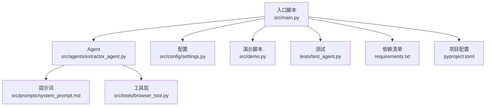
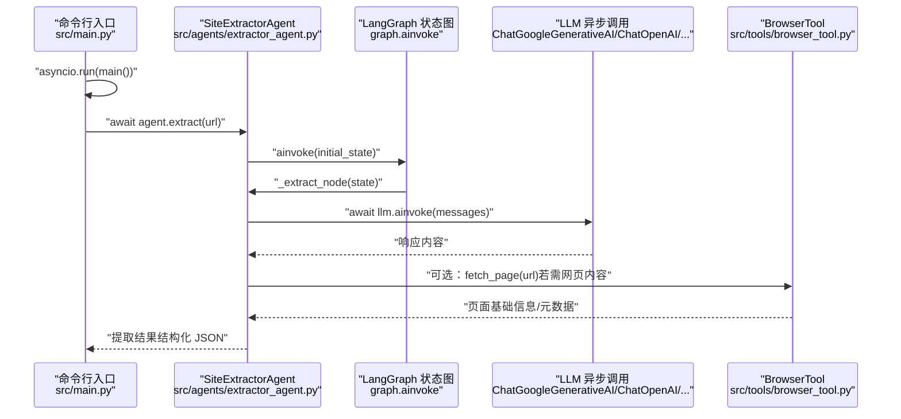
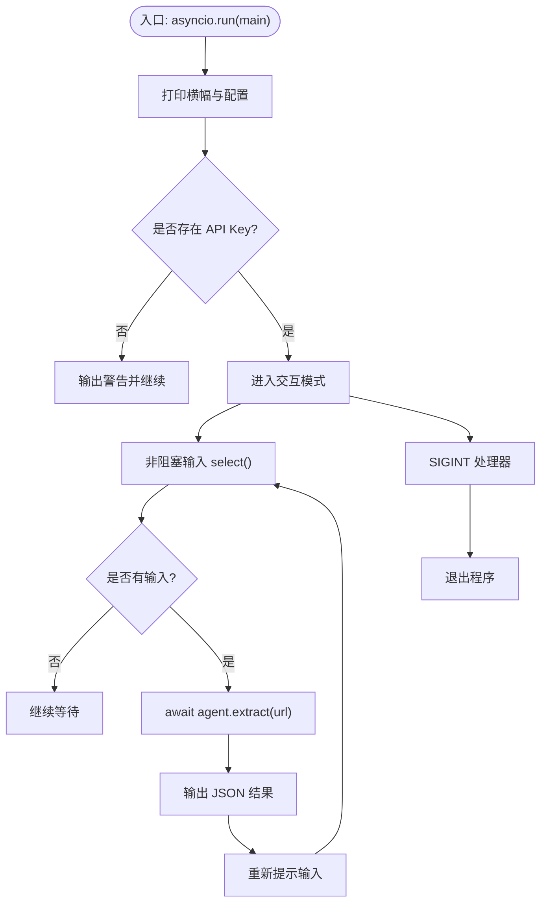
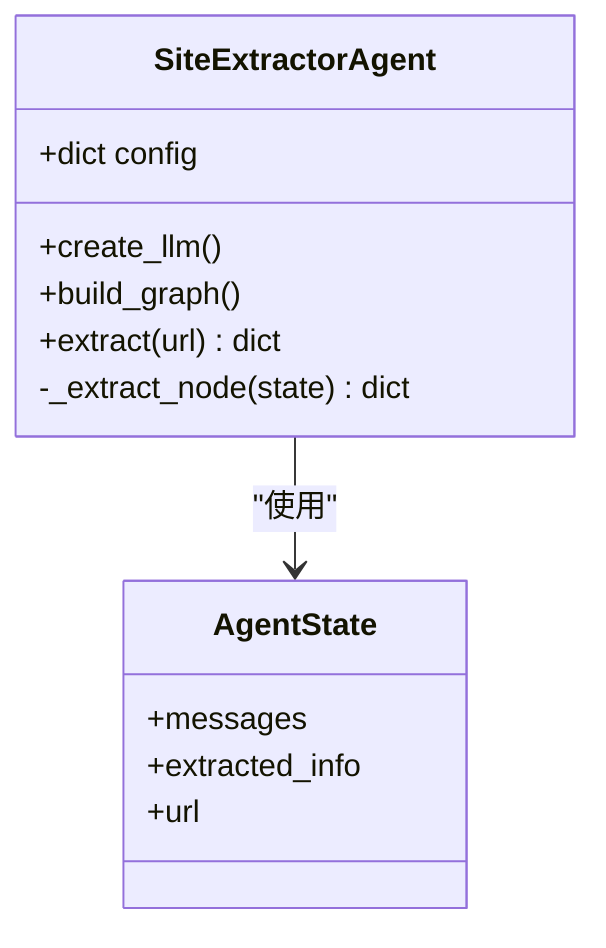
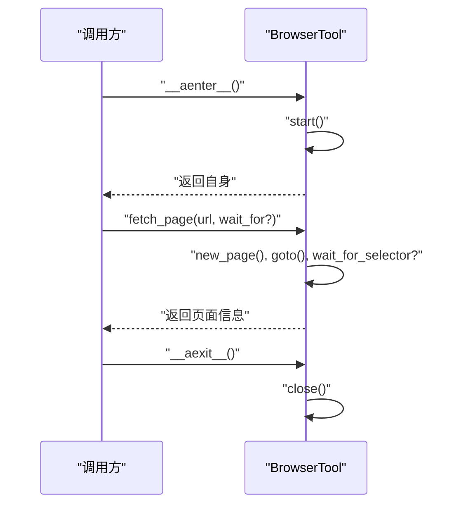
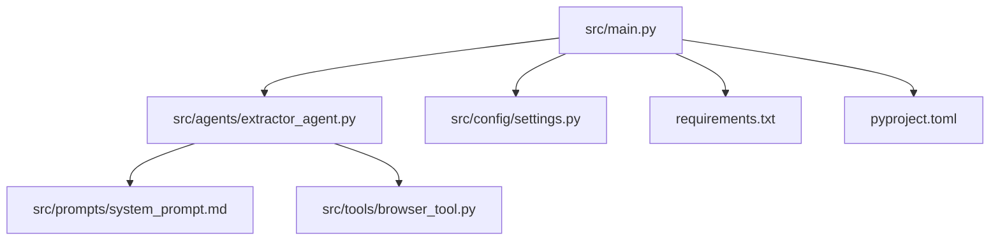

# 异步处理架构

<cite>
**本文引用的文件**
- [src/main.py](file://src/main.py)
- [src/demo.py](file://src/demo.py)
- [src/agents/extractor_agent.py](file://src/agents/extractor_agent.py)
- [src/tools/browser_tool.py](file://src/tools/browser_tool.py)
- [src/config/settings.py](file://src/config/settings.py)
- [src/prompts/system_prompt.md](file://src/prompts/system_prompt.md)
- [tests/test_agent.py](file://tests/test_agent.py)
- [README.md](file://README.md)
- [requirements.txt](file://requirements.txt)
- [pyproject.toml](file://pyproject.toml)
</cite>

## 目录
1. [简介](#简介)
2. [项目结构](#项目结构)
3. [核心组件](#核心组件)
4. [架构总览](#架构总览)
5. [详细组件分析](#详细组件分析)
6. [依赖关系分析](#依赖关系分析)
7. [性能考量](#性能考量)
8. [故障排查指南](#故障排查指南)
9. [结论](#结论)
10. [附录](#附录)

## 简介
本项目围绕“基于 LangChain/LangGraph 的网站信息提取 Agent”展开，采用异步编程范式，结合 asyncio 事件循环、Playwright 异步 API、LangGraph 状态机工作流以及多种 LLM 提供商的异步调用接口，实现高并发、低阻塞的网页信息提取与结构化输出。本文档系统阐述异步实现的关键概念、事件循环与并发处理、资源管理、异步提取流程的优势与性能提升、异步调用方式（如 aiohttp、asyncio.sleep 等）、最佳实践与注意事项，并提供性能监控与调试技巧及与同步组件的集成兼容性建议。

## 项目结构
项目采用分层与功能模块化组织，入口脚本负责 CLI 交互与事件循环调度；Agent 层负责工作流编排与 LLM 异步调用；工具层封装 Playwright 异步浏览器能力；配置层通过 Pydantic Settings 统一管理环境变量与运行参数；提示词文件提供系统级提示与输出规范。

图表来源
- [src/main.py](file://src/main.py#L1-L254)
- [src/agents/extractor_agent.py](file://src/agents/extractor_agent.py#L1-L330)
- [src/tools/browser_tool.py](file://src/tools/browser_tool.py#L1-L108)
- [src/config/settings.py](file://src/config/settings.py#L1-L56)
- [src/prompts/system_prompt.md](file://src/prompts/system_prompt.md#L1-L212)
- [src/demo.py](file://src/demo.py#L1-L51)
- [tests/test_agent.py](file://tests/test_agent.py#L1-L79)
- [requirements.txt](file://requirements.txt#L1-L36)
- [pyproject.toml](file://pyproject.toml#L1-L75)

章节来源
- [src/main.py](file://src/main.py#L1-L254)
- [README.md](file://README.md#L57-L72)

## 核心组件
- 事件循环与入口
  - 使用 asyncio.run 在入口脚本中启动顶层异步主程序，保证事件循环生命周期与程序退出的一致性。
  - 交互模式采用非阻塞输入与 select，避免阻塞事件循环，同时在异步路径中进行 URL 提取与结果输出。
- Agent 工作流
  - 基于 LangGraph StateGraph 构建状态机式工作流，节点为异步方法，通过 graph.ainvoke 触发异步执行。
  - 提供异步提取方法 extract 与异步节点 _extract_node，内部通过 LLM 的异步调用接口完成信息抽取与结构化解析。
- 浏览器工具
  - 封装 Playwright 异步 API，提供异步上下文管理器、启动/关闭、页面抓取与元数据提取等异步能力。
- 配置管理
  - 使用 Pydantic Settings 从 .env 文件加载 API Key 与模型参数，支持多提供商模型切换与浏览器模式配置。
- 演示与测试
  - 演示脚本展示同步 LLM 调用方式，便于对比异步与同步差异。
  - 测试文件包含异步上下文与异步测试标记，验证异步组件行为。

章节来源
- [src/main.py](file://src/main.py#L44-L246)
- [src/agents/extractor_agent.py](file://src/agents/extractor_agent.py#L90-L330)
- [src/tools/browser_tool.py](file://src/tools/browser_tool.py#L10-L108)
- [src/config/settings.py](file://src/config/settings.py#L9-L56)
- [src/demo.py](file://src/demo.py#L1-L51)
- [tests/test_agent.py](file://tests/test_agent.py#L1-L79)

## 架构总览
下图展示了从入口到 Agent、再到 LLM 与浏览器工具的异步调用链路，以及事件循环与资源管理的关系。

图表来源
- [src/main.py](file://src/main.py#L230-L246)
- [src/agents/extractor_agent.py](file://src/agents/extractor_agent.py#L219-L330)
- [src/tools/browser_tool.py](file://src/tools/browser_tool.py#L44-L81)

## 详细组件分析

### 事件循环与入口控制（src/main.py）
- 事件循环启动
  - 使用 asyncio.run(main()) 启动顶层异步主程序，确保事件循环正确创建与清理。
- 交互模式
  - 通过非阻塞输入 select 实现键盘输入监听，避免阻塞事件循环。
  - 在每次提取前打印进度提示，提取完成后以 JSON 形式输出结果。
- 信号处理
  - 注册 SIGINT 处理器，设置退出标志并在退出前清理资源。
- 错误处理
  - 捕获 KeyboardInterrupt 与 asyncio.CancelledError，保证优雅退出。
  - 捕获通用异常并输出堆栈信息，便于调试。

图表来源
- [src/main.py](file://src/main.py#L230-L246)
- [src/main.py](file://src/main.py#L44-L228)

章节来源
- [src/main.py](file://src/main.py#L1-L254)

### Agent 工作流与异步提取（src/agents/extractor_agent.py）
- 状态定义
  - AgentState 包含消息历史、已提取信息与目标 URL，用于工作流状态传递。
- LLM 供应商选择
  - 优先级：Google Gemini → OpenAI → Anthropic → Groq → SiliconFlow → 讯飞 → Cerebras。
  - 动态导入各提供商模块，若不可用则跳过，最终在无可用 Key 时抛出异常。
- 工作流构建
  - 使用 StateGraph 添加单节点“extractor”，设置入口点并连接至结束节点，编译后返回可执行图。
- 异步提取流程
  - extract 方法初始化状态并调用 graph.ainvoke，返回提取结果。
  - _extract_node 构建消息列表（系统提示 + 历史消息），调用 LLM 异步接口获取响应。
  - 解析响应：优先提取代码块中的 JSON，其次尝试直接解析，失败则保留原始内容与错误信息。
  - 更新消息历史并返回新状态，供后续节点或外部消费。

图表来源
- [src/agents/extractor_agent.py](file://src/agents/extractor_agent.py#L77-L115)
- [src/agents/extractor_agent.py](file://src/agents/extractor_agent.py#L195-L240)

章节来源
- [src/agents/extractor_agent.py](file://src/agents/extractor_agent.py#L1-L330)
- [src/prompts/system_prompt.md](file://src/prompts/system_prompt.md#L1-L212)

### 浏览器工具与异步资源管理（src/tools/browser_tool.py）
- 异步上下文管理器
  - __aenter__/__aexit__ 实现异步资源的自动启动与关闭，确保浏览器与 Playwright 实例的生命周期可控。
- 启动与关闭
  - start 启动 Playwright 并打开 Chromium 浏览器；close 关闭浏览器与停止 Playwright。
- 页面抓取
  - fetch_page 异步访问 URL，等待网络空闲，可选等待特定元素出现，获取标题、内容、文本与元数据。
  - 每次抓取后及时关闭页面，避免资源泄漏。
- 元数据提取
  - 通过 query_selector 获取常见 meta 标签内容，形成结构化字典。

图表来源
- [src/tools/browser_tool.py](file://src/tools/browser_tool.py#L23-L81)

章节来源
- [src/tools/browser_tool.py](file://src/tools/browser_tool.py#L1-L108)

### 配置与环境变量（src/config/settings.py）
- API Key 管理
  - 支持多提供商 API Key，按需启用相应模型。
- 模型参数
  - model_name、temperature、max_tokens 等通用参数；各提供商特定模型名称。
- 浏览器配置
  - browser_headless 控制 Playwright 浏览器是否无头运行。
- 环境加载
  - 从 .env 文件加载，大小写不敏感，忽略多余字段。

章节来源
- [src/config/settings.py](file://src/config/settings.py#L1-L56)
- [README.md](file://README.md#L27-L50)

### 演示与测试（src/demo.py 与 tests/test_agent.py）
- 演示脚本
  - 展示同步 LLM 调用方式，便于与异步 Agent 的行为对比。
- 测试脚本
  - 使用 pytest-asyncio 标记异步测试，验证 BrowserTool 异步上下文与 SiteExtractorAgent 的异步提取流程。

章节来源
- [src/demo.py](file://src/demo.py#L1-L51)
- [tests/test_agent.py](file://tests/test_agent.py#L1-L79)

## 依赖关系分析
- 语言与框架
  - LangChain/LangGraph：工作流编排与消息传递。
  - Playwright：异步浏览器自动化。
  - aiohttp：异步 HTTP 客户端（项目中存在依赖，但当前 Agent 未直接使用）。
- 配置与类型
  - pydantic-settings：从 .env 加载配置。
  - rich：终端输出与可视化。
- 测试与开发
  - pytest 与 pytest-asyncio：异步测试支持。
  - black/ruff/mypy：代码风格与静态检查。

图表来源
- [src/main.py](file://src/main.py#L1-L254)
- [requirements.txt](file://requirements.txt#L1-L36)
- [pyproject.toml](file://pyproject.toml#L28-L47)

章节来源
- [requirements.txt](file://requirements.txt#L1-L36)
- [pyproject.toml](file://pyproject.toml#L1-L75)

## 性能考量
- 异步优势
  - 高并发 I/O：浏览器抓取、LLM 调用、网络请求等均采用异步，避免线程阻塞，提升吞吐量。
  - 事件循环复用：单线程事件循环统一调度多个协程，降低上下文切换开销。
- 资源管理
  - 异步上下文管理器确保浏览器与 Playwright 生命周期可控，防止资源泄漏。
  - 每次页面抓取后及时关闭页面，减少内存占用。
- 超时与重试
  - 页面等待与元素选择器可设置超时，避免无限等待。
  - LLM 调用可结合指数退避与重试策略（建议在上层封装）。
- 并发控制
  - 当前实现为单节点工作流，若需并发批量提取，可在入口层引入任务队列与并发限制（例如 asyncio.Semaphore）。
- I/O 优化
  - 合理设置 LLM 超时与模型参数，避免长尾请求拖慢整体性能。
  - 对于静态内容，可考虑缓存与本地解析，减少重复抓取。

[本节为通用性能指导，无需具体文件引用]

## 故障排查指南
- 事件循环与信号
  - 若出现 KeyboardInterrupt 无法捕获，确认使用 asyncio.run(main()) 启动顶层异步主程序。
  - SIGINT 处理器会设置退出标志并立即退出，避免事件循环继续执行。
- LLM 调用异常
  - 检查 API Key 是否正确配置与提供商模块是否安装。
  - 若 LLM 返回内容非标准 JSON，Agent 会回退到原始内容并标注解析错误，便于定位问题。
- 浏览器与页面抓取
  - 确保已安装 Playwright 浏览器：playwright install。
  - 若页面加载缓慢，调整 wait_until 与等待元素策略，必要时增加超时。
- 非阻塞输入
  - 交互模式使用 select 实现非阻塞输入，若在某些平台不生效，可改用 asyncio 的异步 I/O 或第三方库。
- 调试技巧
  - 使用 rich 输出结构化日志，便于观察状态变化与中间结果。
  - 在测试中使用 pytest-asyncio 标记，结合 Mock 验证异步行为。
  - 对于复杂流程，可在关键节点打印状态快照，辅助定位问题。

章节来源
- [src/main.py](file://src/main.py#L76-L85)
- [src/agents/extractor_agent.py](file://src/agents/extractor_agent.py#L299-L304)
- [src/tools/browser_tool.py](file://src/tools/browser_tool.py#L54-L55)
- [tests/test_agent.py](file://tests/test_agent.py#L29-L66)

## 结论
本项目通过 asyncio 事件循环、LangGraph 工作流与 Playwright 异步 API，构建了高并发、低阻塞的网站信息提取系统。Agent 的异步提取流程在保持简洁的同时，具备良好的可扩展性与容错能力。配合异步上下文管理器与合理的超时/重试策略，能够在复杂网络环境下稳定运行。未来可在入口层引入并发控制与批处理能力，进一步提升吞吐与稳定性。

[本节为总结性内容，无需具体文件引用]

## 附录

### 异步调用实现要点
- aiohttp
  - 项目包含 aiohttp 依赖，可用于异步 HTTP 请求场景（如外部服务调用）。建议在独立协程中使用，避免与主线程阻塞混用。
- asyncio.sleep
  - 可用于异步延时与退避重试，避免阻塞事件循环。
- 异步上下文管理器
  - 使用 __aenter__/__aexit__ 管理资源生命周期，确保异常情况下也能正确释放资源。

章节来源
- [requirements.txt](file://requirements.txt#L24-L26)
- [src/tools/browser_tool.py](file://src/tools/browser_tool.py#L23-L31)

### 与同步组件的集成与兼容性
- 同步 LLM 调用
  - 演示脚本展示了同步调用方式，便于对比异步性能与行为差异。
- 与富文本输出库
  - 使用 rich 输出结构化表格与面板，不影响异步执行，仅用于 CLI 交互体验。
- 与测试框架
  - pytest-asyncio 支持异步测试，建议在新增异步功能时补充异步测试用例。

章节来源
- [src/demo.py](file://src/demo.py#L35-L51)
- [tests/test_agent.py](file://tests/test_agent.py#L29-L66)