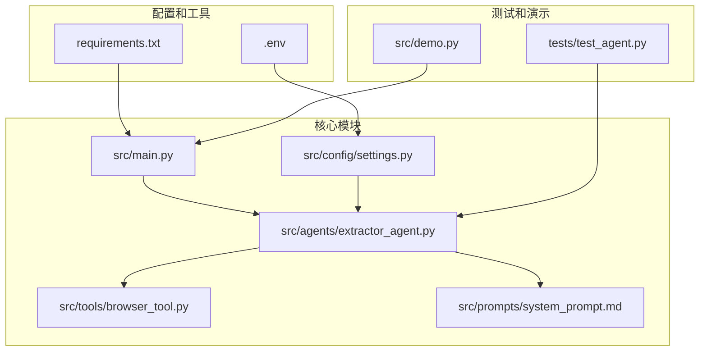
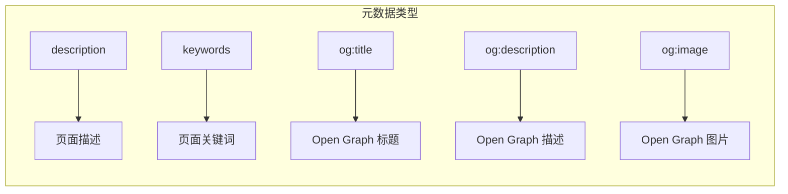
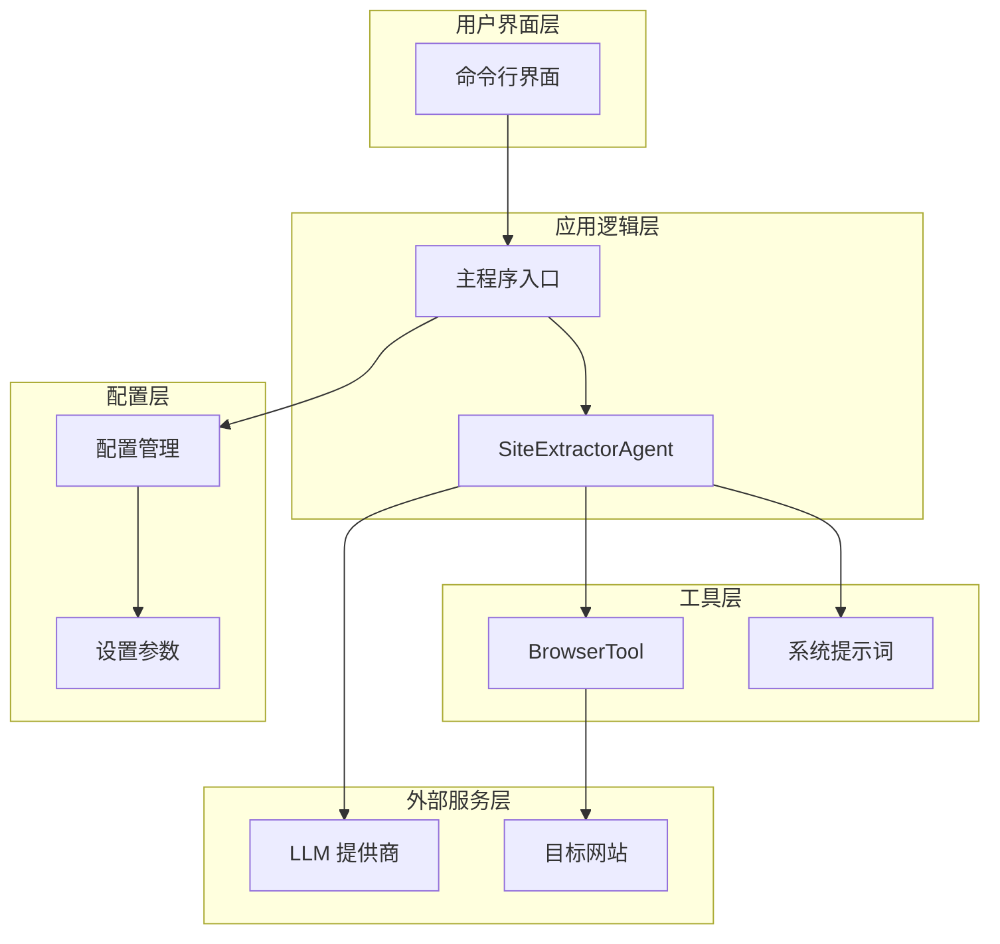
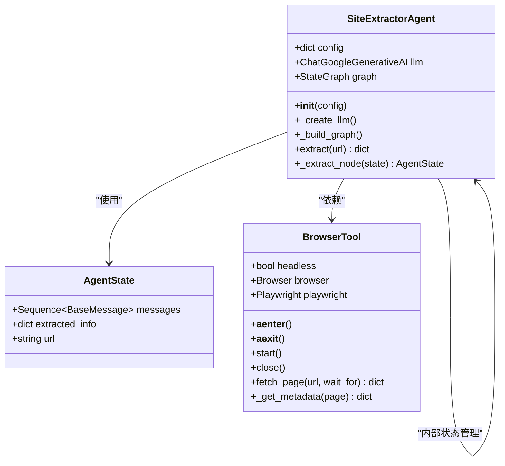
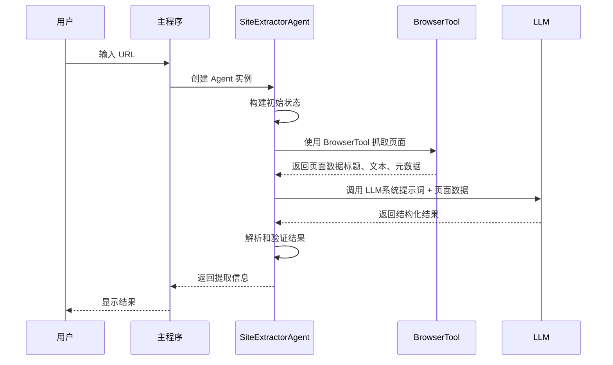
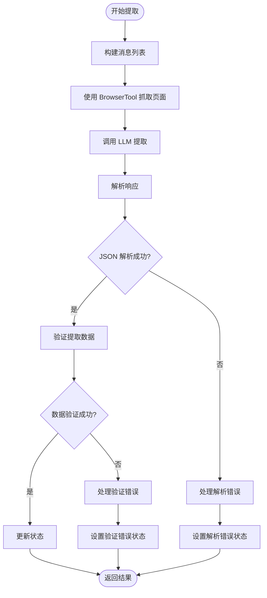
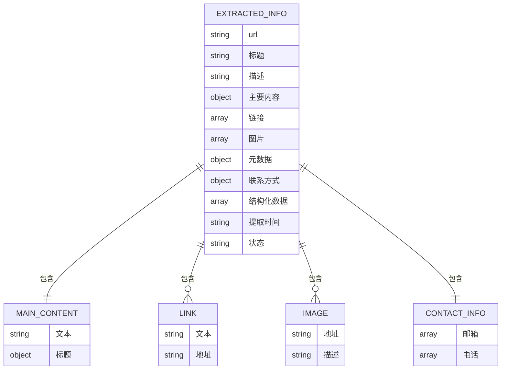

# 网站信息提取

<cite>
**本文档引用的文件**
- [src/agents/extractor_agent.py](file://src/agents/extractor_agent.py)
- [src/prompts/system_prompt.md](file://src/prompts/system_prompt.md)
- [src/tools/browser_tool.py](file://src/tools/browser_tool.py)
- [src/config/settings.py](file://src/config/settings.py)
- [src/main.py](file://src/main.py)
- [src/demo.py](file://src/demo.py)
- [tests/test_agent.py](file://tests/test_agent.py)
- [README.md](file://README.md)
- [requirements.txt](file://requirements.txt)
</cite>

## 更新摘要
**变更内容**
- 更新了提取流程架构，从直接 LLM 交互改为两步流程
- 新增了 BrowserTool 组件的详细说明
- 更新了系统提示词的作用和配置方法
- 修订了提取流程的工作原理和数据流
- 增强了对动态内容和复杂网页的处理能力说明

## 目录
1. [简介](#简介)
2. [项目结构](#项目结构)
3. [核心组件](#核心组件)
4. [架构概览](#架构概览)
5. [详细组件分析](#详细组件分析)
6. [依赖关系分析](#依赖关系分析)
7. [性能考虑](#性能考虑)
8. [故障排除指南](#故障排除指南)
9. [结论](#结论)

## 简介

Site Info Extractor Agent 是一个基于最新 LangChain 和 LangGraph 构建的智能网站信息提取系统。该系统能够从各种类型的网站中提取结构化信息，包括文本内容、链接、图片、元数据等关键信息。系统采用多提供商 LLM 支持，具备强大的内容解析和结构化能力。

**重大更新**：系统已重构为两步提取流程，先使用 BrowserTool 抓取页面内容，再将抓取结果与系统提示词一次性传给 LLM，显著提升了对动态内容和复杂网页的处理能力。

该系统的核心优势在于其模块化设计、灵活的配置管理和强大的错误处理机制。通过精心设计的系统提示词，LLM 能够准确理解提取任务并生成符合预期的结构化输出。

## 项目结构

项目采用清晰的分层架构，每个模块都有明确的职责分工：

**图表来源**
- [src/main.py](file://src/main.py#L1-L254)
- [src/agents/extractor_agent.py](file://src/agents/extractor_agent.py#L1-L352)
- [src/tools/browser_tool.py](file://src/tools/browser_tool.py#L1-L108)

**章节来源**
- [README.md](file://README.md#L61-L76)
- [requirements.txt](file://requirements.txt#L1-L36)

## 核心组件

### SiteExtractorAgent 核心功能

SiteExtractorAgent 是系统的核心组件，负责协调整个提取流程。它基于 LangGraph 构建状态机式的工作流，支持多种 LLM 提供商的动态切换。

#### 主要特性
- **两步提取流程**：先抓取页面内容，再进行结构化提取
- **多提供商支持**：Google Gemini、OpenAI、Anthropic、Groq、SiliconFlow、讯飞、Cerebras
- **异步处理**：完全基于 asyncio 的异步架构
- **状态管理**：基于 LangGraph 的状态机管理
- **错误恢复**：完善的异常处理和错误恢复机制

#### 提供商优先级
系统按照以下优先级自动选择 LLM 提供商：
1. Google Gemini (最高优先级)
2. OpenAI
3. Anthropic
4. Groq
5. SiliconFlow
6. 讯飞
7. Cerebras

**章节来源**
- [src/agents/extractor_agent.py](file://src/agents/extractor_agent.py#L93-L196)

### BrowserTool 浏览器工具

**重大更新**：BrowserTool 是新引入的核心组件，封装了 Playwright 的异步 API，提供网页访问和内容获取功能。它支持无头模式运行，能够处理动态内容和各种网页场景。

#### 核心功能
- **异步浏览器管理**：支持 async 上下文管理器
- **页面内容获取**：获取完整的 HTML 内容和纯文本
- **元数据提取**：自动提取常见的 meta 标签
- **动态内容支持**：处理 JavaScript 动态渲染的内容
- **网络状态等待**：使用 networkidle 等待页面完全加载

#### 元数据提取规则

BrowserTool 自动提取以下类型的元数据：

**章节来源**
- [src/tools/browser_tool.py](file://src/tools/browser_tool.py#L10-L108)

### 系统提示词管理

系统提示词存储在独立的 Markdown 文件中，提供了详细的提取指导和输出规范。这些提示词定义了 LLM 的行为准则、提取规则和输出格式。

#### 提示词结构
- **核心职责**：明确 LLM 的提取任务和责任范围
- **提取规则**：详细规定必须和可选提取的信息类型
- **输出格式**：规定标准的 JSON 输出格式
- **异常处理**：指导如何处理各种异常情况

**章节来源**
- [src/prompts/system_prompt.md](file://src/prompts/system_prompt.md#L1-L212)

## 架构概览

**重大更新**：系统采用两步架构设计，每个层级都有明确的职责和边界：

**图表来源**
- [src/main.py](file://src/main.py#L230-L246)
- [src/agents/extractor_agent.py](file://src/agents/extractor_agent.py#L198-L220)
- [src/tools/browser_tool.py](file://src/tools/browser_tool.py#L44-L80)

## 详细组件分析

### SiteExtractorAgent 类分析

**重大更新**：SiteExtractorAgent 已重构为两步提取流程，先使用 BrowserTool 抓取网页内容，然后将系统提示词与网页信息一并交给 LLM。

#### 类结构图

**图表来源**
- [src/agents/extractor_agent.py](file://src/agents/extractor_agent.py#L79-L90)
- [src/tools/browser_tool.py](file://src/tools/browser_tool.py#L10-L22)

#### 两步提取流程序列图

**图表来源**
- [src/agents/extractor_agent.py](file://src/agents/extractor_agent.py#L244-L351)
- [src/agents/extractor_agent.py](file://src/agents/extractor_agent.py#L265-L297)

#### 错误处理流程图

**图表来源**
- [src/agents/extractor_agent.py](file://src/agents/extractor_agent.py#L326-L351)

**章节来源**
- [src/agents/extractor_agent.py](file://src/agents/extractor_agent.py#L244-L351)

### BrowserTool 组件分析

**重大更新**：BrowserTool 提供了完整的网页访问和内容获取功能，是系统与外部网站交互的桥梁。

#### 核心方法分析

| 方法 | 参数 | 返回值 | 功能描述 |
|------|------|--------|----------|
| `__init__` | headless: bool | None | 初始化浏览器工具 |
| `start` | 无 | None | 启动浏览器实例 |
| `close` | 无 | None | 关闭浏览器连接 |
| `fetch_page` | url: str, wait_for: str | Dict | 获取页面完整内容 |
| `_get_metadata` | page: Page | Dict | 提取页面元数据 |

#### 元数据提取规则

BrowserTool 自动提取以下类型的元数据：

**图表来源**
- [src/tools/browser_tool.py](file://src/tools/browser_tool.py#L94-L106)

**章节来源**
- [src/tools/browser_tool.py](file://src/tools/browser_tool.py#L44-L108)

### 系统提示词配置

系统提示词是指导 LLM 正确执行提取任务的关键配置。它定义了提取的范围、规则和输出格式。

#### 提取规则详解

系统提示词包含了详细的提取指导：

| 提取类别 | 必须提取 | 可选提取 | 质量要求 |
|----------|----------|----------|----------|
| 基础信息 | 标题、描述、主要内容 | 作者、时间、标签 | 准确性、完整性 |
| 链接信息 | 关键链接 | 社交媒体链接 | 一致性、可读性 |
| 媒体资源 | 图片资源 | 其他媒体 | 清晰性、完整性 |
| 结构化数据 | Schema.org | 其他结构化数据 | 标准化、准确性 |

#### 输出格式规范

系统定义了标准的 JSON 输出格式，确保结果的一致性和可处理性：

**图表来源**
- [src/prompts/system_prompt.md](file://src/prompts/system_prompt.md#L109-L146)

**章节来源**
- [src/prompts/system_prompt.md](file://src/prompts/system_prompt.md#L64-L146)

## 依赖关系分析

系统依赖关系清晰，采用了松耦合的设计原则：

```mermaid
graph TB
subgraph "LangChain 生态"
LC[langchain>=1.2.3]
LCC[langchain-core>=1.2.6]
LG[langgraph>=1.0.0]
LGG[langchain-google-genai>=1.0.0]
LO[langchain-openai>=1.1.7]
LA[langchain-anthropic>=0.3.0]
end
subgraph "工具库"
PW[playwright>=1.48.0]
RE[requests>=2.31.0]
BS[beautifulsoup4>=4.12.0]
LX[lxml>=5.0.0]
end
subgraph "配置管理"
PD[pydantic>=2.8.0]
PS[pydantic-settings>=2.0.0]
ED[python-dotenv>=1.0.0]
end
subgraph "异步支持"
AH[aiohttp>=3.9.0]
end
subgraph "界面显示"
RC[rich>=13.7.0]
end
subgraph "测试框架"
PT[pytest>=7.4.0]
PA[pytest-asyncio>=0.21.0]
end
LC --> LCC
LC --> LG
LC --> LGG
LC --> LO
LC --> LA
LC --> PW
LC --> RE
LC --> BS
LC --> LX
LC --> PD
LC --> PS
LC --> ED
LC --> AH
LC --> RC
LC --> PT
LC --> PA
```

**图表来源**
- [requirements.txt](file://requirements.txt#L1-L36)

**章节来源**
- [requirements.txt](file://requirements.txt#L1-L36)

## 性能考虑

**重大更新**：系统在设计时充分考虑了两步流程的性能优化和资源管理：

### 异步架构优势
- **非阻塞 I/O**：所有网络操作都是异步的
- **并发处理**：支持多个提取任务同时进行
- **内存效率**：及时释放浏览器资源和中间结果

### 两步流程性能优化
- **浏览器复用**：使用 async 上下文管理器确保正确关闭
- **LLM 连接池**：复用 LLM 实例减少初始化开销
- **缓存机制**：可扩展的缓存策略减少重复请求
- **网络状态等待**：使用 networkidle 确保页面完全加载

### 性能优化建议
1. **合理设置超时时间**：避免长时间等待
2. **控制并发数量**：防止过度占用系统资源
3. **使用无头模式**：减少资源消耗
4. **实施重试机制**：提高成功率
5. **优化页面等待策略**：平衡加载时间和性能

## 故障排除指南

### 常见问题及解决方案

#### LLM 提供商配置问题
**问题**: 无法连接到 LLM 提供商
**解决方案**: 
1. 检查 API Key 是否正确配置
2. 验证网络连接状态
3. 确认模型名称是否有效
4. 检查配额限制

#### 浏览器访问问题
**问题**: 网页加载失败或内容不完整
**解决方案**:
1. 检查目标网站的 robots.txt
2. 增加等待时间
3. 使用不同的浏览器模式
4. 实施重试机制

#### JSON 解析错误
**问题**: LLM 返回的不是标准 JSON 格式
**解决方案**:
1. 检查系统提示词配置
2. 调整模型参数（温度、最大令牌数）
3. 提供更明确的指令
4. 实施错误恢复策略

#### 内存泄漏问题
**问题**: 长时间运行后内存占用增加
**解决方案**:
1. 确保正确关闭浏览器实例
2. 及时清理临时文件
3. 实施内存监控
4. 定期重启服务

### 错误恢复策略

系统实现了多层次的错误恢复机制：

1. **LLM 调用失败**: 自动切换到备用提供商
2. **网络超时**: 实施指数退避重试
3. **解析失败**: 回退到原始响应处理
4. **资源不足**: 自动清理和重启

**章节来源**
- [src/agents/extractor_agent.py](file://src/agents/extractor_agent.py#L339-L351)
- [src/tools/browser_tool.py](file://src/tools/browser_tool.py#L54-L56)

## 结论

**重大更新**：Site Info Extractor Agent 已重构为两步提取流程，从直接 LLM 交互升级为先抓取后提取的架构，显著提升了对动态内容和复杂网页的处理能力。

### 主要优势
- **两步提取流程**：先抓取页面内容，再进行结构化提取
- **多提供商支持**：确保高可用性和灵活性
- **异步架构**：提供优秀的性能表现
- **标准化输出**：保证结果的一致性和可处理性
- **完善的错误处理**：提高系统的稳定性和可靠性
- **动态内容支持**：有效处理 JavaScript 渲染的页面

### 未来发展方向
1. **增强提取能力**：支持更多类型的网站和内容
2. **优化性能**：进一步提升处理速度和资源利用率
3. **扩展功能**：添加更多定制化的提取规则
4. **改进用户体验**：提供更友好的交互界面和报告功能
5. **增强浏览器工具**：支持更多高级功能如截图、PDF 导出等

该系统为网站信息提取领域提供了一个优秀的参考实现，具有很高的实用价值和扩展潜力。两步提取流程的引入使其在处理现代复杂网页方面表现更加出色。