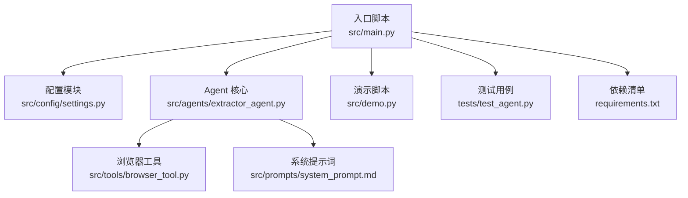
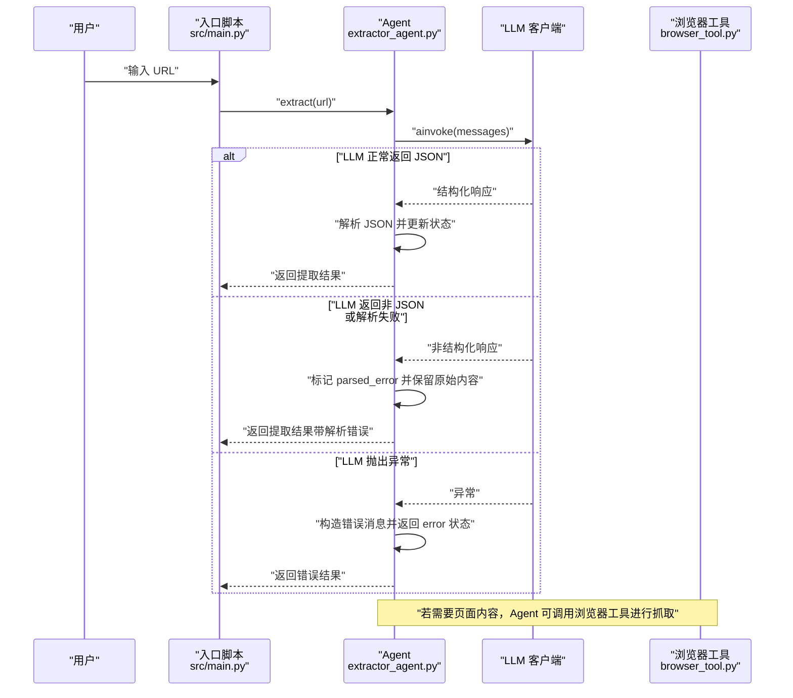
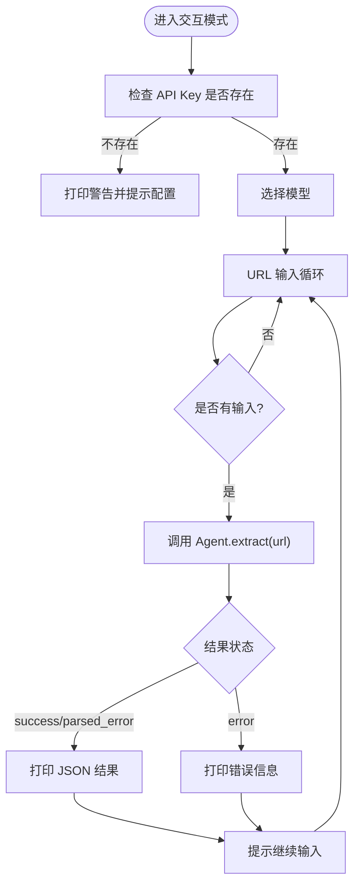
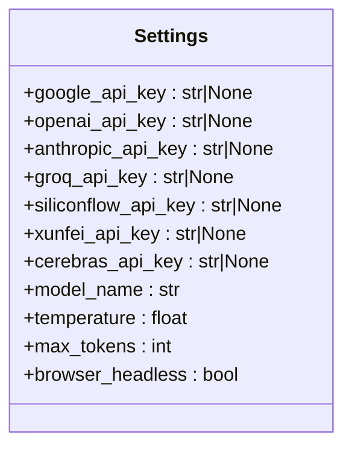
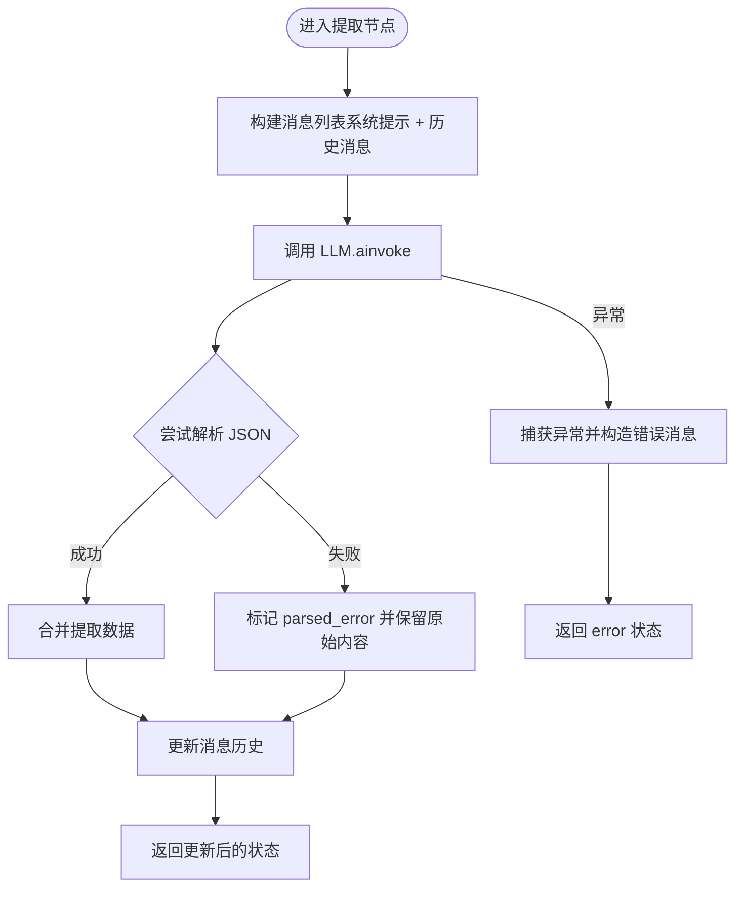
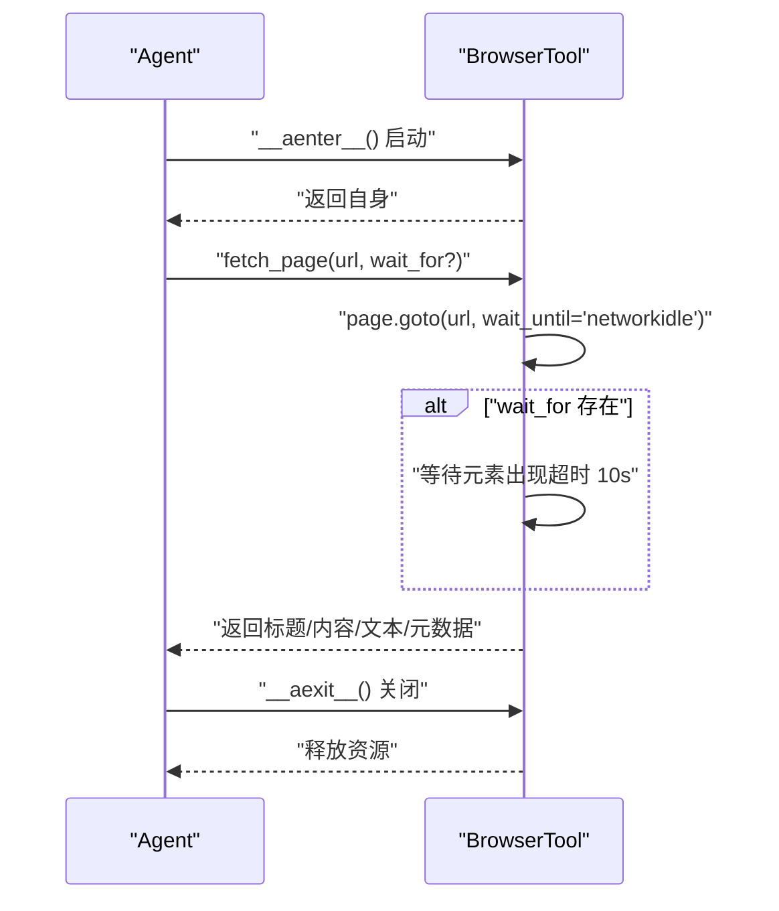
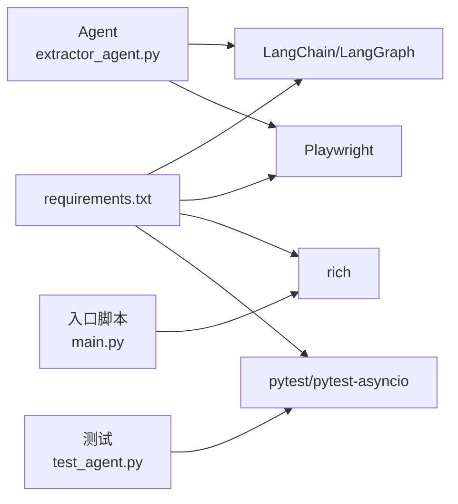

# 错误处理与恢复

<cite>
**本文引用的文件**
- [README.md](file://README.md)
- [src/main.py](file://src/main.py)
- [src/demo.py](file://src/demo.py)
- [src/config/settings.py](file://src/config/settings.py)
- [src/agents/extractor_agent.py](file://src/agents/extractor_agent.py)
- [src/tools/browser_tool.py](file://src/tools/browser_tool.py)
- [src/prompts/system_prompt.md](file://src/prompts/system_prompt.md)
- [requirements.txt](file://requirements.txt)
- [tests/test_agent.py](file://tests/test_agent.py)
- [.env.example](file://.env.example)
</cite>

## 目录
1. [简介](#简介)
2. [项目结构](#项目结构)
3. [核心组件](#核心组件)
4. [架构总览](#架构总览)
5. [详细组件分析](#详细组件分析)
6. [依赖分析](#依赖分析)
7. [性能考虑](#性能考虑)
8. [故障排查指南](#故障排查指南)
9. [结论](#结论)
10. [附录](#附录)

## 简介
本文件聚焦于“错误处理与恢复”主题，系统梳理本项目在运行过程中可能遇到的错误类型（网络超时、模型调用失败、解析错误、权限错误等），并结合源码实现，给出异常分类、错误信息记录、状态码管理、自动重试与退避策略、故障转移方案、日志与监控告警配置以及常见问题的诊断与解决建议。文档同时提供面向非技术用户的可读性说明，并通过可视化图表帮助理解关键流程。

## 项目结构
该项目采用分层设计：入口脚本负责交互与控制流；配置模块集中管理环境变量与模型参数；Agent 层负责工作流编排与错误处理；工具层封装浏览器访问能力；提示词模块定义系统行为与异常处理策略。

图表来源
- [src/main.py](file://src/main.py#L1-L254)
- [src/config/settings.py](file://src/config/settings.py#L1-L56)
- [src/agents/extractor_agent.py](file://src/agents/extractor_agent.py#L1-L330)
- [src/tools/browser_tool.py](file://src/tools/browser_tool.py#L1-L108)
- [src/prompts/system_prompt.md](file://src/prompts/system_prompt.md#L1-L212)
- [src/demo.py](file://src/demo.py#L1-L51)
- [tests/test_agent.py](file://tests/test_agent.py#L1-L80)
- [requirements.txt](file://requirements.txt#L1-L36)

章节来源
- [README.md](file://README.md#L57-L72)
- [src/main.py](file://src/main.py#L1-L254)
- [src/config/settings.py](file://src/config/settings.py#L1-L56)

## 核心组件
- 入口与交互控制：负责打印横幅、展示配置、处理用户输入、信号中断、异常捕获与回退。
- 配置管理：集中读取环境变量，提供模型名称、温度、最大令牌、浏览器模式等参数。
- Agent 核心：基于 LangGraph 的状态机式工作流，封装 LLM 调用、消息构建、JSON 解析与错误状态返回。
- 浏览器工具：封装 Playwright 的异步生命周期与页面抓取，提供页面标题、内容、文本与元数据提取。
- 提示词：定义系统角色、提取规则、异常处理策略与输出格式，指导 LLM 在异常情况下仍能稳定输出结构化结果。
- 依赖与环境：通过 requirements.txt 管理第三方库，.env.example 提供 API Key 示例。

章节来源
- [src/main.py](file://src/main.py#L26-L246)
- [src/config/settings.py](file://src/config/settings.py#L9-L55)
- [src/agents/extractor_agent.py](file://src/agents/extractor_agent.py#L90-L330)
- [src/tools/browser_tool.py](file://src/tools/browser_tool.py#L10-L108)
- [src/prompts/system_prompt.md](file://src/prompts/system_prompt.md#L87-L104)
- [requirements.txt](file://requirements.txt#L1-L36)
- [.env.example](file://.env.example#L1-L9)

## 架构总览
下图展示了从用户输入到提取结果返回的关键流程，以及错误在各环节的捕获与恢复策略。

图表来源
- [src/main.py](file://src/main.py#L209-L212)
- [src/agents/extractor_agent.py](file://src/agents/extractor_agent.py#L219-L330)
- [src/tools/browser_tool.py](file://src/tools/browser_tool.py#L44-L81)

## 详细组件分析

### 入口与交互控制（错误捕获与处理）
- 信号处理：注册 SIGINT 处理器，设置退出标志并在退出前立即终止进程，避免继续执行。
- 非阻塞输入：使用 select 实现非阻塞键盘输入，避免阻塞事件循环。
- 异常捕获：在交互循环中捕获键盘中断、IO 错误、ValueError 等异常，并打印堆栈以便诊断。
- 配置校验：在启动时检查是否存在任一 API Key，若不存在则发出警告并提示配置。

图表来源
- [src/main.py](file://src/main.py#L44-L228)

章节来源
- [src/main.py](file://src/main.py#L76-L85)
- [src/main.py](file://src/main.py#L96-L153)
- [src/main.py](file://src/main.py#L188-L228)
- [src/main.py](file://src/main.py#L230-L246)

### 配置与环境（错误来源与预防）
- 配置来源：通过 pydantic-settings 从 .env 文件读取 API Key 与模型参数，大小写不敏感，忽略额外字段。
- 环境变量示例：.env.example 提供 Google、OpenAI、Anthropic 等 Key 的占位符，便于用户快速配置。
- 依赖声明：requirements.txt 明确列出 LangChain/LangGraph、Playwright、rich 等关键依赖，确保运行时环境一致。

图表来源
- [src/config/settings.py](file://src/config/settings.py#L9-L55)

章节来源
- [src/config/settings.py](file://src/config/settings.py#L9-L55)
- [.env.example](file://.env.example#L1-L9)
- [requirements.txt](file://requirements.txt#L1-L36)

### Agent 核心（异常分类与恢复）
- 异常分类：
  - 解析错误：当 LLM 返回内容无法解析为 JSON 时，记录原始响应与解析错误，状态标记为 parsed_error。
  - 执行错误：当 LLM 调用抛出异常时，构造错误消息并返回 error 状态。
- 错误信息记录：
  - 在提取节点内部捕获异常，构造 AIMessage 错误消息并追加到消息历史。
  - 返回的 extracted_info 字段包含 url、status、error 等关键信息，便于上层处理。
- 状态码管理：
  - 返回结构中包含 status 字段，取值包括 success、parsed_error、error，用于上层判断处理策略。
- 故障转移：
  - LLM 客户端创建时按优先级选择供应商（Google Gemini → OpenAI → Anthropic → Groq → SiliconFlow → 讯飞 → Cerebras），若某供应商不可用则自动降级。

图表来源
- [src/agents/extractor_agent.py](file://src/agents/extractor_agent.py#L241-L330)

章节来源
- [src/agents/extractor_agent.py](file://src/agents/extractor_agent.py#L116-L194)
- [src/agents/extractor_agent.py](file://src/agents/extractor_agent.py#L241-L330)

### 浏览器工具（网络与页面加载错误）
- 生命周期管理：通过异步上下文管理器 start/close 确保浏览器与 Playwright 资源正确释放。
- 页面访问：goto 使用 networkidle 等待条件，必要时可等待特定元素出现；若未启动浏览器直接调用会抛出运行时错误。
- 元数据提取：通过查询常用 meta 标签获取描述、关键词、OG 标签等，增强提取结果的完整性。
- 错误处理：在 fetch_page 内部使用 try/finally 确保页面关闭，避免资源泄漏；若 wait_for 超时，由上游调用方决定重试或降级。

图表来源
- [src/tools/browser_tool.py](file://src/tools/browser_tool.py#L23-L81)

章节来源
- [src/tools/browser_tool.py](file://src/tools/browser_tool.py#L10-L108)

### 提示词与异常处理策略（指导 LLM 稳健输出）
- 异常处理策略：明确列出页面加载失败、内容为空、编码问题、反爬虫机制等场景的应对方法，指导 LLM 在异常情况下仍能输出结构化结果。
- 输出格式：要求输出 JSON，并在系统提示词中给出标准字段与示例，降低解析失败概率。
- 质量要求：准确性、完整性、一致性、可读性，有助于减少下游解析错误。

章节来源
- [src/prompts/system_prompt.md](file://src/prompts/system_prompt.md#L87-L104)
- [src/prompts/system_prompt.md](file://src/prompts/system_prompt.md#L105-L146)

## 依赖分析
- LangChain/LangGraph：提供 LLM 客户端与工作流编排能力，Agent 基于 LangGraph 的状态图实现。
- Playwright：提供异步浏览器访问能力，封装页面加载、内容提取与元数据采集。
- rich：用于命令行友好输出，便于在错误发生时直观展示堆栈与状态。
- pytest/pytest-asyncio：提供异步测试能力，便于验证 Agent 的错误状态返回与异常分支。

图表来源
- [requirements.txt](file://requirements.txt#L1-L36)
- [src/agents/extractor_agent.py](file://src/agents/extractor_agent.py#L1-L330)
- [src/main.py](file://src/main.py#L1-L254)
- [tests/test_agent.py](file://tests/test_agent.py#L1-L80)

章节来源
- [requirements.txt](file://requirements.txt#L1-L36)
- [tests/test_agent.py](file://tests/test_agent.py#L15-L66)

## 性能考虑
- 异步执行：入口脚本与 Agent 均采用 asyncio，避免阻塞；浏览器工具使用异步 API，减少等待时间。
- 超时与等待：浏览器工具在 goto 时使用 networkidle，在等待元素时设置固定超时，避免无限等待。
- 重试与退避：当前实现未内置自动重试与指数退避策略。可在 LLM 调用处增加重试装饰器或指数退避，以提升对瞬时网络波动的鲁棒性。
- 并发控制：建议限制并发请求数量，避免触发上游服务限流或反爬虫机制。

[本节为通用性能建议，不直接分析具体文件]

## 故障排查指南

### 常见错误类型与定位
- 权限错误（API Key 缺失或无效）
  - 现象：启动时提示未检测到 API Key；Agent 初始化时报错。
  - 排查：确认 .env 文件已正确复制并填写；检查 API Key 是否过期或受限。
  - 参考
    - [src/main.py](file://src/main.py#L235-L240)
    - [.env.example](file://.env.example#L1-L9)
- 模型调用失败（404/429/5xx）
  - 现象：LLM 调用抛出异常；Agent 返回 error 状态。
  - 排查：检查模型名称是否正确；尝试切换到其他可用模型；查看上游服务状态。
  - 参考
    - [src/agents/extractor_agent.py](file://src/agents/extractor_agent.py#L128-L194)
    - [README.md](file://README.md#L89-L92)
- 解析错误（LLM 返回非 JSON）
  - 现象：返回 parsed_error 状态，包含原始响应与解析错误信息。
  - 排查：检查系统提示词输出格式是否被修改；确认 LLM 支持 JSON 输出。
  - 参考
    - [src/agents/extractor_agent.py](file://src/agents/extractor_agent.py#L299-L304)
    - [src/prompts/system_prompt.md](file://src/prompts/system_prompt.md#L105-L146)
- 网络超时/页面加载失败
  - 现象：浏览器工具等待元素超时或页面加载失败。
  - 排查：检查网络连通性；适当延长等待时间；确认目标站点可访问。
  - 参考
    - [src/tools/browser_tool.py](file://src/tools/browser_tool.py#L59-L62)
- 信号中断与退出
  - 现象：Ctrl+C 触发 SIGINT，程序立即退出。
  - 排查：确认信号处理器是否正常注册；避免在中间状态强制中断。
  - 参考
    - [src/main.py](file://src/main.py#L79-L85)

### 诊断步骤
- 启动阶段：检查 API Key 是否存在与有效；确认模型名称与提供商可用。
- 运行阶段：观察返回状态（success/parsed_error/error）；记录错误堆栈与原始响应。
- 网络阶段：验证浏览器工具是否正确启动与关闭；检查等待条件与超时设置。
- 日志与监控：使用 rich 输出错误堆栈；建议接入外部日志系统与告警平台。

章节来源
- [src/main.py](file://src/main.py#L235-L240)
- [src/agents/extractor_agent.py](file://src/agents/extractor_agent.py#L128-L194)
- [src/agents/extractor_agent.py](file://src/agents/extractor_agent.py#L299-L304)
- [src/tools/browser_tool.py](file://src/tools/browser_tool.py#L59-L62)
- [README.md](file://README.md#L89-L92)

### 自动重试与退避策略（建议实现）
- 在 LLM 调用处引入重试装饰器或指数退避，针对 429、503、网络超时等瞬时错误进行重试。
- 限制最大重试次数与总等待时间，避免雪崩效应。
- 为不同错误类型设置差异化退避间隔，提高成功率。

[本节为通用实现建议，不直接分析具体文件]

### 故障转移方案（建议实现）
- 多提供商降级：当前已实现供应商优先级降级；可在失败时自动切换到下一个可用提供商。
- 备用提取路径：当 LLM 解析失败时，可回退到基于正则或 HTML 解析的备用提取策略。
- 缓存与兜底：对已提取的页面内容进行缓存，减少重复请求；对解析失败的页面记录并人工复核。

[本节为通用实现建议，不直接分析具体文件]

### 日志记录与监控告警（建议实现）
- 日志记录：使用 rich 输出关键错误与堆栈；建议集成 logging 模块，将错误写入文件并按级别分级。
- 监控告警：对接外部监控系统（如 Prometheus/Grafana、Sentry、LogRocket），对 error/parsed_error 状态进行告警。
- 指标采集：统计 LLM 调用成功率、平均响应时间、解析失败率等指标，辅助容量规划与优化。

[本节为通用实现建议，不直接分析具体文件]

## 结论
本项目在错误处理方面具备良好的基础：入口脚本对用户交互与异常进行了妥善捕获；Agent 在 LLM 调用失败与解析失败时提供了清晰的状态反馈；浏览器工具通过异步上下文管理器保障资源安全释放。为进一步提升鲁棒性，建议在 LLM 调用层引入自动重试与指数退避策略，完善多提供商故障转移与备用提取路径，并建立完善的日志与监控体系，以便快速定位与解决问题。

[本节为总结性内容，不直接分析具体文件]

## 附录

### 状态码与返回结构说明
- 成功：status = "success"
- 解析错误：status = "parsed_error"，包含 raw_response 与 parse_error
- 执行错误：status = "error"，包含 error 信息

章节来源
- [src/agents/extractor_agent.py](file://src/agents/extractor_agent.py#L266-L329)

### 测试覆盖与验证
- 单元测试：包含 BrowserTool 初始化与 SiteExtractorAgent 的基本行为验证，可作为后续扩展测试的基础。
- 建议：新增对 LLM 调用失败、解析失败、网络超时等边界场景的测试用例。

章节来源
- [tests/test_agent.py](file://tests/test_agent.py#L26-L66)