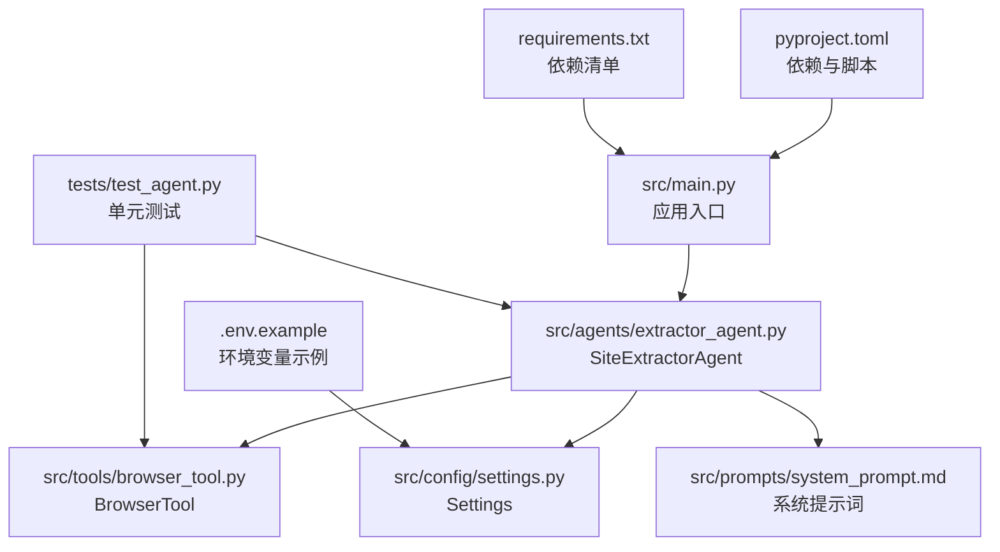
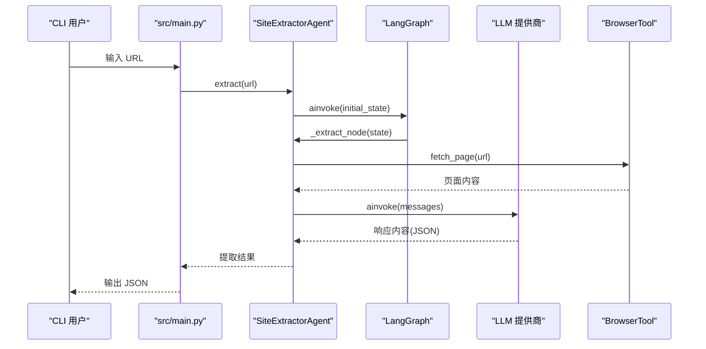
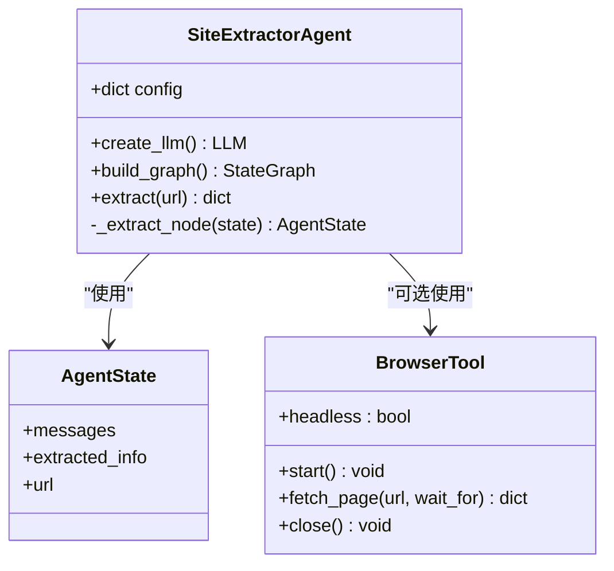
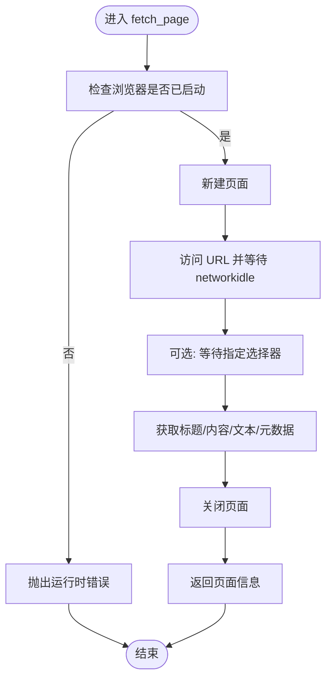
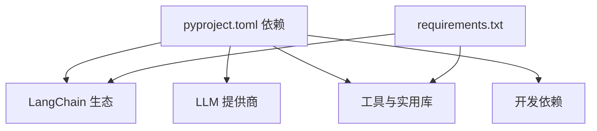

# 开发指南

<cite>
**本文档引用的文件**
- [README.md](file://README.md)
- [pyproject.toml](file://pyproject.toml)
- [requirements.txt](file://requirements.txt)
- [src/main.py](file://src/main.py)
- [src/demo.py](file://src/demo.py)
- [src/agents/extractor_agent.py](file://src/agents/extractor_agent.py)
- [src/config/settings.py](file://src/config/settings.py)
- [src/tools/browser_tool.py](file://src/tools/browser_tool.py)
- [src/prompts/system_prompt.md](file://src/prompts/system_prompt.md)
- [tests/test_agent.py](file://tests/test_agent.py)
- [conftest.py](file://conftest.py)
- [.env.example](file://.env.example)
</cite>

## 目录
1. [简介](#简介)
2. [项目结构](#项目结构)
3. [核心组件](#核心组件)
4. [架构总览](#架构总览)
5. [详细组件分析](#详细组件分析)
6. [依赖分析](#依赖分析)
7. [性能考虑](#性能考虑)
8. [故障排除指南](#故障排除指南)
9. [结论](#结论)
10. [附录](#附录)

## 简介
本指南面向 Site Info Extractor Agent 项目的开发者，提供从环境搭建、依赖管理、测试策略、代码质量保障、贡献流程到调试技巧与构建打包的全流程开发文档。项目基于 LangChain/LangGraph 构建，支持多 LLM 提供商（Google Gemini、OpenAI、Anthropic、Groq、SiliconFlow、讯飞、Cerebras），并通过 Playwright 实现浏览器驱动的网页信息提取。

## 项目结构
项目采用按功能分层的组织方式，核心目录与职责如下：
- src/agents：Agent 实现与工作流编排
- src/tools：工具集合（浏览器工具等）
- src/config：配置管理（Pydantic Settings）
- src/prompts：系统提示词模板
- src/main.py：应用入口与交互式 CLI
- tests：单元测试
- pyproject.toml：Poetry/Packaging 配置
- requirements.txt：依赖清单
- .env.example：环境变量示例

图表来源
- [src/main.py](file://src/main.py#L1-L254)
- [src/agents/extractor_agent.py](file://src/agents/extractor_agent.py#L1-L330)
- [src/tools/browser_tool.py](file://src/tools/browser_tool.py#L1-L108)
- [src/config/settings.py](file://src/config/settings.py#L1-L56)
- [src/prompts/system_prompt.md](file://src/prompts/system_prompt.md#L1-L212)
- [tests/test_agent.py](file://tests/test_agent.py#L1-L80)
- [pyproject.toml](file://pyproject.toml#L1-L75)
- [requirements.txt](file://requirements.txt#L1-L36)
- [.env.example](file://.env.example#L1-L9)

章节来源
- [README.md](file://README.md#L57-L72)
- [pyproject.toml](file://pyproject.toml#L1-L75)
- [requirements.txt](file://requirements.txt#L1-L36)

## 核心组件
- SiteExtractorAgent：基于 LangGraph 的状态机式 Agent，负责根据配置动态选择 LLM 提供商，构建提取工作流并执行异步提取。
- BrowserTool：基于 Playwright 的异步浏览器工具，提供页面抓取、内容获取与元数据提取能力。
- Settings：使用 Pydantic Settings 管理配置，支持从 .env 文件加载 API Key 与模型参数。
- 系统提示词：定义提取规则、输出格式与异常处理策略，确保 LLM 输出结构化且符合预期。

章节来源
- [src/agents/extractor_agent.py](file://src/agents/extractor_agent.py#L90-L330)
- [src/tools/browser_tool.py](file://src/tools/browser_tool.py#L10-L108)
- [src/config/settings.py](file://src/config/settings.py#L9-L56)
- [src/prompts/system_prompt.md](file://src/prompts/system_prompt.md#L1-L212)

## 架构总览
系统采用“配置驱动 + 工作流编排”的架构：
- 配置层：Settings 统一管理 API Key、模型名称、温度、最大令牌数、浏览器模式等。
- 工具层：BrowserTool 提供异步浏览器能力；可扩展加入更多工具。
- Agent 层：SiteExtractorAgent 根据配置动态选择 LLM 提供商，构建 LangGraph 工作流，执行提取节点。
- 入口层：src/main.py 提供交互式 CLI，支持多模型选择与 URL 输入循环。

图表来源
- [src/main.py](file://src/main.py#L219-L239)
- [src/agents/extractor_agent.py](file://src/agents/extractor_agent.py#L195-L239)
- [src/tools/browser_tool.py](file://src/tools/browser_tool.py#L44-L80)

## 详细组件分析

### SiteExtractorAgent 组件分析
- 设计要点
  - 动态 LLM 选择：优先 Google Gemini，其次 OpenAI/兼容提供商，再 Anthropic/Groq/SiliconFlow/Xunfei/Cerebras。
  - LangGraph 工作流：单节点“extractor”流程，入口为提取节点，完成后结束。
  - 异步提取：通过 graph.ainvoke 执行，支持异步链路。
  - 结果解析：优先解析 LLM 返回的 JSON，若失败则记录原始响应与错误信息。
- 关键接口
  - __init__(config)：初始化配置与 LLM。
  - extract(url)：执行提取并返回结构化结果。
  - _extract_node(state)：提取节点实现，构建消息、调用 LLM、解析响应。
- 错误处理
  - LLM 调用异常：构造错误 AIMessage，返回状态为 error。
  - JSON 解析异常：记录 parsed_error，并保留原始响应。

图表来源
- [src/agents/extractor_agent.py](file://src/agents/extractor_agent.py#L77-L330)
- [src/tools/browser_tool.py](file://src/tools/browser_tool.py#L10-L108)

章节来源
- [src/agents/extractor_agent.py](file://src/agents/extractor_agent.py#L90-L330)

### BrowserTool 组件分析
- 设计要点
  - 异步上下文管理：支持 async with 自动启动/关闭浏览器。
  - 页面抓取：通过 Playwright 启动 Chromium，访问 URL，等待网络空闲，获取标题、内容、文本与元数据。
  - 元数据提取：支持 description、keywords、og:* 等常见 meta 标签。
- 关键接口
  - __aenter__/__aexit__：异步生命周期管理。
  - start()/close()：启动与关闭浏览器。
  - fetch_page(url, wait_for)：抓取页面并返回结构化数据。
- 错误处理
  - 未启动浏览器时报错，防止非法调用。

图表来源
- [src/tools/browser_tool.py](file://src/tools/browser_tool.py#L44-L80)

章节来源
- [src/tools/browser_tool.py](file://src/tools/browser_tool.py#L10-L108)

### Settings 组件分析
- 设计要点
  - 使用 Pydantic Settings 管理配置，支持从 .env 文件加载。
  - 支持多提供商 API Key 与模型名称配置。
  - 默认模型与参数（温度、最大令牌、浏览器模式）集中管理。
- 关键字段
  - API Key：google_api_key、openai_api_key、anthropic_api_key、groq_api_key、siliconflow_api_key、xunfei_api_key、cerebras_api_key。
  - 模型配置：model_name、temperature、max_tokens、各提供商特定模型名。
  - 浏览器配置：browser_headless。
- 环境加载
  - env_file=".env"，大小写不敏感，忽略多余字段。

章节来源
- [src/config/settings.py](file://src/config/settings.py#L9-L56)
- [.env.example](file://.env.example#L1-L9)

### 系统提示词分析
- 设计要点
  - 明确 Agent 的核心职责、工作流程与提取规则。
  - 规定输出格式为 JSON，字段名使用中文，值保持原语言。
  - 提供异常处理策略与性能优化建议。
- 使用位置
  - SiteExtractorAgent 在提取节点中将系统提示词注入消息列表，作为 LLM 的上下文。

章节来源
- [src/prompts/system_prompt.md](file://src/prompts/system_prompt.md#L1-L212)
- [src/agents/extractor_agent.py](file://src/agents/extractor_agent.py#L29-L31)

## 依赖分析
- 语言与运行时
  - Python >= 3.10，推荐 3.11+。
- 核心依赖
  - LangChain 生态：langchain、langchain-core、langgraph、langchain-community。
  - LLM 提供商：langchain-google-genai、langchain-openai、langchain-anthropic、langchain-groq。
  - 工具与实用库：python-dotenv、pydantic、pydantic-settings、tavily-python、playwright、requests、beautifulsoup4、lxml、aiohttp、rich、typing-extensions。
- 开发依赖
  - pytest、pytest-asyncio、black、ruff、mypy。
- 构建与脚本
  - build-backend=hatchling，项目脚本 site-extractor = src.main:main。

图表来源
- [pyproject.toml](file://pyproject.toml#L28-L47)
- [requirements.txt](file://requirements.txt#L1-L36)

章节来源
- [pyproject.toml](file://pyproject.toml#L1-L75)
- [requirements.txt](file://requirements.txt#L1-L36)

## 性能考虑
- 异步执行：Agent 与 BrowserTool 均采用异步实现，减少阻塞，提升吞吐。
- LLM 选择策略：优先使用免费或低延迟提供商（如 Google Gemini），在高负载场景下可切换至兼容提供商。
- 浏览器模式：默认 headless 模式，减少资源消耗；必要时可调整为非 headless 以便调试。
- 超时与重试：建议在调用 LLM 与浏览器工具时增加超时控制与重试策略，避免长时间阻塞。
- 内容解析：优先解析 LLM 返回的 JSON，若失败保留原始响应，便于后续分析与降级处理。

## 故障排除指南
- 环境变量缺失
  - 症状：未检测到 API Key，无法启动交互模式。
  - 处理：复制 .env.example 为 .env，并填写 GOOGLE_API_KEY、OPENAI_API_KEY、ANTHROPIC_API_KEY 等。
- Playwright 依赖
  - 症状：浏览器安装失败或无法启动。
  - 处理：执行 playwright install 安装所需浏览器。
- LLM 模型不可用
  - 症状：模型未找到（404 NOT_FOUND）。
  - 处理：尝试更换可用模型，参考 README 中支持的模型列表。
- JSON 解析失败
  - 症状：提取结果包含 raw_response 与 parse_error。
  - 处理：检查 LLM 输出格式，确保遵循系统提示词的 JSON 输出规范。
- 信号中断
  - 症状：Ctrl+C 退出行为异常。
  - 处理：main.py 中已注册 SIGINT 处理器，确保快速退出。

章节来源
- [README.md](file://README.md#L27-L50)
- [src/main.py](file://src/main.py#L76-L85)
- [src/agents/extractor_agent.py](file://src/agents/extractor_agent.py#L299-L304)

## 结论
本开发指南提供了从环境搭建到测试、质量保障、贡献流程与调试技巧的完整路径。通过配置驱动与 LangGraph 工作流，项目具备良好的可扩展性与可维护性。建议在开发过程中严格遵循测试与代码质量规范，确保在多 LLM 提供商与复杂提取场景下的稳定性与可靠性。

## 附录

### 开发环境搭建
- 环境要求
  - Python >= 3.10（推荐 3.11+）。
- 步骤
  - 创建虚拟环境并激活。
  - 安装依赖：pip install -r requirements.txt。
  - 安装 Playwright 浏览器：playwright install。
  - 复制 .env.example 为 .env 并配置 API Key。
  - 运行项目：python src/main.py。

章节来源
- [README.md](file://README.md#L7-L25)

### 依赖管理与测试环境
- 依赖管理
  - 使用 pyproject.toml 管理核心与可选依赖，requirements.txt 用于兼容安装。
- 测试环境
  - 使用 pytest 与 pytest-asyncio 运行异步测试。
  - conftest.py 统一添加项目根目录到 Python 路径，抑制兼容性警告。
  - 单元测试覆盖 BrowserTool 初始化与 SiteExtractorAgent 的基本行为。

章节来源
- [pyproject.toml](file://pyproject.toml#L49-L56)
- [requirements.txt](file://requirements.txt#L33-L36)
- [conftest.py](file://conftest.py#L1-L20)
- [tests/test_agent.py](file://tests/test_agent.py#L1-L80)

### 单元测试实现与策略
- 测试策略
  - 使用 Mock 替换 LLM 实现，验证 extract 流程与错误处理。
  - 使用 pytest-asyncio 标注异步测试，确保异步执行正确。
  - 通过异步上下文管理器测试 BrowserTool 生命周期。
- 测试用例设计
  - BrowserTool：验证初始化后浏览器与 Playwright 实例存在。
  - SiteExtractorAgent：验证初始化配置、Mock LLM 返回与提取结果结构。
- 模拟对象使用
  - 使用 unittest.mock.Mock 与 patch 替换 ChatGoogleGenerativeAI，避免真实网络调用。
- 异步测试处理
  - 使用 @pytest.mark.asyncio 标注异步测试方法，确保事件循环正确运行。

章节来源
- [tests/test_agent.py](file://tests/test_agent.py#L26-L66)

### 代码质量保证
- 静态分析
  - mypy：启用类型检查，建议在 CI 中运行以发现潜在类型问题。
- 代码格式化
  - black：统一代码风格，line-length=100。
  - ruff：lint 规则，line-length=100，选择 E、F、I、N、W。
- 持续集成
  - 建议在 CI 中执行：mypy、black --check、ruff check、pytest。

章节来源
- [pyproject.toml](file://pyproject.toml#L61-L75)

### 贡献指南
- 代码提交规范
  - 提交信息应简洁明确，描述变更目的与影响范围。
- 分支管理策略
  - 建议采用 Git Flow：develop -> feature/* -> release/* -> main。
- Pull Request 流程
  - 提交 PR 前确保本地测试通过，CI 通过，文档与注释完整。
- 代码审查
  - 关注可读性、可维护性与安全性（尤其是 API Key 的处理）。

### 调试技巧与开发工具
- 调试技巧
  - 使用 rich 控制台输出结构化信息，便于观察配置与中间结果。
  - 在 SiteExtractorAgent 中捕获 LLM 异常并记录 AIMessage，辅助定位问题。
  - 在 BrowserTool 中使用 headless=False 进行可视化调试。
- 开发工具
  - black/ruff/mypy：统一风格与静态检查。
  - pytest-asyncio：异步测试支持。
  - Playwright：浏览器调试与截图/视频录制（可选）。

章节来源
- [src/main.py](file://src/main.py#L230-L246)
- [src/agents/extractor_agent.py](file://src/agents/extractor_agent.py#L315-L329)
- [src/tools/browser_tool.py](file://src/tools/browser_tool.py#L13-L21)

### 构建与打包流程
- 构建系统
  - build-backend=hatchling，支持标准 Python 包构建。
- 依赖管理
  - 推荐使用 pyproject.toml 管理依赖，requirements.txt 仅用于兼容安装。
- 版本发布
  - 建议在版本标签前更新版本号（version=0.x.y），并在 CI 中进行打包与上传（PyPI/私有仓库）。

章节来源
- [pyproject.toml](file://pyproject.toml#L1-L3)