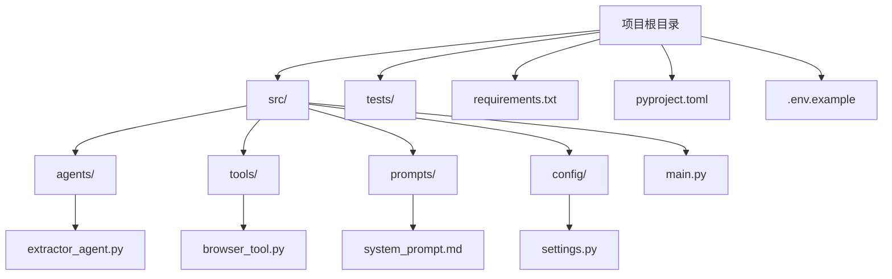
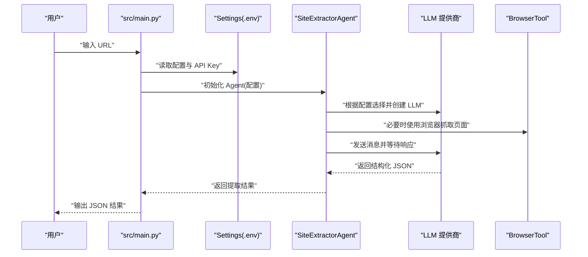
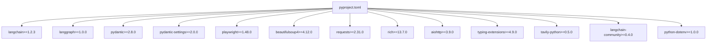

# 开发环境搭建

<cite>
**本文档引用的文件**
- [README.md](file://README.md)
- [pyproject.toml](file://pyproject.toml)
- [requirements.txt](file://requirements.txt)
- [.env.example](file://.env.example)
- [src/main.py](file://src/main.py)
- [src/config/settings.py](file://src/config/settings.py)
- [src/agents/extractor_agent.py](file://src/agents/extractor_agent.py)
- [src/tools/browser_tool.py](file://src/tools/browser_tool.py)
- [src/demo.py](file://src/demo.py)
- [tests/test_agent.py](file://tests/test_agent.py)
- [conftest.py](file://conftest.py)
</cite>

## 目录
1. [简介](#简介)
2. [项目结构](#项目结构)
3. [核心组件](#核心组件)
4. [架构总览](#架构总览)
5. [详细组件分析](#详细组件分析)
6. [依赖关系分析](#依赖关系分析)
7. [性能考虑](#性能考虑)
8. [故障排除指南](#故障排除指南)
9. [结论](#结论)
10. [附录](#附录)

## 简介
本指南面向 Site Info Extractor Agent 项目的开发者，提供从零开始的开发环境搭建步骤，涵盖 Python 版本要求、虚拟环境创建、依赖安装、Poetry 或 pip 使用方式、IDE 配置建议、环境变量配置、调试环境设置以及常见问题排查。项目基于 LangChain/LangGraph 构建，支持多 LLM 提供商（Google Gemini、OpenAI、Anthropic、Groq、SiliconFlow、讯飞、Cerebras），并使用 Playwright 进行网页抓取。

## 项目结构
项目采用分层组织方式，核心模块包括：
- src/agents：Agent 实现与工作流
- src/tools：工具集合（如浏览器工具）
- src/prompts：提示词模板
- src/config：配置管理（Pydantic Settings）
- src/main.py：应用入口
- tests：测试用例
- requirements.txt：依赖清单
- pyproject.toml：项目元数据与依赖声明
- .env.example：环境变量示例

图表来源
- [README.md](file://README.md#L57-L72)
- [pyproject.toml](file://pyproject.toml#L1-L75)

章节来源
- [README.md](file://README.md#L57-L72)
- [pyproject.toml](file://pyproject.toml#L1-L75)

## 核心组件
- 配置管理：通过 Pydantic Settings 读取 .env 环境变量，支持多提供商 API Key 与模型配置。
- Agent：基于 LangGraph 的状态机式工作流，支持动态选择 LLM 提供商。
- 工具：BrowserTool 封装 Playwright，提供异步页面抓取与元数据提取。
- 入口：src/main.py 提供交互式 CLI，支持多模型选择与实时提取。

章节来源
- [src/config/settings.py](file://src/config/settings.py#L1-L56)
- [src/agents/extractor_agent.py](file://src/agents/extractor_agent.py#L1-L330)
- [src/tools/browser_tool.py](file://src/tools/browser_tool.py#L1-L108)
- [src/main.py](file://src/main.py#L1-L254)

## 架构总览
下图展示了从用户输入到 LLM 提供商调用的整体流程，以及配置加载与工具协作关系。

图表来源
- [src/main.py](file://src/main.py#L44-L228)
- [src/config/settings.py](file://src/config/settings.py#L9-L55)
- [src/agents/extractor_agent.py](file://src/agents/extractor_agent.py#L116-L193)
- [src/tools/browser_tool.py](file://src/tools/browser_tool.py#L44-L80)

## 详细组件分析

### Python 版本与运行时要求
- Python 版本：要求 >= 3.10，推荐 3.11+。
- 运行时特性：项目使用 asyncio、Playwright 异步 API、LangChain/LangGraph 异步工作流。

章节来源
- [README.md](file://README.md#L7-L9)
- [pyproject.toml](file://pyproject.toml#L10)

### 虚拟环境创建与激活
- 推荐使用 python -m venv 创建虚拟环境。
- Linux/Mac 使用 source venv/bin/activate；Windows 使用 venv\Scripts\activate。

章节来源
- [README.md](file://README.md#L14-L18)

### 依赖安装（pip 与 Poetry 两种方式）
- pip 方式：
  - 安装基础依赖：pip install -r requirements.txt
  - 安装 Playwright 浏览器：playwright install
- Poetry 方式：
  - 安装依赖：poetry install
  - 开发依赖安装：poetry install --with dev
  - 运行命令：poetry run python src/main.py

注意：项目同时提供 requirements.txt 与 pyproject.toml，两者均声明了依赖。若使用 Poetry，建议以 pyproject.toml 为主；若使用 pip，则按 requirements.txt 安装。

章节来源
- [README.md](file://README.md#L11-L25)
- [requirements.txt](file://requirements.txt#L1-L36)
- [pyproject.toml](file://pyproject.toml#L28-L47)
- [pyproject.toml](file://pyproject.toml#L49-L56)

### 环境变量配置
- 复制示例文件：cp .env.example .env
- 配置项：
  - GOOGLE_API_KEY：必需（Gemini 模型）
  - OPENAI_API_KEY：可选
  - ANTHROPIC_API_KEY：可选
- 安全提示：.env 已加入 .gitignore，避免提交到仓库；如误提交，需立即撤销历史或加密。

章节来源
- [README.md](file://README.md#L27-L43)
- [.env.example](file://.env.example#L1-L9)
- [src/config/settings.py](file://src/config/settings.py#L12-L19)
- [src/config/settings.py](file://src/config/settings.py#L46-L51)

### IDE 配置建议

#### VS Code
- Python 解释器：选择虚拟环境中解释器（venv/bin/python 或 venv\Scripts\python.exe）
- 扩展建议：
  - Python（Microsoft）
  - Pylance（类型检查）
  - Ruff（代码风格）
  - Black（格式化）
- 调试配置：在 .vscode/launch.json 中添加 Python 启动配置，指向 src/main.py
- 终端：使用集成终端，确保已激活虚拟环境

#### PyCharm
- Interpreter：选择虚拟环境解释器
- 代码风格：启用 Ruff/Black
- 调试：新建 Run/Debug 配置，目标为 src/main.py
- 终端：使用项目终端，确保已激活虚拟环境

#### 通用建议
- 启用类型检查（mypy）与静态分析（ruff）
- 格式化统一（black），行宽 100
- 在测试中抑制特定兼容性警告（如 Pydantic V1 警告）

章节来源
- [pyproject.toml](file://pyproject.toml#L61-L74)
- [tests/test_agent.py](file://tests/test_agent.py#L18-L23)
- [conftest.py](file://conftest.py#L10-L15)

### 调试环境配置
- 断点设置：在 src/main.py、src/agents/extractor_agent.py、src/tools/browser_tool.py 中设置断点进行调试
- 日志与输出：Rich 控制台输出，便于观察交互式界面与中间结果
- 交互式模式：运行 python src/main.py 后，输入 URL 即可触发提取流程
- 测试调试：使用 pytest 运行测试，支持异步测试（pytest-asyncio）

章节来源
- [src/main.py](file://src/main.py#L230-L246)
- [tests/test_agent.py](file://tests/test_agent.py#L29-L65)

### 运行与入口
- 运行入口：python src/main.py
- 命令行脚本：site-extractor（通过 pyproject.toml 注册）

章节来源
- [README.md](file://README.md#L51-L55)
- [pyproject.toml](file://pyproject.toml#L58-L59)
- [src/demo.py](file://src/demo.py#L50-L51)

## 依赖关系分析
项目依赖主要分为三类：
- 核心框架：LangChain、LangGraph、Pydantic、Pydantic Settings
- LLM 提供商适配：langchain-google-genai、langchain-openai、langchain-anthropic、langchain-groq 等
- 工具与实用库：Playwright、BeautifulSoup、Requests、Rich、AIOHTTP 等

图表来源
- [pyproject.toml](file://pyproject.toml#L28-L47)

章节来源
- [pyproject.toml](file://pyproject.toml#L28-L47)
- [requirements.txt](file://requirements.txt#L1-L36)

## 性能考虑
- 无头浏览器：默认 headless=True，减少资源占用；如需可视化调试可设为 False
- 异步 I/O：Playwright 与 aiohttp 提供异步能力，避免阻塞
- LLM 选择：优先使用免费提供商（如 Gemini）进行本地开发，付费提供商用于生产
- 缓存与重试：可在工具层增加缓存与重试机制（建议在业务层扩展）

## 故障排除指南

### Python 版本不匹配
- 症状：安装或运行时报错，提示 Python 版本过低
- 解决：升级至 Python 3.10+，推荐 3.11+

章节来源
- [README.md](file://README.md#L9)
- [pyproject.toml](file://pyproject.toml#L10)

### 依赖安装失败
- 症状：pip 安装报错或缺失某些包
- 解决：
  - 使用 requirements.txt 安装：pip install -r requirements.txt
  - 安装 Playwright 浏览器：playwright install
  - 若使用 Poetry：poetry install --with dev

章节来源
- [README.md](file://README.md#L20-L24)
- [requirements.txt](file://requirements.txt#L1-L36)
- [pyproject.toml](file://pyproject.toml#L49-L56)

### 环境变量未生效
- 症状：运行时报错提示未检测到 API Key
- 解决：
  - 复制示例文件：cp .env.example .env
  - 填写 GOOGLE_API_KEY（必需），可选 OPENAI_API_KEY、ANTHROPIC_API_KEY
  - 确认 .env 已被 pydantic-settings 正确加载

章节来源
- [README.md](file://README.md#L29-L38)
- [.env.example](file://.env.example#L1-L9)
- [src/config/settings.py](file://src/config/settings.py#L46-L51)

### Playwright 浏览器不可用
- 症状：浏览器启动失败或页面无法加载
- 解决：运行 playwright install 安装所需浏览器二进制

章节来源
- [README.md](file://README.md#L23-L24)
- [src/tools/browser_tool.py](file://src/tools/browser_tool.py#L32-L42)

### LLM 提供商导入失败
- 症状：Agent 无法创建 LLM 实例，提示 ImportError
- 解决：确认已安装对应提供商的适配包（如 langchain-google-genai、langchain-openai 等）

章节来源
- [src/agents/extractor_agent.py](file://src/agents/extractor_agent.py#L44-L74)

### 交互式模式无法输入
- 症状：CLI 无响应或无法输入 URL
- 解决：确保已正确激活虚拟环境并在终端中运行；检查非阻塞输入逻辑是否正常

章节来源
- [src/main.py](file://src/main.py#L96-L153)
- [src/main.py](file://src/main.py#L188-L228)

### 测试运行异常
- 症状：pytest 报错或无法识别模块
- 解决：确保项目根目录已添加到 sys.path；使用 pytest-asyncio；必要时在 conftest.py 中设置路径

章节来源
- [tests/test_agent.py](file://tests/test_agent.py#L12-L23)
- [conftest.py](file://conftest.py#L17-L19)

## 结论
按照本指南完成 Python 版本、虚拟环境、依赖安装与环境变量配置后，即可顺利运行 Site Info Extractor Agent。建议在开发阶段优先使用免费提供商（如 Gemini），并通过交互式 CLI 快速验证功能。遇到问题时，优先检查 Python 版本、依赖安装、环境变量与 Playwright 安装情况。

## 附录

### 常用命令速查
- 创建虚拟环境：python -m venv venv
- 激活虚拟环境：Linux/Mac: source venv/bin/activate；Windows: venv\Scripts\activate
- 安装依赖：pip install -r requirements.txt
- 安装 Playwright：playwright install
- 运行项目：python src/main.py
- 运行测试：pytest tests/

章节来源
- [README.md](file://README.md#L14-L18)
- [README.md](file://README.md#L20-L24)
- [README.md](file://README.md#L51-L55)
- [tests/test_agent.py](file://tests/test_agent.py#L78-L79)