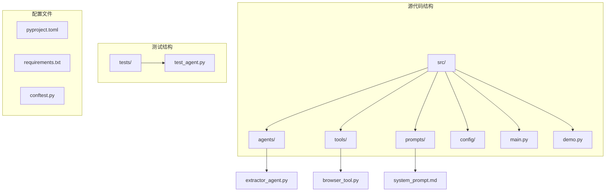
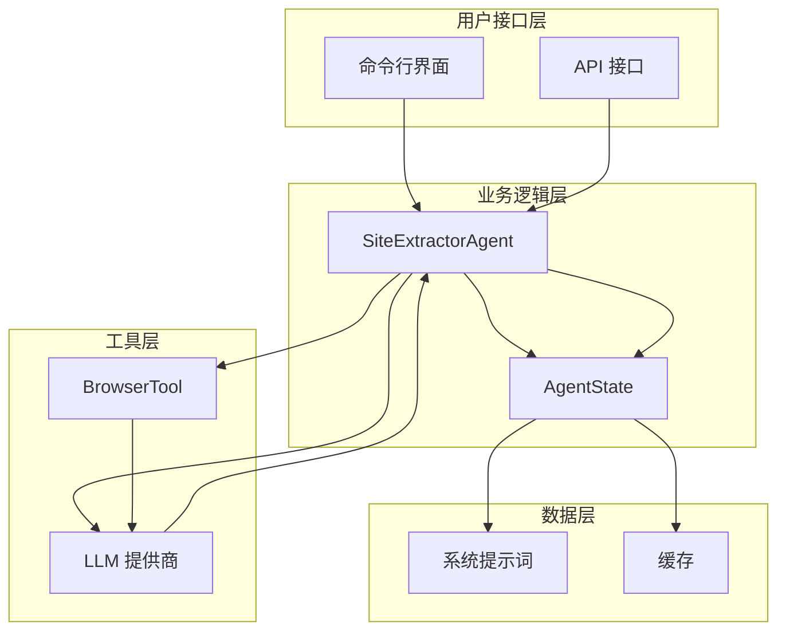
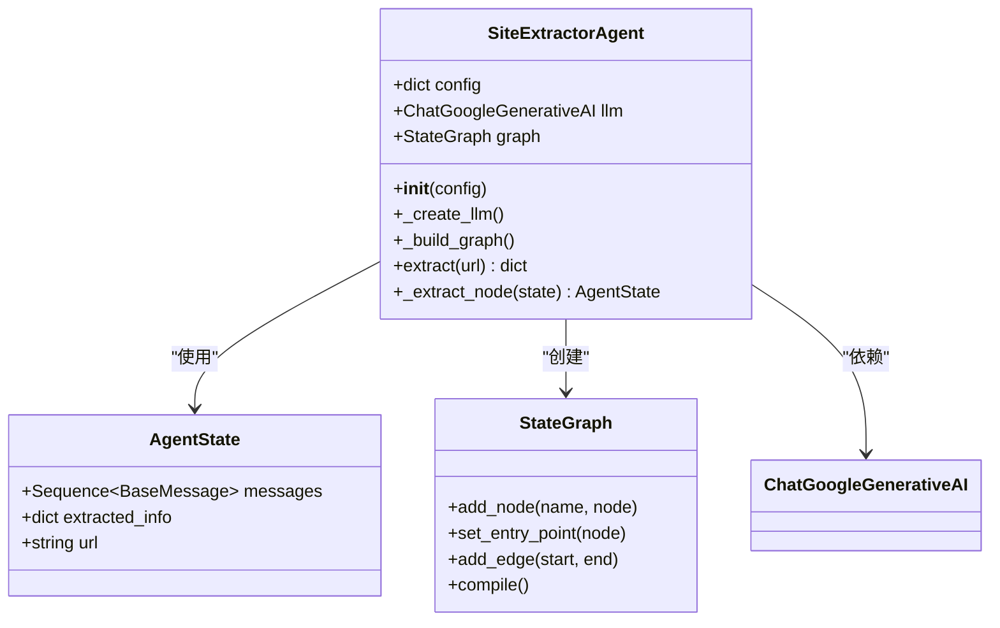
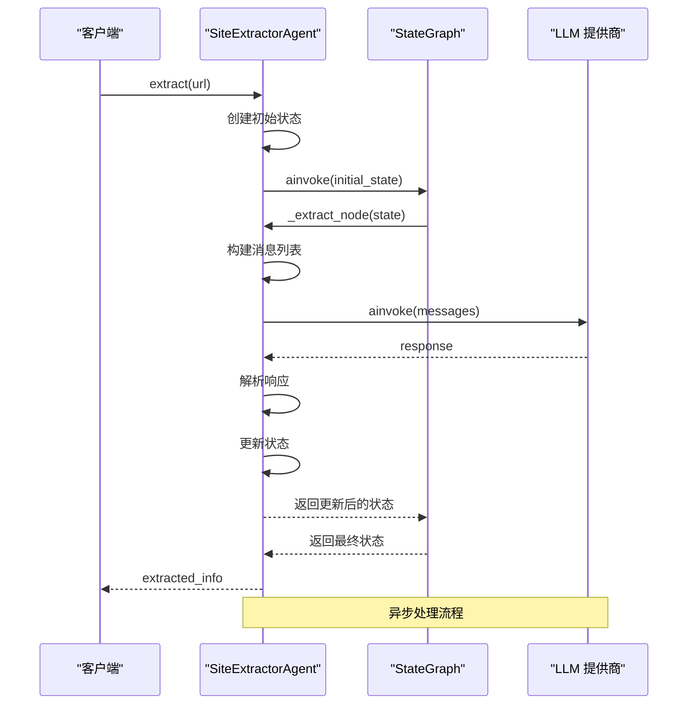
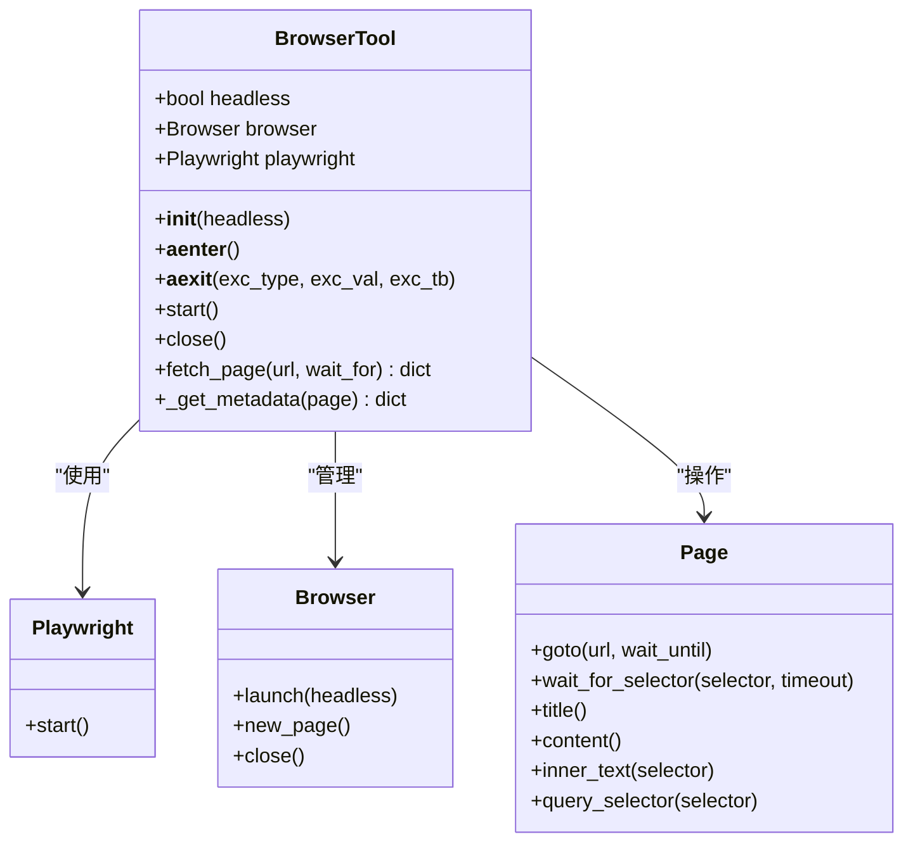
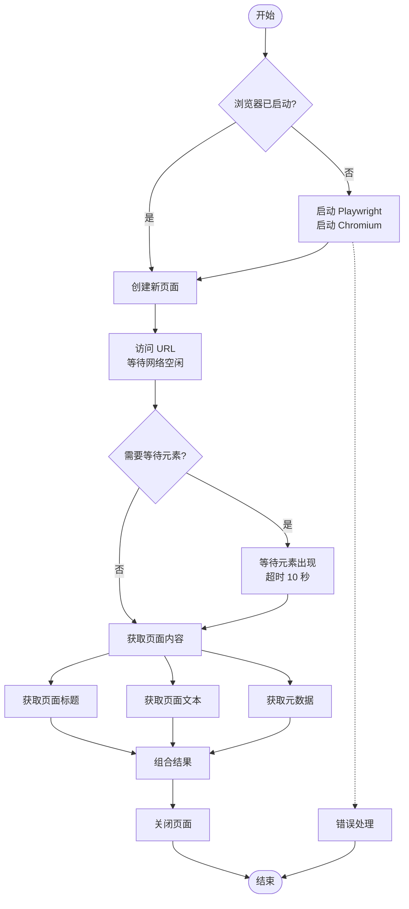
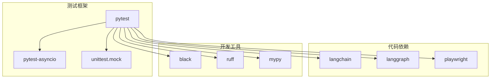
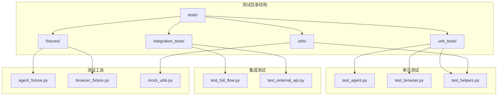

# 测试指南

<cite>
**本文档引用的文件**
- [src/agents/extractor_agent.py](file://src/agents/extractor_agent.py)
- [src/tools/browser_tool.py](file://src/tools/browser_tool.py)
- [tests/test_agent.py](file://tests/test_agent.py)
- [conftest.py](file://conftest.py)
- [pyproject.toml](file://pyproject.toml)
- [requirements.txt](file://requirements.txt)
- [src/prompts/system_prompt.md](file://src/prompts/system_prompt.md)
</cite>

## 目录
1. [简介](#简介)
2. [项目结构](#项目结构)
3. [核心组件](#核心组件)
4. [架构概览](#架构概览)
5. [详细组件分析](#详细组件分析)
6. [依赖分析](#依赖分析)
7. [性能考虑](#性能考虑)
8. [故障排除指南](#故障排除指南)
9. [结论](#结论)
10. [附录](#附录)

## 简介

Site Info Extractor Agent 是一个基于 LangChain 和 LangGraph 构建的网站信息提取智能体。本测试指南旨在为该项目提供全面的测试策略和最佳实践，涵盖单元测试、集成测试、异步测试处理、模拟对象使用、测试覆盖率要求以及 CI/CD 流程。

该系统支持多种 LLM 提供商（Google Gemini、OpenAI、Anthropic、Groq、SiliconFlow、讯飞），并通过 LangGraph 实现状态机式的提取工作流。测试指南将重点关注以下核心组件：
- SiteExtractorAgent：主提取代理，负责协调信息提取流程
- BrowserTool：浏览器工具，封装 Playwright 进行网页访问
- LLM API 调用：支持多种外部 AI 服务提供商

## 项目结构

项目采用模块化架构，主要包含以下结构：



**图表来源**
- [src/agents/extractor_agent.py](file://src/agents/extractor_agent.py#L1-L330)
- [src/tools/browser_tool.py](file://src/tools/browser_tool.py#L1-L108)
- [tests/test_agent.py](file://tests/test_agent.py#L1-L80)

**章节来源**
- [src/agents/extractor_agent.py](file://src/agents/extractor_agent.py#L1-L330)
- [src/tools/browser_tool.py](file://src/tools/browser_tool.py#L1-L108)
- [tests/test_agent.py](file://tests/test_agent.py#L1-L80)

## 核心组件

### SiteExtractorAgent 类

SiteExtractorAgent 是系统的核心组件，基于 LangGraph 实现状态机式的提取工作流。该类具有以下关键特性：

- **多提供商支持**：支持 Google Gemini、OpenAI、Anthropic、Groq、SiliconFlow、讯飞等多种 LLM 提供商
- **异步处理**：所有操作均支持异步执行
- **状态管理**：使用 AgentState 管理提取过程中的状态信息
- **错误处理**：内置完善的错误处理和恢复机制

### BrowserTool 类

BrowserTool 封装了 Playwright 功能，提供异步网页访问能力：

- **异步上下文管理**：支持 async with 语法
- **元数据提取**：自动提取页面的 meta 标签信息
- **无头模式支持**：可配置是否使用无头浏览器
- **错误处理**：包含完整的异常处理机制

**章节来源**
- [src/agents/extractor_agent.py](file://src/agents/extractor_agent.py#L90-L330)
- [src/tools/browser_tool.py](file://src/tools/browser_tool.py#L10-L108)

## 架构概览

系统采用分层架构设计，通过 LangGraph 实现状态机式的处理流程：



**图表来源**
- [src/agents/extractor_agent.py](file://src/agents/extractor_agent.py#L195-L217)
- [src/tools/browser_tool.py](file://src/tools/browser_tool.py#L44-L80)

## 详细组件分析

### SiteExtractorAgent 组件分析

#### 类结构图



**图表来源**
- [src/agents/extractor_agent.py](file://src/agents/extractor_agent.py#L77-L95)
- [src/agents/extractor_agent.py](file://src/agents/extractor_agent.py#L90-L115)

#### 提取流程序列图



**图表来源**
- [src/agents/extractor_agent.py](file://src/agents/extractor_agent.py#L219-L239)
- [src/agents/extractor_agent.py](file://src/agents/extractor_agent.py#L241-L329)

**章节来源**
- [src/agents/extractor_agent.py](file://src/agents/extractor_agent.py#L90-L330)

### BrowserTool 组件分析

#### 类结构图



**图表来源**
- [src/tools/browser_tool.py](file://src/tools/browser_tool.py#L10-L43)
- [src/tools/browser_tool.py](file://src/tools/browser_tool.py#L44-L80)

#### 页面获取流程



**图表来源**
- [src/tools/browser_tool.py](file://src/tools/browser_tool.py#L44-L80)

**章节来源**
- [src/tools/browser_tool.py](file://src/tools/browser_tool.py#L10-L108)

## 依赖分析

### 测试框架依赖

项目使用 pytest 作为主要测试框架，支持异步测试和参数化测试：



**图表来源**
- [pyproject.toml](file://pyproject.toml#L28-L47)
- [pyproject.toml](file://pyproject.toml#L49-L56)

### 测试文件组织结构

测试文件采用按功能模块组织的方式：



**图表来源**
- [tests/test_agent.py](file://tests/test_agent.py#L1-L80)

**章节来源**
- [pyproject.toml](file://pyproject.toml#L49-L56)
- [tests/test_agent.py](file://tests/test_agent.py#L1-L80)

## 性能考虑

### 异步测试性能优化

由于项目大量使用异步操作，测试性能优化至关重要：

1. **并发测试**：合理使用 `pytest-asyncio` 的并发执行能力
2. **资源复用**：通过 fixtures 复用昂贵的资源（如 LLM 连接）
3. **超时控制**：为异步操作设置合理的超时时间
4. **内存管理**：及时清理测试产生的临时资源

### 测试覆盖率策略

建议的覆盖率要求：
- **单元测试覆盖率**：≥ 80%
- **集成测试覆盖率**：≥ 60%
- **关键路径覆盖率**：100%

## 故障排除指南

### 常见测试问题及解决方案

#### LLM API 调用失败

**问题症状**：测试中 LLM 调用抛出异常或返回错误

**解决方案**：
1. 使用 `@patch` 装饰器模拟 LLM API
2. 在测试配置中设置 `MOCK_LLM=true`
3. 使用 `pytest.mark.skipif` 条件跳过依赖外部服务的测试

#### 浏览器启动失败

**问题症状**：BrowserTool 初始化或启动时抛出异常

**解决方案**：
1. 确保测试环境中安装了 Playwright 浏览器驱动
2. 使用 `pytest.mark.skipif` 跳过需要浏览器的测试
3. 在 CI 环境中使用无头模式

#### 异步测试执行问题

**问题症状**：异步测试执行超时或死锁

**解决方案**：
1. 确保所有异步测试函数使用 `@pytest.mark.asyncio`
2. 正确使用 `await` 关键字
3. 避免在测试中使用阻塞操作

**章节来源**
- [tests/test_agent.py](file://tests/test_agent.py#L54-L66)

## 结论

Site Info Extractor Agent 的测试策略应该遵循以下原则：

1. **分层测试**：单元测试、集成测试、端到端测试相结合
2. **异步优先**：充分利用 pytest-asyncio 的异步测试能力
3. **模拟驱动**：对外部依赖进行充分的模拟和隔离
4. **覆盖率导向**：确保关键业务逻辑得到充分测试
5. **持续集成**：将测试集成到 CI/CD 流程中

通过实施本测试指南，可以确保系统的稳定性和可靠性，同时为未来的功能扩展提供坚实的基础。

## 附录

### 测试运行命令

#### 基础测试运行
```bash
# 运行所有测试
pytest tests/

# 运行特定测试文件
pytest tests/test_agent.py

# 运行异步测试
pytest tests/ -m asyncio

# 详细输出
pytest tests/ -v

# 显示覆盖率
pytest --cov=src/ tests/
```

#### CI/CD 测试配置

在 GitHub Actions 中的示例配置：

```yaml
name: 测试流程

on:
  push:
    branches: [ main ]
  pull_request:
    branches: [ main ]

jobs:
  test:
    runs-on: ubuntu-latest
    strategy:
      matrix:
        python-version: [3.10, 3.11, 3.12]

    steps:
    - uses: actions/checkout@v4
    
    - name: 设置 Python ${{ matrix.python-version }}
      uses: actions/setup-python@v4
      with:
        python-version: ${{ matrix.python-version }}
        
    - name: 安装依赖
      run: |
        pip install --upgrade pip
        pip install pytest pytest-asyncio pytest-cov
        pip install -r requirements.txt
        
    - name: 运行测试
      run: |
        pytest tests/ --asyncio-mode=auto --cov=src/ --cov-report=xml
        
    - name: 上传覆盖率报告
      uses: codecov/codecov-action@v4
      with:
        file: ./coverage.xml
        flags: unittests
        name: codecov-umbrella
```

### 测试用例设计最佳实践

#### 单元测试设计原则
1. **单一职责**：每个测试只验证一个功能点
2. **可预测性**：测试结果应该是确定性的
3. **独立性**：测试之间不应相互依赖
4. **可读性**：测试名称和断言语句应该清晰明了

#### 异步测试最佳实践
1. **正确标注**：使用 `@pytest.mark.asyncio` 装饰器
2. **资源管理**：使用 `async with` 管理异步资源
3. **超时处理**：为异步操作设置合理的超时时间
4. **错误处理**：测试异常情况和边界条件

#### 模拟对象使用指南
1. **最小化模拟**：只模拟必要的外部依赖
2. **行为验证**：验证模拟对象的方法调用次数和参数
3. **状态管理**：正确设置模拟对象的状态
4. **清理工作**：测试后清理模拟对象的状态

### 边界条件测试清单

#### LLM API 测试边界
- API 密钥无效或缺失
- 网络连接超时
- API 限流和配额限制
- 响应格式不符合预期
- LLM 服务不可用

#### 浏览器工具测试边界
- URL 无效或不存在
- 网络连接失败
- 页面加载超时
- JavaScript 阻塞
- 反爬虫机制

#### 系统提示词测试边界
- 提示词文件缺失
- 提示词格式错误
- 编码问题
- 内容过长

### 错误处理测试策略

#### 异常场景测试
1. **输入验证**：测试无效输入参数
2. **外部依赖故障**：模拟外部服务不可用
3. **资源不足**：测试内存和磁盘空间不足
4. **权限问题**：测试文件和网络权限

#### 恢复机制测试
1. **重试逻辑**：验证自动重试机制
2. **降级策略**：测试降级到备用方案
3. **状态恢复**：验证状态机的恢复能力
4. **资源清理**：确保资源正确释放

通过遵循本测试指南，可以为 Site Info Extractor Agent 建立一个全面、可靠的测试体系，确保系统的质量和稳定性。