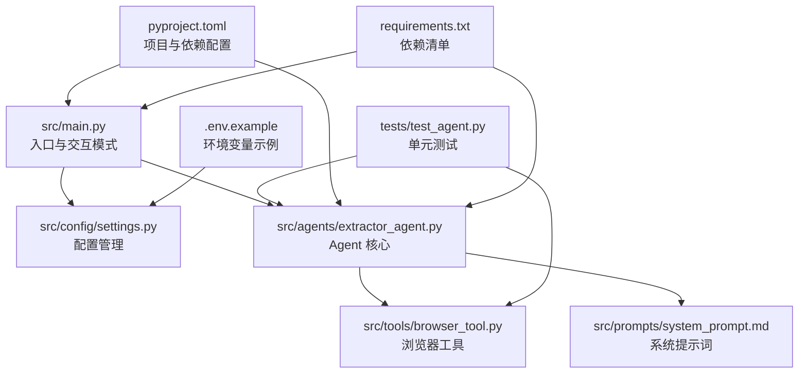
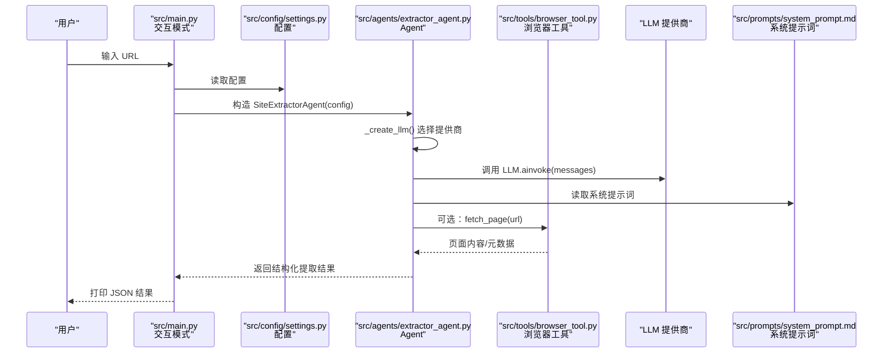
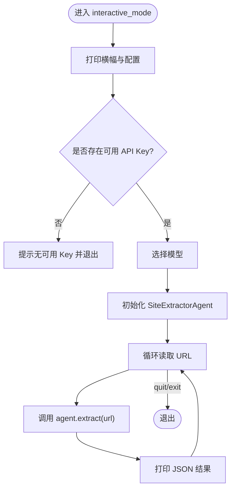
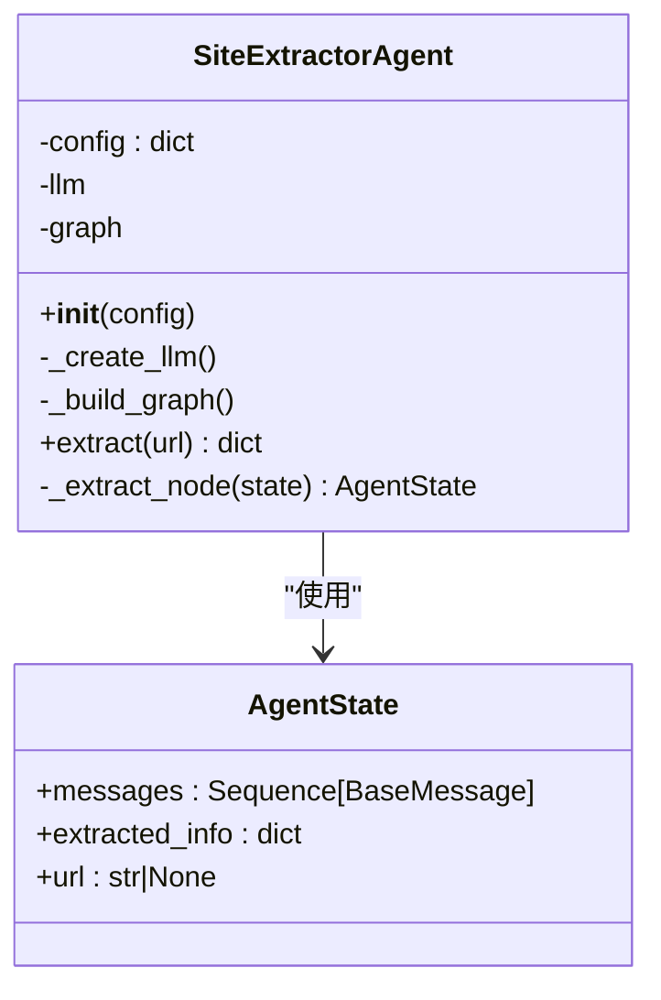
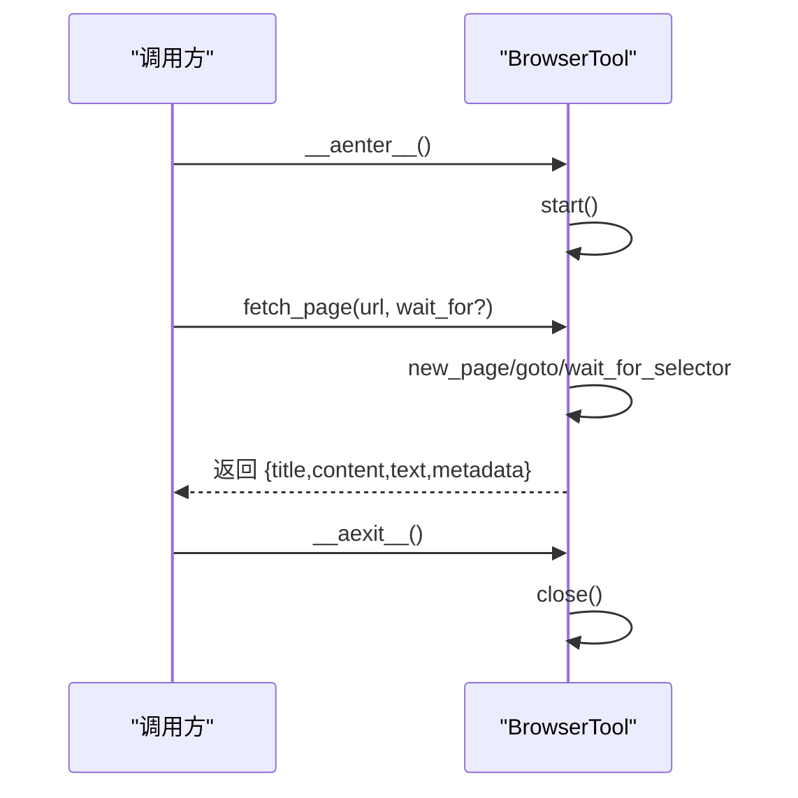
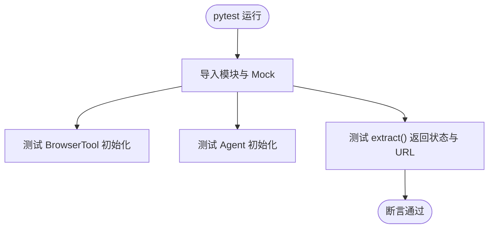
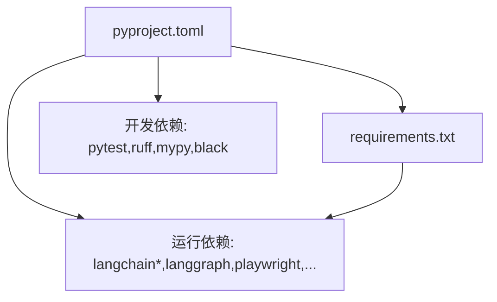

# 贡献指南

<cite>
**本文引用的文件**
- [README.md](file://README.md)
- [pyproject.toml](file://pyproject.toml)
- [requirements.txt](file://requirements.txt)
- [src/main.py](file://src/main.py)
- [src/demo.py](file://src/demo.py)
- [src/config/settings.py](file://src/config/settings.py)
- [src/agents/extractor_agent.py](file://src/agents/extractor_agent.py)
- [src/tools/browser_tool.py](file://src/tools/browser_tool.py)
- [src/prompts/system_prompt.md](file://src/prompts/system_prompt.md)
- [tests/test_agent.py](file://tests/test_agent.py)
- [conftest.py](file://conftest.py)
- [.env.example](file://.env.example)
</cite>

## 目录
1. [简介](#简介)
2. [项目结构](#项目结构)
3. [核心组件](#核心组件)
4. [架构总览](#架构总览)
5. [详细组件分析](#详细组件分析)
6. [依赖分析](#依赖分析)
7. [性能考虑](#性能考虑)
8. [故障排查指南](#故障排查指南)
9. [结论](#结论)
10. [附录](#附录)

## 简介
本指南面向希望为 Site Info Extractor Agent 项目做出贡献的开发者，涵盖从 Fork 仓库到提交 PR 的完整流程、代码规范与风格、代码审查标准、Bug 报告与功能请求流程、版本发布与语义化版本控制、文档贡献方法、社区行为准则与沟通渠道，以及新贡献者入门与常见问题解答。本指南以项目现有文件为依据，确保内容与代码一致且可操作。

## 项目结构
该项目采用按功能域分层的组织方式，核心模块包括：
- 入口与运行：src/main.py、src/demo.py
- 配置管理：src/config/settings.py
- Agent 实现：src/agents/extractor_agent.py
- 工具集合：src/tools/browser_tool.py
- 提示词：src/prompts/system_prompt.md
- 测试：tests/test_agent.py
- 项目配置：pyproject.toml、requirements.txt
- 示例环境变量：.env.example



图表来源
- [src/main.py](file://src/main.py#L1-L254)
- [src/config/settings.py](file://src/config/settings.py#L1-L56)
- [src/agents/extractor_agent.py](file://src/agents/extractor_agent.py#L1-L330)
- [src/tools/browser_tool.py](file://src/tools/browser_tool.py#L1-L108)
- [src/prompts/system_prompt.md](file://src/prompts/system_prompt.md#L1-L212)
- [tests/test_agent.py](file://tests/test_agent.py#L1-L80)
- [pyproject.toml](file://pyproject.toml#L1-L75)
- [requirements.txt](file://requirements.txt#L1-L36)
- [.env.example](file://.env.example#L1-L9)

章节来源
- [README.md](file://README.md#L57-L72)
- [src/main.py](file://src/main.py#L1-L254)
- [src/config/settings.py](file://src/config/settings.py#L1-L56)
- [src/agents/extractor_agent.py](file://src/agents/extractor_agent.py#L1-L330)
- [src/tools/browser_tool.py](file://src/tools/browser_tool.py#L1-L108)
- [src/prompts/system_prompt.md](file://src/prompts/system_prompt.md#L1-L212)
- [tests/test_agent.py](file://tests/test_agent.py#L1-L80)
- [pyproject.toml](file://pyproject.toml#L1-L75)
- [requirements.txt](file://requirements.txt#L1-L36)
- [.env.example](file://.env.example#L1-L9)

## 核心组件
- 入口与交互模式：负责打印横幅、展示配置、交互式输入 URL 并调用 Agent 执行提取。
- 配置管理：集中管理 API Key、模型名称、温度、最大令牌数、浏览器模式等。
- Agent 核心：根据配置动态选择 LLM 提供商，构建 LangGraph 工作流，执行提取并返回结构化结果。
- 浏览器工具：封装 Playwright，提供异步上下文管理、页面抓取与元数据提取。
- 提示词：定义系统提示词模板，约束输出格式与质量要求。
- 测试：包含浏览器工具与 Agent 的基础单元测试，使用 pytest 与 asyncio。

章节来源
- [src/main.py](file://src/main.py#L26-L246)
- [src/config/settings.py](file://src/config/settings.py#L9-L56)
- [src/agents/extractor_agent.py](file://src/agents/extractor_agent.py#L90-L330)
- [src/tools/browser_tool.py](file://src/tools/browser_tool.py#L10-L108)
- [src/prompts/system_prompt.md](file://src/prompts/system_prompt.md#L1-L212)
- [tests/test_agent.py](file://tests/test_agent.py#L26-L80)

## 架构总览
系统采用“入口 → 配置 → Agent → 工具 → LLM”的链路，Agent 使用 LangGraph 构建状态机式工作流，结合浏览器工具进行网页内容抓取与解析，最终由 LLM 生成结构化输出。



图表来源
- [src/main.py](file://src/main.py#L44-L228)
- [src/config/settings.py](file://src/config/settings.py#L9-L56)
- [src/agents/extractor_agent.py](file://src/agents/extractor_agent.py#L116-L194)
- [src/tools/browser_tool.py](file://src/tools/browser_tool.py#L44-L81)
- [src/prompts/system_prompt.md](file://src/prompts/system_prompt.md#L1-L212)

## 详细组件分析

### 组件 A：入口与交互模式（src/main.py）
- 职责：打印横幅与配置表、交互式收集 URL、选择模型、调用 Agent 执行提取并输出 JSON。
- 关键流程：非阻塞输入、信号处理、模型选择、URL 循环、异常处理。
- 性能与健壮性：使用 select 实现非阻塞输入；捕获键盘中断与异常；对 Pydantic 兼容性警告进行抑制。



图表来源
- [src/main.py](file://src/main.py#L26-L228)

章节来源
- [src/main.py](file://src/main.py#L26-L246)

### 组件 B：配置管理（src/config/settings.py）
- 职责：使用 Pydantic Settings 管理环境变量与默认值，支持多提供商模型配置与浏览器模式。
- 关键点：.env 文件映射、大小写不敏感、额外字段忽略；提供全局 settings 实例。

```mermaid
classDiagram
class Settings {
+google_api_key : str|None
+openai_api_key : str|None
+anthropic_api_key : str|None
+groq_api_key : str|None
+siliconflow_api_key : str|None
+xunfei_api_key : str|None
+cerebras_api_key : str|None
+model_name : str
+temperature : float
+max_tokens : int
+gemini_model_name : str
+groq_model_name : str
+siliconflow_model_name : str
+xunfei_model_name : str
+cerebras_model_name : str
+openai_model_name : str
+anthropic_model_name : str
+browser_headless : bool
+Config
}
Settings --> ".env" : "读取"
```

图表来源
- [src/config/settings.py](file://src/config/settings.py#L9-L56)

章节来源
- [src/config/settings.py](file://src/config/settings.py#L1-L56)

### 组件 C：Agent 核心（src/agents/extractor_agent.py）
- 职责：动态选择 LLM 提供商（Google Gemini → OpenAI → Anthropic → Groq → SiliconFlow → 讯飞 → Cerebras），构建 LangGraph 工作流，执行提取并解析 LLM 响应。
- 关键流程：_create_llm() 优先级选择、_build_graph() 单节点流程、extract() 启动工作流、_extract_node() 解析 JSON 或回退为原始文本。
- 错误处理：JSON 解析失败时保留原始响应与错误信息；异常时返回 error 状态。



图表来源
- [src/agents/extractor_agent.py](file://src/agents/extractor_agent.py#L77-L330)

章节来源
- [src/agents/extractor_agent.py](file://src/agents/extractor_agent.py#L1-L330)

### 组件 D：浏览器工具（src/tools/browser_tool.py）
- 职责：封装 Playwright，提供异步上下文管理、页面访问、内容与元数据提取。
- 关键流程：start()/close() 生命周期管理；fetch_page() 获取 title/content/text/metadata；_get_metadata() 提取常用 meta 标签。
- 错误处理：未启动时抛出运行时错误；网络空闲后获取内容；等待指定选择器。



图表来源
- [src/tools/browser_tool.py](file://src/tools/browser_tool.py#L23-L81)

章节来源
- [src/tools/browser_tool.py](file://src/tools/browser_tool.py#L1-L108)

### 组件 E：测试（tests/test_agent.py）
- 职责：验证浏览器工具初始化、Agent 初始化与提取流程（Mock LLM）。
- 关键点：pytest 异步测试、Mock 替换 LLM、断言结果状态与 URL。



图表来源
- [tests/test_agent.py](file://tests/test_agent.py#L26-L66)

章节来源
- [tests/test_agent.py](file://tests/test_agent.py#L1-L80)
- [conftest.py](file://conftest.py#L1-L20)

## 依赖分析
- 项目使用 pyproject.toml 管理构建系统、许可证、关键字、分类器与依赖；requirements.txt 提供运行时依赖清单。
- 开发依赖包括 pytest、pytest-asyncio、black、ruff、mypy，用于测试、格式化、静态检查与类型检查。
- 依赖范围：LangChain 生态（core、google-genai、openai、anthropic、community）、LangGraph、Playwright、BeautifulSoup、Requests、Rich、aiohttp、typing-extensions 等。



图表来源
- [pyproject.toml](file://pyproject.toml#L28-L47)
- [requirements.txt](file://requirements.txt#L1-L36)

章节来源
- [pyproject.toml](file://pyproject.toml#L1-L75)
- [requirements.txt](file://requirements.txt#L1-L36)

## 性能考虑
- 异步与非阻塞：入口使用 select 实现非阻塞输入，提升交互体验。
- LLM 选择优先级：优先使用 Google Gemini，其次为 OpenAI/兼容提供商，减少失败重试成本。
- 浏览器模式：默认无头模式，降低资源消耗；可通过配置切换。
- 错误降级：JSON 解析失败时保留原始响应，避免完全失败。
- 超时与等待：浏览器工具在网络空闲后获取内容，必要时等待指定选择器，平衡稳定性与性能。

章节来源
- [src/main.py](file://src/main.py#L96-L153)
- [src/agents/extractor_agent.py](file://src/agents/extractor_agent.py#L128-L194)
- [src/tools/browser_tool.py](file://src/tools/browser_tool.py#L54-L81)

## 故障排查指南
- 未检测到 API Key：入口会提示缺少 API Key，并列出可选 Key 名称；请在 .env 中配置。
- 模型未找到：若出现 404 NOT_FOUND，请尝试其他模型或在提供商平台启用相应模型。
- 权限与安全：.env 文件受 .gitignore 保护，切勿提交；如误提交，参考 README 的安全注意事项。
- 测试运行：确保安装 dev 依赖并使用 pytest 运行测试；注意 Python 3.14 与 Pydantic V1 兼容性警告已抑制。

章节来源
- [src/main.py](file://src/main.py#L235-L240)
- [README.md](file://README.md#L40-L50)
- [tests/test_agent.py](file://tests/test_agent.py#L18-L23)

## 结论
本指南提供了从 Fork 到 PR 的完整贡献流程、代码规范与风格、审查标准、Bug 与功能请求流程、版本发布与语义化版本控制、文档贡献方法、社区行为准则与沟通渠道，以及新贡献者入门与常见问题解答。建议贡献者在提交前先运行测试与格式化检查，确保代码质量与一致性。

## 附录

### 代码贡献流程（Fork → 分支 → 提交 → PR）
- Fork 仓库至个人账户
- 克隆仓库到本地，创建并切换到功能分支
- 在本地完成开发与测试
- 提交更改并推送分支
- 在 GitHub 上创建 Pull Request，填写 PR 描述与关联 Issue
- 根据 Review 意见修改并更新 PR

[本节为通用流程说明，无需源码引用]

### 代码规范与风格
- 代码格式化：使用 black，行宽 100；ruff 作为 linter，规则集包含 E/F/I/N/W。
- 类型检查：mypy 配置启用返回值警告与未使用配置检查。
- 命名约定：遵循 Python 风格（下划线命名），模块与类名清晰表达职责。
- 注释要求：公共接口与复杂逻辑需提供清晰注释；遵循现有注释风格。

章节来源
- [pyproject.toml](file://pyproject.toml#L61-L75)

### 代码审查标准与流程
- 功能正确性：确保新增/修改功能符合预期，覆盖边界条件。
- 代码质量：遵循格式化与类型检查规则，避免重复代码与过长函数。
- 测试覆盖率：新增功能配套单元测试；尽量使用 Mock 降低外部依赖。
- 文档与注释：更新相关文档与注释，保持一致性。
- 安全与隐私：避免硬编码密钥，遵循 .env 管理与安全注意事项。

章节来源
- [tests/test_agent.py](file://tests/test_agent.py#L26-L66)
- [README.md](file://README.md#L40-L50)

### Bug 报告与功能请求
- 使用 Issue 模板（如存在）描述问题或需求，包含复现步骤、期望结果、实际结果、环境信息（Python 版本、LLM 提供商、模型名称）。
- 若涉及 API Key 或敏感信息，请在私信中提供，避免公开暴露。

[本节为通用流程说明，无需源码引用]

### 版本发布与语义化版本控制
- 版本号：当前版本为 0.1.0（pyproject.toml），遵循语义化版本控制（主.次.补丁）。
- 发布流程：在合并 PR 后更新版本号与变更日志，打 Tag 并发布 Release。

章节来源
- [pyproject.toml](file://pyproject.toml#L7)

### 文档贡献方法
- 更新 README、提示词文件或新增示例脚本时，确保与现有风格一致。
- 示例脚本可参考 src/demo.py 的结构与注释风格。

章节来源
- [src/demo.py](file://src/demo.py#L1-L51)
- [src/prompts/system_prompt.md](file://src/prompts/system_prompt.md#L1-L212)

### 社区行为准则与沟通渠道
- 尊重与包容：在讨论与审查中保持尊重，聚焦技术问题。
- 沟通渠道：通过 GitHub Issues/PR 讨论，必要时私下沟通敏感问题。

[本节为通用准则说明，无需源码引用]

### 新贡献者入门指导与常见问题
- 环境准备：Python >= 3.10，创建虚拟环境，安装依赖与 Playwright。
- 环境变量：复制 .env.example 为 .env 并填写所需 API Key。
- 运行项目：执行 python src/main.py 启动交互模式。
- 常见问题：模型未找到、API Key 缺失、权限与安全注意事项。

章节来源
- [README.md](file://README.md#L7-L55)
- [.env.example](file://.env.example#L1-L9)