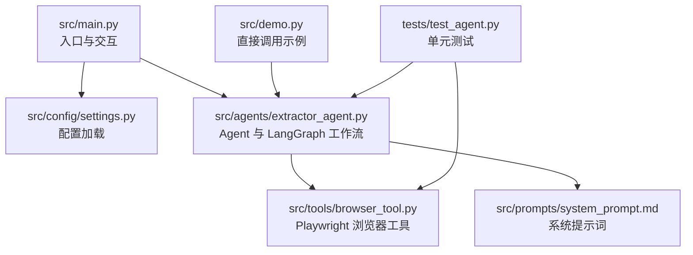
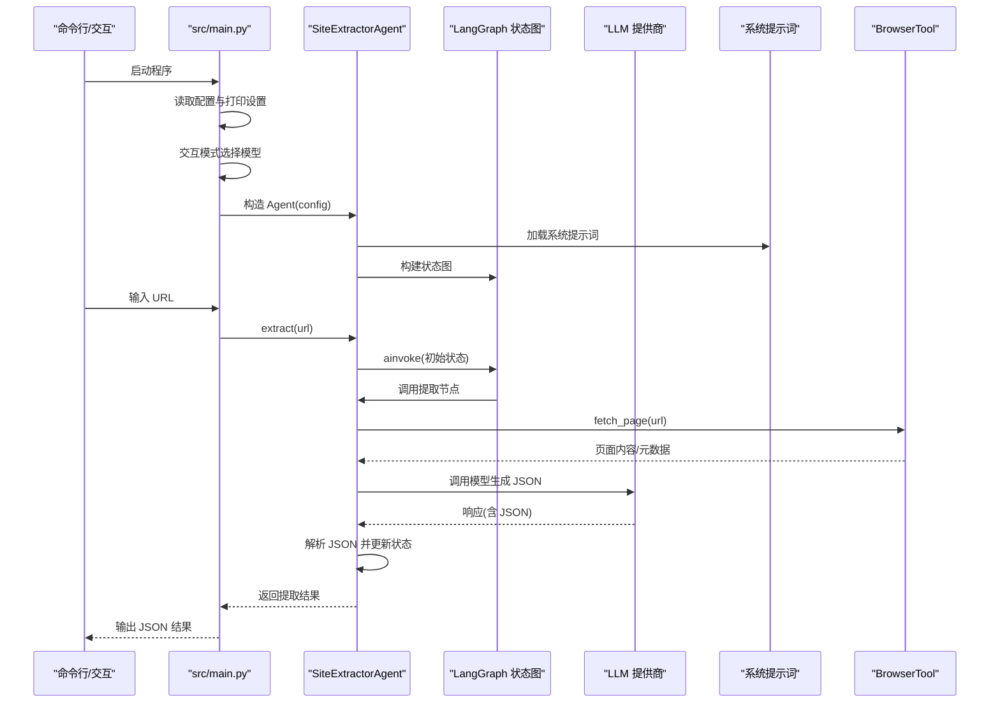
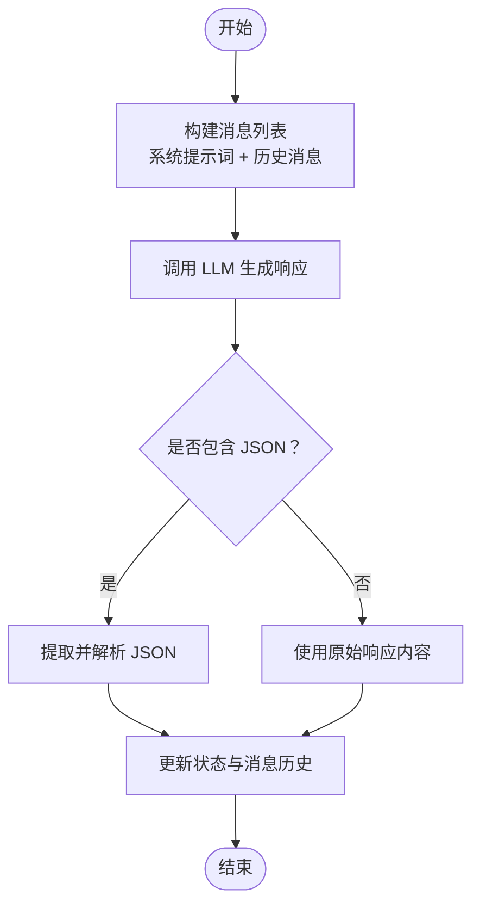
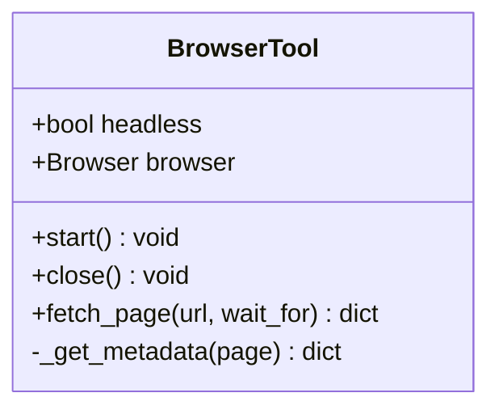
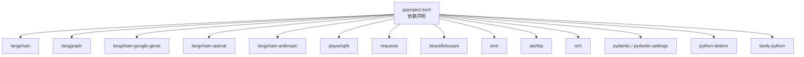

# 快速开始

<cite>
**本文引用的文件**
- [README.md](file://README.md)
- [pyproject.toml](file://pyproject.toml)
- [requirements.txt](file://requirements.txt)
- [.env.example](file://.env.example)
- [src/main.py](file://src/main.py)
- [src/config/settings.py](file://src/config/settings.py)
- [src/agents/extractor_agent.py](file://src/agents/extractor_agent.py)
- [src/tools/browser_tool.py](file://src/tools/browser_tool.py)
- [src/prompts/system_prompt.md](file://src/prompts/system_prompt.md)
- [src/demo.py](file://src/demo.py)
- [tests/test_agent.py](file://tests/test_agent.py)
- [conftest.py](file://conftest.py)
</cite>

## 目录
1. [简介](#简介)
2. [项目结构](#项目结构)
3. [核心组件](#核心组件)
4. [架构总览](#架构总览)
5. [详细组件分析](#详细组件分析)
6. [依赖分析](#依赖分析)
7. [性能考虑](#性能考虑)
8. [故障排除指南](#故障排除指南)
9. [结论](#结论)
10. [附录](#附录)

## 简介
本指南面向新手，帮助你在约 15 分钟内完成 Site Info Extractor Agent 的环境准备、依赖安装、Playwright 浏览器安装、环境变量配置，并成功运行第一个提取任务。项目基于 LangChain 和 LangGraph，支持多种 LLM 提供商（Google Gemini、OpenAI、Anthropic 等），并通过浏览器工具抓取网页内容，最终以结构化 JSON 输出提取结果。

## 项目结构
项目采用按功能分层的组织方式，核心模块包括：
- 入口与交互：src/main.py
- 配置管理：src/config/settings.py
- Agent 与工作流：src/agents/extractor_agent.py
- 浏览器工具：src/tools/browser_tool.py
- 系统提示词：src/prompts/system_prompt.md
- 示例与演示：src/demo.py
- 测试：tests/test_agent.py
- 项目元信息：pyproject.toml、requirements.txt、.env.example、README.md



图表来源
- [src/main.py](file://src/main.py#L1-L254)
- [src/config/settings.py](file://src/config/settings.py#L1-L56)
- [src/agents/extractor_agent.py](file://src/agents/extractor_agent.py#L1-L330)
- [src/tools/browser_tool.py](file://src/tools/browser_tool.py#L1-L108)
- [src/prompts/system_prompt.md](file://src/prompts/system_prompt.md#L1-L212)
- [src/demo.py](file://src/demo.py#L1-L51)
- [tests/test_agent.py](file://tests/test_agent.py#L1-L80)

章节来源
- [README.md](file://README.md#L57-L72)
- [pyproject.toml](file://pyproject.toml#L58-L59)

## 核心组件
- 配置系统：通过 pydantic-settings 从 .env 文件加载 API Key 与模型参数，支持多提供商模型名称与默认值。
- Agent：基于 LangGraph 的状态机式工作流，负责构建消息、调用 LLM、解析 JSON 结果并返回结构化数据。
- 浏览器工具：基于 Playwright 的异步浏览器封装，支持无头/有头模式，抓取页面标题、内容、文本与元数据。
- 交互入口：提供命令行交互模式，支持多模型选择与实时 URL 提取。

章节来源
- [src/config/settings.py](file://src/config/settings.py#L9-L56)
- [src/agents/extractor_agent.py](file://src/agents/extractor_agent.py#L90-L330)
- [src/tools/browser_tool.py](file://src/tools/browser_tool.py#L10-L108)
- [src/main.py](file://src/main.py#L44-L228)

## 架构总览
下图展示了从入口到提取完成的关键调用链路，包括配置加载、模型选择、工作流执行与结果解析。



图表来源
- [src/main.py](file://src/main.py#L44-L228)
- [src/agents/extractor_agent.py](file://src/agents/extractor_agent.py#L195-L239)
- [src/prompts/system_prompt.md](file://src/prompts/system_prompt.md#L1-L212)
- [src/tools/browser_tool.py](file://src/tools/browser_tool.py#L44-L80)

## 详细组件分析

### 配置与环境变量
- Python 版本要求：3.10 及以上（推荐 3.11+）。
- 依赖安装：使用 requirements.txt 或 pyproject.toml 中的依赖声明。
- Playwright 浏览器安装：通过 playwright install 安装 Chromium。
- 环境变量：复制 .env.example 为 .env 并填写 API Key；项目会自动从 .env 加载配置。
- API Key 支持：Google（必需用于默认模型）、OpenAI、Anthropic、Groq、SiliconFlow、讯飞、Cerebras。
- 模型默认值：Gemini 默认模型、Groq、SiliconFlow、讯飞、Cerebras 的默认模型名称在配置中定义。

章节来源
- [README.md](file://README.md#L7-L25)
- [.env.example](file://.env.example#L1-L9)
- [src/config/settings.py](file://src/config/settings.py#L9-L56)
- [pyproject.toml](file://pyproject.toml#L28-L47)

### 交互式运行与命令行模式
- 启动方式：python src/main.py。
- 交互流程：程序启动后显示当前配置，随后进入交互模式，支持多模型选择与实时输入 URL 进行提取。
- 退出方式：输入 quit/exit/q 或 Ctrl+C。

章节来源
- [README.md](file://README.md#L51-L55)
- [src/main.py](file://src/main.py#L44-L228)

### 直接调用方式（示例）
- 提供 src/demo.py 展示如何直接调用 LLM（例如 Google Gemini）进行同步对话。
- 也可在业务代码中直接构造 SiteExtractorAgent(config) 并调用 extract(url)。

章节来源
- [src/demo.py](file://src/demo.py#L1-L51)
- [src/agents/extractor_agent.py](file://src/agents/extractor_agent.py#L90-L115)

### Agent 与 LangGraph 工作流
- 状态结构：包含 messages、extracted_info、url。
- 工作流：单节点“extractor”，入口即执行，完成后结束。
- 模型选择优先级：Google Gemini → OpenAI → Anthropic → Groq → SiliconFlow → 讯飞 → Cerebras。
- 结果解析：优先解析 LLM 返回中的 JSON（支持 ```json ... ``` 或 ``` ... ``` 包裹），否则记录原始响应与解析错误。



图表来源
- [src/agents/extractor_agent.py](file://src/agents/extractor_agent.py#L241-L329)
- [src/prompts/system_prompt.md](file://src/prompts/system_prompt.md#L109-L146)

章节来源
- [src/agents/extractor_agent.py](file://src/agents/extractor_agent.py#L77-L239)

### 浏览器工具（Playwright）
- 支持无头/有头模式，异步上下文管理器启动与关闭。
- 功能：打开页面、等待网络空闲、获取标题/HTML/文本、提取常用 meta 标签。
- 典型用途：在提取前先抓取页面内容，作为 LLM 的上下文输入。



图表来源
- [src/tools/browser_tool.py](file://src/tools/browser_tool.py#L10-L108)

章节来源
- [src/tools/browser_tool.py](file://src/tools/browser_tool.py#L10-L108)

### 系统提示词与输出规范
- 系统提示词定义了提取职责、工作流程、提取规则与输出格式。
- 输出必须使用中文字段名，JSON 结构包含 url、标题、描述、主要内容、链接、图片、元数据、联系方式、结构化数据、提取时间、状态等。

章节来源
- [src/prompts/system_prompt.md](file://src/prompts/system_prompt.md#L1-L212)

## 依赖分析
- Python 版本：pyproject.toml 明确要求 Python >= 3.10。
- 核心依赖：langchain、langchain-core、langgraph、langchain-google-genai、langchain-openai、langchain-anthropic、langchain-community、tavily-python、playwright、requests、beautifulsoup4、lxml、aiohttp、rich、pydantic、pydantic-settings、python-dotenv。
- 可选依赖：开发工具（pytest、black、ruff、mypy）。
- 运行脚本：site-extractor = src.main:main。



图表来源
- [pyproject.toml](file://pyproject.toml#L28-L47)

章节来源
- [pyproject.toml](file://pyproject.toml#L1-L75)
- [requirements.txt](file://requirements.txt#L1-L36)

## 性能考虑
- 无头模式：默认启用无头模式，减少资源占用。
- 异步执行：浏览器与 LLM 调用均采用异步，提升吞吐。
- 模型选择：优先使用免费的 Google Gemini（默认模型），在资源受限场景更友好。
- 超时与等待：浏览器工具对页面加载设置了等待条件，必要时可传入等待选择器。
- 并发控制：建议在批量提取时限制并发数量，避免触发反爬虫或资源耗尽。

章节来源
- [src/config/settings.py](file://src/config/settings.py#L44-L44)
- [src/tools/browser_tool.py](file://src/tools/browser_tool.py#L59-L62)

## 故障排除指南
- Python 版本不满足：确保使用 Python 3.10+，推荐 3.11+。
- 依赖安装失败：
  - 使用 requirements.txt 或 pyproject.toml 安装依赖。
  - 若出现编译错误，确认系统已安装构建工具（如 gcc、make）。
- Playwright 浏览器未安装：
  - 执行 playwright install 安装 Chromium。
  - 如遇权限问题，使用管理员权限或更换安装路径。
- API Key 未配置：
  - 复制 .env.example 为 .env 并填写 GOOGLE_API_KEY（默认模型必需）。
  - 可同时配置 OPENAI_API_KEY、ANTHROPIC_API_KEY 等以启用多提供商。
- 模型未找到（404）：
  - 切换到其他可用模型，参考 README 中支持的模型列表。
  - 在相应平台（如 Google AI Studio）启用目标模型。
- 交互模式无法输入：
  - 确认终端支持非阻塞输入；在某些 IDE 终端中可能需要调整设置。
- 提取结果不是 JSON：
  - 检查 LLM 输出是否包含 ```json 包裹；若无，Agent 会记录原始响应与解析错误。
- 权限与安全：
  - .env 文件受 .gitignore 保护，切勿提交到仓库。
  - 如已提交，立即撤销历史或使用加密工具。

章节来源
- [README.md](file://README.md#L7-L25)
- [README.md](file://README.md#L40-L50)
- [README.md](file://README.md#L83-L92)
- [src/main.py](file://src/main.py#L235-L240)
- [src/agents/extractor_agent.py](file://src/agents/extractor_agent.py#L271-L304)

## 结论
按照本指南，你可以在 15 分钟内完成环境准备、依赖安装、Playwright 浏览器安装与环境变量配置，并通过交互模式或直接调用方式运行第一个提取任务。若遇到问题，可参考故障排除章节逐步定位与解决。

## 附录

### 环境变量配置步骤
- 复制示例文件为 .env：cp .env.example .env
- 编辑 .env，填写以下密钥（至少 GOOGLE_API_KEY 为必需）：
  - GOOGLE_API_KEY：Google Gemini API Key
  - OPENAI_API_KEY：OpenAI API Key（可选）
  - ANTHROPIC_API_KEY：Anthropic API Key（可选）

章节来源
- [README.md](file://README.md#L29-L39)
- [.env.example](file://.env.example#L1-L9)

### 获取 API Key 的方法
- Google API Key：
  - 访问 Google AI Studio 获取 API Key，填入 .env 的 GOOGLE_API_KEY。
- OpenAI API Key：
  - 在 OpenAI 平台创建密钥，填入 .env 的 OPENAI_API_KEY。
- Anthropic API Key：
  - 在 Anthropic 平台创建密钥，填入 .env 的 ANTHROPIC_API_KEY。

章节来源
- [README.md](file://README.md#L45-L49)

### 运行方式
- 交互模式：python src/main.py，随后按提示输入 URL 进行提取。
- 直接调用：参考 src/demo.py 的示例，或在业务代码中构造 SiteExtractorAgent(config) 并调用 extract(url)。

章节来源
- [README.md](file://README.md#L51-L55)
- [src/demo.py](file://src/demo.py#L1-L51)
- [src/main.py](file://src/main.py#L44-L228)

### 测试与验证
- 单元测试：tests/test_agent.py 包含 BrowserTool 与 SiteExtractorAgent 的基础测试，可使用 pytest 运行。
- 测试路径配置：conftest.py 已将项目根目录加入 Python 路径，便于测试导入。

章节来源
- [tests/test_agent.py](file://tests/test_agent.py#L1-L80)
- [conftest.py](file://conftest.py#L1-L20)