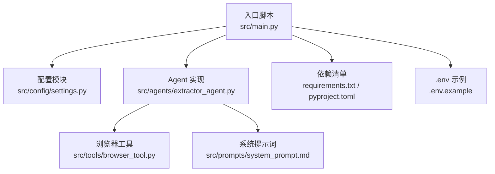
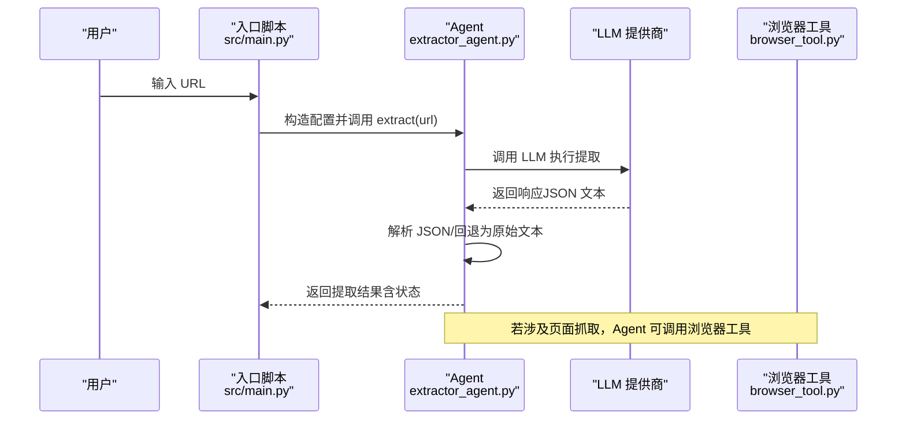
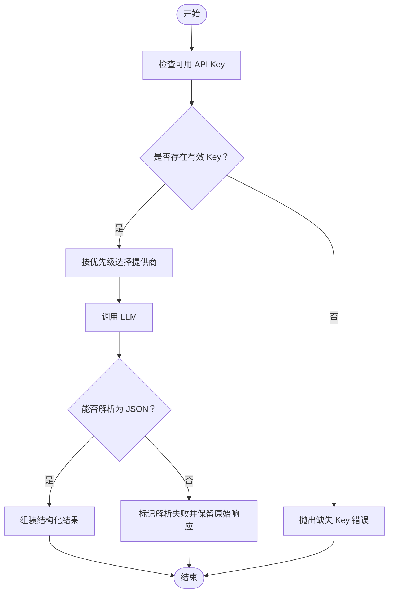
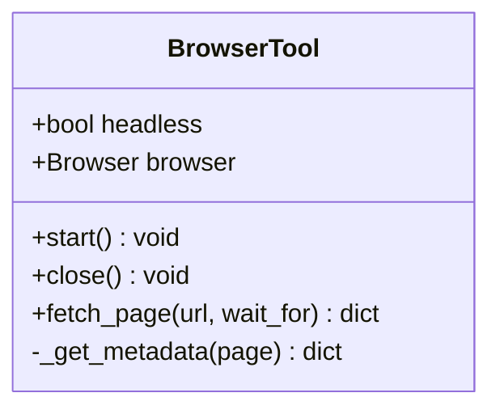
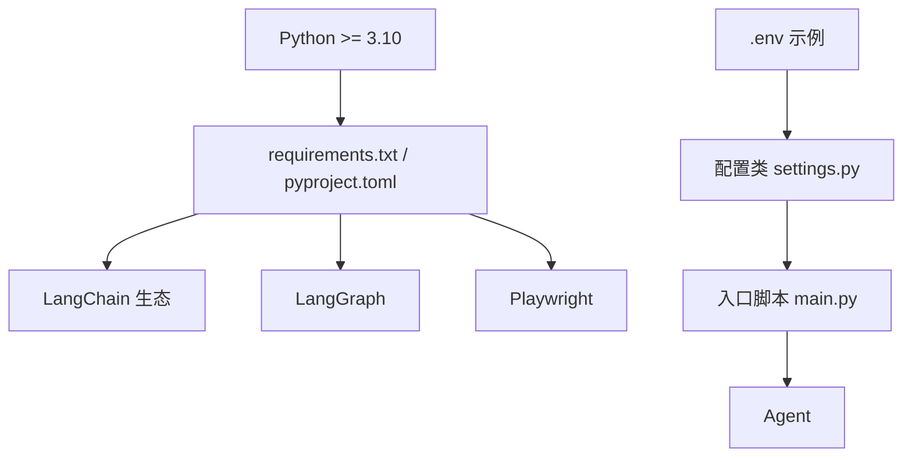

# 常见问题

<cite>
**本文引用的文件**
- [README.md](file://README.md)
- [src/main.py](file://src/main.py)
- [src/config/settings.py](file://src/config/settings.py)
- [src/agents/extractor_agent.py](file://src/agents/extractor_agent.py)
- [src/tools/browser_tool.py](file://src/tools/browser_tool.py)
- [src/prompts/system_prompt.md](file://src/prompts/system_prompt.md)
- [requirements.txt](file://requirements.txt)
- [pyproject.toml](file://pyproject.toml)
- [.env.example](file://.env.example)
- [tests/test_agent.py](file://tests/test_agent.py)
</cite>

## 目录
1. [简介](#简介)
2. [项目结构](#项目结构)
3. [核心组件](#核心组件)
4. [架构总览](#架构总览)
5. [详细组件分析](#详细组件分析)
6. [依赖分析](#依赖分析)
7. [性能考虑](#性能考虑)
8. [故障排查指南](#故障排查指南)
9. [结论](#结论)
10. [附录](#附录)

## 简介
本文件面向 Site Info Extractor Agent 的使用者与维护者，聚焦“常见问题”的系统化解答。围绕模型调用失败、API 密钥配置错误、网络连接超时、浏览器启动失败、权限不足等典型问题，提供症状识别、原因分析与修复步骤，并结合源码中的错误处理与日志输出，给出可操作的排障流程。

## 项目结构
该项目采用分层与按功能域划分的组织方式：
- 配置层：集中于配置类与环境变量加载，负责模型参数与提供商密钥注入
- 应用入口：交互式 CLI，负责运行模式、模型选择与错误展示
- Agent 层：LangGraph 工作流与 LLM 供应商适配，负责提取流程与结果解析
- 工具层：浏览器工具封装 Playwright，负责页面抓取与基础元数据提取
- 提示词层：系统提示词模板，指导 LLM 输出结构化 JSON

图表来源
- [src/main.py](file://src/main.py#L1-L254)
- [src/config/settings.py](file://src/config/settings.py#L1-L56)
- [src/agents/extractor_agent.py](file://src/agents/extractor_agent.py#L1-L330)
- [src/tools/browser_tool.py](file://src/tools/browser_tool.py#L1-L108)
- [src/prompts/system_prompt.md](file://src/prompts/system_prompt.md#L1-L212)
- [requirements.txt](file://requirements.txt#L1-L36)
- [pyproject.toml](file://pyproject.toml#L1-L75)
- [.env.example](file://.env.example#L1-L9)

章节来源
- [README.md](file://README.md#L57-L72)
- [src/main.py](file://src/main.py#L1-L254)
- [src/config/settings.py](file://src/config/settings.py#L1-L56)
- [src/agents/extractor_agent.py](file://src/agents/extractor_agent.py#L1-L330)
- [src/tools/browser_tool.py](file://src/tools/browser_tool.py#L1-L108)
- [src/prompts/system_prompt.md](file://src/prompts/system_prompt.md#L1-L212)
- [requirements.txt](file://requirements.txt#L1-L36)
- [pyproject.toml](file://pyproject.toml#L1-L75)
- [.env.example](file://.env.example#L1-L9)

## 核心组件
- 配置与环境变量
  - 通过配置类加载 .env，支持多提供商 API Key 与模型参数
  - 入口脚本打印当前配置表，便于核对
- Agent 与工作流
  - 动态选择 LLM 提供商，优先 Google Gemini，其次 OpenAI、Anthropic、Groq、SiliconFlow、讯飞、Cerebras
  - 单节点工作流：提取 → 结束；异常时返回错误状态
- 浏览器工具
  - 封装 Playwright，支持异步上下文管理、页面访问、内容与元数据提取
- 提示词
  - 明确输出格式与字段，要求 LLM 输出结构化 JSON

章节来源
- [src/config/settings.py](file://src/config/settings.py#L9-L56)
- [src/main.py](file://src/main.py#L34-L42)
- [src/agents/extractor_agent.py](file://src/agents/extractor_agent.py#L90-L194)
- [src/tools/browser_tool.py](file://src/tools/browser_tool.py#L10-L81)
- [src/prompts/system_prompt.md](file://src/prompts/system_prompt.md#L105-L146)

## 架构总览
下图展示了从用户输入到提取结果的关键交互路径，以及错误在何处被捕获与反馈。

图表来源
- [src/main.py](file://src/main.py#L182-L228)
- [src/agents/extractor_agent.py](file://src/agents/extractor_agent.py#L219-L329)
- [src/tools/browser_tool.py](file://src/tools/browser_tool.py#L44-L80)

## 详细组件分析

### 组件一：模型选择与调用链路
- 优先级顺序：Google Gemini → OpenAI → Anthropic → Groq → SiliconFlow → 讯飞 → Cerebras
- 若无任一可用 API Key，抛出明确错误提示
- LLM 调用失败时，Agent 返回错误状态与异常文本

图表来源
- [src/agents/extractor_agent.py](file://src/agents/extractor_agent.py#L116-L194)
- [src/agents/extractor_agent.py](file://src/agents/extractor_agent.py#L241-L329)

章节来源
- [src/agents/extractor_agent.py](file://src/agents/extractor_agent.py#L90-L194)
- [src/agents/extractor_agent.py](file://src/agents/extractor_agent.py#L241-L329)

### 组件二：浏览器工具与页面抓取
- 异步上下文管理：自动启动/关闭浏览器与页面
- 页面访问：支持等待网络空闲与指定元素出现
- 元数据提取：收集常见 meta 标签

图表来源
- [src/tools/browser_tool.py](file://src/tools/browser_tool.py#L10-L108)

章节来源
- [src/tools/browser_tool.py](file://src/tools/browser_tool.py#L32-L80)

### 组件三：系统提示词与输出规范
- 明确输出格式为结构化 JSON，字段以中文命名
- 规定必要与可选字段，指导 LLM 产出符合预期的结果

章节来源
- [src/prompts/system_prompt.md](file://src/prompts/system_prompt.md#L105-L146)

## 依赖分析
- Python 版本与依赖
  - 要求 Python >= 3.10；项目声明支持至 3.14
  - LangChain/LangGraph 生态与 Playwright 等核心依赖
- 环境变量
  - .env 示例包含 Google、OpenAI、Anthropic API Key
  - .gitignore 保护 .env 不被提交

图表来源
- [pyproject.toml](file://pyproject.toml#L10-L26)
- [requirements.txt](file://requirements.txt#L1-L36)
- [.env.example](file://.env.example#L1-L9)
- [src/config/settings.py](file://src/config/settings.py#L46-L51)
- [src/main.py](file://src/main.py#L230-L246)

章节来源
- [pyproject.toml](file://pyproject.toml#L10-L47)
- [requirements.txt](file://requirements.txt#L1-L36)
- [.env.example](file://.env.example#L1-L9)
- [src/config/settings.py](file://src/config/settings.py#L46-L51)
- [src/main.py](file://src/main.py#L230-L246)

## 性能考虑
- 无头模式：默认启用，减少资源占用
- 超时控制：页面等待元素出现时设置超时上限
- 结果解析：优先结构化 JSON，解析失败保留原始响应，避免重复计算
- 并发与重试：当前实现为单节点工作流，建议在外部调用层控制并发与重试

章节来源
- [src/config/settings.py](file://src/config/settings.py#L44-L44)
- [src/tools/browser_tool.py](file://src/tools/browser_tool.py#L61-L62)
- [src/agents/extractor_agent.py](file://src/agents/extractor_agent.py#L271-L304)

## 故障排查指南

### 一、模型调用失败
- 症状
  - 提取结果包含错误状态与异常文本
  - 输出中出现解析失败标记及原始响应
- 可能原因
  - API Key 缺失或无效
  - 模型名称不存在或未启用
  - LLM 返回非结构化文本
- 快速识别
  - 查看入口脚本输出的“提取完成”后 JSON 结果中的状态字段
  - 若状态为错误或解析失败，结合 parse_error/raw_response 字段定位
- 修复步骤
  1) 确认 .env 中已配置至少一个提供商的 API Key
  2) 核对模型名称是否正确且已启用（参考项目支持的模型列表）
  3) 若 LLM 返回非 JSON 文本，调整系统提示词或切换到更稳定的提供商
  4) 如遇模型未找到错误，尝试更换可用模型

章节来源
- [src/agents/extractor_agent.py](file://src/agents/extractor_agent.py#L188-L193)
- [src/agents/extractor_agent.py](file://src/agents/extractor_agent.py#L299-L304)
- [src/agents/extractor_agent.py](file://src/agents/extractor_agent.py#L315-L329)
- [src/main.py](file://src/main.py#L230-L246)
- [README.md](file://README.md#L83-L92)

### 二、API 密钥配置错误
- 症状
  - 启动时提示未检测到 API Key
  - 交互模式无法进入或直接报错
- 可能原因
  - .env 文件未创建或未正确填写
  - 环境变量大小写不匹配（配置类区分大小写关闭）
- 快速识别
  - 启动时查看控制台警告信息
  - 核对 .env 文件路径与内容
- 修复步骤
  1) 复制示例文件为 .env 并填入所需 Key
  2) 确认 Key 名称与示例一致
  3) 重启应用使配置生效

章节来源
- [src/main.py](file://src/main.py#L235-L240)
- [src/config/settings.py](file://src/config/settings.py#L46-L51)
- [.env.example](file://.env.example#L1-L9)

### 三、网络连接超时
- 症状
  - 页面访问失败或返回空内容
  - 元数据提取为空
- 可能原因
  - 目标站点网络不稳定或反爬机制较强
  - 等待元素超时
- 快速识别
  - 浏览器工具在等待元素时设置超时上限
- 修复步骤
  1) 调整等待条件或移除等待参数
  2) 增加重试与延时策略
  3) 更换代理或降低请求频率

章节来源
- [src/tools/browser_tool.py](file://src/tools/browser_tool.py#L61-L62)

### 四、浏览器启动失败
- 症状
  - 运行时报错提示浏览器未启动
  - 无法打开新页面
- 可能原因
  - Playwright 未安装或驱动缺失
  - 权限不足导致无法启动 Chromium
- 快速识别
  - 检查浏览器工具的启动与关闭流程
  - 出现“未启动”运行时错误
- 修复步骤
  1) 安装 Playwright 并下载浏览器驱动
  2) 在受支持的环境中运行（避免容器/服务器沙箱限制）
  3) 尝试切换到有头模式进行调试

章节来源
- [src/tools/browser_tool.py](file://src/tools/browser_tool.py#L32-L42)
- [src/tools/browser_tool.py](file://src/tools/browser_tool.py#L54-L55)
- [README.md](file://README.md#L23-L24)

### 五、权限不足
- 症状
  - 进程无法启动或崩溃
  - 文件系统访问受限
- 可能原因
  - 虚拟环境未激活或权限不足
  - .env 文件权限不当
- 快速识别
  - 启动失败或权限相关异常
- 修复步骤
  1) 激活正确的虚拟环境
  2) 确保 .env 文件权限仅限当前用户
  3) 在具备网络与图形栈的环境中运行

章节来源
- [README.md](file://README.md#L14-L25)
- [.gitignore](file://.gitignore#L32-L39)

### 六、环境变量配置问题
- 症状
  - 配置类未加载到值
  - 模型参数与预期不符
- 可能原因
  - env_file 路径不正确或文件名不匹配
  - 变量名大小写不一致
- 快速识别
  - 入口脚本打印的配置表与期望不一致
- 修复步骤
  1) 确认 .env 文件位于项目根目录
  2) 使用示例文件作为对照
  3) 重启应用以重新加载配置

章节来源
- [src/config/settings.py](file://src/config/settings.py#L46-L51)
- [src/main.py](file://src/main.py#L34-L42)

### 七、依赖包版本冲突
- 症状
  - 导入失败或运行时报错
  - 版本不兼容导致功能异常
- 可能原因
  - Python 版本过高或过低
  - 依赖版本范围不满足
- 快速识别
  - 依赖清单与项目声明版本范围
- 修复步骤
  1) 使用 Python 3.10+ 并创建独立虚拟环境
  2) 按 requirements.txt 或 pyproject.toml 安装依赖
  3) 避免在同一环境中安装与项目冲突的包

章节来源
- [pyproject.toml](file://pyproject.toml#L10-L26)
- [requirements.txt](file://requirements.txt#L1-L36)

### 八、LLM 模型不可用
- 症状
  - 调用 LLM 时返回“未找到”或类似错误
- 可能原因
  - 模型名称拼写错误或未启用
  - 配额不足或配额限制
- 快速识别
  - LLM 调用异常堆栈
- 修复步骤
  1) 切换到项目支持的可用模型
  2) 在提供商平台确认模型可用性与配额
  3) 检查网络与代理设置

章节来源
- [README.md](file://README.md#L83-L92)
- [src/agents/extractor_agent.py](file://src/agents/extractor_agent.py#L116-L194)

## 结论
本指南基于源码中的错误处理与日志输出，总结了常见问题的症状、原因与修复步骤。建议在排查时遵循“配置核对—环境验证—依赖检查—模型与网络诊断”的顺序，结合入口脚本与 Agent 的状态输出快速定位问题根因。

## 附录
- 快速核对清单
  - .env 是否存在且包含有效 API Key
  - Python 版本与依赖是否满足要求
  - Playwright 是否正确安装与驱动可用
  - 模型名称是否在支持列表内且已启用
  - 无头模式与网络环境是否允许浏览器启动