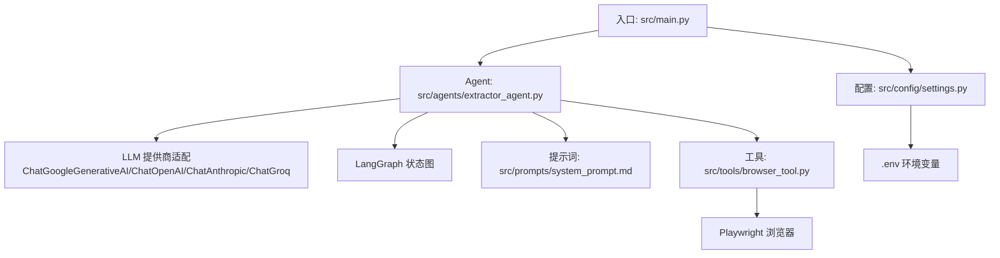
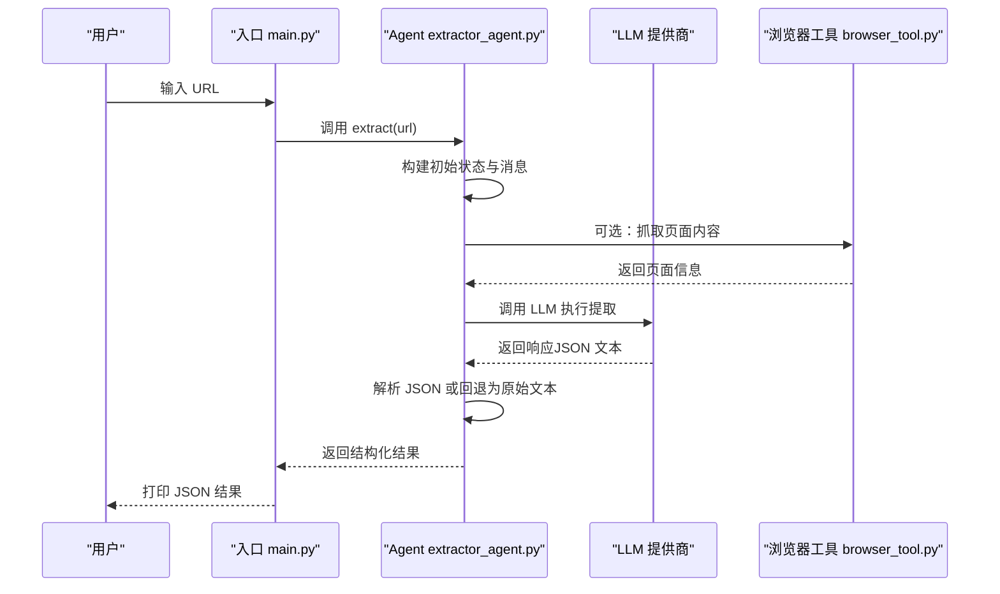
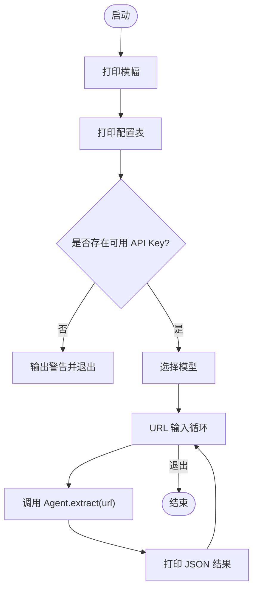
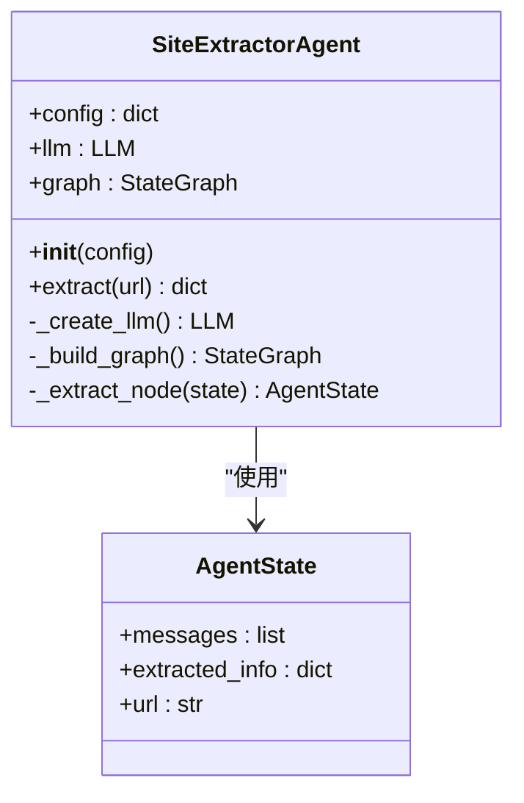
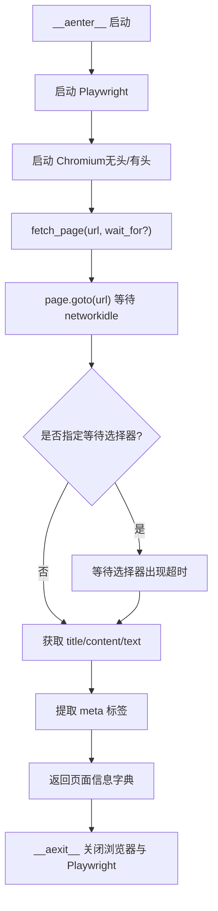
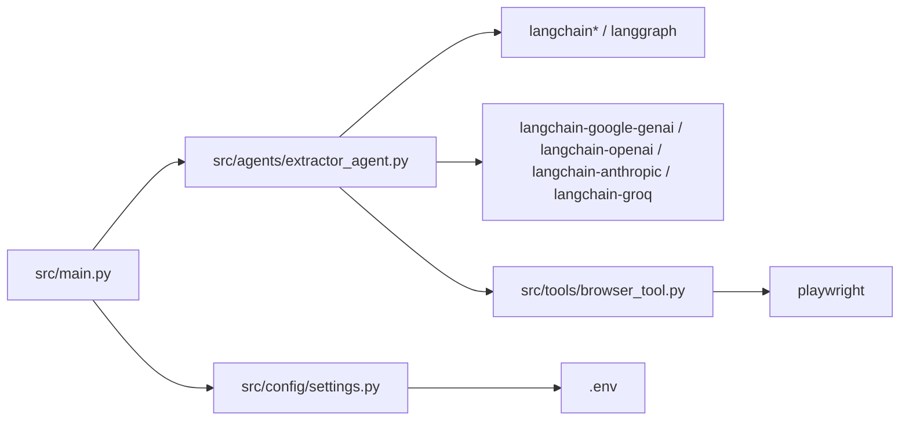

# 故障排除

<cite>
**本文引用的文件**
- [README.md](file://README.md)
- [src/main.py](file://src/main.py)
- [src/agents/extractor_agent.py](file://src/agents/extractor_agent.py)
- [src/tools/browser_tool.py](file://src/tools/browser_tool.py)
- [src/config/settings.py](file://src/config/settings.py)
- [src/prompts/system_prompt.md](file://src/prompts/system_prompt.md)
- [requirements.txt](file://requirements.txt)
- [.env.example](file://.env.example)
- [tests/test_agent.py](file://tests/test_agent.py)
- [pyproject.toml](file://pyproject.toml)
</cite>

## 目录
1. [简介](#简介)
2. [项目结构](#项目结构)
3. [核心组件](#核心组件)
4. [架构总览](#架构总览)
5. [详细组件分析](#详细组件分析)
6. [依赖分析](#依赖分析)
7. [性能考虑](#性能考虑)
8. [故障排除指南](#故障排除指南)
9. [结论](#结论)
10. [附录](#附录)

## 简介
本指南面向 Site Info Extractor Agent 的使用者与维护者，提供系统化的故障排除方法与最佳实践。内容覆盖模型调用失败、API 密钥错误、网络连接问题、浏览器启动失败等常见问题，并给出日志分析、错误代码解读、环境检查清单、调试技巧与工具使用方法。同时包含错误恢复策略、降级方案、社区支持与问题报告渠道，以及预防性维护与监控建议。

## 项目结构
该项目采用分层与功能模块化组织：
- 入口与交互：src/main.py 提供命令行交互与模型选择
- Agent 核心：src/agents/extractor_agent.py 实现基于 LangGraph 的状态机式提取流程
- 工具：src/tools/browser_tool.py 封装 Playwright 进行网页抓取
- 配置：src/config/settings.py 使用 Pydantic Settings 管理环境变量与默认值
- 提示词：src/prompts/system_prompt.md 定义系统提示词与输出规范
- 依赖：requirements.txt 与 pyproject.toml 管理第三方库与脚手架配置
- 测试：tests/test_agent.py 提供基础单元测试与模拟

图表来源
- [src/main.py](file://src/main.py#L230-L246)
- [src/agents/extractor_agent.py](file://src/agents/extractor_agent.py#L116-L194)
- [src/tools/browser_tool.py](file://src/tools/browser_tool.py#L32-L43)
- [src/config/settings.py](file://src/config/settings.py#L9-L56)

章节来源
- [README.md](file://README.md#L57-L72)
- [src/main.py](file://src/main.py#L1-L254)
- [src/agents/extractor_agent.py](file://src/agents/extractor_agent.py#L1-L330)
- [src/tools/browser_tool.py](file://src/tools/browser_tool.py#L1-L108)
- [src/config/settings.py](file://src/config/settings.py#L1-L56)
- [src/prompts/system_prompt.md](file://src/prompts/system_prompt.md#L1-L212)
- [requirements.txt](file://requirements.txt#L1-L36)
- [pyproject.toml](file://pyproject.toml#L1-L75)

## 核心组件
- 入口与交互：负责打印横幅、展示配置、选择模型、接收 URL 并调用 Agent 执行提取，捕获键盘中断与异常并输出详细堆栈
- Agent：根据配置动态选择 LLM 提供商，构建 LangGraph 状态图，执行提取节点，解析 LLM 响应为结构化 JSON，处理解析失败与执行异常
- 浏览器工具：封装 Playwright，支持异步上下文管理、启动/关闭浏览器、抓取页面内容与元数据
- 配置管理：通过 Settings 读取 .env，暴露模型名称、温度、最大令牌、浏览器模式等参数
- 提示词：定义系统提示词与输出格式，指导 LLM 提取结构化信息

章节来源
- [src/main.py](file://src/main.py#L26-L246)
- [src/agents/extractor_agent.py](file://src/agents/extractor_agent.py#L90-L330)
- [src/tools/browser_tool.py](file://src/tools/browser_tool.py#L10-L108)
- [src/config/settings.py](file://src/config/settings.py#L9-L56)
- [src/prompts/system_prompt.md](file://src/prompts/system_prompt.md#L1-L212)

## 架构总览
系统以 LangGraph 为核心，Agent 作为状态机驱动提取流程；LLM 提供商通过动态导入按可用性与配置选择；浏览器工具用于获取页面内容；配置通过环境变量注入。

图表来源
- [src/main.py](file://src/main.py#L182-L228)
- [src/agents/extractor_agent.py](file://src/agents/extractor_agent.py#L219-L330)
- [src/tools/browser_tool.py](file://src/tools/browser_tool.py#L44-L81)

## 详细组件分析

### 组件 A：入口与交互（main.py）
- 负责打印横幅与当前配置表
- 检测可用 API Key 并进行模型选择
- 交互式循环读取 URL，调用 Agent 执行提取并打印结果
- 捕获键盘中断与异常，输出详细堆栈便于定位问题

图表来源
- [src/main.py](file://src/main.py#L26-L246)

章节来源
- [src/main.py](file://src/main.py#L26-L246)

### 组件 B：Agent（extractor_agent.py）
- 动态导入 LLM 提供商，按优先级选择可用实例
- 构建 LangGraph 状态图，单节点“提取”流程
- 提取消息列表，调用 LLM，解析 JSON，处理解析失败与执行异常
- 返回包含状态、URL、提取结果或错误信息的结果字典

图表来源
- [src/agents/extractor_agent.py](file://src/agents/extractor_agent.py#L77-L115)
- [src/agents/extractor_agent.py](file://src/agents/extractor_agent.py#L90-L330)

章节来源
- [src/agents/extractor_agent.py](file://src/agents/extractor_agent.py#L1-L330)

### 组件 C：浏览器工具（browser_tool.py）
- 异步上下文管理器，启动/关闭 Playwright 与 Chromium
- 抓取页面标题、HTML 内容、纯文本与常用 meta 元数据
- 支持等待元素出现与超时控制

图表来源
- [src/tools/browser_tool.py](file://src/tools/browser_tool.py#L23-L81)

章节来源
- [src/tools/browser_tool.py](file://src/tools/browser_tool.py#L1-L108)

### 组件 D：配置（settings.py）
- 通过 Settings 读取 .env，暴露 API Key、模型名称、温度、最大令牌、浏览器模式等
- 默认模型名称与提供商特定模型名称

章节来源
- [src/config/settings.py](file://src/config/settings.py#L9-L56)

### 组件 E：提示词（system_prompt.md）
- 定义系统提示词、工作流程、提取规则、输出格式与示例
- 明确异常处理策略与质量要求

章节来源
- [src/prompts/system_prompt.md](file://src/prompts/system_prompt.md#L1-L212)

## 依赖分析
- LangChain/LangGraph：核心链路与状态图
- LLM 提供商：Google Gemini、OpenAI、Anthropic、Groq、SiliconFlow、讯飞、Cerebras
- 工具：Playwright、requests、beautifulsoup4、lxml、aiohttp
- 配置与日志：python-dotenv、pydantic、pydantic-settings、rich

图表来源
- [requirements.txt](file://requirements.txt#L1-L36)
- [pyproject.toml](file://pyproject.toml#L28-L47)
- [src/main.py](file://src/main.py#L20-L21)
- [src/agents/extractor_agent.py](file://src/agents/extractor_agent.py#L34-L74)
- [src/tools/browser_tool.py](file://src/tools/browser_tool.py#L7-L7)

章节来源
- [requirements.txt](file://requirements.txt#L1-L36)
- [pyproject.toml](file://pyproject.toml#L28-L47)

## 性能考虑
- 模型选择与成本：优先使用免费提供商（如 Google Gemini）以降低开销
- 浏览器模式：无头模式减少资源占用，适合批量任务
- 超时与重试：合理设置等待与超时，避免长时间阻塞
- 并发控制：避免过度并发导致网络与浏览器资源争用
- 输出格式：遵循提示词规范，减少后处理与二次解析成本

## 故障排除指南

### 一、模型调用失败
常见症状
- 提示“未找到可用 API Key”
- LLM 调用抛出异常或返回非 JSON 文本
- 模型未找到（404）或供应商不可用

排查步骤
1. 确认 .env 文件存在且包含有效 API Key（至少一个）
2. 在入口处检查是否检测到可用 API Key
3. 若使用 Google Gemini，确认模型名称正确且已在平台启用
4. 切换到其他可用提供商（如 OpenAI、Anthropic、Groq、SiliconFlow、讯飞、Cerebras）

恢复策略
- 降级到免费提供商（如 Google Gemini）
- 更换模型名称或调整温度/最大令牌
- 使用测试用例验证 LLM 调用路径

章节来源
- [src/main.py](file://src/main.py#L235-L240)
- [src/agents/extractor_agent.py](file://src/agents/extractor_agent.py#L116-L194)
- [README.md](file://README.md#L89-L92)
- [.env.example](file://.env.example#L1-L9)

### 二、API 密钥错误
常见症状
- “需要提供以下 API Key 之一”错误
- LLM 初始化失败或认证失败
- 入口提示未检测到 API Key

排查步骤
1. 复制 .env.example 为 .env 并填写密钥
2. 确认密钥名称大小写与 .env 示例一致
3. 验证密钥有效性与配额状态
4. 在入口处检查可用模型列表是否为空

恢复策略
- 补充缺失的 API Key
- 使用最小权限原则，仅启用必要提供商
- 在测试中使用 Mock 替代真实调用

章节来源
- [src/agents/extractor_agent.py](file://src/agents/extractor_agent.py#L188-L193)
- [src/main.py](file://src/main.py#L235-L240)
- [.env.example](file://.env.example#L1-L9)
- [tests/test_agent.py](file://tests/test_agent.py#L40-L66)

### 三、网络连接问题
常见症状
- 页面加载超时或失败
- LLM 请求超时或返回网络错误
- 浏览器无法启动或连接失败

排查步骤
1. 检查本地网络连通性与代理设置
2. 验证目标网站可达性
3. 在浏览器工具中增加等待与超时参数
4. 尝试禁用无头模式观察页面行为

恢复策略
- 增加等待时间与重试次数
- 使用备用请求库（如 requests）进行回退
- 限制并发，避免资源争用

章节来源
- [src/tools/browser_tool.py](file://src/tools/browser_tool.py#L44-L81)
- [src/agents/extractor_agent.py](file://src/agents/extractor_agent.py#L256-L330)

### 四、浏览器启动失败
常见症状
- RuntimeError：“浏览器未启动”
- Playwright 启动失败或 Chromium 启动异常
- 权限不足或缺少依赖

排查步骤
1. 确认已安装 Playwright 浏览器：执行安装命令
2. 检查操作系统图形环境（无头模式下无需显示）
3. 确认 Python 版本满足要求
4. 在入口处检查浏览器模式配置

恢复策略
- 使用无头模式（默认）
- 在 CI/容器环境中确保安装依赖与权限
- 临时禁用浏览器工具以验证 LLM 路径

章节来源
- [src/tools/browser_tool.py](file://src/tools/browser_tool.py#L32-L43)
- [src/config/settings.py](file://src/config/settings.py#L44-L44)
- [README.md](file://README.md#L23-L25)

### 五、日志分析与错误解读
- 入口输出：Rich 控制台打印横幅、配置表、错误与堆栈
- Agent 输出：提取结果包含状态、URL、原始响应或错误信息
- 建议：开启详细日志、记录时间戳、区分不同阶段错误

调试技巧
- 使用交互模式逐步输入 URL 观察行为
- 在测试中使用 Mock 替代真实 LLM 调用
- 通过断言验证状态与字段

章节来源
- [src/main.py](file://src/main.py#L230-L246)
- [src/agents/extractor_agent.py](file://src/agents/extractor_agent.py#L299-L329)
- [tests/test_agent.py](file://tests/test_agent.py#L54-L66)

### 六、调试模式与工具
- 交互模式：输入 URL 触发提取，支持 Ctrl+C 优雅退出
- 信号处理：捕获 SIGINT，立即退出避免继续执行
- 测试：pytest + pytest-asyncio，Mock LLM 调用路径

章节来源
- [src/main.py](file://src/main.py#L76-L85)
- [tests/test_agent.py](file://tests/test_agent.py#L1-L80)

### 七、错误恢复策略与降级方案
- LLM 提供商降级：从 Google Gemini → OpenAI → Anthropic → Groq → SiliconFlow → 讯飞 → Cerebras
- 输出降级：解析失败时保留原始响应与错误信息
- 浏览器降级：禁用浏览器工具，仅使用 LLM 提取 URL 文本
- 超时降级：缩短等待与超时，快速失败并记录

章节来源
- [src/agents/extractor_agent.py](file://src/agents/extractor_agent.py#L116-L194)
- [src/agents/extractor_agent.py](file://src/agents/extractor_agent.py#L299-L329)

### 八、环境检查清单
- Python 版本：满足要求
- 依赖安装：requirements.txt 与 pyproject.toml
- Playwright：已安装浏览器
- .env：包含至少一个有效 API Key
- 模型名称：在平台启用且可用
- 浏览器模式：无头/有头按需配置

章节来源
- [README.md](file://README.md#L7-L25)
- [requirements.txt](file://requirements.txt#L1-L36)
- [pyproject.toml](file://pyproject.toml#L10-L11)
- [.env.example](file://.env.example#L1-L9)

### 九、社区支持与问题报告
- 项目许可证：MIT
- 问题反馈：建议在仓库中提交 Issue 描述症状、环境信息与复现步骤
- 参考文档：README 与提示词规范

章节来源
- [README.md](file://README.md#L98-L101)

## 结论
通过系统化的故障排除流程、明确的降级策略与完善的日志记录，Site Info Extractor Agent 可在复杂网络与多提供商环境下稳定运行。建议在生产环境中结合监控与告警，定期验证 API Key 与模型可用性，并持续优化浏览器与 LLM 的超时与并发配置。

## 附录

### A. 常见错误与修复对照
- 未检测到 API Key：补充 .env 并确认密钥有效
- 模型未找到：更换模型名称或在平台启用
- 浏览器启动失败：安装 Playwright 浏览器，使用无头模式
- LLM 解析失败：检查提示词与输出格式，回退到原始响应

### B. 性能优化建议
- 选择合适模型与提供商
- 合理设置温度与最大令牌
- 使用无头模式与等待策略
- 控制并发与超时时间

### C. 监控与预防性维护
- 定期检查 API Key 限额与状态
- 记录关键指标（成功率、耗时、错误类型）
- 建立健康检查与告警机制
- 持续更新依赖与提示词