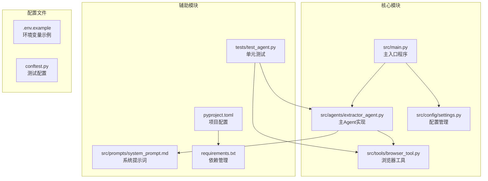
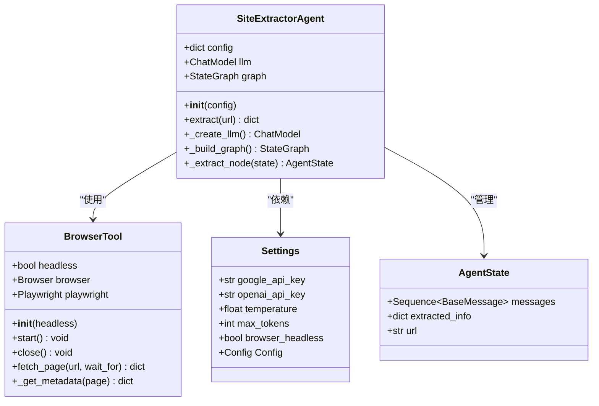
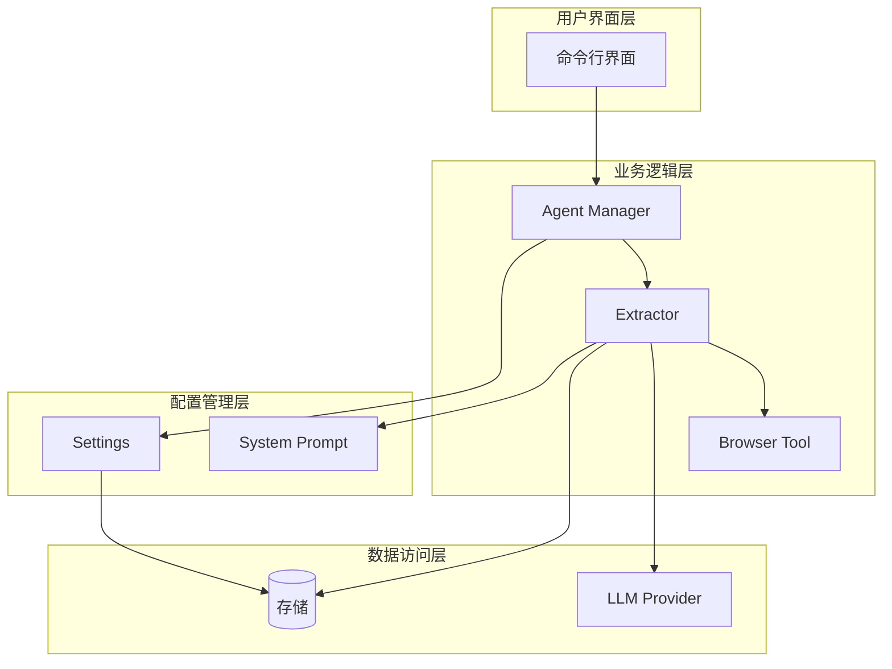
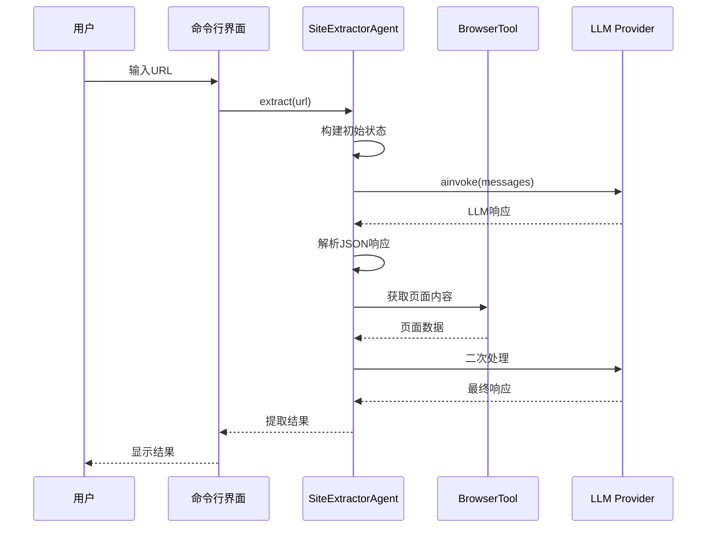
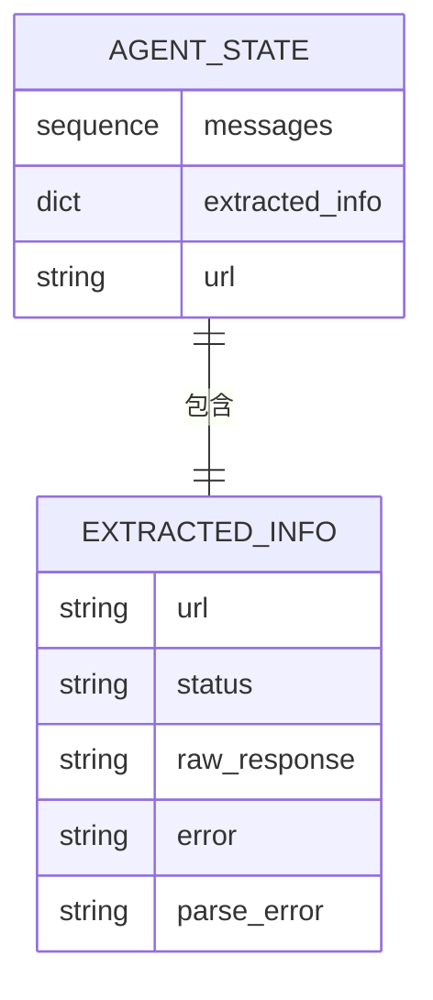
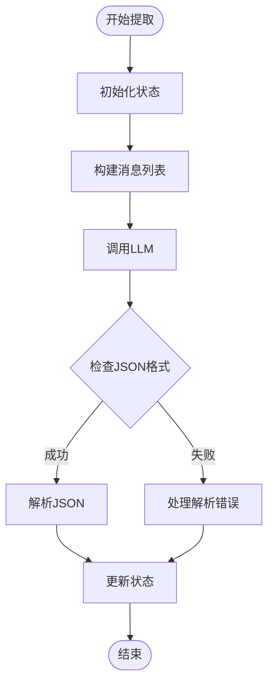
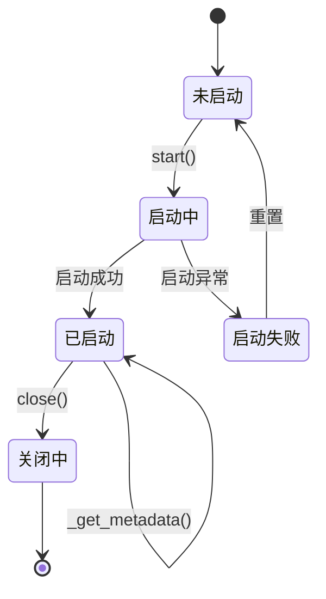
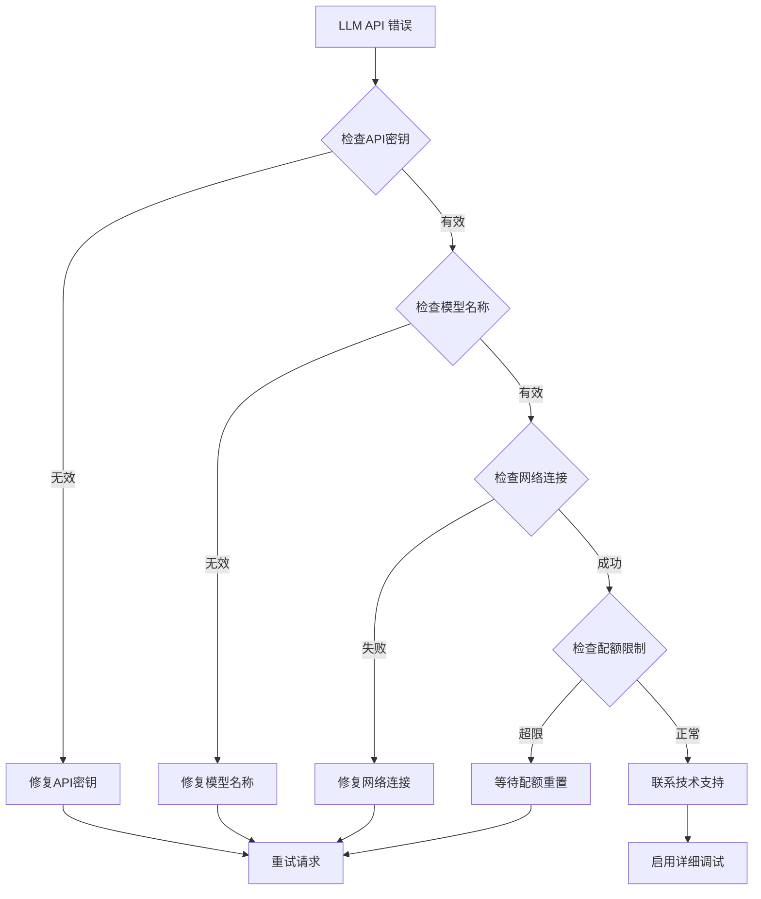
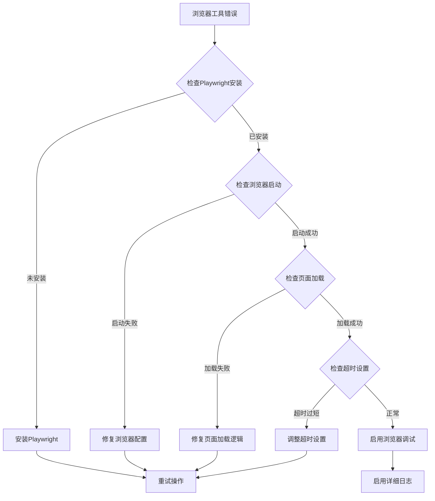

# 调试指南

<cite>
**本文档引用的文件**
- [src/main.py](file://src/main.py)
- [src/agents/extractor_agent.py](file://src/agents/extractor_agent.py)
- [src/tools/browser_tool.py](file://src/tools/browser_tool.py)
- [src/config/settings.py](file://src/config/settings.py)
- [src/prompts/system_prompt.md](file://src/prompts/system_prompt.md)
- [tests/test_agent.py](file://tests/test_agent.py)
- [pyproject.toml](file://pyproject.toml)
- [requirements.txt](file://requirements.txt)
- [README.md](file://README.md)
- [conftest.py](file://conftest.py)
</cite>

## 目录
1. [简介](#简介)
2. [项目结构](#项目结构)
3. [核心组件](#核心组件)
4. [架构概览](#架构概览)
5. [详细组件分析](#详细组件分析)
6. [调试工具与方法](#调试工具与方法)
7. [性能分析与监控](#性能分析与监控)
8. [故障排除指南](#故障排除指南)
9. [结论](#结论)

## 简介

Site Info Extractor Agent 是一个基于 LangChain 和 LangGraph 构建的智能网站信息提取系统。该系统能够自动从各种网站中提取、分析和结构化关键信息，支持多种 LLM 提供商（Google Gemini、OpenAI、Anthropic、Groq、SiliconFlow、讯飞）以及多种提取策略。

本调试指南旨在帮助开发者和用户有效地诊断和解决系统运行过程中遇到的各种问题，包括调试模式启用、日志收集、错误堆栈分析、性能监控等方面。

## 项目结构

项目采用模块化设计，主要包含以下核心模块：



**图表来源**
- [src/main.py](file://src/main.py#L1-L254)
- [src/agents/extractor_agent.py](file://src/agents/extractor_agent.py#L1-L330)
- [src/tools/browser_tool.py](file://src/tools/browser_tool.py#L1-L108)
- [src/config/settings.py](file://src/config/settings.py#L1-L56)

**章节来源**
- [src/main.py](file://src/main.py#L1-L254)
- [src/agents/extractor_agent.py](file://src/agents/extractor_agent.py#L1-L330)
- [src/tools/browser_tool.py](file://src/tools/browser_tool.py#L1-L108)
- [src/config/settings.py](file://src/config/settings.py#L1-L56)

## 核心组件

### 主要组件概述

系统由以下几个核心组件构成：

1. **SiteExtractorAgent**: 主要的 Agent 实现，基于 LangGraph 构建状态机式工作流
2. **BrowserTool**: 封装 Playwright 的浏览器工具，用于网页访问和内容获取
3. **Settings**: 配置管理类，使用 Pydantic 管理应用配置
4. **System Prompt**: 详细的系统提示词，定义提取规则和输出格式

### 组件关系图



**图表来源**
- [src/agents/extractor_agent.py](file://src/agents/extractor_agent.py#L90-L330)
- [src/tools/browser_tool.py](file://src/tools/browser_tool.py#L10-L108)
- [src/config/settings.py](file://src/config/settings.py#L9-L56)

**章节来源**
- [src/agents/extractor_agent.py](file://src/agents/extractor_agent.py#L90-L330)
- [src/tools/browser_tool.py](file://src/tools/browser_tool.py#L10-L108)
- [src/config/settings.py](file://src/config/settings.py#L9-L56)

## 架构概览

系统采用分层架构设计，具有清晰的关注点分离：



**图表来源**
- [src/main.py](file://src/main.py#L44-L246)
- [src/agents/extractor_agent.py](file://src/agents/extractor_agent.py#L195-L240)
- [src/config/settings.py](file://src/config/settings.py#L9-L56)

系统的核心工作流程如下：



**图表来源**
- [src/main.py](file://src/main.py#L219-L239)
- [src/agents/extractor_agent.py](file://src/agents/extractor_agent.py#L241-L329)

**章节来源**
- [src/main.py](file://src/main.py#L44-L246)
- [src/agents/extractor_agent.py](file://src/agents/extractor_agent.py#L195-L329)

## 详细组件分析

### SiteExtractorAgent 组件

SiteExtractorAgent 是系统的核心组件，负责协调整个信息提取流程：

#### 关键特性

1. **多提供商支持**: 支持 Google Gemini、OpenAI、Anthropic、Groq、SiliconFlow、讯飞等多种 LLM 提供商
2. **状态管理**: 基于 LangGraph 的状态机式工作流管理
3. **错误处理**: 完善的异常处理和错误恢复机制
4. **异步处理**: 全面的异步支持，提高并发性能

#### 状态结构分析



**图表来源**
- [src/agents/extractor_agent.py](file://src/agents/extractor_agent.py#L77-L88)
- [src/agents/extractor_agent.py](file://src/agents/extractor_agent.py#L266-L304)

#### 提取流程控制图



**图表来源**
- [src/agents/extractor_agent.py](file://src/agents/extractor_agent.py#L241-L329)

**章节来源**
- [src/agents/extractor_agent.py](file://src/agents/extractor_agent.py#L90-L330)

### BrowserTool 组件

BrowserTool 封装了 Playwright 功能，提供了异步的网页访问能力：

#### 核心功能

1. **异步上下文管理**: 支持 async with 语法
2. **页面内容获取**: 获取页面标题、内容、文本和元数据
3. **元数据提取**: 自动提取常见的 meta 标签
4. **错误处理**: 完善的异常处理机制

#### 生命周期管理



**图表来源**
- [src/tools/browser_tool.py](file://src/tools/browser_tool.py#L23-L42)

**章节来源**
- [src/tools/browser_tool.py](file://src/tools/browser_tool.py#L10-L108)

### Settings 配置管理

Settings 类使用 Pydantic 管理应用配置，提供了类型安全的配置访问：

#### 配置项分类

1. **API 密钥**: 支持多个 LLM 提供商的 API 密钥
2. **模型配置**: 温度、最大令牌数、模型名称等
3. **浏览器配置**: 无头模式等浏览器相关设置

**章节来源**
- [src/config/settings.py](file://src/config/settings.py#L9-L56)

## 调试工具与方法

### 启用调试模式

#### 方法一：通过环境变量

```bash
# 设置 Python 调试模式
export PYTHONDEVMODE=1

# 启用详细日志
export PYTHONWARNINGS="default"

# 设置调试端口（用于远程调试）
export PYCHARM_HOST=127.0.0.1
export PYCHARM_PORT=5678
```

#### 方法二：修改源码调试

在关键位置添加调试断点：

```python
# 在 src/agents/extractor_agent.py 中的关键位置
import pdb

def _extract_node(self, state):
    pdb.set_trace()  # 设置断点
    # ... 提取逻辑
```

**章节来源**
- [src/main.py](file://src/main.py#L1-L254)
- [src/agents/extractor_agent.py](file://src/agents/extractor_agent.py#L256-L329)

### 日志级别设置

#### 系统级日志配置

```python
import logging
import sys

# 配置根日志记录器
logging.basicConfig(
    level=logging.DEBUG,
    format='%(asctime)s - %(name)s - %(levelname)s - %(message)s',
    handlers=[
        logging.FileHandler('debug.log'),
        logging.StreamHandler(sys.stdout)
    ]
)

# 设置特定模块的日志级别
logging.getLogger('src.agents.extractor_agent').setLevel(logging.DEBUG)
logging.getLogger('src.tools.browser_tool').setLevel(logging.DEBUG)
```

#### LLM 调用日志

```python
# 在 LLM 调用前后添加日志
import time

def debug_llm_call(self, messages):
    start_time = time.time()
    logger.debug(f"LLM调用开始: {len(messages)} 条消息")
    
    response = await self.llm.ainvoke(messages)
    
    end_time = time.time()
    logger.debug(f"LLM调用完成: 耗时 {end_time - start_time:.2f} 秒")
    
    return response
```

**章节来源**
- [src/agents/extractor_agent.py](file://src/agents/extractor_agent.py#L262-L263)
- [src/main.py](file://src/main.py#L150-L152)

### Python 调试器使用

#### PDB 调试器

```bash
# 启动调试会话
python -m pdb src/main.py

# 在代码中设置断点
# pdb.set_trace()

# 常用 PDB 命令
# n (next) - 执行下一行
# s (step) - 单步进入函数
# c (continue) - 继续执行
# l (list) - 显示当前代码
# p 变量名 - 打印变量值
# pp 变量名 - 美化打印变量值
```

#### IDE 调试器配置

##### VS Code 配置

```json
{
    "version": "0.2.0",
    "configurations": [
        {
            "name": "Python: Current File",
            "type": "python",
            "request": "launch",
            "program": "${file}",
            "console": "integratedTerminal",
            "justMyCode": true,
            "env": {
                "PYTHONPATH": "${workspaceFolder}"
            }
        },
        {
            "name": "Python: Remote Attach",
            "type": "python",
            "request": "attach",
            "port": 5678,
            "host": "localhost",
            "pathMappings": [
                {
                    "localRoot": "${workspaceFolder}",
                    "remoteRoot": "/app"
                }
            ]
        }
    ]
}
```

##### PyCharm 配置

```python
# 在 PyCharm 中设置远程调试
import pydevd_pycharm
pydevd_pycharm.settrace('localhost', port=5678, stdoutToServer=True, stderrToServer=True)
```

**章节来源**
- [src/main.py](file://src/main.py#L1-L254)
- [src/agents/extractor_agent.py](file://src/agents/extractor_agent.py#L1-L330)

### 网络请求追踪

#### HTTP 请求监控

```python
import http.client as http_client
import logging

# 启用 HTTP 调试
http_client.HTTPConnection.debuglevel = 1

# 配置日志
logging.basicConfig()
logging.getLogger().setLevel(logging.DEBUG)
requests_log = logging.getLogger("requests.packages.urllib3")
requests_log.setLevel(logging.DEBUG)
requests_log.propagate = True
```

#### LLM API 调用追踪

```python
import openai
from openai import OpenAI

# 配置 OpenAI 客户端以启用详细日志
client = OpenAI(
    api_key="your-api-key",
    http_client=httpx.AsyncHTTPTransport(
        retries=3,
        timeout=30.0
    )
)

# 添加请求拦截器
original_request = client._client.request

def debug_request(*args, **kwargs):
    print(f"HTTP 请求: {args}")
    print(f"请求头: {kwargs.get('headers', {})}")
    print(f"请求体: {kwargs.get('data', kwargs.get('json', {}))}")
    return original_request(*args, **kwargs)

client._client.request = debug_request
```

**章节来源**
- [src/agents/extractor_agent.py](file://src/agents/extractor_agent.py#L128-L193)

### 调试脚本示例

#### 基础调试脚本

```python
#!/usr/bin/env python3
"""
Site Info Extractor Agent 调试脚本
"""

import asyncio
import logging
from src.agents.extractor_agent import SiteExtractorAgent
from src.config.settings import settings

# 配置调试日志
logging.basicConfig(
    level=logging.DEBUG,
    format='%(asctime)s - %(name)s - %(levelname)s - %(message)s'
)

async def debug_extract():
    """调试提取功能"""
    
    # 创建配置
    config = {
        "model_name": settings.gemini_model_name,
        "temperature": settings.temperature,
        "max_tokens": settings.max_tokens,
        "google_api_key": settings.google_api_key
    }
    
    # 创建 Agent
    agent = SiteExtractorAgent(config)
    
    # 测试 URL
    test_urls = [
        "https://example.com",
        "https://httpbin.org/html"
    ]
    
    for url in test_urls:
        try:
            print(f"\n调试提取: {url}")
            result = await agent.extract(url)
            print(f"结果: {result}")
        except Exception as e:
            print(f"错误: {e}")
            logging.error(f"提取失败: {e}", exc_info=True)

if __name__ == "__main__":
    asyncio.run(debug_extract())
```

#### 性能调试脚本

```python
#!/usr/bin/env python3
"""
性能调试脚本
"""

import asyncio
import time
import tracemalloc
from src.agents.extractor_agent import SiteExtractorAgent

async def performance_debug():
    """性能调试"""
    
    # 开始内存跟踪
    tracemalloc.start()
    
    # 创建 Agent
    config = {
        "model_name": "gemini-2.5-flash",
        "google_api_key": "test-key"
    }
    
    agent = SiteExtractorAgent(config)
    
    # 测试多次调用
    urls = ["https://example.com"] * 5
    total_time = 0
    
    for i, url in enumerate(urls):
        start_time = time.time()
        
        try:
            result = await agent.extract(url)
            end_time = time.time()
            
            elapsed = end_time - start_time
            total_time += elapsed
            
            print(f"调用 {i+1}: {elapsed:.2f}秒, 状态: {result.get('status')}")
            
        except Exception as e:
            print(f"调用 {i+1} 失败: {e}")
    
    # 结束内存跟踪
    current, peak = tracemalloc.get_traced_memory()
    tracemalloc.stop()
    
    print(f"\n平均耗时: {total_time/len(urls):.2f}秒")
    print(f"当前内存使用: {current / 1024 / 1024:.2f} MB")
    print(f"峰值内存使用: {peak / 1024 / 1024:.2f} MB")

if __name__ == "__main__":
    asyncio.run(performance_debug())
```

**章节来源**
- [src/agents/extractor_agent.py](file://src/agents/extractor_agent.py#L219-L239)

## 性能分析与监控

### 内存使用监控

#### 实时内存监控

```python
import psutil
import os
from datetime import datetime

def monitor_memory():
    """监控内存使用情况"""
    process = psutil.Process(os.getpid())
    memory_info = process.memory_info()
    
    return {
        'rss_mb': memory_info.rss / 1024 / 1024,
        'vms_mb': memory_info.vms / 1024 / 1024,
        'percent': process.memory_percent(),
        'timestamp': datetime.now().isoformat()
    }

# 在关键位置添加内存监控
def debug_memory_usage(operation):
    """调试内存使用"""
    memory_before = monitor_memory()
    print(f"操作前: {memory_before}")
    
    # 执行操作
    result = operation()
    
    memory_after = monitor_memory()
    print(f"操作后: {memory_after}")
    
    return result
```

#### 内存泄漏检测

```python
import gc
import weakref

class MemoryLeakDetector:
    """内存泄漏检测器"""
    
    def __init__(self):
        self.objects = []
        self.referrers = []
    
    def track_object(self, obj):
        """跟踪对象"""
        self.objects.append(id(obj))
        return obj
    
    def detect_leaks(self):
        """检测内存泄漏"""
        gc.collect()
        leaked_objects = []
        
        for obj_id in self.objects:
            if obj_id in [id(o) for o in gc.get_objects()]:
                leaked_objects.append(obj_id)
        
        return len(leaked_objects)
```

**章节来源**
- [src/agents/extractor_agent.py](file://src/agents/extractor_agent.py#L1-L330)

### 性能指标收集

#### 关键性能指标

```python
import time
from functools import wraps

class PerformanceMonitor:
    """性能监控器"""
    
    def __init__(self):
        self.metrics = {
            'extract_count': 0,
            'total_time': 0,
            'avg_time': 0,
            'max_time': 0,
            'min_time': float('inf')
        }
    
    def measure(self, func_name):
        """测量函数执行时间"""
        def decorator(func):
            @wraps(func)
            def wrapper(*args, **kwargs):
                start_time = time.time()
                
                try:
                    result = func(*args, **kwargs)
                    return result
                finally:
                    end_time = time.time()
                    elapsed = end_time - start_time
                    
                    self._update_metrics(elapsed)
                    print(f"{func_name} 执行时间: {elapsed:.2f}秒")
            
            return wrapper
        return decorator
    
    def _update_metrics(self, elapsed):
        """更新性能指标"""
        self.metrics['extract_count'] += 1
        self.metrics['total_time'] += elapsed
        
        if elapsed > self.metrics['max_time']:
            self.metrics['max_time'] = elapsed
        
        if elapsed < self.metrics['min_time']:
            self.metrics['min_time'] = elapsed
        
        self.metrics['avg_time'] = self.metrics['total_time'] / self.metrics['extract_count']
    
    def get_report(self):
        """获取性能报告"""
        return {
            '总调用次数': self.metrics['extract_count'],
            '总耗时': f"{self.metrics['total_time']:.2f}秒",
            '平均耗时': f"{self.metrics['avg_time']:.2f}秒",
            '最长耗时': f"{self.metrics['max_time']:.2f}秒",
            '最短耗时': f"{self.metrics['min_time']:.2f}秒"
        }
```

**章节来源**
- [src/agents/extractor_agent.py](file://src/agents/extractor_agent.py#L219-L239)

### 系统资源监控

#### CPU 和内存监控

```python
import threading
import time
import psutil
from queue import Queue

class ResourceMonitor:
    """系统资源监控器"""
    
    def __init__(self, interval=1.0):
        self.interval = interval
        self.monitoring = False
        self.metrics_queue = Queue()
        self.thread = None
    
    def start_monitoring(self):
        """开始监控"""
        if not self.monitoring:
            self.monitoring = True
            self.thread = threading.Thread(target=self._monitor_loop)
            self.thread.daemon = True
            self.thread.start()
    
    def stop_monitoring(self):
        """停止监控"""
        self.monitoring = False
        if self.thread:
            self.thread.join()
    
    def _monitor_loop(self):
        """监控循环"""
        while self.monitoring:
            cpu_percent = psutil.cpu_percent(interval=0.1)
            memory_info = psutil.virtual_memory()
            
            metrics = {
                'cpu_percent': cpu_percent,
                'memory_percent': memory_info.percent,
                'memory_available': memory_info.available,
                'timestamp': time.time()
            }
            
            self.metrics_queue.put(metrics)
            time.sleep(self.interval)
    
    def get_latest_metrics(self):
        """获取最新指标"""
        metrics = []
        while not self.metrics_queue.empty():
            metrics.append(self.metrics_queue.get_nowait())
        return metrics[-1] if metrics else None
```

**章节来源**
- [src/main.py](file://src/main.py#L1-L254)

## 故障排除指南

### 常见错误类型与解决方案

#### LLM API 错误



**图表来源**
- [src/agents/extractor_agent.py](file://src/agents/extractor_agent.py#L188-L193)

#### 浏览器工具错误



**图表来源**
- [src/tools/browser_tool.py](file://src/tools/browser_tool.py#L32-L42)

### 错误堆栈分析

#### 错误分类与处理

```python
import traceback
import logging

class DebugErrorHandler:
    """调试错误处理器"""
    
    @staticmethod
    def handle_exception(error, context=None):
        """处理异常"""
        error_info = {
            'error_type': type(error).__name__,
            'error_message': str(error),
            'context': context,
            'traceback': traceback.format_exc()
        }
        
        # 记录详细错误信息
        logging.error(f"错误发生: {error_info}")
        
        # 根据错误类型进行分类处理
        if isinstance(error, ValueError):
            return DebugErrorHandler._handle_value_error(error)
        elif isinstance(error, ConnectionError):
            return DebugErrorHandler._handle_connection_error(error)
        elif isinstance(error, TimeoutError):
            return DebugErrorHandler._handle_timeout_error(error)
        else:
            return DebugErrorHandler._handle_generic_error(error)
    
    @staticmethod
    def _handle_value_error(error):
        """处理值错误"""
        logging.warning("值错误: 检查输入参数和配置")
        return {"action": "验证输入", "retry": True}
    
    @staticmethod
    def _handle_connection_error(error):
        """处理连接错误"""
        logging.warning("连接错误: 检查网络和代理设置")
        return {"action": "检查网络连接", "retry": True}
    
    @staticmethod
    def _handle_timeout_error(error):
        """处理超时错误"""
        logging.warning("超时错误: 调整超时设置或重试策略")
        return {"action": "增加超时时间", "retry": True}
    
    @staticmethod
    def _handle_generic_error(error):
        """处理通用错误"""
        logging.error("未知错误: 需要人工干预")
        return {"action": "人工检查", "retry": False}
```

**章节来源**
- [src/agents/extractor_agent.py](file://src/agents/extractor_agent.py#L315-L329)
- [src/main.py](file://src/main.py#L150-L152)

### 调试最佳实践

#### 代码级调试技巧

```python
# 1. 使用类型注解进行静态检查
from typing import Optional, Dict, Any

def debug_extract(self, url: str) -> Dict[str, Any]:
    """带类型注解的调试提取函数"""
    # 参数验证
    if not url:
        raise ValueError("URL不能为空")
    
    # 调试输出
    print(f"调试: 正在处理URL - {url}")
    
    # 执行逻辑
    result = self._extract_node(...)
    
    # 结果验证
    if not isinstance(result, dict):
        raise TypeError("提取结果必须是字典类型")
    
    return result

# 2. 使用上下文管理器确保资源清理
async def debug_with_cleanup(self, url: str):
    """带资源清理的调试函数"""
    browser = None
    try:
        browser = BrowserTool(headless=True)
        await browser.start()
        # 执行操作
        result = await browser.fetch_page(url)
        return result
    finally:
        if browser:
            await browser.close()

# 3. 实现重试机制
import asyncio
import random

async def retry_with_backoff(func, max_retries=3, base_delay=1):
    """指数退避重试机制"""
    for attempt in range(max_retries):
        try:
            return await func()
        except Exception as e:
            if attempt == max_retries - 1:
                raise e
            
            delay = base_delay * (2 ** attempt) + random.uniform(0, 1)
            print(f"第{attempt + 1}次尝试失败，{delay:.2f}秒后重试")
            await asyncio.sleep(delay)
```

#### 配置调试

```python
# 1. 环境变量调试
import os

def debug_env_vars():
    """调试环境变量"""
    required_vars = ['GOOGLE_API_KEY', 'OPENAI_API_KEY']
    optional_vars = ['DEBUG_MODE', 'LOG_LEVEL']
    
    print("必需环境变量:")
    for var in required_vars:
        value = os.getenv(var)
        print(f"  {var}: {'已设置' if value else '未设置'}")
    
    print("可选环境变量:")
    for var in optional_vars:
        value = os.getenv(var, '未设置')
        print(f"  {var}: {value}")

# 2. 配置文件调试
def debug_config():
    """调试配置文件"""
    from src.config.settings import settings
    
    print("当前配置:")
    print(f"  模型名称: {settings.model_name}")
    print(f"  温度: {settings.temperature}")
    print(f"  最大令牌: {settings.max_tokens}")
    print(f"  浏览器模式: {'无头' if settings.browser_headless else '有头'}")
    
    # 检查可用的API密钥
    api_keys = [
        ('Google', settings.google_api_key),
        ('OpenAI', settings.openai_api_key),
        ('Anthropic', settings.anthropic_api_key)
    ]
    
    print("可用的API提供商:")
    for provider, key in api_keys:
        if key:
            print(f"  ✓ {provider}")
        else:
            print(f"  ✗ {provider} (未配置)")
```

**章节来源**
- [src/agents/extractor_agent.py](file://src/agents/extractor_agent.py#L116-L193)
- [src/config/settings.py](file://src/config/settings.py#L9-L56)

### 测试驱动调试

#### 单元测试调试

```python
import pytest
from unittest.mock import Mock, patch
from src.agents.extractor_agent import SiteExtractorAgent

def test_extract_debug():
    """调试提取功能的单元测试"""
    
    # 创建测试配置
    config = {
        "model_name": "gemini-2.5-flash",
        "google_api_key": "test-key"
    }
    
    # 创建 Agent
    agent = SiteExtractorAgent(config)
    
    # 使用 Mock 测试
    with patch.object(agent.llm, 'ainvoke') as mock_llm:
        # 设置 Mock 返回值
        mock_response = Mock()
        mock_response.content = '{"url": "https://example.com", "title": "Test"}'
        mock_llm.return_value = mock_response
        
        # 执行测试
        result = agent.extract("https://example.com")
        
        # 断言
        assert result["status"] == "success"
        assert result["url"] == "https://example.com"
        
        # 验证 Mock 调用
        mock_llm.assert_called_once()

# 运行测试
if __name__ == "__main__":
    pytest.main([__file__, "-v", "--tb=long"])
```

#### 集成测试调试

```python
import asyncio
import pytest
from src.tools.browser_tool import BrowserTool

@pytest.mark.asyncio
async def test_browser_tool_debug():
    """调试浏览器工具的集成测试"""
    
    # 启用详细日志
    import logging
    logging.basicConfig(level=logging.DEBUG)
    
    async with BrowserTool(headless=True) as browser:
        # 测试浏览器启动
        assert browser.browser is not None
        assert browser.playwright is not None
        
        # 测试页面获取
        try:
            page_data = await browser.fetch_page("https://httpbin.org/html")
            assert page_data is not None
            assert "url" in page_data
            assert "title" in page_data
            assert "content" in page_data
            assert "text" in page_data
            assert "metadata" in page_data
            
            print("浏览器工具测试通过")
            print(f"页面标题: {page_data['title']}")
            print(f"页面长度: {len(page_data['content'])} 字符")
            
        except Exception as e:
            print(f"浏览器工具测试失败: {e}")
            raise e
```

**章节来源**
- [tests/test_agent.py](file://tests/test_agent.py#L26-L80)

## 结论

Site Info Extractor Agent 调试指南提供了全面的调试方法和最佳实践，涵盖了从基础调试到高级性能分析的各个方面。通过合理使用这些工具和技术，开发者可以快速定位和解决系统运行中的各种问题。

### 关键要点总结

1. **多层次调试策略**: 从环境变量设置到代码级断点调试，从日志记录到性能监控
2. **系统化错误处理**: 建立完善的错误分类和处理机制
3. **性能优化指导**: 提供内存使用监控和性能指标收集方法
4. **测试驱动开发**: 通过单元测试和集成测试确保代码质量
5. **最佳实践建议**: 提供代码编写和调试的最佳实践指导

### 后续改进方向

1. **增强日志系统**: 实现结构化日志和分布式追踪
2. **自动化监控**: 建立自动化的性能监控和告警系统
3. **可视化调试**: 开发图形化的调试界面和性能分析工具
4. **持续集成**: 完善 CI/CD 流程中的自动化测试和调试

通过遵循本指南提供的方法和建议，用户可以有效地调试和优化 Site Info Extractor Agent 系统，确保其稳定可靠地运行。