# 错误恢复

<cite>
**本文档引用的文件**
- [src/agents/extractor_agent.py](file://src/agents/extractor_agent.py)
- [src/config/settings.py](file://src/config/settings.py)
- [src/tools/browser_tool.py](file://src/tools/browser_tool.py)
- [src/main.py](file://src/main.py)
- [src/prompts/system_prompt.md](file://src/prompts/system_prompt.md)
- [requirements.txt](file://requirements.txt)
- [README.md](file://README.md)
- [tests/test_agent.py](file://tests/test_agent.py)
</cite>

## 目录
1. [简介](#简介)
2. [系统架构概览](#系统架构概览)
3. [核心组件](#核心组件)
4. [错误恢复策略](#错误恢复策略)
5. [降级方案](#降级方案)
6. [手动恢复操作](#手动恢复操作)
7. [数据备份与恢复](#数据备份与恢复)
8. [故障排查指南](#故障排查指南)
9. [性能考虑](#性能考虑)
10. [结论](#结论)

## 简介

Site Info Extractor Agent 是一个基于 LangChain 和 LangGraph 构建的智能网站信息提取系统。本文件专注于系统的错误恢复和降级策略，确保在各种异常情况下能够提供稳定的服务。

该系统支持多种 LLM 提供商，包括 Google Gemini、OpenAI、Anthropic、Groq、SiliconFlow 和讯飞，并具备完善的错误处理机制和自动恢复能力。

## 系统架构概览

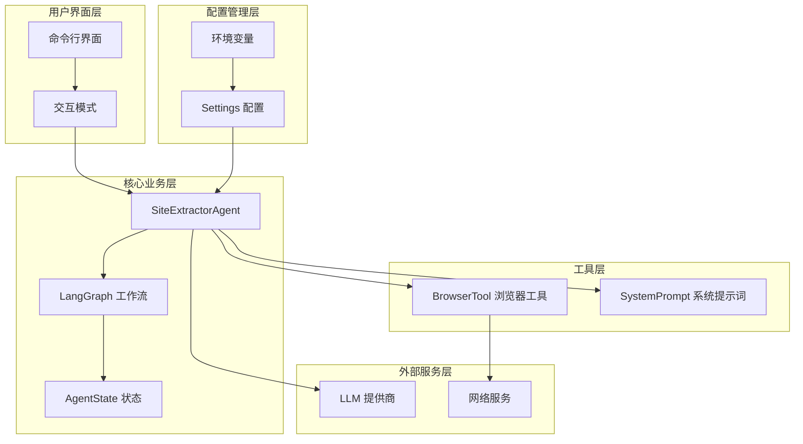
```mermaid
graph TB
subgraph "用户界面层"
CLI[命令行界面]
Interactive[交互模式]
end
subgraph "核心业务层"
Agent[SiteExtractorAgent]
Graph[LangGraph 工作流]
State[AgentState 状态]
end
subgraph "工具层"
Browser[BrowserTool 浏览器工具]
Prompt[SystemPrompt 系统提示词]
end
subgraph "配置管理层"
Settings[Settings 配置]
Env[环境变量]
end
subgraph "外部服务层"
LLM[LLM 提供商]
Network[网络服务]
end
CLI --> Interactive
Interactive --> Agent
Agent --> Graph
Graph --> State
Agent --> Browser
Agent --> Prompt
Agent --> LLM
Settings --> Agent
Env --> Settings
Browser --> Network
```

**图表来源**
- [src/main.py](file://src/main.py#L44-L228)
- [src/agents/extractor_agent.py](file://src/agents/extractor_agent.py#L90-L194)
- [src/tools/browser_tool.py](file://src/tools/browser_tool.py#L10-L43)

## 核心组件

### SiteExtractorAgent 核心功能

SiteExtractorAgent 是系统的核心组件，负责协调整个信息提取流程：

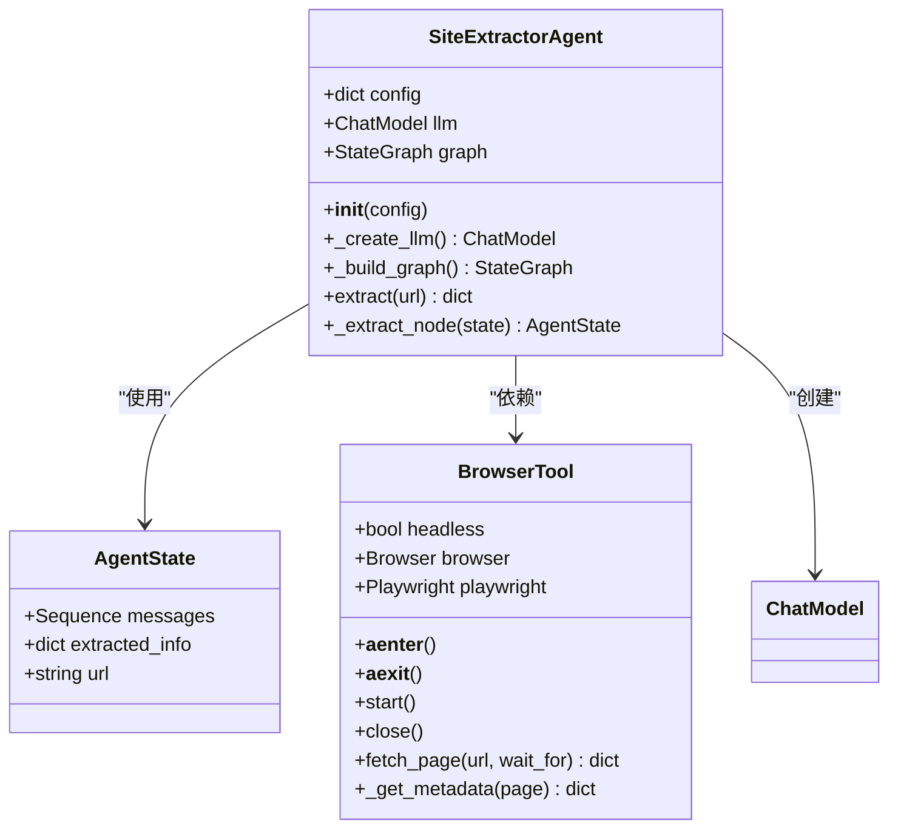
```mermaid
classDiagram
class SiteExtractorAgent {
+dict config
+ChatModel llm
+StateGraph graph
+__init__(config)
+_create_llm() ChatModel
+_build_graph() StateGraph
+extract(url) dict
+_extract_node(state) AgentState
}
class AgentState {
+Sequence messages
+dict extracted_info
+string url
}
class BrowserTool {
+bool headless
+Browser browser
+Playwright playwright
+__aenter__()
+__aexit__()
+start()
+close()
+fetch_page(url, wait_for) dict
+_get_metadata(page) dict
}
SiteExtractorAgent --> AgentState : "使用"
SiteExtractorAgent --> BrowserTool : "依赖"
SiteExtractorAgent --> ChatModel : "创建"
```

**图表来源**
- [src/agents/extractor_agent.py](file://src/agents/extractor_agent.py#L77-L95)
- [src/tools/browser_tool.py](file://src/tools/browser_tool.py#L10-L22)

**章节来源**
- [src/agents/extractor_agent.py](file://src/agents/extractor_agent.py#L90-L194)
- [src/tools/browser_tool.py](file://src/tools/browser_tool.py#L10-L43)

## 错误恢复策略

### 网络重试机制

系统实现了多层次的错误处理和恢复机制：

#### LLM 调用错误处理

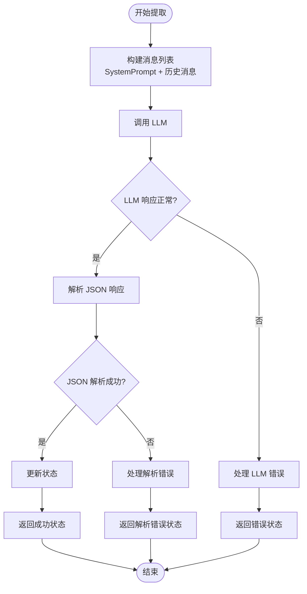
```mermaid
flowchart TD
Start([开始提取]) --> BuildMessages["构建消息列表<br/>SystemPrompt + 历史消息"]
BuildMessages --> CallLLM["调用 LLM"]
CallLLM --> LLMResponse{"LLM 响应正常?"}
LLMResponse --> |是| ParseJSON["解析 JSON 响应"]
LLMResponse --> |否| HandleError["处理 LLM 错误"]
ParseJSON --> ParseSuccess{"JSON 解析成功?"}
ParseSuccess --> |是| UpdateState["更新状态"]
ParseSuccess --> |否| HandleParseError["处理解析错误"]
HandleError --> ReturnError["返回错误状态"]
HandleParseError --> ReturnParsedError["返回解析错误状态"]
UpdateState --> ReturnSuccess["返回成功状态"]
ReturnSuccess --> End([结束])
ReturnError --> End
ReturnParsedError --> End
```

**图表来源**
- [src/agents/extractor_agent.py](file://src/agents/extractor_agent.py#L241-L330)

#### API Key 自动切换

系统支持多种 LLM 提供商的自动切换：

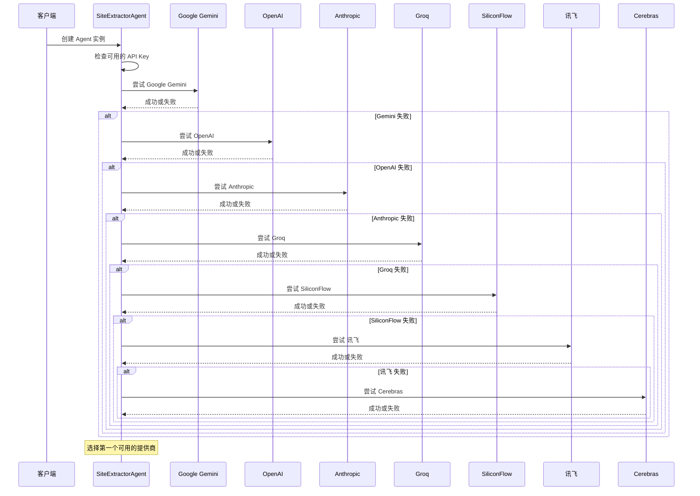
```mermaid
sequenceDiagram
participant Client as 客户端
participant Agent as SiteExtractorAgent
participant Gemini as Google Gemini
participant OpenAI as OpenAI
participant Anthropic as Anthropic
participant Groq as Groq
participant SiliconFlow as SiliconFlow
participant XunFei as 讯飞
participant Cerebras as Cerebras
Client->>Agent : 创建 Agent 实例
Agent->>Agent : 检查可用的 API Key
Agent->>Gemini : 尝试 Google Gemini
Gemini-->>Agent : 成功或失败
alt Gemini 失败
Agent->>OpenAI : 尝试 OpenAI
OpenAI-->>Agent : 成功或失败
alt OpenAI 失败
Agent->>Anthropic : 尝试 Anthropic
Anthropic-->>Agent : 成功或失败
alt Anthropic 失败
Agent->>Groq : 尝试 Groq
Groq-->>Agent : 成功或失败
alt Groq 失败
Agent->>SiliconFlow : 尝试 SiliconFlow
SiliconFlow-->>Agent : 成功或失败
alt SiliconFlow 失败
Agent->>XunFei : 尝试 讯飞
XunFei-->>Agent : 成功或失败
alt 讯飞 失败
Agent->>Cerebras : 尝试 Cerebras
Cerebras-->>Agent : 成功或失败
end
end
end
end
end
end
Note over Agent : 选择第一个可用的提供商
```

**图表来源**
- [src/agents/extractor_agent.py](file://src/agents/extractor_agent.py#L116-L194)

**章节来源**
- [src/agents/extractor_agent.py](file://src/agents/extractor_agent.py#L241-L330)

### 错误分类与处理

#### JSON 解析错误处理

当 LLM 返回的响应无法解析为 JSON 时，系统会采取以下措施：

1. **回退到原始响应**：保存原始文本内容
2. **标记解析状态**：设置 `parsed_error` 状态
3. **记录错误详情**：包含具体的解析错误信息

#### LLM 调用异常处理

对于 LLM 调用过程中的任何异常，系统会：
1. **捕获异常**：使用 try-catch 机制
2. **生成错误消息**：创建包含错误详情的 AIMessage
3. **返回错误状态**：设置 `error` 状态和错误信息

**章节来源**
- [src/agents/extractor_agent.py](file://src/agents/extractor_agent.py#L299-L329)

## 降级方案

### 触发条件

系统定义了以下降级触发条件：

1. **LLM 提供商不可用**：API Key 缺失或过期
2. **网络连接失败**：无法连接到 LLM 服务
3. **请求超时**：LLM 响应时间超过阈值
4. **模型不可用**：指定的模型在提供商处不存在
5. **配额限制**：达到 API 使用限制

### 执行流程

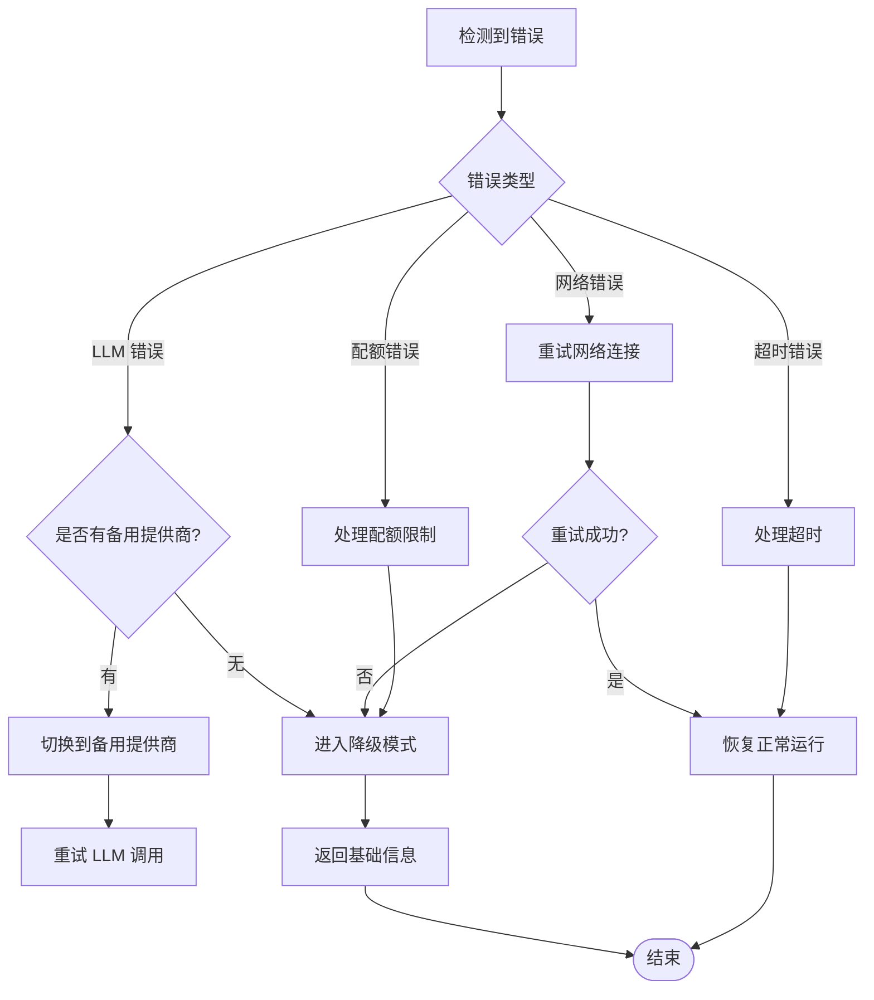
```mermaid
flowchart TD
ErrorDetected[检测到错误] --> CheckType{错误类型}
CheckType --> |LLM 错误| CheckFallback{"是否有备用提供商?"}
CheckType --> |网络错误| RetryNetwork["重试网络连接"]
CheckType --> |超时错误| TimeoutHandler["处理超时"]
CheckType --> |配额错误| QuotaHandler["处理配额限制"]
CheckFallback --> |有| SwitchProvider["切换到备用提供商"]
CheckFallback --> |无| FallbackMode["进入降级模式"]
SwitchProvider --> RetryCall["重试 LLM 调用"]
RetryNetwork --> NetworkRetry{"重试成功?"}
NetworkRetry --> |是| ResumeNormal["恢复正常运行"]
NetworkRetry --> |否| FallbackMode
TimeoutHandler --> ResumeNormal
QuotaHandler --> FallbackMode
FallbackMode --> ReturnBasicInfo["返回基础信息"]
ReturnBasicInfo --> End([结束])
ResumeNormal --> End
```

**图表来源**
- [src/agents/extractor_agent.py](file://src/agents/extractor_agent.py#L116-L194)

### 降级模式特性

当无法使用 LLM 时，系统会：
1. **返回基础页面信息**：标题、描述、内容摘要
2. **跳过复杂分析**：不进行深度内容解析
3. **提供有限结果**：仅返回结构化的基本信息

**章节来源**
- [src/agents/extractor_agent.py](file://src/agents/extractor_agent.py#L187-L193)

## 手动恢复操作

### 状态重置

当系统出现异常状态时，可以通过以下方式进行重置：

#### 重启浏览器实例

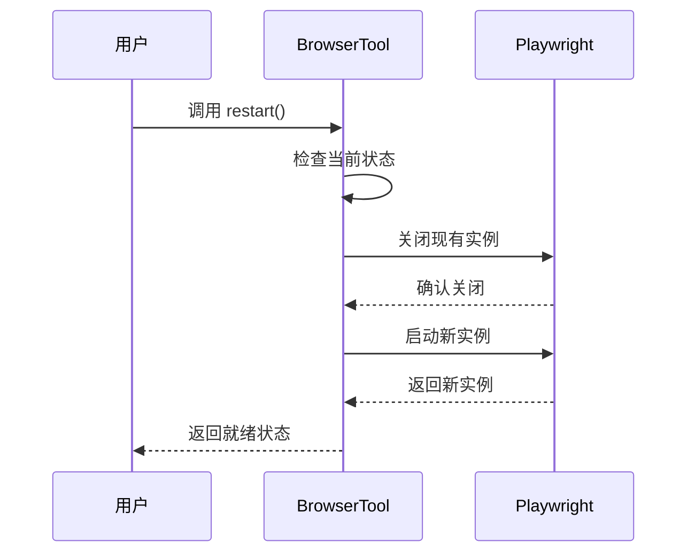
```mermaid
sequenceDiagram
participant User as 用户
participant Browser as BrowserTool
participant Playwright as Playwright
User->>Browser : 调用 restart()
Browser->>Browser : 检查当前状态
Browser->>Playwright : 关闭现有实例
Playwright-->>Browser : 确认关闭
Browser->>Playwright : 启动新实例
Playwright-->>Browser : 返回新实例
Browser-->>User : 返回就绪状态
```

**图表来源**
- [src/tools/browser_tool.py](file://src/tools/browser_tool.py#L32-L42)

#### 重新初始化 Agent

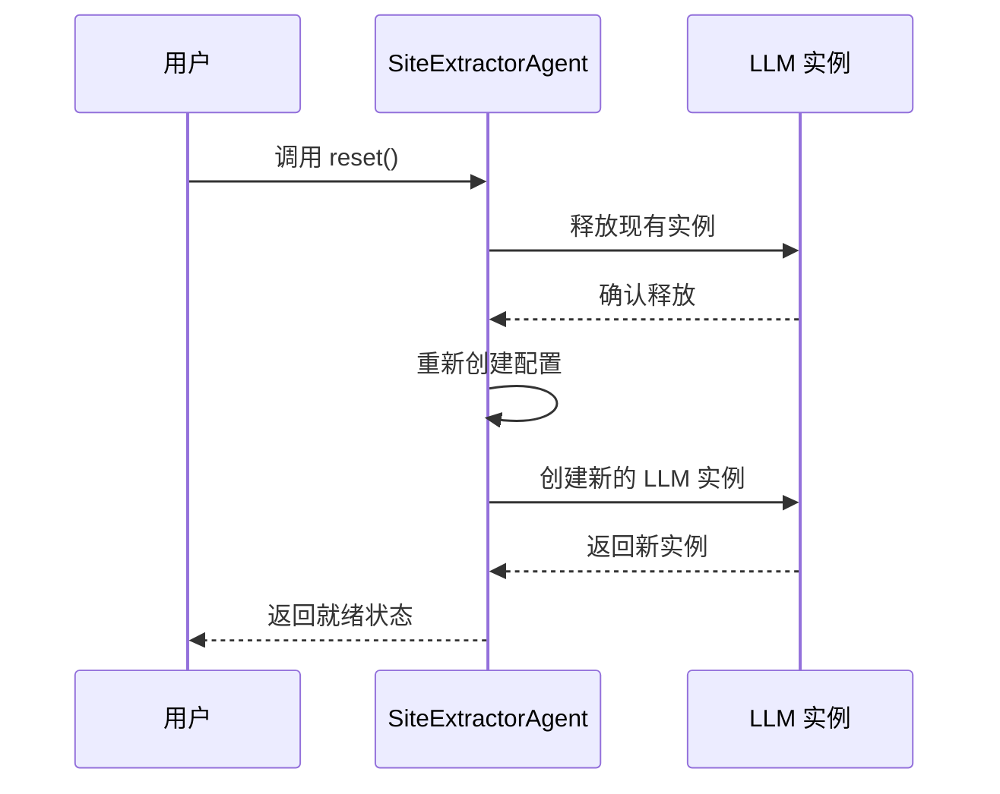
```mermaid
sequenceDiagram
participant User as 用户
participant Agent as SiteExtractorAgent
participant LLM as LLM 实例
User->>Agent : 调用 reset()
Agent->>LLM : 释放现有实例
LLM-->>Agent : 确认释放
Agent->>Agent : 重新创建配置
Agent->>LLM : 创建新的 LLM 实例
LLM-->>Agent : 返回新实例
Agent-->>User : 返回就绪状态
```

**图表来源**
- [src/agents/extractor_agent.py](file://src/agents/extractor_agent.py#L97-L114)

### 配置修复

#### API Key 验证

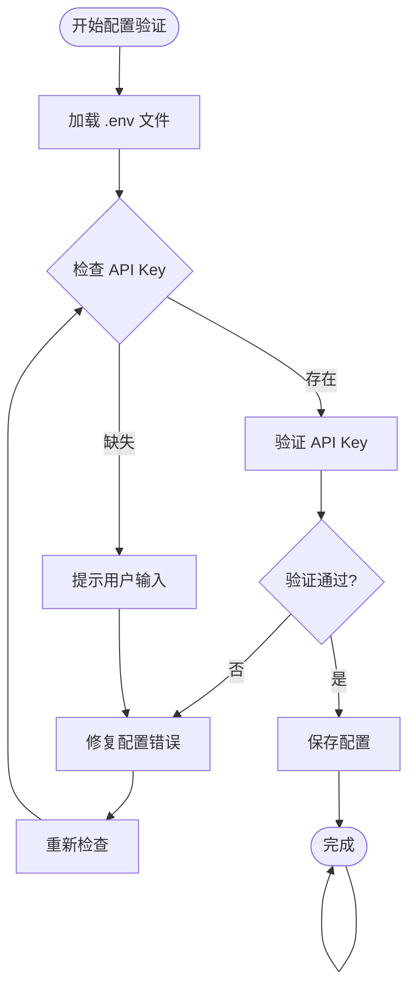
```mermaid
flowchart TD
Start([开始配置验证]) --> LoadEnv["加载 .env 文件"]
LoadEnv --> CheckKeys{"检查 API Key"}
CheckKeys --> |缺失| PromptKey["提示用户输入"]
CheckKeys --> |存在| ValidateKey["验证 API Key"]
ValidateKey --> KeyValid{"验证通过?"}
KeyValid --> |是| SaveConfig["保存配置"]
KeyValid --> |否| FixKey["修复配置错误"]
PromptKey --> FixKey
FixKey --> Recheck["重新检查"]
Recheck --> CheckKeys
SaveConfig --> End([完成])
End --> End
```

**图表来源**
- [src/config/settings.py](file://src/config/settings.py#L9-L55)

#### 模型配置调整

当遇到模型相关错误时，可以：
1. **检查模型名称**：确认模型名称正确
2. **验证模型可用性**：检查提供商处的模型状态
3. **调整模型参数**：修改温度、最大令牌数等参数

**章节来源**
- [src/config/settings.py](file://src/config/settings.py#L21-L42)

### 缓存清理

虽然当前版本没有实现缓存机制，但可以考虑以下清理操作：

#### 临时文件清理

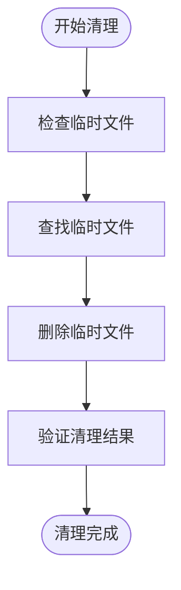
```mermaid
flowchart TD
CleanupStart([开始清理]) --> CheckTemp["检查临时文件"]
CheckTemp --> FindFiles["查找临时文件"]
FindFiles --> DeleteFiles["删除临时文件"]
DeleteFiles --> VerifyCleanup["验证清理结果"]
VerifyCleanup --> CleanupEnd([清理完成])
```

#### 内存清理

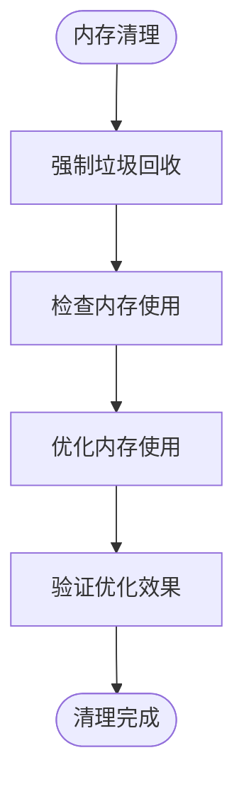
```mermaid
flowchart TD
MemoryStart([内存清理]) --> ForceGC["强制垃圾回收"]
ForceGC --> CheckMemory["检查内存使用"]
CheckMemory --> Optimize["优化内存使用"]
Optimize --> VerifyOptimization["验证优化效果"]
VerifyOptimization --> MemoryEnd([清理完成])
```

## 数据备份与恢复

### 备份策略

由于系统主要处理临时的提取任务，建议采用以下备份策略：

#### 配置备份

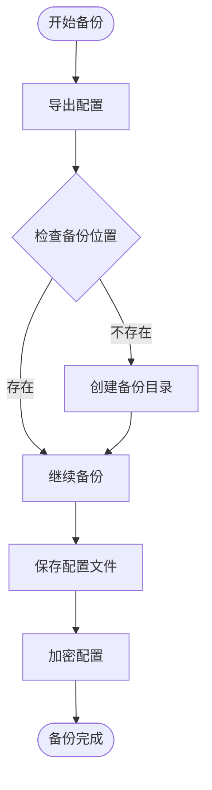
```mermaid
flowchart TD
BackupStart([开始备份]) --> ExportConfig["导出配置"]
ExportConfig --> CheckBackup{"检查备份位置"}
CheckBackup --> |不存在| CreateDir["创建备份目录"]
CheckBackup --> |存在| ContinueBackup["继续备份"]
CreateDir --> ContinueBackup
ContinueBackup --> SaveConfig["保存配置文件"]
SaveConfig --> EncryptConfig["加密配置"]
EncryptConfig --> Complete([备份完成])
```

#### 结果备份

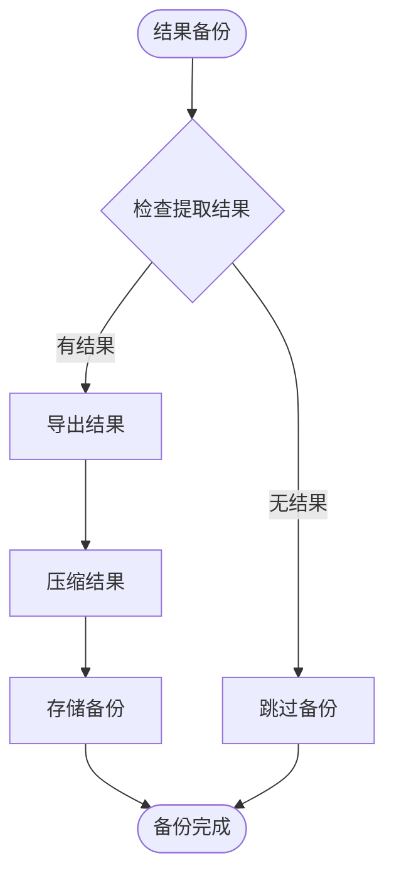
```mermaid
flowchart TD
ResultBackup([结果备份]) --> CheckResults{"检查提取结果"}
CheckResults --> |有结果| ExportResults["导出结果"]
CheckResults --> |无结果| SkipBackup["跳过备份"]
ExportResults --> CompressResults["压缩结果"]
CompressResults --> StoreBackup["存储备份"]
StoreBackup --> Complete([备份完成])
SkipBackup --> Complete
```

### 恢复策略

#### 配置恢复

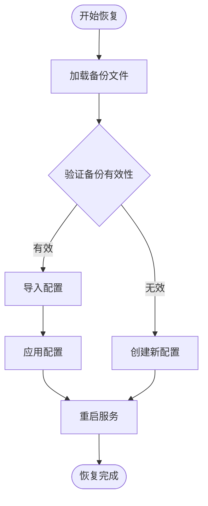
```mermaid
flowchart TD
RestoreStart([开始恢复]) --> LoadBackup["加载备份文件"]
LoadBackup --> ValidateBackup{"验证备份有效性"}
ValidateBackup --> |有效| ImportConfig["导入配置"]
ValidateBackup --> |无效| CreateNew["创建新配置"]
ImportConfig --> ApplyConfig["应用配置"]
ApplyConfig --> RestartServices["重启服务"]
CreateNew --> RestartServices
RestartServices --> RestoreComplete([恢复完成])
```

#### 数据恢复

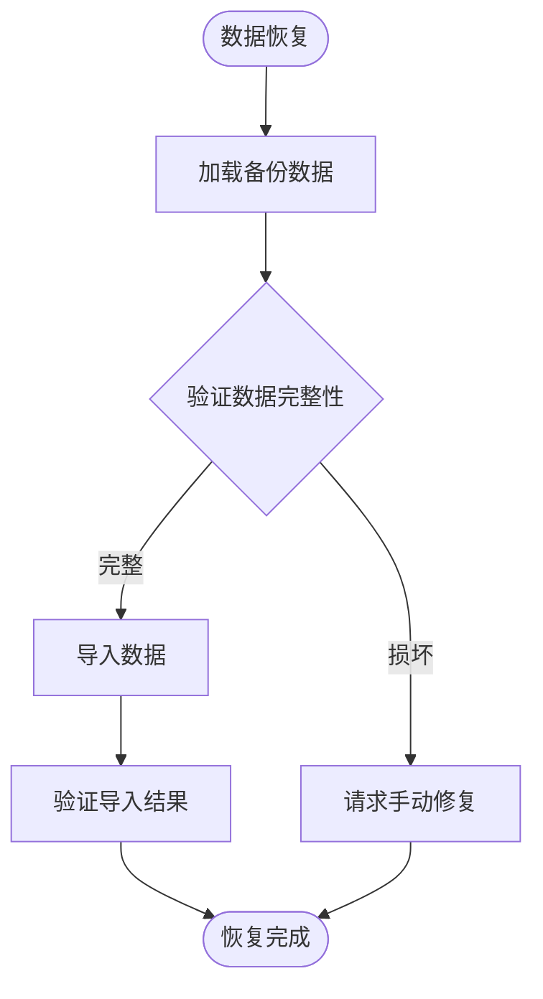
```mermaid
flowchart TD
DataRestore([数据恢复]) --> LoadData["加载备份数据"]
LoadData --> ValidateData{"验证数据完整性"}
ValidateData --> |完整| ImportData["导入数据"]
ValidateData --> |损坏| RequestManual["请求手动修复"]
ImportData --> VerifyData["验证导入结果"]
VerifyData --> RestoreComplete([恢复完成])
RequestManual --> RestoreComplete
```

## 故障排查指南

### 常见错误诊断

#### LLM 提供商错误

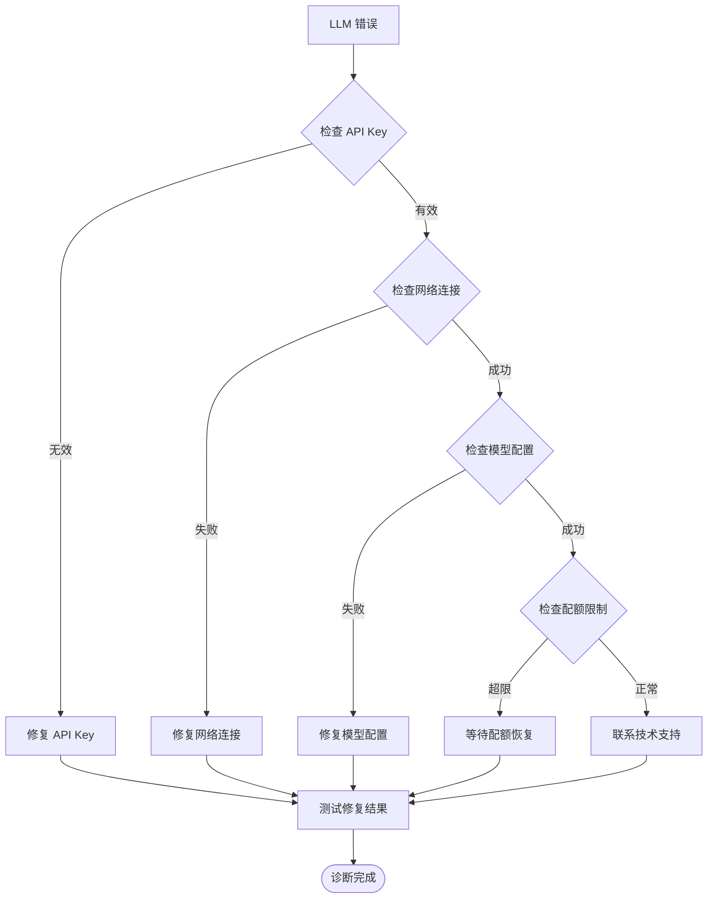
```mermaid
flowchart TD
LLMErrors[LLM 错误] --> CheckAPIKey{"检查 API Key"}
CheckAPIKey --> |无效| FixAPIKey["修复 API Key"]
CheckAPIKey --> |有效| CheckNetwork{"检查网络连接"}
CheckNetwork --> |失败| FixNetwork["修复网络连接"]
CheckNetwork --> |成功| CheckModel{"检查模型配置"}
CheckModel --> |失败| FixModel["修复模型配置"]
CheckModel --> |成功| CheckRateLimit{"检查配额限制"}
CheckRateLimit --> |超限| WaitLimit["等待配额恢复"]
CheckRateLimit --> |正常| ContactSupport["联系技术支持"]
FixAPIKey --> TestFix["测试修复结果"]
FixNetwork --> TestFix
FixModel --> TestFix
WaitLimit --> TestFix
ContactSupport --> TestFix
TestFix --> End([诊断完成])
```

#### 浏览器相关错误

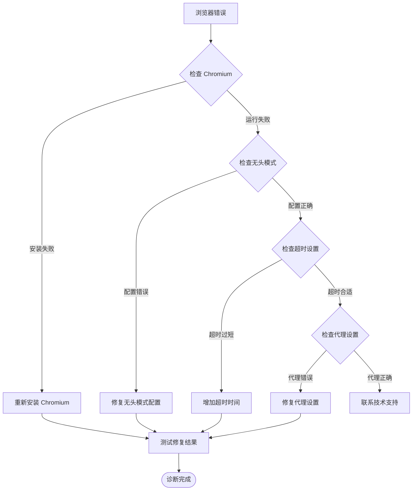
```mermaid
flowchart TD
BrowserErrors[浏览器错误] --> CheckChromium{"检查 Chromium"}
CheckChromium --> |安装失败| InstallChromium["重新安装 Chromium"]
CheckChromium --> |运行失败| CheckHeadless{"检查无头模式"}
CheckHeadless --> |配置错误| FixHeadless["修复无头模式配置"]
CheckHeadless --> |配置正确| CheckTimeout{"检查超时设置"}
CheckTimeout --> |超时过短| IncreaseTimeout["增加超时时间"]
CheckTimeout --> |超时合适| CheckProxy{"检查代理设置"}
CheckProxy --> |代理错误| FixProxy["修复代理设置"]
CheckProxy --> |代理正确| ContactSupport["联系技术支持"]
InstallChromium --> TestFix["测试修复结果"]
FixHeadless --> TestFix
IncreaseTimeout --> TestFix
FixProxy --> TestFix
TestFix --> End([诊断完成])
```

**章节来源**
- [src/main.py](file://src/main.py#L230-L246)
- [src/agents/extractor_agent.py](file://src/agents/extractor_agent.py#L315-L329)

### 调试工具

#### 日志记录

系统提供了详细的日志记录机制：

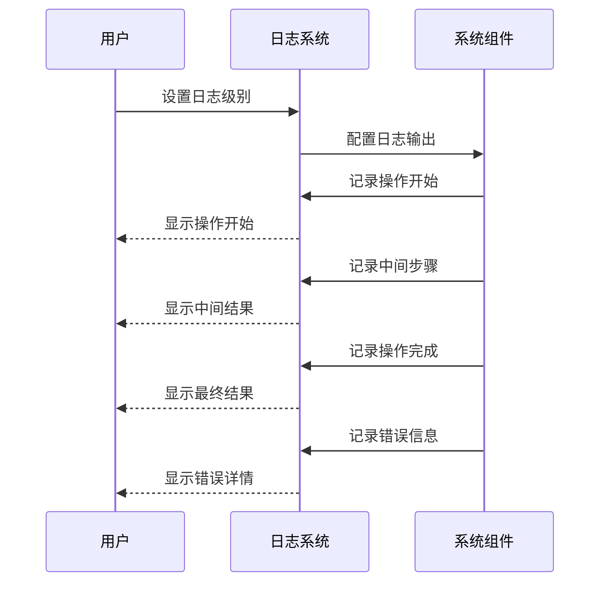
```mermaid
sequenceDiagram
participant User as 用户
participant Logger as 日志系统
participant System as 系统组件
User->>Logger : 设置日志级别
Logger->>System : 配置日志输出
System->>Logger : 记录操作开始
Logger-->>User : 显示操作开始
System->>Logger : 记录中间步骤
Logger-->>User : 显示中间结果
System->>Logger : 记录操作完成
Logger-->>User : 显示最终结果
System->>Logger : 记录错误信息
Logger-->>User : 显示错误详情
```

#### 性能监控

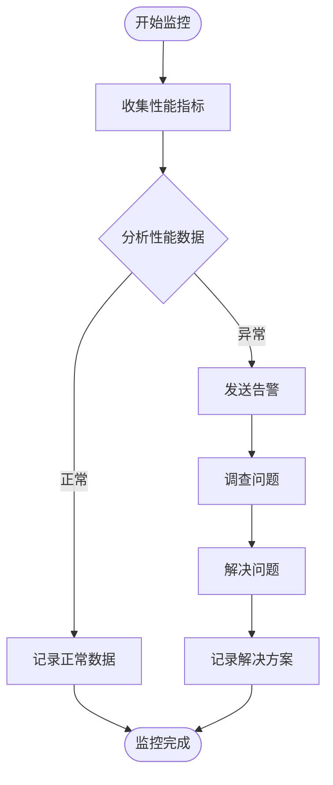
```mermaid
flowchart TD
MonitorStart([开始监控]) --> CollectMetrics["收集性能指标"]
CollectMetrics --> AnalyzeMetrics{"分析性能数据"}
AnalyzeMetrics --> |正常| LogMetrics["记录正常数据"]
AnalyzeMetrics --> |异常| AlertAdmin["发送告警"]
AlertAdmin --> InvestigateIssue["调查问题"]
InvestigateIssue --> ResolveIssue["解决问题"]
ResolveIssue --> LogResolution["记录解决方案"]
LogMetrics --> MonitorEnd([监控完成])
LogResolution --> MonitorEnd
```

**章节来源**
- [src/main.py](file://src/main.py#L1-L254)

## 性能考虑

### 资源管理

#### 内存优化

系统采用了以下内存管理策略：

1. **及时释放资源**：在异步上下文中正确管理浏览器实例
2. **批量处理**：避免同时处理过多的提取任务
3. **缓存策略**：合理使用缓存以减少重复计算

#### 网络优化

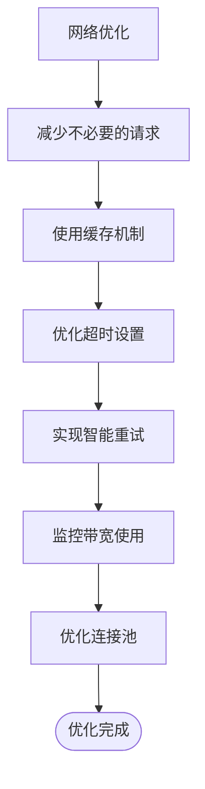
```mermaid
flowchart TD
NetworkOptimization[网络优化] --> ReduceRequests["减少不必要的请求"]
ReduceRequests --> UseCaching["使用缓存机制"]
UseCaching --> OptimizeTimeout["优化超时设置"]
OptimizeTimeout --> ImplementRetry["实现智能重试"]
ImplementRetry --> MonitorBandwidth["监控带宽使用"]
MonitorBandwidth --> OptimizeConnection["优化连接池"]
OptimizeConnection --> Complete([优化完成])
```

### 并发控制

系统通过以下方式控制并发：

1. **异步处理**：使用 asyncio 实现非阻塞操作
2. **信号处理**：正确处理中断信号
3. **资源限制**：避免过度消耗系统资源

**章节来源**
- [src/tools/browser_tool.py](file://src/tools/browser_tool.py#L23-L31)
- [src/main.py](file://src/main.py#L76-L85)

## 结论

Site Info Extractor Agent 的错误恢复和降级策略设计充分考虑了生产环境的稳定性需求。通过多层次的错误处理、自动提供商切换、以及完善的降级机制，系统能够在大部分异常情况下保持基本功能的可用性。

### 关键优势

1. **多提供商支持**：确保在单一提供商故障时能够快速切换
2. **智能错误处理**：区分不同类型的错误并采取相应的恢复措施
3. **降级模式**：在严重故障时提供基础功能保证
4. **完善的诊断工具**：帮助用户快速定位和解决问题

### 建议改进

1. **增强重试机制**：实现指数退避的智能重试策略
2. **添加监控告警**：建立更完善的系统监控和告警机制
3. **实现持久化缓存**：添加本地缓存以提高性能和可靠性
4. **扩展测试覆盖**：增加更多的集成测试和压力测试

通过持续的改进和完善，Site Info Extractor Agent 将能够为用户提供更加稳定可靠的信息提取服务。