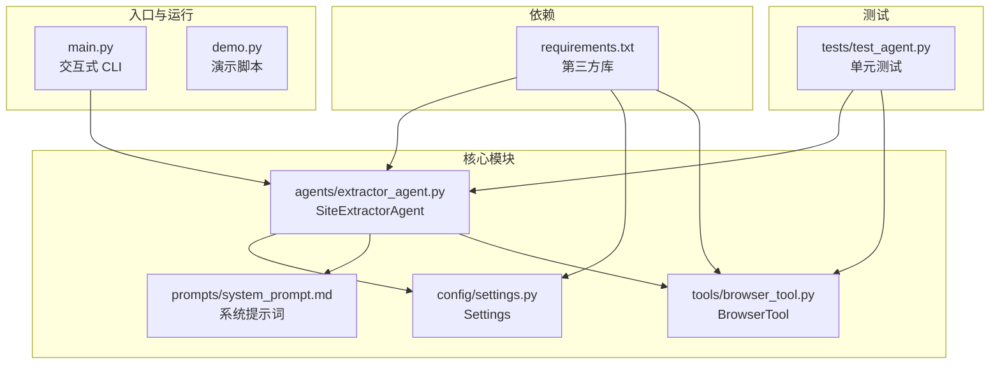
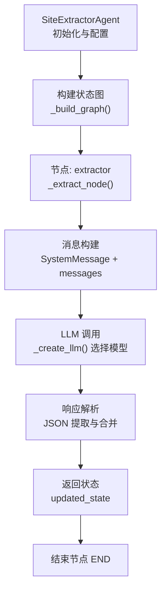
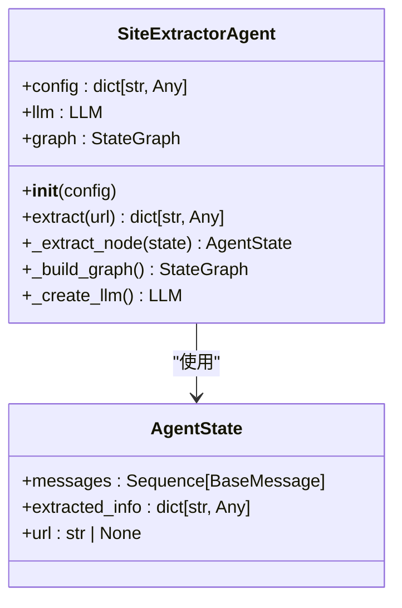
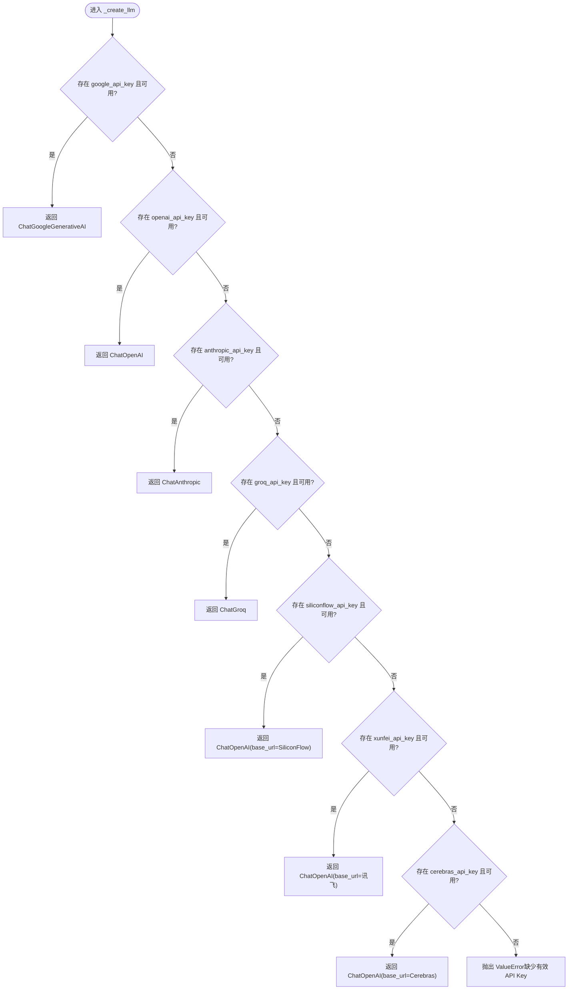
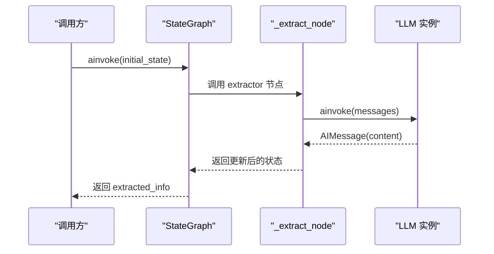
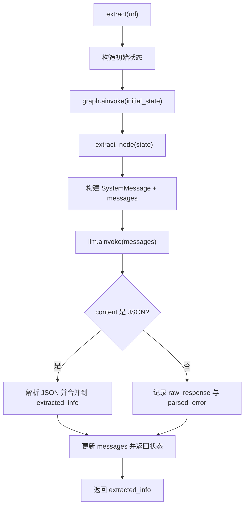
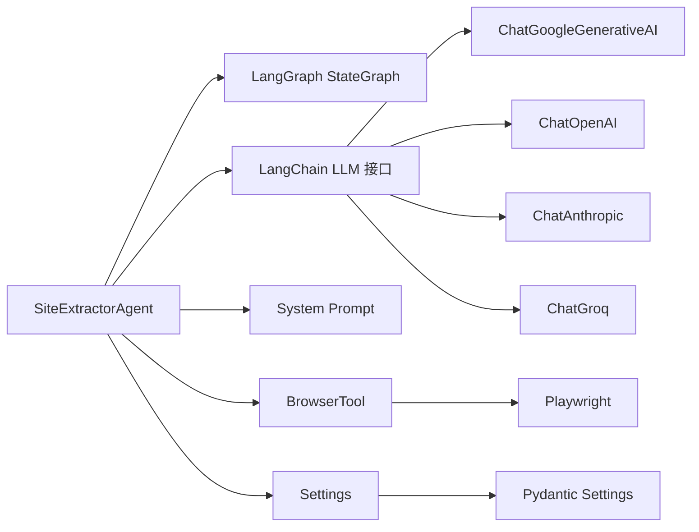

# Agent 核心模块

<cite>
**本文引用的文件**
- [src/agents/extractor_agent.py](file://src/agents/extractor_agent.py)
- [src/config/settings.py](file://src/config/settings.py)
- [src/prompts/system_prompt.md](file://src/prompts/system_prompt.md)
- [src/tools/browser_tool.py](file://src/tools/browser_tool.py)
- [src/main.py](file://src/main.py)
- [src/demo.py](file://src/demo.py)
- [tests/test_agent.py](file://tests/test_agent.py)
- [requirements.txt](file://requirements.txt)
- [README.md](file://README.md)
</cite>

## 目录
1. [简介](#简介)
2. [项目结构](#项目结构)
3. [核心组件](#核心组件)
4. [架构总览](#架构总览)
5. [详细组件分析](#详细组件分析)
6. [依赖分析](#依赖分析)
7. [性能考虑](#性能考虑)
8. [故障排查指南](#故障排查指南)
9. [结论](#结论)
10. [附录](#附录)

## 简介
本文件面向 SiteExtractorAgent 核心模块，系统性阐述其设计理念、实现细节与使用方式。重点覆盖：
- 基于 LangGraph 的状态机式工作流构建
- LLM 模型动态选择与集成策略（Google Gemini、OpenAI、Anthropic、Groq、SiliconFlow、讯飞、Cerebras）
- AgentState 状态结构设计与数据流转
- _create_llm 的优先级与配置逻辑
- _build_graph 的节点与边定义及流程控制
- extract 与 _extract_node 的异步执行流程、消息构建、LLM 调用、响应解析与错误处理
- 公共接口、参数说明与返回值格式

## 项目结构
该项目采用“按职责分层”的组织方式：
- agents：核心 Agent 实现（SiteExtractorAgent）
- config：配置管理（Pydantic Settings）
- prompts：系统提示词（Markdown）
- tools：工具集合（浏览器工具）
- main.py：交互式入口与 CLI
- tests：单元测试
- requirements.txt：依赖清单



图表来源
- [src/agents/extractor_agent.py](file://src/agents/extractor_agent.py#L1-L330)
- [src/config/settings.py](file://src/config/settings.py#L1-L56)
- [src/prompts/system_prompt.md](file://src/prompts/system_prompt.md#L1-L212)
- [src/tools/browser_tool.py](file://src/tools/browser_tool.py#L1-L108)
- [src/main.py](file://src/main.py#L1-L254)
- [src/demo.py](file://src/demo.py#L1-L51)
- [tests/test_agent.py](file://tests/test_agent.py#L1-L80)
- [requirements.txt](file://requirements.txt#L1-L36)

章节来源
- [README.md](file://README.md#L57-L72)
- [requirements.txt](file://requirements.txt#L1-L36)

## 核心组件
- SiteExtractorAgent：基于 LangGraph 的状态机式 Agent，负责构建工作流、选择 LLM、执行提取并管理状态
- AgentState：TypedDict 定义的状态结构，包含 messages、extracted_info、url
- BrowserTool：封装 Playwright 的异步浏览器工具，用于页面抓取与内容获取
- Settings：Pydantic Settings，集中管理 API Key、模型名称、温度、最大令牌数、浏览器模式等配置

章节来源
- [src/agents/extractor_agent.py](file://src/agents/extractor_agent.py#L77-L88)
- [src/agents/extractor_agent.py](file://src/agents/extractor_agent.py#L90-L115)
- [src/tools/browser_tool.py](file://src/tools/browser_tool.py#L10-L43)
- [src/config/settings.py](file://src/config/settings.py#L9-L56)

## 架构总览
SiteExtractorAgent 通过 LangGraph 构建状态图，当前为单节点流程：提取 → 结束。Agent 在初始化时根据配置动态选择 LLM 提供商，并在提取节点中组合系统提示词与历史消息，调用 LLM，解析 JSON 响应，最终返回结构化提取结果。



图表来源
- [src/agents/extractor_agent.py](file://src/agents/extractor_agent.py#L195-L217)
- [src/agents/extractor_agent.py](file://src/agents/extractor_agent.py#L241-L329)
- [src/agents/extractor_agent.py](file://src/agents/extractor_agent.py#L116-L193)

## 详细组件分析

### SiteExtractorAgent 类与 AgentState 设计
- 类职责
  - 初始化：接收配置，创建 LLM 实例，构建并编译 LangGraph
  - 提供异步提取接口：extract(url)
  - 实现提取节点：_extract_node(state)，负责消息构建、LLM 调用、响应解析与状态更新
- AgentState 字段
  - messages：消息历史，支持追加合并
  - extracted_info：提取结果字典，包含 url、状态、原始响应、解析错误等
  - url：目标网站 URL



图表来源
- [src/agents/extractor_agent.py](file://src/agents/extractor_agent.py#L77-L88)
- [src/agents/extractor_agent.py](file://src/agents/extractor_agent.py#L90-L115)
- [src/agents/extractor_agent.py](file://src/agents/extractor_agent.py#L241-L329)

章节来源
- [src/agents/extractor_agent.py](file://src/agents/extractor_agent.py#L77-L88)
- [src/agents/extractor_agent.py](file://src/agents/extractor_agent.py#L90-L115)

### LLM 动态选择与集成策略（_create_llm）
- 优先级顺序：Google Gemini → OpenAI → Anthropic → Groq → SiliconFlow → 讯飞 → Cerebras
- 可用性检测：通过 try/except 动态导入各提供商模块，标记可用性
- OpenAI 兼容链路：SiliconFlow、讯飞、Cerebras 使用 ChatOpenAI，但通过不同的 base_url 实现
- 配置参数：model_name、temperature、api_key（以及 SiliconFlow/讯飞/Cerebras 的 base_url）



图表来源
- [src/agents/extractor_agent.py](file://src/agents/extractor_agent.py#L116-L193)

章节来源
- [src/agents/extractor_agent.py](file://src/agents/extractor_agent.py#L34-L74)
- [src/agents/extractor_agent.py](file://src/agents/extractor_agent.py#L116-L193)

### LangGraph 工作流构建（_build_graph）
- 状态图类型：StateGraph(AgentState)
- 节点：仅一个节点“extractor”，绑定到 _extract_node
- 边：入口点设为“extractor”，执行后直接连接至 END
- 编译：返回已编译的 StateGraph，支持异步调用



图表来源
- [src/agents/extractor_agent.py](file://src/agents/extractor_agent.py#L195-L217)
- [src/agents/extractor_agent.py](file://src/agents/extractor_agent.py#L241-L329)

章节来源
- [src/agents/extractor_agent.py](file://src/agents/extractor_agent.py#L195-L217)

### 异步执行流程：extract 与 _extract_node
- extract(url)
  - 构造初始状态：messages（包含 HumanMessage）、空 extracted_info、url
  - 调用 graph.ainvoke，返回 extracted_info
- _extract_node(state)
  - 消息构建：SystemMessage(System Prompt) + 历史 messages
  - LLM 调用：await llm.ainvoke(messages)
  - 响应解析：
    - 优先从 content 中提取 JSON（支持 ```json ... ``` 或 ``` ... ```）
    - 若解析失败，保留原始 content 并标注 parsed_error
  - 状态更新：追加 LLM 响应到 messages，合并提取结果到 extracted_info
  - 错误处理：捕获异常，构造 AIMessage 错误消息，返回错误状态



图表来源
- [src/agents/extractor_agent.py](file://src/agents/extractor_agent.py#L219-L239)
- [src/agents/extractor_agent.py](file://src/agents/extractor_agent.py#L241-L329)

章节来源
- [src/agents/extractor_agent.py](file://src/agents/extractor_agent.py#L219-L239)
- [src/agents/extractor_agent.py](file://src/agents/extractor_agent.py#L241-L329)

### 系统提示词与输出规范
- 系统提示词强调中文输出、结构化提取、异常处理与输出格式
- 输出格式示例包含 url、标题、描述、主要内容、链接、图片、元数据、联系方式、结构化数据、提取时间、状态等字段

章节来源
- [src/prompts/system_prompt.md](file://src/prompts/system_prompt.md#L109-L146)
- [src/prompts/system_prompt.md](file://src/prompts/system_prompt.md#L150-L186)

### 配置与环境
- Settings 提供 API Key、模型名称、温度、最大令牌数、浏览器模式等配置项
- main.py 从 Settings 读取配置，构建 Agent 并进入交互模式
- requirements.txt 列出 LangChain/LangGraph、LLM 提供商适配包、Playwright、Pydantic 等依赖

章节来源
- [src/config/settings.py](file://src/config/settings.py#L9-L56)
- [src/main.py](file://src/main.py#L48-L181)
- [requirements.txt](file://requirements.txt#L1-L36)

## 依赖分析
- 组件耦合
  - SiteExtractorAgent 依赖 LangGraph（StateGraph）、LangChain LLM 接口、系统提示词文件
  - BrowserTool 与 SiteExtractorAgent 解耦，当前实现中未在 _extract_node 中直接使用
- 外部依赖
  - LLM 提供商适配：langchain-google-genai、langchain-openai、langchain-anthropic、langchain-groq
  - 配置管理：pydantic-settings
  - 浏览览器：playwright
  - CLI 与日志：rich



图表来源
- [src/agents/extractor_agent.py](file://src/agents/extractor_agent.py#L18-L19)
- [src/agents/extractor_agent.py](file://src/agents/extractor_agent.py#L34-L74)
- [src/config/settings.py](file://src/config/settings.py#L9-L56)
- [src/tools/browser_tool.py](file://src/tools/browser_tool.py#L10-L43)

章节来源
- [requirements.txt](file://requirements.txt#L1-L36)
- [src/agents/extractor_agent.py](file://src/agents/extractor_agent.py#L34-L74)

## 性能考虑
- 异步执行：使用 asyncio 与 ainvoke，提升并发与吞吐
- LLM 选择：优先使用本地可用且稳定的提供商（如 Google Gemini），减少网络往返
- 消息管理：使用 Annotated[Sequence[BaseMessage], operator.add]，避免重复拷贝
- 响应解析：先尝试 JSON 提取，失败回退为原始文本，降低解析成本
- 浏览器工具：Playwright 以异步方式启动与关闭，避免阻塞事件循环

[本节为通用建议，不直接分析具体文件]

## 故障排查指南
- 无可用 API Key
  - 现象：初始化 _create_llm 抛出 ValueError
  - 处理：检查 .env 中至少配置一个提供商的 API Key
- LLM 调用失败
  - 现象：_extract_node 捕获异常，返回错误状态
  - 处理：查看 extracted_info["error"]；确认网络、API Key、模型名称与 base_url 正确
- JSON 解析失败
  - 现象：_extract_node 标记 parsed_error，保留 raw_response
  - 处理：检查 LLM 输出格式是否符合系统提示词约定
- 浏览器工具未启动
  - 现象：fetch_page 抛出 RuntimeError
  - 处理：确保使用异步上下文管理器或显式调用 start()

章节来源
- [src/agents/extractor_agent.py](file://src/agents/extractor_agent.py#L187-L193)
- [src/agents/extractor_agent.py](file://src/agents/extractor_agent.py#L315-L329)
- [src/tools/browser_tool.py](file://src/tools/browser_tool.py#L54-L55)

## 结论
SiteExtractorAgent 通过 LangGraph 将提取流程状态化，结合多提供商 LLM 的动态选择与系统提示词，实现了稳定、可扩展的网站信息提取能力。AgentState 的设计保证了消息历史与提取结果的可追踪性；_extract_node 的解析与错误处理增强了鲁棒性。当前版本聚焦于单节点流程，后续可扩展为多节点工作流以支持更复杂的提取策略与工具集成。

[本节为总结性内容，不直接分析具体文件]

## 附录

### 公共接口与参数说明
- SiteExtractorAgent(config)
  - 参数：config（dict），包含 model_name、temperature、max_tokens、各提供商 API Key
  - 作用：初始化 LLM 与状态图
- extract(url)
  - 参数：url（str）
  - 返回：dict[str, Any]，包含提取结果与状态信息
- _extract_node(state)
  - 参数：state（AgentState）
  - 返回：更新后的 AgentState

章节来源
- [src/agents/extractor_agent.py](file://src/agents/extractor_agent.py#L97-L115)
- [src/agents/extractor_agent.py](file://src/agents/extractor_agent.py#L219-L239)
- [src/agents/extractor_agent.py](file://src/agents/extractor_agent.py#L241-L329)

### 使用模式与示例
- 交互式运行
  - 通过 main.py 进入交互模式，自动选择可用模型并逐个输入 URL 进行提取
- 单元测试模式
  - 使用 tests/test_agent.py 中的 Mock 测试验证提取流程
- 演示脚本
  - src/demo.py 展示了直接使用 Google Gemini 的方式，便于理解 LLM 调用与消息格式

章节来源
- [src/main.py](file://src/main.py#L44-L228)
- [tests/test_agent.py](file://tests/test_agent.py#L37-L66)
- [src/demo.py](file://src/demo.py#L28-L47)