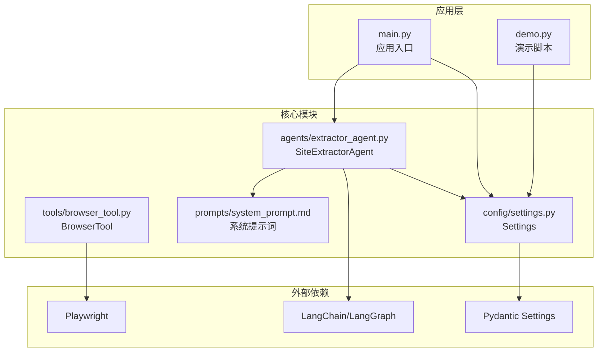
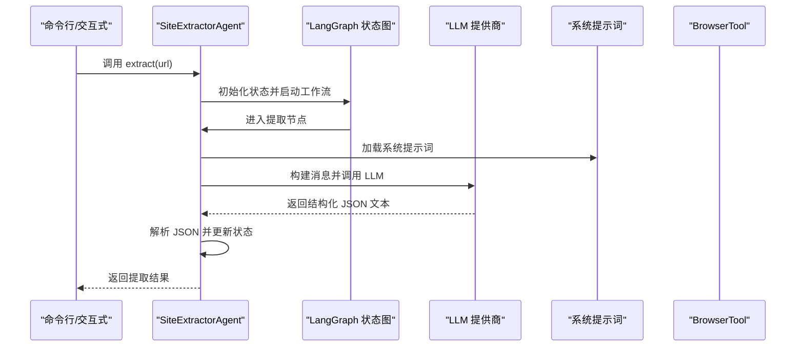
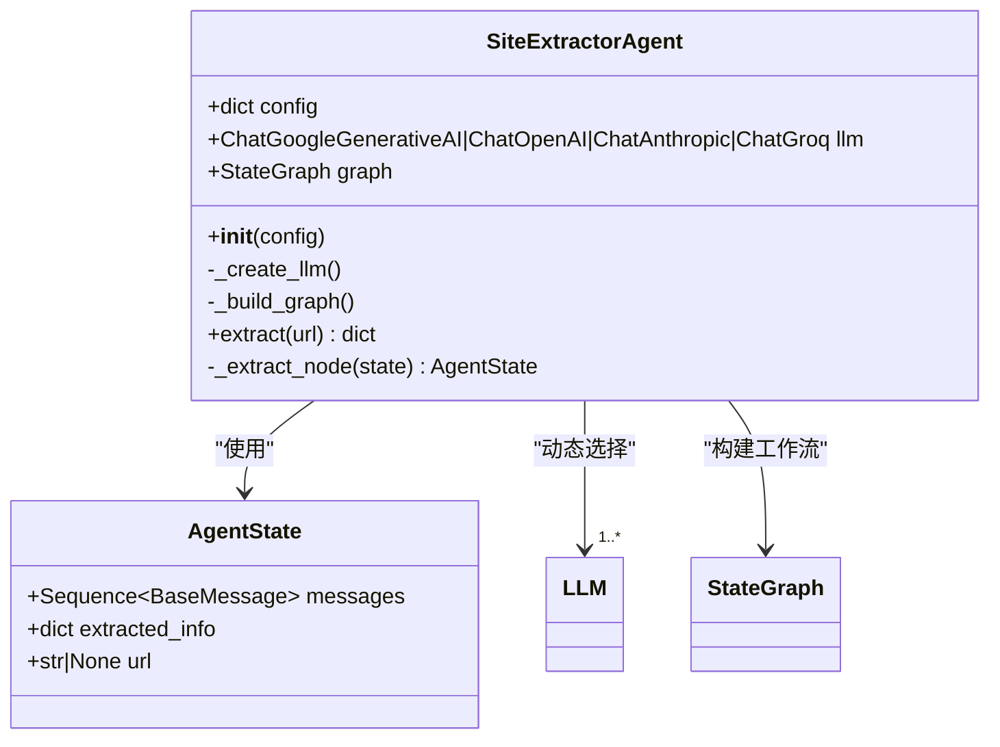
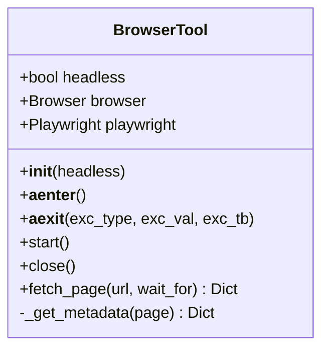
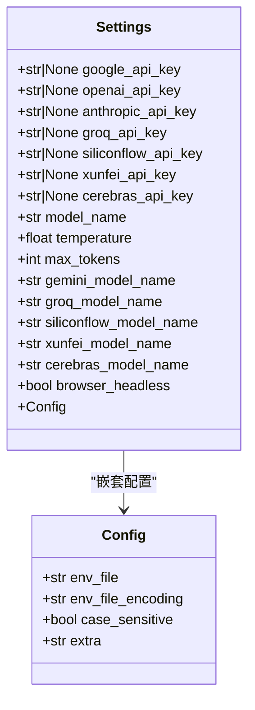
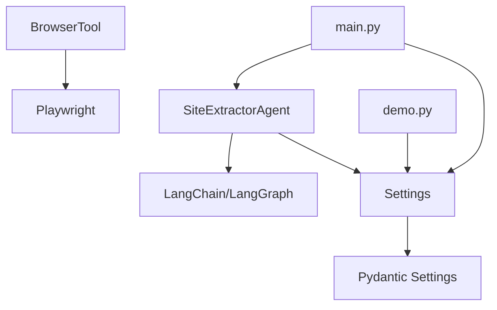
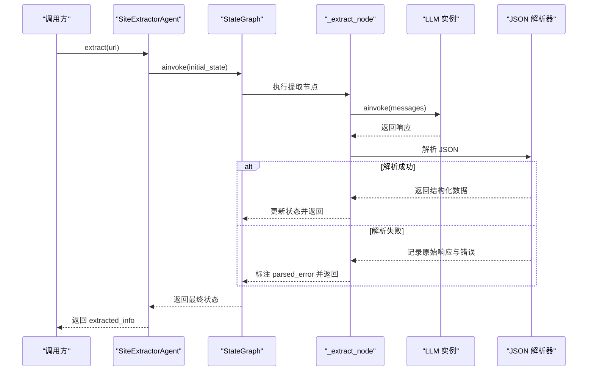

# 核心模块详解

<cite>
**本文档引用的文件**
- [src/agents/extractor_agent.py](file://src/agents/extractor_agent.py)
- [src/tools/browser_tool.py](file://src/tools/browser_tool.py)
- [src/config/settings.py](file://src/config/settings.py)
- [src/prompts/system_prompt.md](file://src/prompts/system_prompt.md)
- [src/main.py](file://src/main.py)
- [src/demo.py](file://src/demo.py)
- [tests/test_agent.py](file://tests/test_agent.py)
- [requirements.txt](file://requirements.txt)
- [README.md](file://README.md)
</cite>

## 目录
1. [简介](#简介)
2. [项目结构](#项目结构)
3. [核心组件](#核心组件)
4. [架构总览](#架构总览)
5. [详细组件分析](#详细组件分析)
6. [依赖关系分析](#依赖关系分析)
7. [性能考虑](#性能考虑)
8. [故障排除指南](#故障排除指南)
9. [结论](#结论)
10. [附录](#附录)

## 简介
本项目是一个基于 LangChain 和 LangGraph 的网站信息提取智能 Agent 系统。本文档深入解析核心模块的设计理念与实现细节，涵盖：
- SiteExtractorAgent 类的 LangGraph 工作流构建、LLM 模型集成策略与状态管理机制
- BrowserTool 类的 Playwright 集成、异步网页访问与错误处理
- Settings 类的配置管理设计（Pydantic 类型验证、环境变量处理、配置验证规则）
- 系统提示词的设计原则与输出格式规范
- 各模块的公共接口、参数说明、返回值格式与集成关系

## 项目结构
项目采用分层模块化设计，核心模块位于 src 目录下：
- agents：包含 SiteExtractorAgent 核心逻辑
- tools：包含 BrowserTool 浏览器工具
- config：包含 Settings 配置管理
- prompts：包含系统提示词模板
- main.py：应用入口与交互式运行
- demo.py：演示脚本
- tests：单元测试



图表来源
- [src/main.py](file://src/main.py#L1-L254)
- [src/agents/extractor_agent.py](file://src/agents/extractor_agent.py#L1-L330)
- [src/tools/browser_tool.py](file://src/tools/browser_tool.py#L1-L108)
- [src/config/settings.py](file://src/config/settings.py#L1-L56)
- [src/prompts/system_prompt.md](file://src/prompts/system_prompt.md#L1-L212)

章节来源
- [README.md](file://README.md#L57-L72)
- [requirements.txt](file://requirements.txt#L1-L36)

## 核心组件
本节概述三个核心组件及其职责：
- SiteExtractorAgent：基于 LangGraph 的状态机式 Agent，负责构建提取工作流、调用 LLM、解析结果与错误处理
- BrowserTool：基于 Playwright 的异步网页访问工具，提供页面内容获取与元数据提取
- Settings：基于 Pydantic 的配置管理类，统一管理 API Key、模型参数与浏览器配置

章节来源
- [src/agents/extractor_agent.py](file://src/agents/extractor_agent.py#L90-L115)
- [src/tools/browser_tool.py](file://src/tools/browser_tool.py#L10-L22)
- [src/config/settings.py](file://src/config/settings.py#L9-L56)

## 架构总览
系统采用“提示词驱动 + LLM 推理 + 工具链”的架构模式：
- 提示词驱动：通过系统提示词定义提取任务、规则与输出格式
- LLM 推理：根据提示词与网页内容进行结构化解析
- 工具链：BrowserTool 提供网页内容，Agent 负责状态流转与结果聚合



图表来源
- [src/agents/extractor_agent.py](file://src/agents/extractor_agent.py#L195-L239)
- [src/prompts/system_prompt.md](file://src/prompts/system_prompt.md#L1-L212)

## 详细组件分析

### SiteExtractorAgent 组件分析
SiteExtractorAgent 是系统的核心控制器，负责：
- 动态选择 LLM 提供商（Google Gemini、OpenAI、Anthropic、Groq、SiliconFlow、讯飞、Cerebras）
- 构建 LangGraph 状态图，实现状态机式工作流
- 在提取节点中整合系统提示词与消息历史，调用 LLM 并解析结果
- 统一错误处理与状态更新



图表来源
- [src/agents/extractor_agent.py](file://src/agents/extractor_agent.py#L77-L115)
- [src/agents/extractor_agent.py](file://src/agents/extractor_agent.py#L195-L239)

实现要点与设计原则：
- LLM 选择策略：按优先级依次尝试 Google Gemini → OpenAI → Anthropic → Groq → SiliconFlow → 讯飞 → Cerebras；若均不可用则抛出异常
- LangGraph 工作流：当前为单节点流程（extractor → END），便于扩展为多节点状态机
- 状态管理：AgentState 包含 messages、extracted_info、url，用于消息历史与提取结果的持久化
- 提示词集成：在提取节点中将系统提示词与历史消息合并后调用 LLM
- 结果解析：优先解析 LLM 返回的 JSON 内容，支持多种标记风格（```json ... ``` 或 ``` ... ```），解析失败时保留原始响应并标注状态

章节来源
- [src/agents/extractor_agent.py](file://src/agents/extractor_agent.py#L97-L194)
- [src/agents/extractor_agent.py](file://src/agents/extractor_agent.py#L195-L217)
- [src/agents/extractor_agent.py](file://src/agents/extractor_agent.py#L219-L329)

#### 提示词与输出格式设计
系统提示词明确了 Agent 的职责、工作流程、提取规则与输出格式规范：
- 职责范围：网页内容理解、信息提取、内容分析、数据结构化
- 语言要求：输出必须使用中文，字段名使用中文，文本内容保持原语言
- 输出格式：JSON 结构，包含 url、标题、描述、主要内容、链接、图片、元数据、联系方式、结构化数据、提取时间、状态等字段
- 异常处理：对页面加载失败、内容为空、编码问题、反爬虫机制提供处理建议

章节来源
- [src/prompts/system_prompt.md](file://src/prompts/system_prompt.md#L1-L212)

#### 使用模式与接口说明
- 初始化：传入包含模型名称、温度、最大令牌数及 API Key 的配置字典
- 提取接口：异步调用 extract(url)，返回包含提取结果的字典
- 返回值：包含 url、状态（success/parsed_error/error）、以及解析后的结构化数据

章节来源
- [src/agents/extractor_agent.py](file://src/agents/extractor_agent.py#L97-L115)
- [src/agents/extractor_agent.py](file://src/agents/extractor_agent.py#L219-L239)

### BrowserTool 组件分析
BrowserTool 封装 Playwright，提供异步网页访问能力：
- 异步生命周期管理：支持 async with 上下文管理器，自动启动与关闭浏览器
- 页面抓取：支持无头/有头模式，等待网络空闲，可选等待特定元素
- 元数据提取：自动抓取 meta 标签（description、keywords、og:*）



图表来源
- [src/tools/browser_tool.py](file://src/tools/browser_tool.py#L10-L108)

实现要点与设计原则：
- 异步上下文管理：通过 __aenter__/__aexit__ 确保资源正确释放
- 页面访问：goto 使用 networkidle 等待策略，保证页面完全加载
- 元数据抓取：针对常见 SEO 元标签进行统一提取，便于后续结构化处理
- 错误处理：在未启动浏览器时抛出明确的运行时错误

章节来源
- [src/tools/browser_tool.py](file://src/tools/browser_tool.py#L13-L43)
- [src/tools/browser_tool.py](file://src/tools/browser_tool.py#L44-L81)
- [src/tools/browser_tool.py](file://src/tools/browser_tool.py#L82-L108)

### Settings 组件分析
Settings 基于 Pydantic Settings 管理应用配置：
- API Key 管理：支持多提供商 API Key（Google、OpenAI、Anthropic、Groq、SiliconFlow、讯飞、Cerebras）
- 模型配置：统一的模型名称、温度、最大令牌数，以及各提供商的默认模型
- 浏览器配置：headless 模式开关
- 环境变量绑定：通过 .env 文件加载，大小写不敏感，忽略额外字段



图表来源
- [src/config/settings.py](file://src/config/settings.py#L9-L56)

实现要点与设计原则：
- 类型安全：Pydantic 类型验证确保配置字段的正确性
- 环境变量：通过 .env 文件加载，支持大小写不敏感匹配
- 扩展性：新增提供商只需在 Settings 中增加对应字段与默认模型

章节来源
- [src/config/settings.py](file://src/config/settings.py#L9-L56)

## 依赖关系分析
系统依赖关系如下：
- LangChain/LangGraph：提供 LLM 集成与状态图工作流
- Playwright：提供异步网页访问能力
- Pydantic Settings：提供类型安全的配置管理
- Rich：提供命令行可视化输出



图表来源
- [requirements.txt](file://requirements.txt#L1-L36)
- [src/main.py](file://src/main.py#L20-L21)
- [src/demo.py](file://src/demo.py#L15-L16)

章节来源
- [requirements.txt](file://requirements.txt#L1-L36)

## 性能考虑
- 异步执行：BrowserTool 与 SiteExtractorAgent 均采用异步实现，提升 I/O 密集场景下的吞吐量
- 资源管理：通过上下文管理器确保 Playwright 资源及时释放，避免内存泄漏
- LLM 选择：优先使用本地/就近的提供商 API，减少网络延迟
- 状态复用：LangGraph 状态图复用消息历史，避免重复计算
- 超时控制：BrowserTool 的等待策略与超时设置平衡加载完整性和响应速度

## 故障排除指南
常见问题与解决方案：
- API Key 未配置：检查 .env 文件是否包含有效 API Key；交互式模式会提示未检测到可用 Key
- LLM 选择失败：确认对应提供商的 API Key 与模型名称正确；Agent 会在无可用 Key 时抛出异常
- 页面加载失败：BrowserTool 默认等待 networkidle，若页面为 SPA，可传入 wait_for 参数等待特定元素
- JSON 解析失败：Agent 会捕获解析异常并保留原始响应与错误信息，便于调试
- 运行时错误：未启动浏览器时调用 fetch_page 会抛出运行时错误，需先调用 start 或使用上下文管理器

章节来源
- [src/main.py](file://src/main.py#L235-L240)
- [src/agents/extractor_agent.py](file://src/agents/extractor_agent.py#L315-L329)
- [src/tools/browser_tool.py](file://src/tools/browser_tool.py#L54-L55)

## 结论
本项目通过 LangGraph 构建状态机式工作流，结合多提供商 LLM 与 Playwright 异步网页访问，实现了稳定高效的网站信息提取系统。Settings 提供类型安全的配置管理，System Prompt 明确输出规范与提取规则。整体架构具备良好的可扩展性与可维护性，适合进一步扩展为多节点复杂工作流。

## 附录

### 使用示例与最佳实践
- 交互式运行：通过命令行启动交互模式，选择模型并输入 URL 进行提取
- 配置管理：在 .env 文件中配置 API Key 与模型参数，Settings 自动加载
- 单元测试：使用 pytest 与 pytest-asyncio 运行测试，覆盖 BrowserTool 与 Agent 的核心功能

章节来源
- [src/main.py](file://src/main.py#L44-L228)
- [tests/test_agent.py](file://tests/test_agent.py#L26-L66)

### 代码级序列图（Agent 提取流程）


图表来源
- [src/agents/extractor_agent.py](file://src/agents/extractor_agent.py#L219-L329)