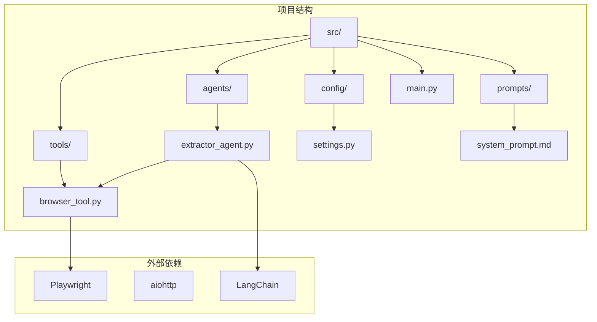
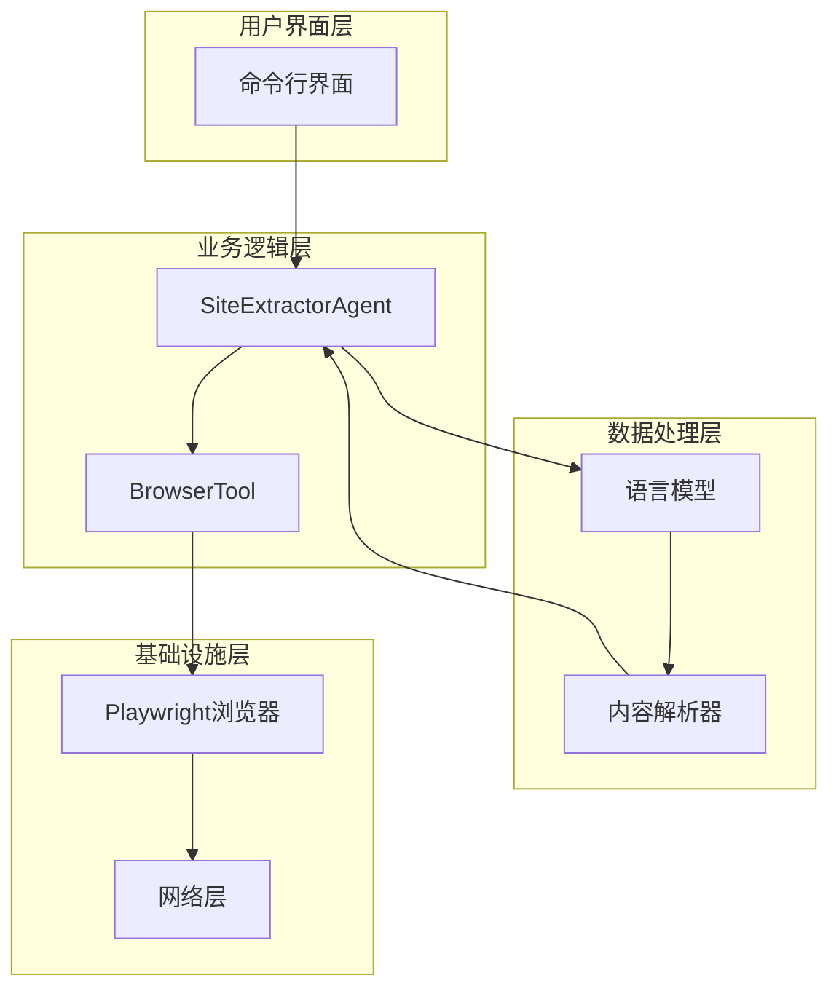
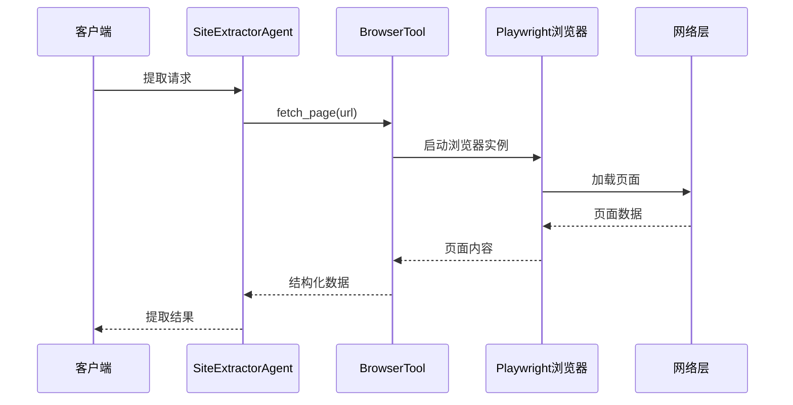
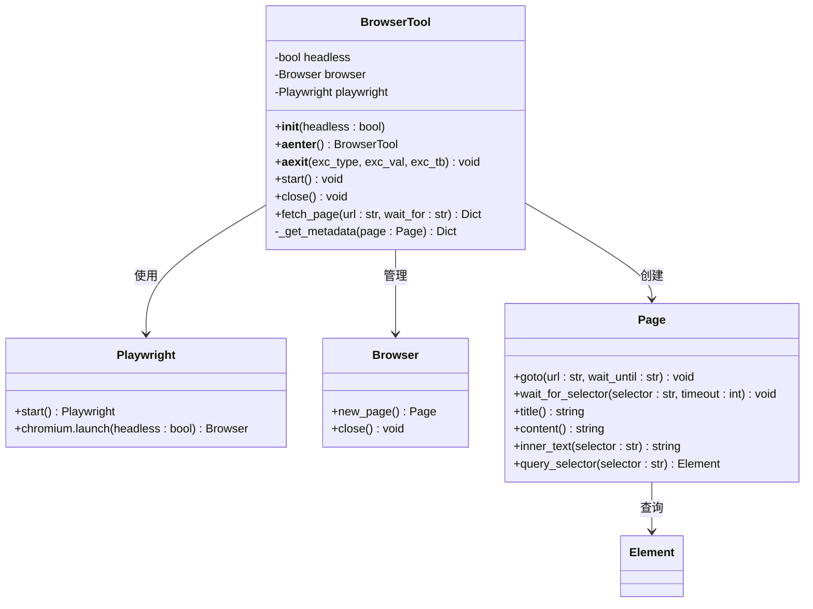
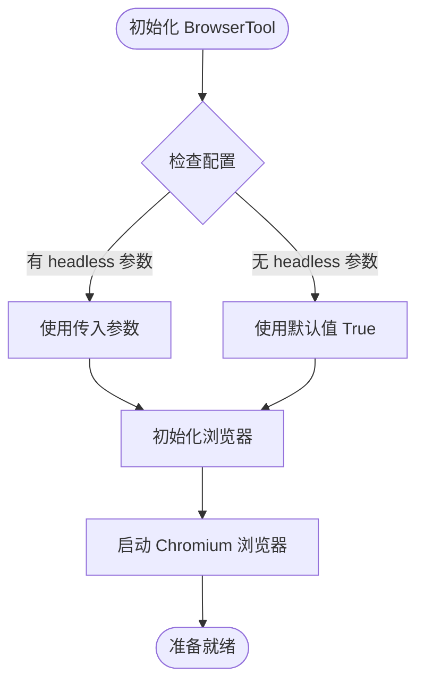
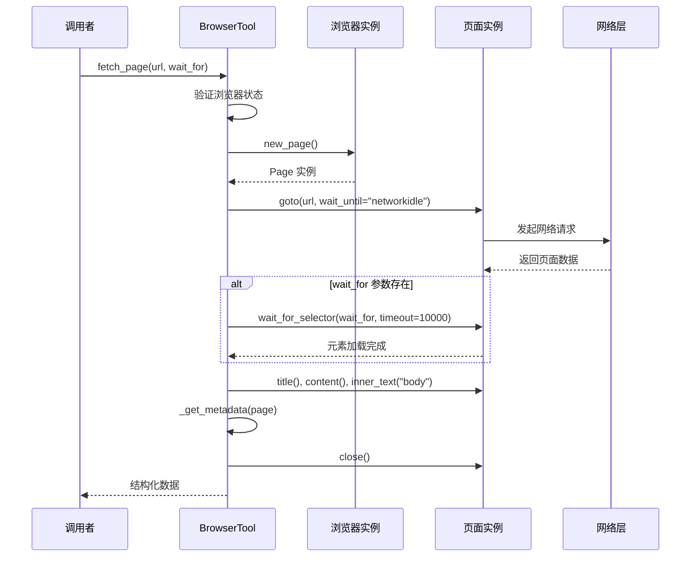
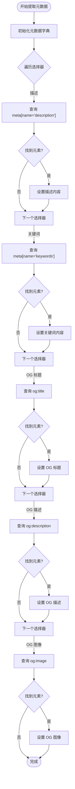
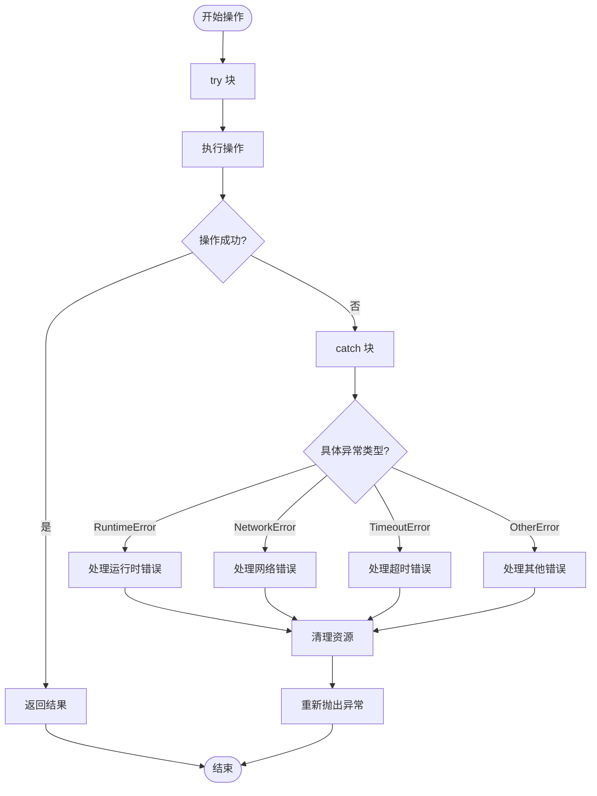
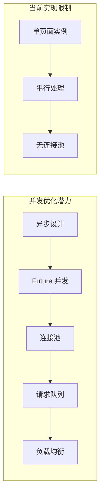
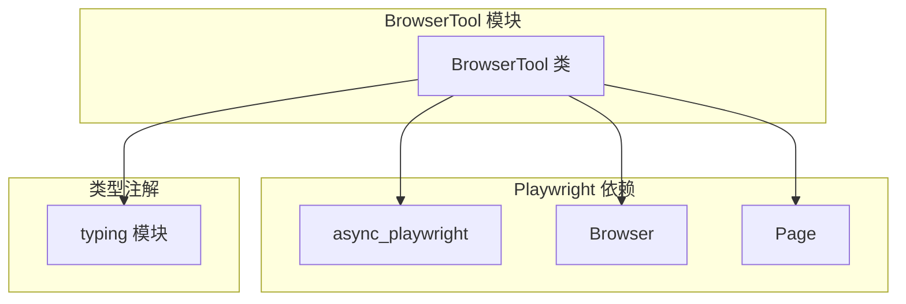

# 浏览器工具模块

<cite>
**本文档引用的文件**
- [browser_tool.py](file://src/tools/browser_tool.py)
- [settings.py](file://src/config/settings.py)
- [extractor_agent.py](file://src/agents/extractor_agent.py)
- [main.py](file://src/main.py)
- [requirements.txt](file://requirements.txt)
- [system_prompt.md](file://src/prompts/system_prompt.md)
- [test_agent.py](file://tests/test_agent.py)
</cite>

## 目录
1. [简介](#简介)
2. [项目结构](#项目结构)
3. [核心组件](#核心组件)
4. [架构概览](#架构概览)
5. [详细组件分析](#详细组件分析)
6. [依赖关系分析](#依赖关系分析)
7. [性能考虑](#性能考虑)
8. [故障排除指南](#故障排除指南)
9. [结论](#结论)
10. [附录](#附录)

## 简介

BrowserTool 是一个基于 Playwright 的浏览器工具模块，专门用于网页内容的异步访问和信息提取。该模块提供了完整的浏览器生命周期管理、页面内容获取、元数据提取和错误处理机制。通过异步编程模式，BrowserTool 能够高效地处理多个并发的网页访问任务，为网站信息提取系统提供强大的前端渲染能力。

该模块的设计遵循现代异步编程最佳实践，支持无头模式运行，具备良好的可扩展性和稳定性。通过与 LangChain 生态系统的深度集成，BrowserTool 成为了整个网站信息提取 Agent 的核心基础设施。

## 项目结构

项目采用模块化设计，BrowserTool 作为独立的工具模块位于 `src/tools/` 目录下，与其他核心组件协同工作：



**图表来源**
- [browser_tool.py](file://src/tools/browser_tool.py#L1-L108)
- [extractor_agent.py](file://src/agents/extractor_agent.py#L1-L330)

**章节来源**
- [browser_tool.py](file://src/tools/browser_tool.py#L1-L108)
- [settings.py](file://src/config/settings.py#L1-L56)

## 核心组件

BrowserTool 模块的核心是 BrowserTool 类，它提供了完整的浏览器操作能力：

### 主要特性
- **异步浏览器管理**：支持完整的浏览器生命周期管理
- **页面内容提取**：获取页面标题、内容、文本和元数据
- **元数据识别**：自动提取常见的 SEO 元数据
- **错误处理**：完善的异常处理和资源清理机制
- **配置灵活**：支持无头模式和自定义配置

### 关键接口
- `__init__(headless: bool)`：初始化浏览器工具
- `start()`：启动浏览器实例
- `close()`：关闭浏览器实例
- `fetch_page(url: str, wait_for: Optional[str])`：获取页面内容
- `__aenter__()` 和 `__aexit__()`：异步上下文管理器支持

**章节来源**
- [browser_tool.py](file://src/tools/browser_tool.py#L10-L108)

## 架构概览

BrowserTool 在整个系统架构中扮演着关键角色，作为底层基础设施为上层 Agent 提供网页访问能力：



**图表来源**
- [extractor_agent.py](file://src/agents/extractor_agent.py#L90-L330)
- [browser_tool.py](file://src/tools/browser_tool.py#L10-L108)

### 组件交互流程



**图表来源**
- [extractor_agent.py](file://src/agents/extractor_agent.py#L219-L239)
- [browser_tool.py](file://src/tools/browser_tool.py#L44-L80)

## 详细组件分析

### BrowserTool 类设计

BrowserTool 类采用了面向对象的设计模式，提供了清晰的接口和完整的生命周期管理：



**图表来源**
- [browser_tool.py](file://src/tools/browser_tool.py#L10-L108)

### 浏览器初始化配置

BrowserTool 支持灵活的初始化配置，主要参数包括：

#### 基本配置参数
- **headless (bool)**：控制是否使用无头模式运行浏览器
  - 默认值：`True`
  - 影响：无头模式更节省资源，适合服务器环境
  - 适用场景：生产环境、CI/CD 流水线

#### 配置继承机制
BrowserTool 通过配置继承与系统设置集成：



**图表来源**
- [browser_tool.py](file://src/tools/browser_tool.py#L13-L35)
- [settings.py](file://src/config/settings.py#L43-L44)

**章节来源**
- [browser_tool.py](file://src/tools/browser_tool.py#L13-L35)
- [settings.py](file://src/config/settings.py#L43-L44)

### 异步网页访问流程

BrowserTool 的网页访问采用了完整的异步编程模式，确保高效的并发处理能力：

#### 页面访问序列图



**图表来源**
- [browser_tool.py](file://src/tools/browser_tool.py#L44-L80)

#### 关键处理步骤

1. **URL 验证**：检查浏览器实例状态，确保正确初始化
2. **页面加载**：使用 `wait_until="networkidle"` 等待网络空闲
3. **元素等待**：可选的元素选择器等待机制
4. **内容提取**：获取页面标题、HTML 内容和纯文本
5. **元数据收集**：自动提取 SEO 相关的元数据
6. **资源清理**：确保页面实例正确关闭

**章节来源**
- [browser_tool.py](file://src/tools/browser_tool.py#L44-L80)

### 元数据提取机制

BrowserTool 实现了智能的元数据提取功能，能够自动识别和提取常见的 SEO 元数据：

#### 支持的元数据类型

| 元数据类型 | CSS 选择器 | 用途 |
|-----------|-----------|------|
| 页面描述 | `meta[name="description"]` | SEO 描述 |
| 关键词 | `meta[name="keywords"]` | SEO 关键词 |
| Open Graph 标题 | `meta[property="og:title"]` | 社交分享标题 |
| Open Graph 描述 | `meta[property="og:description"]` | 社交分享描述 |
| Open Graph 图像 | `meta[property="og:image"]` | 社交分享图像 |

#### 元数据提取流程



**图表来源**
- [browser_tool.py](file://src/tools/browser_tool.py#L82-L107)

**章节来源**
- [browser_tool.py](file://src/tools/browser_tool.py#L82-L107)

### 错误处理策略

BrowserTool 实现了多层次的错误处理机制，确保系统的稳定性和可靠性：

#### 异常处理层次



**图表来源**
- [browser_tool.py](file://src/tools/browser_tool.py#L54-L80)

#### 主要错误类型及处理

1. **浏览器未启动错误**：当直接调用 `fetch_page` 而未启动浏览器时
2. **网络连接错误**：页面加载过程中出现的网络异常
3. **超时错误**：页面加载或元素等待超时
4. **资源清理错误**：浏览器实例关闭时的异常

**章节来源**
- [browser_tool.py](file://src/tools/browser_tool.py#L54-L80)

### 性能优化机制

BrowserTool 采用了多项性能优化策略，确保高效的网页访问能力：

#### 资源管理优化

1. **异步上下文管理**：自动管理浏览器生命周期
2. **页面实例复用**：每个 URL 请求使用独立的页面实例
3. **及时资源清理**：确保页面关闭和浏览器释放

#### 并发处理能力

虽然当前实现为单页面访问，但 BrowserTool 的异步设计为未来的并发优化奠定了基础：



**章节来源**
- [browser_tool.py](file://src/tools/browser_tool.py#L23-L42)

## 依赖关系分析

BrowserTool 模块的依赖关系相对简洁，主要依赖于 Playwright 异步 API：



**图表来源**
- [browser_tool.py](file://src/tools/browser_tool.py#L6-L7)

### 外部依赖分析

根据 requirements.txt 文件，BrowserTool 主要依赖关系如下：

| 依赖包 | 版本要求 | 用途 |
|--------|----------|------|
| playwright | >=1.48.0 | 浏览器自动化 |
| typing-extensions | >=4.9.0 | 类型注解支持 |
| aiohttp | >=3.9.0 | 异步 HTTP 客户端 |

**章节来源**
- [requirements.txt](file://requirements.txt#L17-L25)

## 性能考虑

BrowserTool 在设计时充分考虑了性能因素，特别是在异步编程和资源管理方面：

### 异步编程优势

1. **非阻塞 I/O**：避免了传统同步模式下的阻塞问题
2. **高并发处理**：能够同时处理多个网页访问请求
3. **内存效率**：异步模式下的内存使用更加高效

### 资源管理策略

1. **及时清理**：每个页面访问后立即关闭页面实例
2. **异常安全**：使用 finally 块确保资源清理
3. **生命周期管理**：通过上下文管理器自动管理浏览器实例

### 性能优化建议

1. **连接复用**：考虑实现浏览器实例的复用机制
2. **缓存策略**：为频繁访问的页面实现缓存机制
3. **并发控制**：限制同时运行的浏览器实例数量
4. **超时配置**：根据网络环境调整超时参数

## 故障排除指南

### 常见问题及解决方案

#### 浏览器启动失败

**症状**：初始化 BrowserTool 时抛出异常
**原因**：
- Playwright 未正确安装
- Chromium 浏览器不可用
- 权限不足

**解决方案**：
1. 确保已安装 Playwright 浏览器
2. 检查系统权限
3. 验证环境变量配置

#### 页面加载超时

**症状**：fetch_page 方法抛出超时异常
**原因**：
- 网络连接缓慢
- 目标网站响应慢
- 等待条件过于严格

**解决方案**：
1. 调整等待超时时间
2. 检查网络连接质量
3. 优化等待条件

#### 元数据提取失败

**症状**：元数据字典为空或不完整
**原因**：
- 目标页面缺少相应的 meta 标签
- CSS 选择器匹配失败
- 页面结构变化

**解决方案**：
1. 检查目标页面的 HTML 结构
2. 更新 CSS 选择器
3. 实现降级策略

**章节来源**
- [browser_tool.py](file://src/tools/browser_tool.py#L54-L80)

## 结论

BrowserTool 模块作为一个基于 Playwright 的异步浏览器工具，为网站信息提取系统提供了强大而可靠的基础设施。其设计特点包括：

1. **异步架构**：完全基于异步编程模式，支持高效的并发处理
2. **资源管理**：完善的生命周期管理和资源清理机制
3. **错误处理**：多层次的异常处理和恢复策略
4. **配置灵活**：支持无头模式和自定义配置选项
5. **易于集成**：与 LangChain 生态系统无缝集成

该模块的成功实施为整个网站信息提取 Agent 提供了坚实的基础，使得复杂的网页内容提取任务变得简单而可靠。随着系统的进一步发展，BrowserTool 可以通过增加连接池、缓存机制和并发控制等特性来进一步提升性能和稳定性。

## 附录

### 使用示例

#### 基本使用模式

```python
# 方式1：使用上下文管理器
async with BrowserTool(headless=True) as browser:
    result = await browser.fetch_page("https://example.com")

# 方式2：手动管理生命周期
browser = BrowserTool(headless=True)
await browser.start()
try:
    result = await browser.fetch_page("https://example.com")
finally:
    await browser.close()
```

#### 高级配置示例

```python
# 配置无头模式
browser = BrowserTool(headless=True)

# 配置有头模式（调试用）
browser = BrowserTool(headless=False)

# 获取页面内容并等待特定元素
result = await browser.fetch_page(
    url="https://example.com",
    wait_for=".content-wrapper"
)
```

### 最佳实践

1. **始终使用上下文管理器**：确保资源正确清理
2. **合理设置超时时间**：平衡响应速度和成功率
3. **处理异常情况**：实现完善的错误处理机制
4. **监控资源使用**：定期检查内存和 CPU 使用情况
5. **测试不同场景**：验证在各种网络和页面条件下的表现

### 配置参考

| 配置项 | 类型 | 默认值 | 说明 |
|--------|------|--------|------|
| headless | bool | True | 是否使用无头模式 |
| wait_for | str | None | 等待的元素选择器 |
| timeout | int | 10000 | 等待超时时间（毫秒） |