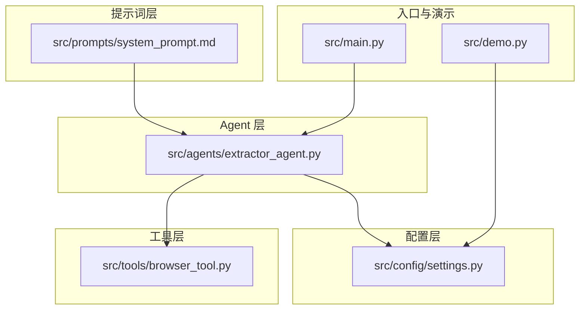
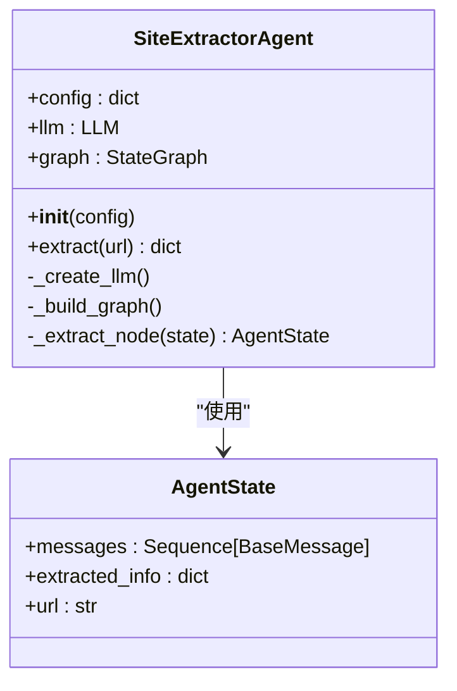
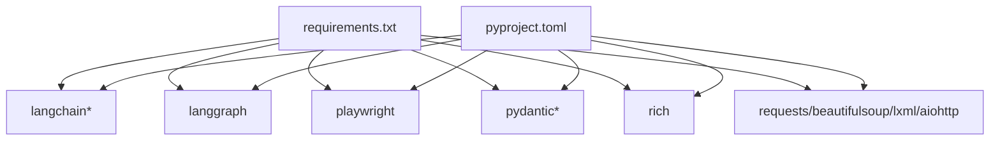

# 系统提示词管理

<cite>
**本文引用的文件**
- [src/prompts/system_prompt.md](file://src/prompts/system_prompt.md)
- [src/agents/extractor_agent.py](file://src/agents/extractor_agent.py)
- [src/main.py](file://src/main.py)
- [src/config/settings.py](file://src/config/settings.py)
- [src/tools/browser_tool.py](file://src/tools/browser_tool.py)
- [README.md](file://README.md)
- [requirements.txt](file://requirements.txt)
- [pyproject.toml](file://pyproject.toml)
- [tests/test_agent.py](file://tests/test_agent.py)
- [src/demo.py](file://src/demo.py)
</cite>

## 目录
1. [简介](#简介)
2. [项目结构](#项目结构)
3. [核心组件](#核心组件)
4. [架构总览](#架构总览)
5. [详细组件分析](#详细组件分析)
6. [依赖分析](#依赖分析)
7. [性能考虑](#性能考虑)
8. [故障排查指南](#故障排查指南)
9. [结论](#结论)
10. [附录](#附录)

## 简介
本技术文档围绕“系统提示词管理”展开，聚焦于系统提示词的设计原则、实现机制与集成方式，涵盖提示词模板结构、内容规范与格式要求；说明提示词对 LLM 的作用与影响（指导理解提取任务、规范输出格式、提升提取准确性）；阐述版本管理与维护策略（内容更新、向后兼容性、迁移方案）；解释提示词与 Agent 的集成（动态加载、参数注入、上下文传递）；明确输出格式规范（JSON 结构、字段定义、数据类型约束与验证规则）；并提供提示词优化指南（按网站类型调整策略、处理特殊内容格式、提高提取质量），最后给出具体示例与使用场景。

## 项目结构
该项目采用模块化设计，核心围绕“提示词 + Agent + 工具 + 配置”的分层组织：
- 提示词层：位于 src/prompts/system_prompt.md，集中管理系统提示词与输出规范
- Agent 层：位于 src/agents/extractor_agent.py，负责动态加载 LLM、构建 LangGraph 工作流、执行提取
- 工具层：位于 src/tools/browser_tool.py，封装 Playwright 进行网页访问与内容获取
- 配置层：位于 src/config/settings.py，通过 Pydantic Settings 管理 API Key、模型与运行参数
- 入口与演示：位于 src/main.py、src/demo.py，提供交互式 CLI 与简单调用示例
- 文档与依赖：README.md、requirements.txt、pyproject.toml



图表来源
- [src/prompts/system_prompt.md](file://src/prompts/system_prompt.md#L1-L212)
- [src/agents/extractor_agent.py](file://src/agents/extractor_agent.py#L1-L330)
- [src/tools/browser_tool.py](file://src/tools/browser_tool.py#L1-L108)
- [src/config/settings.py](file://src/config/settings.py#L1-L56)
- [src/main.py](file://src/main.py#L1-L254)
- [src/demo.py](file://src/demo.py#L1-L51)

章节来源
- [README.md](file://README.md#L57-L72)
- [requirements.txt](file://requirements.txt#L1-L36)
- [pyproject.toml](file://pyproject.toml#L1-L75)

## 核心组件
- 系统提示词：集中于 Markdown 文件，定义 Agent 的职责、工作流程、提取规则、异常处理、输出格式与示例，以及语言与合规要求
- SiteExtractorAgent：基于 LangGraph 的状态机式 Agent，负责动态加载 LLM、构建工作流、执行提取、解析 JSON 输出、处理异常
- BrowserTool：封装 Playwright，提供异步浏览器能力，用于页面访问、内容抓取与元数据提取
- Settings：Pydantic Settings，集中管理 API Key、模型名称、温度、最大令牌数、浏览器模式等配置
- 入口与演示：CLI 交互模式与简单 LLM 调用示例，展示提示词与配置的集成方式

章节来源
- [src/prompts/system_prompt.md](file://src/prompts/system_prompt.md#L1-L212)
- [src/agents/extractor_agent.py](file://src/agents/extractor_agent.py#L1-L330)
- [src/tools/browser_tool.py](file://src/tools/browser_tool.py#L1-L108)
- [src/config/settings.py](file://src/config/settings.py#L1-L56)
- [src/main.py](file://src/main.py#L1-L254)
- [src/demo.py](file://src/demo.py#L1-L51)

## 架构总览
系统提示词通过 SiteExtractorAgent 在运行时动态加载，并作为 SystemMessage 注入到 LLM 的消息序列中，指导 LLM 完成网页信息提取任务。Agent 以 LangGraph 状态机驱动，单节点流程“提取 → 结束”，在提取节点中构建消息列表（System + 历史消息），调用 LLM，解析 JSON 输出，处理异常并返回结构化结果。

```mermaid
sequenceDiagram
participant U as "用户"
participant M as "入口(main.py)"
participant A as "Agent(extractor_agent.py)"
participant S as "系统提示词(system_prompt.md)"
participant L as "LLM(多提供商)"
participant B as "浏览器工具(browser_tool.py)"
U->>M : "输入URL"
M->>A : "extract(url)"
A->>A : "构建初始状态<br/>messages=[HumanMessage]"
A->>S : "读取系统提示词"
A->>A : "messages=[SystemMessage(SYSTEM_PROMPT)] + 历史消息"
A->>L : "ainvoke(messages)"
L-->>A : "AIMessage(JSON字符串/纯文本)"
A->>A : "解析JSON(支持
```json...```或```...```)"
    A->>A: "更新extracted_info并返回"
    A-->>M: "返回结构化结果"
    M-->>U: "打印JSON结果"
```

图表来源
- [src/agents/extractor_agent.py](file://src/agents/extractor_agent.py#L219-L330)
- [src/prompts/system_prompt.md](file://src/prompts/system_prompt.md#L1-L212)
- [src/main.py](file://src/main.py#L209-L212)

## 详细组件分析

### 系统提示词设计与实现
- 设计原则
  - 明确职责边界：网页内容理解、信息提取、内容分析、数据结构化
  - 语言与合规：强制中文输出、字段名中文、错误信息中文、遵守法律法规
  - 工作流程：接收任务 → 页面访问 → 内容提取 → 信息整理 → 结果输出
  - 提取规则：必须提取与可选提取清单，质量要求（准确性、完整性、一致性、可读性）
  - 异常处理：页面加载失败、内容为空、编码问题、反爬虫机制
  - 输出格式：严格 JSON 结构，字段名与值的中文要求，示例与注释
- 实现机制
  - 动态加载：Agent 在初始化时读取提示词文件，若不存在则回退为默认提示
  - 上下文注入：在提取节点中将 SYSTEM_PROMPT 组合为 SystemMessage，与历史消息一起传给 LLM
  - 输出解析：Agent 支持从 LLM 响应中提取 JSON 片段（```json...``` 或 ```...```），并进行 JSON 解析；解析失败时保留原始响应与错误信息
- 影响与作用
  - 指导 LLM 正确理解提取任务：职责、流程、规则、异常处理
  - 规范输出格式：严格的 JSON 结构与字段定义，减少歧义
  - 提高提取准确性：通过质量要求与异常处理策略降低错误率

章节来源
- [src/prompts/system_prompt.md](file://src/prompts/system_prompt.md#L1-L212)
- [src/agents/extractor_agent.py](file://src/agents/extractor_agent.py#L29-L31)
- [src/agents/extractor_agent.py](file://src/agents/extractor_agent.py#L256-L330)

### SiteExtractorAgent：提示词集成与执行流程
- 动态加载与提供商选择
  - 优先级：Google Gemini → OpenAI → Anthropic → Groq → SiliconFlow → 讯飞 → Cerebras
  - 通过 try/except 动态导入各提供商，标记可用性状态，按配置选择实例
- LangGraph 工作流
  - 单节点流程：extractor → END
  - 状态结构：messages、extracted_info、url
- 提取节点逻辑
  - 构建消息列表：SystemMessage(SYSTEM_PROMPT) + 历史消息
  - 调用 LLM：ainvoke
  - JSON 解析：支持多种包裹形式，解析失败记录错误
  - 异常处理：捕获执行错误，返回 error 状态与错误信息
- 参数注入与上下文传递
  - 配置注入：model_name、temperature、max_tokens、API Key
  - 上下文传递：messages 历史记录随状态流转，extracted_info 逐步累积



图表来源
- [src/agents/extractor_agent.py](file://src/agents/extractor_agent.py#L77-L88)
- [src/agents/extractor_agent.py](file://src/agents/extractor_agent.py#L90-L330)

章节来源
- [src/agents/extractor_agent.py](file://src/agents/extractor_agent.py#L34-L74)
- [src/agents/extractor_agent.py](file://src/agents/extractor_agent.py#L195-L217)
- [src/agents/extractor_agent.py](file://src/agents/extractor_agent.py#L219-L330)

### BrowserTool：页面访问与内容获取
- 能力概述
  - 异步生命周期管理：start/close，支持上下文管理器
  - 页面访问：goto、wait_for_selector、content、inner_text
  - 元数据提取：description、keywords、og:* 等常用 meta 标签
- 与 Agent 的关系
  - Agent 通过 BrowserTool 获取页面基础内容与元数据，辅助 LLM 更全面地理解页面
  - 本仓库当前 Agent 的提取逻辑主要依赖 LLM 解析，BrowserTool 作为潜在增强点

章节来源
- [src/tools/browser_tool.py](file://src/tools/browser_tool.py#L1-L108)

### Settings：配置与环境变量
- 管理范围
  - API Key：google、openai、anthropic、groq、siliconflow、xunfei、cerebras
  - 模型配置：model_name、temperature、max_tokens、各提供商特定模型名
  - 浏览器配置：browser_headless
- 与提示词的关系
  - 提示词本身不直接依赖 Settings，但 Agent 的 LLM 选择与行为受 Settings 影响，间接影响提示词效果

章节来源
- [src/config/settings.py](file://src/config/settings.py#L1-L56)

### 入口与演示：CLI 与简单调用
- CLI 交互模式
  - 读取 Settings，构建 Agent 配置，支持多提供商选择
  - 循环输入 URL，调用 Agent.extract，打印 JSON 结果
- 演示脚本
  - 直接调用 Google Gemini，展示 SystemMessage + HumanMessage 的消息序列

章节来源
- [src/main.py](file://src/main.py#L44-L228)
- [src/demo.py](file://src/demo.py#L1-L51)

## 依赖分析
- LangChain/LangGraph 生态：LLM 提供商适配、消息类型、LangGraph 状态机
- Playwright：网页访问与内容获取
- Pydantic/Pydantic Settings：配置管理
- Rich：终端输出美化
- Requests/BeautifulSoup/lxml：HTTP 请求与解析（可选）
- aiohttp：异步 HTTP 支持
- pytest/pytest-asyncio：测试框架



图表来源
- [requirements.txt](file://requirements.txt#L1-L36)
- [pyproject.toml](file://pyproject.toml#L28-L47)

章节来源
- [requirements.txt](file://requirements.txt#L1-L36)
- [pyproject.toml](file://pyproject.toml#L1-L75)

## 性能考虑
- 提示词体积与复杂度
  - 提示词越长，LLM 推理成本越高；建议保持结构化、要点化，避免冗余
- JSON 解析开销
  - Agent 对 LLM 响应进行 JSON 解析，包含片段提取与异常处理；建议 LLM 输出尽量稳定且结构化
- 并发与超时
  - Settings 中的 max_tokens 与 temperature 影响推理时长；合理设置可平衡速度与质量
- 浏览器访问
  - BrowserTool 的页面加载与等待策略影响整体耗时；可结合 wait_for 与网络空闲策略优化

## 故障排查指南
- 提示词加载失败
  - 现象：SYSTEM_PROMPT_FILE 不存在，回退为默认提示
  - 排查：确认提示词文件路径与权限
- LLM 未配置 API Key
  - 现象：抛出缺少 API Key 的错误
  - 排查：检查 .env 中对应提供商的 API Key，或在配置中提供
- JSON 解析失败
  - 现象：返回 parsed_error，保留原始响应与错误信息
  - 排查：检查 LLM 输出是否符合 JSON 结构；必要时在提示词中强化输出格式约束
- 页面加载失败
  - 现象：异常状态与错误信息
  - 排查：检查网络、robots.txt、反爬虫策略；适当增加延迟或更换提供商

章节来源
- [src/agents/extractor_agent.py](file://src/agents/extractor_agent.py#L29-L31)
- [src/agents/extractor_agent.py](file://src/agents/extractor_agent.py#L189-L193)
- [src/agents/extractor_agent.py](file://src/agents/extractor_agent.py#L299-L304)
- [src/agents/extractor_agent.py](file://src/agents/extractor_agent.py#L315-L329)

## 结论
系统提示词是 Site Info Extractor Agent 的核心“指令层”，通过明确职责、流程、规则与输出规范，有效指导 LLM 完成网页信息提取任务。Agent 以 LangGraph 驱动，动态加载提示词与 LLM，实现稳定的提取流程；BrowserTool 提供页面访问能力，可作为后续增强点。通过合理的配置管理、异常处理与输出解析，系统在准确性与稳定性之间取得平衡。建议持续优化提示词结构与输出约束，结合不同网站类型制定差异化策略，以进一步提升提取质量。

## 附录

### 输出格式规范（JSON 结构）
- 字段定义与类型约束
  - url: 字符串，完整 URL
  - 标题: 字符串，页面标题
  - 描述: 字符串，页面描述
  - 主要内容: 对象，包含
    - 文本: 字符串，主要内容文本
    - 标题: 对象，包含 h1、h2 等键，值为数组
  - 链接: 数组，元素为对象，包含
    - 文本: 字符串，链接文字
    - 地址: 字符串，链接地址
  - 图片: 数组，元素为对象，包含
    - 地址: 字符串，图片地址
    - 描述: 字符串，图片描述
  - 元数据: 对象，包含
    - 作者: 字符串
    - 日期: 字符串
    - 标签: 数组，元素为字符串
  - 联系方式: 对象，包含
    - 邮箱: 数组，元素为字符串
    - 电话: 数组，元素为字符串
  - 结构化数据: 数组，元素为对象或空数组
  - 提取时间: 字符串，提取时间
  - 状态: 字符串，枚举值为 成功、部分成功、错误
- 验证规则
  - 字段名与值需遵循提示词的语言与格式要求
  - JSON 结构需满足提示词示例与注释
  - 解析失败时，保留原始响应与错误信息字段

章节来源
- [src/prompts/system_prompt.md](file://src/prompts/system_prompt.md#L105-L146)
- [src/prompts/system_prompt.md](file://src/prompts/system_prompt.md#L148-L187)

### 提示词优化指南
- 按网站类型调整策略
  - 新闻/博客：强调标题层级、作者、发布时间、标签
  - 电商/产品页：强调产品描述、价格、图片、结构化数据（Schema.org）
  - 企业官网：强调导航链接、联系方式、元描述
- 处理特殊内容格式
  - 动态渲染：提示词中明确等待与提取策略
  - 多语言内容：保持原文，仅对标题与描述进行翻译
  - 结构化数据：鼓励提取 JSON-LD 等结构化片段
- 提升提取质量
  - 明确质量要求（准确性、完整性、一致性、可读性）
  - 在提示词中强化输出格式与字段约束
  - 提供正反示例，帮助 LLM 更好理解边界情况

章节来源
- [src/prompts/system_prompt.md](file://src/prompts/system_prompt.md#L64-L86)
- [src/prompts/system_prompt.md](file://src/prompts/system_prompt.md#L189-L211)

### 版本管理与维护策略
- 内容更新
  - 采用版本号或时间戳标识提示词版本，便于追踪变更
  - 更新时提供迁移说明与兼容性提示
- 向后兼容性
  - 保持输出字段的稳定性，新增字段时提供默认值或可选
  - 提示词变更需同步更新 Agent 的解析逻辑与测试
- 迁移方案
  - 通过配置切换不同版本的提示词文件
  - 提供过渡期的双格式解析与字段映射

章节来源
- [src/agents/extractor_agent.py](file://src/agents/extractor_agent.py#L29-L31)

### 提示词与 Agent 集成示例
- 示例场景
  - 交互式提取：通过 CLI 输入 URL，Agent 读取提示词并输出结构化结果
  - 简单调用：直接构造 SystemMessage + HumanMessage，调用 LLM 获取响应
- 使用路径参考
  - 交互式提取：[src/main.py](file://src/main.py#L209-L212)
  - 简单调用：[src/demo.py](file://src/demo.py#L35-L47)

章节来源
- [src/main.py](file://src/main.py#L209-L212)
- [src/demo.py](file://src/demo.py#L35-L47)