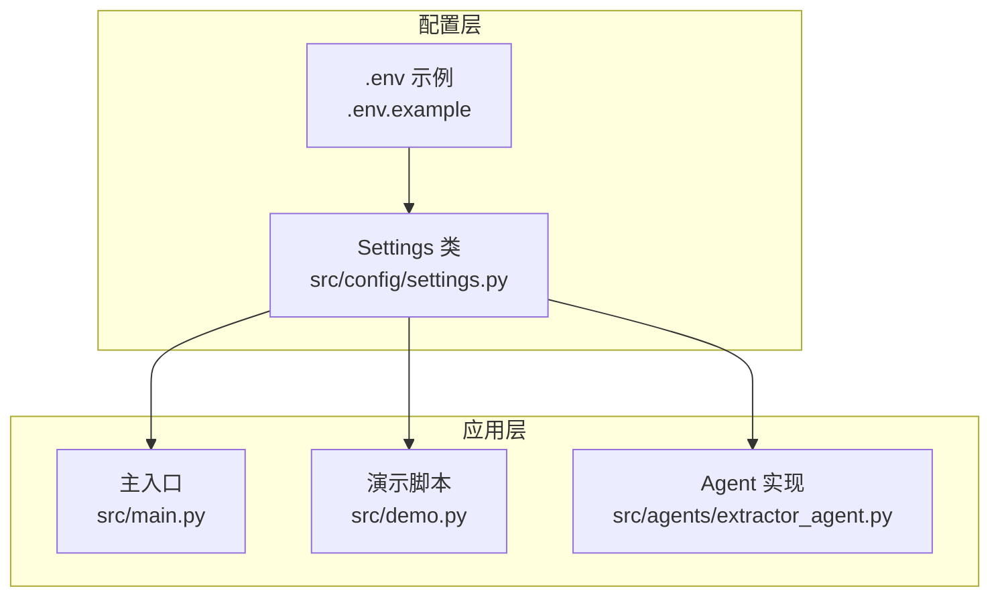
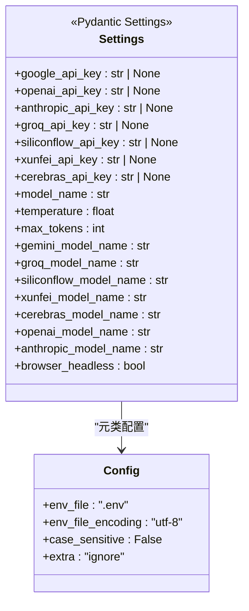
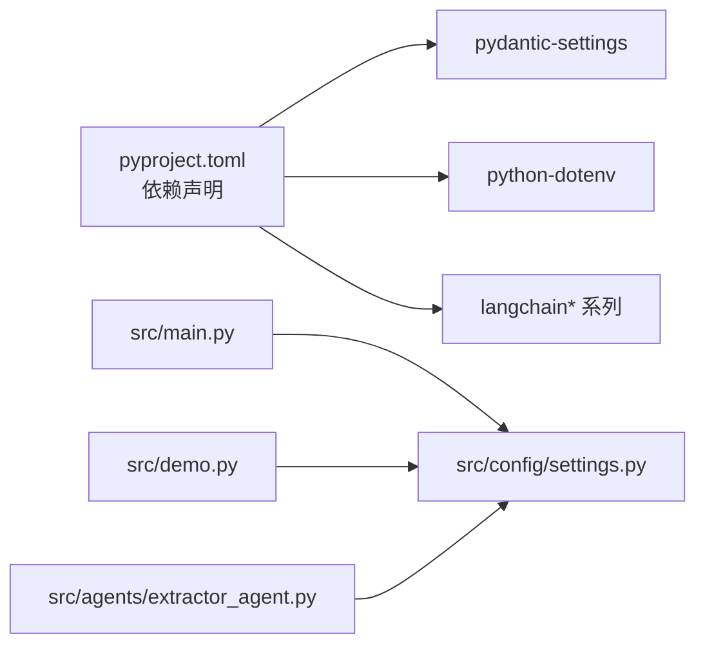

# 配置管理系统

<cite>
**本文引用的文件**
- [src/config/settings.py](file://src/config/settings.py)
- [.env.example](file://.env.example)
- [src/main.py](file://src/main.py)
- [src/demo.py](file://src/demo.py)
- [src/agents/extractor_agent.py](file://src/agents/extractor_agent.py)
- [pyproject.toml](file://pyproject.toml)
- [requirements.txt](file://requirements.txt)
- [README.md](file://README.md)
</cite>

## 目录
1. [简介](#简介)
2. [项目结构](#项目结构)
3. [核心组件](#核心组件)
4. [架构总览](#架构总览)
5. [详细组件分析](#详细组件分析)
6. [依赖分析](#依赖分析)
7. [性能考虑](#性能考虑)
8. [故障排查指南](#故障排查指南)
9. [结论](#结论)
10. [附录](#附录)

## 简介
本项目采用 Pydantic Settings 管理配置，通过 .env 文件加载环境变量，并在运行时统一注入到应用各模块。配置系统围绕 Settings 类展开，涵盖 API 密钥、模型参数、浏览器行为等关键配置项，确保在不同 LLM 提供商之间灵活切换的同时，保持一致的配置体验与类型安全。

## 项目结构
配置系统位于 src/config/settings.py，通过全局 settings 实例对外提供配置读取能力；应用入口 src/main.py 与演示脚本 src/demo.py 均直接依赖该实例；Agent 层在运行时根据配置动态选择 LLM 提供商并创建相应客户端。

图表来源
- [src/config/settings.py](file://src/config/settings.py#L1-L56)
- [.env.example](file://.env.example#L1-L9)
- [src/main.py](file://src/main.py#L1-L254)
- [src/demo.py](file://src/demo.py#L1-L51)
- [src/agents/extractor_agent.py](file://src/agents/extractor_agent.py#L1-L330)

章节来源
- [src/config/settings.py](file://src/config/settings.py#L1-L56)
- [src/main.py](file://src/main.py#L1-L254)
- [src/demo.py](file://src/demo.py#L1-L51)
- [src/agents/extractor_agent.py](file://src/agents/extractor_agent.py#L1-L330)

## 核心组件
- Settings 类：集中定义所有配置项，包括 API 密钥、模型参数、提供商特定模型名、浏览器行为等，并通过 pydantic-settings 的 BaseSettings 自动从 .env 文件加载。
- 全局 settings 实例：在模块导入时完成 .env 解析与类型转换，供应用各处按需读取。
- 应用集成：主入口与演示脚本均直接使用 settings；Agent 在运行时根据配置选择 LLM 提供商并创建客户端。

章节来源
- [src/config/settings.py](file://src/config/settings.py#L9-L56)
- [src/main.py](file://src/main.py#L20-L21)
- [src/demo.py](file://src/demo.py#L15-L15)
- [src/agents/extractor_agent.py](file://src/agents/extractor_agent.py#L97-L115)

## 架构总览
配置系统遵循“声明式配置 + 环境变量驱动”的设计，Settings 类作为唯一真相源，通过 pydantic-settings 的配置元类控制 .env 加载、大小写不敏感、额外字段忽略等行为。应用层通过导入 settings 获取配置，无需关心底层加载细节。

图表来源
- [src/config/settings.py](file://src/config/settings.py#L9-L56)

章节来源
- [src/config/settings.py](file://src/config/settings.py#L9-L56)

## 详细组件分析

### Settings 类设计与实现
- 字段分类与用途
  - API 密钥配置：google_api_key、openai_api_key、anthropic_api_key、groq_api_key、siliconflow_api_key、xunfei_api_key、cerebras_api_key。其中 google_api_key 为必需（用于默认 Gemini 模型），其余可选。
  - 模型配置：model_name（通用默认模型名）、temperature（生成温度）、max_tokens（最大令牌数）。
  - 提供商特定模型配置：gemini_model_name、groq_model_name、siliconflow_model_name、xunfei_model_name、cerebras_model_name、openai_model_name、anthropic_model_name。
  - 浏览器配置：browser_headless（是否使用无头浏览器模式）。
- 类型与默认值
  - API 密钥字段为可空字符串类型，便于显式未配置时为 None。
  - 模型参数与行为参数均为具体类型并提供合理默认值，确保最小可用配置即可运行。
- 配置元类
  - env_file 指向 .env 文件，env_file_encoding 使用 UTF-8，case_sensitive 关闭，extra 设置为忽略额外字段，保证与 .env 示例字段匹配且容错。

章节来源
- [src/config/settings.py](file://src/config/settings.py#L12-L45)
- [src/config/settings.py](file://src/config/settings.py#L46-L51)

### 环境变量管理机制
- .env 文件加载
  - Settings.Config 指定 env_file 为 ".env"，pydantic-settings 会在模块导入时自动从项目根目录加载该文件。
  - .env.example 提供了示例键值，包括 GOOGLE_API_KEY（必需）、OPENAI_API_KEY、ANTHROPIC_API_KEY（可选）等。
- 变量解析与类型转换
  - pydantic-settings 将 .env 中的字符串值自动转换为 Settings 中声明的类型（如 str、float、int、bool）。
  - 未提供的字段将回退到代码中定义的默认值。
- 大小写与额外字段
  - case_sensitive=False 使环境变量键大小写不敏感，提升易用性。
  - extra="ignore" 忽略 .env 中未在 Settings 中声明的键，避免报错。

章节来源
- [src/config/settings.py](file://src/config/settings.py#L46-L51)
- [.env.example](file://.env.example#L1-L9)

### 配置验证流程
- 必填字段检查
  - google_api_key 为必需字段，若未配置，应用在启动时会提示缺少 API Key。
- 值范围与类型验证
  - temperature、max_tokens 等参数由 pydantic 自动进行类型校验与默认值填充。
- 依赖关系验证
  - 运行时选择 LLM 提供商时，Agent 会检查对应 API Key 是否存在且可用模块已安装，不存在则抛出异常提示所需 Key。

章节来源
- [src/main.py](file://src/main.py#L235-L240)
- [src/agents/extractor_agent.py](file://src/agents/extractor_agent.py#L128-L193)

### 配置优先级与覆盖机制
- 优先级顺序
  - 环境变量（.env）优先于代码默认值。
  - 若 .env 中未提供某字段，则使用代码中定义的默认值。
  - 代码参数（如 Agent 构造时传入的 config）仅在该调用范围内生效，不影响全局 settings。
- 覆盖方式
  - 通过修改 .env 文件可覆盖默认值；在某些场景下，也可通过命令行或进程环境变量覆盖（取决于部署方式）。
  - 代码中直接赋值 settings（如在测试或调试场景）不会持久化到 .env，仅影响当前进程。

章节来源
- [src/config/settings.py](file://src/config/settings.py#L46-L51)
- [src/main.py](file://src/main.py#L48-L53)
- [src/agents/extractor_agent.py](file://src/agents/extractor_agent.py#L97-L115)

### 配置项分类与用途详解
- 模型配置
  - model_name：通用默认模型名，用于 Agent 构建阶段。
  - temperature：控制生成随机性，数值越低越稳定。
  - max_tokens：限制输出长度，避免过长响应。
- API 密钥配置
  - google_api_key：必需，用于 Google Gemini 默认模型。
  - openai_api_key、anthropic_api_key、groq_api_key、siliconflow_api_key、xunfei_api_key、cerebras_api_key：可选，用于备用提供商。
- 提供商特定模型配置
  - 各提供商默认模型名，便于快速切换与测试。
- 行为配置
  - browser_headless：控制浏览器是否以无头模式运行，适合服务器环境。

章节来源
- [src/config/settings.py](file://src/config/settings.py#L21-L45)
- [src/main.py](file://src/main.py#L34-L41)

### 配置使用示例与最佳实践
- 快速开始
  - 复制 .env.example 为 .env，并填写 GOOGLE_API_KEY（必需）。
  - 运行 python src/main.py 启动交互模式。
- 最佳实践
  - 优先使用 .env 管理密钥与参数，避免硬编码。
  - 为不同提供商分别配置 API Key，以便在运行时自动选择可用的提供商。
  - 根据任务复杂度调整 temperature 与 max_tokens，平衡准确性与成本。
  - 在生产环境中确保 .env 不被提交至版本库，并定期轮换密钥。

章节来源
- [README.md](file://README.md#L27-L55)
- [src/main.py](file://src/main.py#L235-L240)

## 依赖分析
- 配置系统依赖
  - pydantic-settings：提供从 .env 加载与类型转换能力。
  - python-dotenv：确保 .env 文件被正确解析。
- 应用层依赖
  - 主入口与演示脚本通过导入 settings 获取配置。
  - Agent 层在运行时根据配置动态创建 LLM 客户端。

图表来源
- [pyproject.toml](file://pyproject.toml#L28-L47)
- [src/main.py](file://src/main.py#L20-L21)
- [src/demo.py](file://src/demo.py#L15-L15)
- [src/agents/extractor_agent.py](file://src/agents/extractor_agent.py#L97-L115)

章节来源
- [pyproject.toml](file://pyproject.toml#L28-L47)
- [requirements.txt](file://requirements.txt#L10-L13)

## 性能考虑
- 配置加载时机
  - settings 在模块导入时完成 .env 解析，避免每次访问都重复 IO。
- 类型转换开销
  - pydantic 的类型转换在导入阶段完成，运行时读取为原生类型，开销极低。
- 配置变更频率
  - 建议在启动时一次性加载配置，运行期间尽量避免频繁修改 .env 内容。

## 故障排查指南
- 未检测到 API Key
  - 现象：启动时提示缺少 API Key。
  - 排查：确认 .env 中 GOOGLE_API_KEY 是否填写；若使用其他提供商，需同时配置对应 API Key。
- 模型不可用或 404
  - 现象：调用 LLM 时报模型未找到。
  - 排查：尝试更换 providers 特定模型名（如 gemini_model_name、openai_model_name 等）；确认密钥有效且模型已在平台启用。
- 运行时选择提供商失败
  - 现象：抛出缺少 API Key 的异常。
  - 排查：检查对应提供商 API Key 是否存在且可用模块已安装；确认 .env 中键名大小写不敏感匹配。

章节来源
- [src/main.py](file://src/main.py#L235-L240)
- [src/agents/extractor_agent.py](file://src/agents/extractor_agent.py#L128-L193)

## 结论
本配置管理系统以 Settings 类为核心，结合 pydantic-settings 的强类型与 .env 自动加载能力，提供了简洁、可靠、可扩展的配置方案。通过明确的字段分类、合理的默认值与宽松的容错策略，既满足快速上手的需求，又为多提供商、多模型的灵活切换提供了基础支撑。

## 附录
- 配置项一览
  - API 密钥：google_api_key、openai_api_key、anthropic_api_key、groq_api_key、siliconflow_api_key、xunfei_api_key、cerebras_api_key
  - 模型参数：model_name、temperature、max_tokens
  - 提供商特定模型：gemini_model_name、groq_model_name、siliconflow_model_name、xunfei_model_name、cerebras_model_name、openai_model_name、anthropic_model_name
  - 行为参数：browser_headless