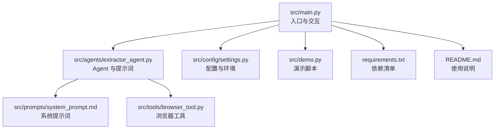
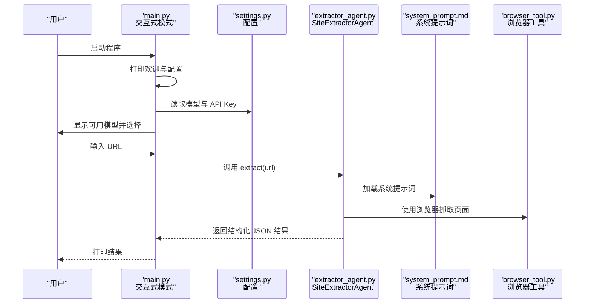
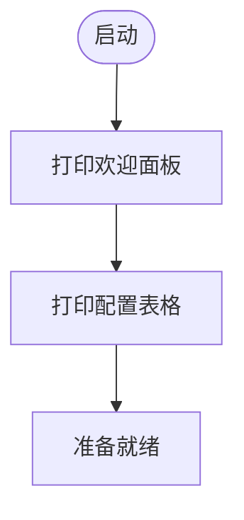
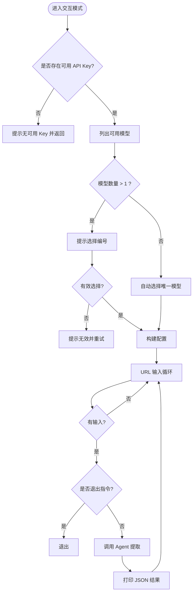
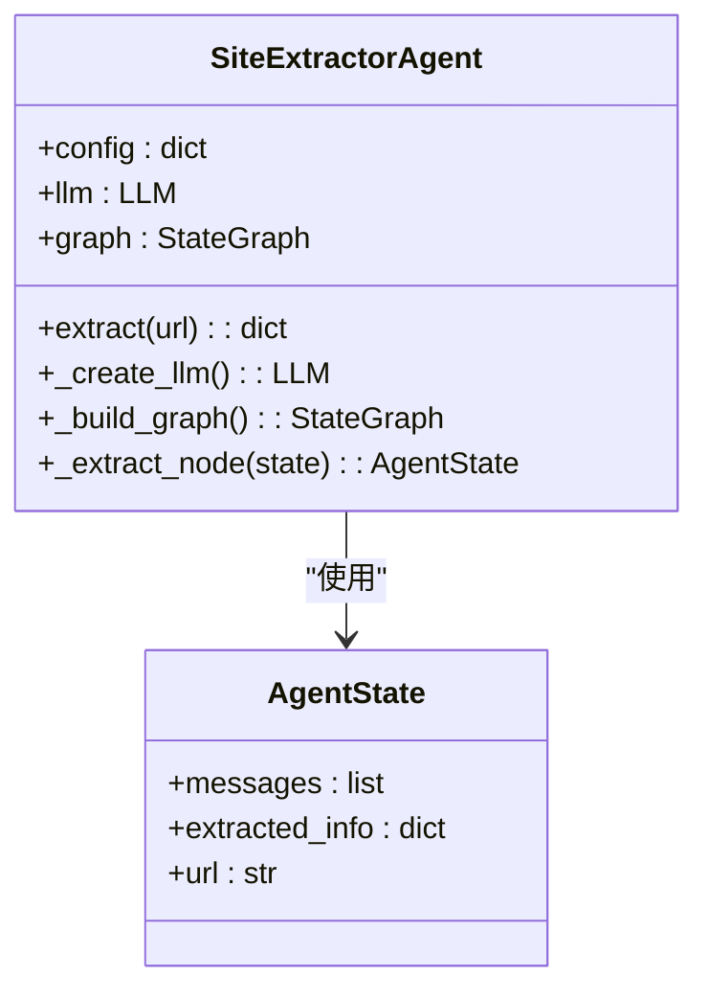
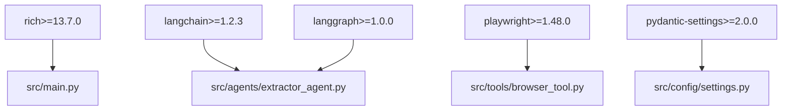

# 用户界面

<cite>
**本文引用的文件**
- [src/main.py](file://src/main.py)
- [src/demo.py](file://src/demo.py)
- [src/agents/extractor_agent.py](file://src/agents/extractor_agent.py)
- [src/config/settings.py](file://src/config/settings.py)
- [src/prompts/system_prompt.md](file://src/prompts/system_prompt.md)
- [src/tools/browser_tool.py](file://src/tools/browser_tool.py)
- [requirements.txt](file://requirements.txt)
- [README.md](file://README.md)
</cite>

## 目录
1. [简介](#简介)
2. [项目结构](#项目结构)
3. [核心组件](#核心组件)
4. [架构总览](#架构总览)
5. [详细组件分析](#详细组件分析)
6. [依赖分析](#依赖分析)
7. [性能考虑](#性能考虑)
8. [故障排除指南](#故障排除指南)
9. [结论](#结论)
10. [附录](#附录)

## 简介
本文件面向 Site Info Extractor Agent 的用户界面，聚焦命令行交互体验与 Rich 库的视觉呈现。文档涵盖欢迎界面、输入提示、结果展示、模型选择、错误处理、优雅降级、演示脚本使用与扩展、以及界面定制与扩展建议。目标是帮助用户快速上手交互式模式，并理解界面背后的设计理念与实现细节。

## 项目结构
该项目采用分层与功能模块化组织：
- 入口与交互：src/main.py
- Agent 与提示词：src/agents/extractor_agent.py、src/prompts/system_prompt.md
- 配置与环境：src/config/settings.py、.env 示例
- 工具与浏览器：src/tools/browser_tool.py
- 演示脚本：src/demo.py
- 依赖与运行说明：requirements.txt、README.md

图表来源
- [src/main.py](file://src/main.py#L1-L254)
- [src/agents/extractor_agent.py](file://src/agents/extractor_agent.py#L1-L330)
- [src/config/settings.py](file://src/config/settings.py#L1-L56)
- [src/prompts/system_prompt.md](file://src/prompts/system_prompt.md#L1-L212)
- [src/tools/browser_tool.py](file://src/tools/browser_tool.py#L1-L108)
- [src/demo.py](file://src/demo.py#L1-L51)
- [requirements.txt](file://requirements.txt#L1-L36)
- [README.md](file://README.md#L1-L101)

章节来源
- [src/main.py](file://src/main.py#L1-L254)
- [README.md](file://README.md#L57-L72)

## 核心组件
- 欢迎与配置展示：通过 Rich 的 Panel 与 Table 展示欢迎信息与当前配置，提升可读性与专业感。
- 交互式模式：非阻塞输入、信号处理、模型选择、URL 循环输入与结果打印。
- Agent 与提示词：LangGraph 状态机驱动的提取流程，系统提示词确保输出结构化与中文。
- 配置管理：Pydantic Settings 从 .env 读取 API Key 与模型参数，支持多提供商切换。
- 演示脚本：独立演示 Google Gemini 的直接调用方式，便于理解 LLM 集成。

章节来源
- [src/main.py](file://src/main.py#L26-L42)
- [src/main.py](file://src/main.py#L44-L228)
- [src/agents/extractor_agent.py](file://src/agents/extractor_agent.py#L29-L31)
- [src/config/settings.py](file://src/config/settings.py#L9-L55)
- [src/demo.py](file://src/demo.py#L13-L33)

## 架构总览
命令行界面以 asyncio 事件循环为核心，结合 Rich 的控制台输出与表格渲染，形成“欢迎界面 → 配置展示 → 模型选择 → URL 输入 → 结果展示”的完整交互链路。Agent 通过 LangGraph 状态机与系统提示词协作，最终以 JSON 形式输出结构化结果。

图表来源
- [src/main.py](file://src/main.py#L230-L246)
- [src/main.py](file://src/main.py#L44-L228)
- [src/config/settings.py](file://src/config/settings.py#L9-L55)
- [src/agents/extractor_agent.py](file://src/agents/extractor_agent.py#L29-L31)
- [src/prompts/system_prompt.md](file://src/prompts/system_prompt.md#L1-L212)
- [src/tools/browser_tool.py](file://src/tools/browser_tool.py#L44-L80)

## 详细组件分析

### 欢迎界面与配置展示
- 欢迎界面：使用 Rich Panel 展示项目标题与简述，强调“基于 LangChain 与 LangGraph 的网站信息提取系统”，营造专业感。
- 配置展示：使用 Rich Table 列出温度、最大令牌、浏览器模式等关键配置项，配合样式增强可读性。

图表来源
- [src/main.py](file://src/main.py#L26-L42)

章节来源
- [src/main.py](file://src/main.py#L26-L42)

### 交互式模式与输入处理
- 模型选择：根据已配置的 API Key 动态列出可用提供商；当仅一个可用时自动选择；多于一个时提示用户选择。
- 非阻塞输入：使用 select 与 sys.stdin 实现非阻塞键盘输入，支持 Ctrl+C 优雅退出。
- URL 输入循环：持续提示“请输入 URL >”，支持 quit/exit/q 退出；每次提取后重新提示。
- 信号处理：捕获 SIGINT，设置退出标志并立即退出，避免长时间阻塞。

图表来源
- [src/main.py](file://src/main.py#L44-L228)

章节来源
- [src/main.py](file://src/main.py#L44-L228)

### 结果展示与 Rich 视觉效果
- JSON 结果：使用 console.print_json 输出结构化结果，便于阅读与复制。
- 文本样式：通过颜色与样式（如绿色勾选、黄色提示、红色错误）区分状态与信息类型，提升可读性。
- 面板与表格：欢迎面板与配置表格统一风格，强化界面一致性。

章节来源
- [src/main.py](file://src/main.py#L210-L212)

### Agent 与提示词集成
- 系统提示词：从文件加载，确保输出结构化、中文、字段规范。
- LangGraph 工作流：单节点提取流程，入口为“extractor”，完成后结束。
- LLM 选择：按优先级选择提供商（Google Gemini → OpenAI → Anthropic → Groq → SiliconFlow → 讯飞 → Cerebras），若均不可用则抛出错误。
- 结果解析：优先解析 LLM 返回中的 JSON 片段，失败时保留原始响应并标注解析错误。

图表来源
- [src/agents/extractor_agent.py](file://src/agents/extractor_agent.py#L77-L88)
- [src/agents/extractor_agent.py](file://src/agents/extractor_agent.py#L90-L115)
- [src/agents/extractor_agent.py](file://src/agents/extractor_agent.py#L195-L217)
- [src/agents/extractor_agent.py](file://src/agents/extractor_agent.py#L219-L239)
- [src/agents/extractor_agent.py](file://src/agents/extractor_agent.py#L241-L329)

章节来源
- [src/agents/extractor_agent.py](file://src/agents/extractor_agent.py#L29-L31)
- [src/agents/extractor_agent.py](file://src/agents/extractor_agent.py#L116-L193)
- [src/agents/extractor_agent.py](file://src/agents/extractor_agent.py#L195-L217)
- [src/agents/extractor_agent.py](file://src/agents/extractor_agent.py#L219-L329)
- [src/prompts/system_prompt.md](file://src/prompts/system_prompt.md#L1-L212)

### 配置与环境管理
- Settings：集中管理 API Key、模型名称、温度、最大令牌、浏览器模式等；从 .env 文件加载。
- 模型优先级：免费提供商优先于付费提供商，便于快速试用。
- 浏览器模式：默认无头模式，可在配置中调整。

章节来源
- [src/config/settings.py](file://src/config/settings.py#L9-L55)

### 演示脚本与扩展
- 演示脚本：直接使用 ChatGoogleGenerativeAI 调用 Gemini，验证 API Key 与模型可用性，适合快速验证环境。
- 扩展方式：可参考演示脚本的调用方式，在交互模式中增加更多提供商或自定义消息结构。

章节来源
- [src/demo.py](file://src/demo.py#L13-L33)

## 依赖分析
- Rich：用于控制台输出、面板、表格与 JSON 打印。
- LangChain/LangGraph：构建 Agent 与工作流，调用 LLM。
- Playwright：浏览器工具，用于页面抓取与内容获取。
- Pydantic Settings：从 .env 读取配置，支持大小写不敏感与额外字段忽略。

图表来源
- [requirements.txt](file://requirements.txt#L1-L36)
- [src/main.py](file://src/main.py#L13-L16)
- [src/agents/extractor_agent.py](file://src/agents/extractor_agent.py#L18-L26)
- [src/tools/browser_tool.py](file://src/tools/browser_tool.py#L7)
- [src/config/settings.py](file://src/config/settings.py#L6)

章节来源
- [requirements.txt](file://requirements.txt#L1-L36)

## 性能考虑
- 非阻塞输入：使用 select 实现非阻塞键盘输入，避免主线程阻塞，提升交互流畅度。
- 无头浏览器：默认无头模式减少资源占用，适合命令行环境。
- JSON 输出：Rich 的 JSON 打印便于快速审阅，但对超大数据集建议重定向到文件以便后续处理。
- 错误处理：捕获常见异常并打印堆栈，便于定位问题；同时避免长时间阻塞导致的卡顿。

## 故障排除指南
- 未检测到 API Key：启动时会提示未检测到任何 API Key，需在 .env 中配置至少一个提供商的密钥。
- 模型不可用：若出现 404 或模型未找到，尝试更换模型名称或在平台手动启用相应模型。
- 退出与中断：支持 Ctrl+C 优雅退出；若程序卡住，可再次按 Ctrl+C 触发信号处理。
- 浏览器问题：确认已安装 Playwright 浏览器；若页面加载缓慢，可适当调整网络环境或等待条件满足。

章节来源
- [src/main.py](file://src/main.py#L235-L240)
- [README.md](file://README.md#L89-L92)
- [src/main.py](file://src/main.py#L77-L85)

## 结论
本用户界面以 Rich 为核心，结合 asyncio 与 LangGraph，提供了简洁、直观且富有表现力的命令行交互体验。通过欢迎面板、配置表格、模型选择与结果 JSON 打印，用户能够快速上手并高效完成网站信息提取任务。同时，完善的错误处理与优雅降级保证了在异常情况下的稳定运行。

## 附录

### 交互式模式使用指南
- 启动：运行入口脚本后，程序会先展示欢迎与配置，随后进入交互模式。
- 模型选择：若仅配置了一个提供商，将自动选择；若配置了多个，需按提示输入编号进行选择。
- URL 输入：输入 URL 后回车，程序将调用 Agent 提取并打印 JSON 结果；输入 quit/exit/q 可退出。
- 退出：支持 Ctrl+C 优雅退出。

章节来源
- [src/main.py](file://src/main.py#L44-L228)

### 演示脚本使用与扩展
- 使用：确保已配置 GOOGLE_API_KEY，运行演示脚本可直接调用 Gemini 并输出响应。
- 扩展：可参考演示脚本的调用方式，增加对其他提供商的支持或自定义消息结构。

章节来源
- [src/demo.py](file://src/demo.py#L22-L26)
- [src/demo.py](file://src/demo.py#L29-L47)

### 界面定制与扩展建议
- 自定义提示词：修改系统提示词文件以调整输出格式与提取规则。
- 修改显示样式：通过 Rich 的样式与颜色参数调整面板、表格与文本颜色。
- 增加新提供商：在配置中新增 API Key 与模型名称，并在 Agent 的 LLM 选择逻辑中加入相应分支。
- 结果格式化：可将 JSON 输出改为表格或 Markdown 表格，提升可读性。

章节来源
- [src/prompts/system_prompt.md](file://src/prompts/system_prompt.md#L1-L212)
- [src/config/settings.py](file://src/config/settings.py#L26-L42)
- [src/agents/extractor_agent.py](file://src/agents/extractor_agent.py#L116-L193)