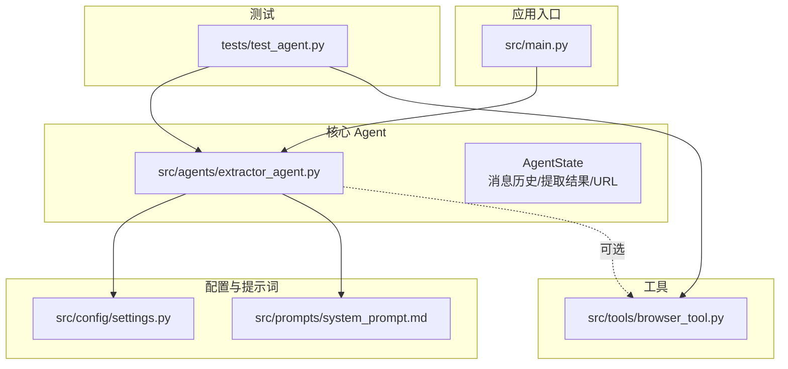
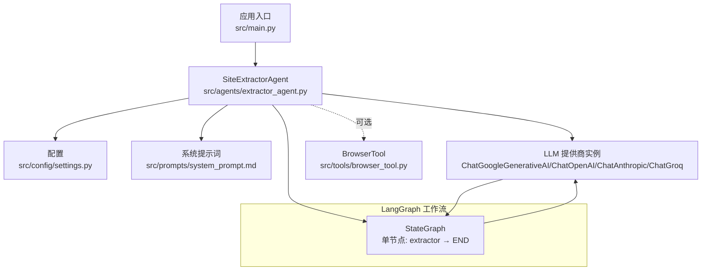
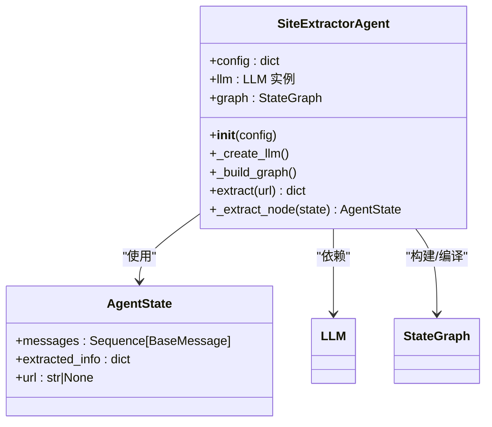
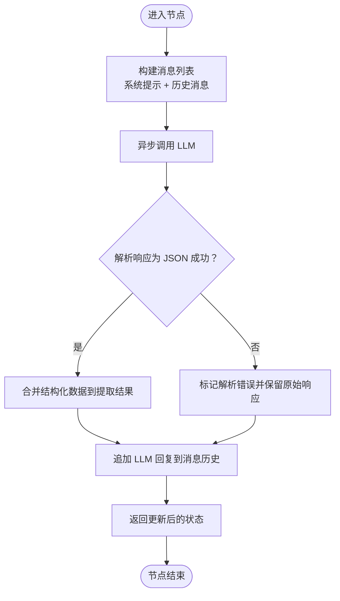
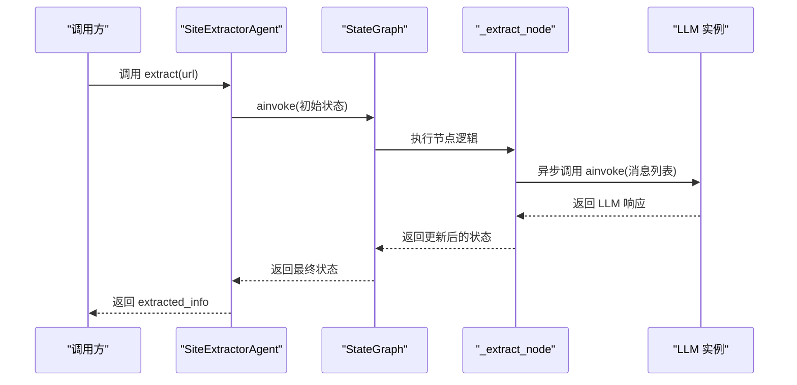
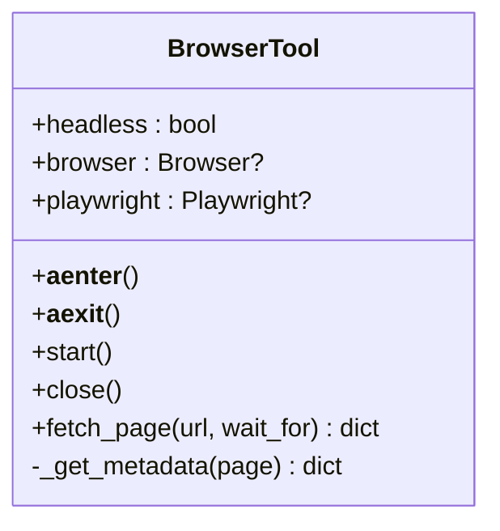
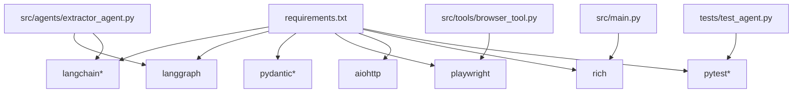

# Agent 核心架构

<cite>
**本文引用的文件**
- [src/agents/extractor_agent.py](file://src/agents/extractor_agent.py)
- [src/main.py](file://src/main.py)
- [src/config/settings.py](file://src/config/settings.py)
- [src/prompts/system_prompt.md](file://src/prompts/system_prompt.md)
- [src/tools/browser_tool.py](file://src/tools/browser_tool.py)
- [tests/test_agent.py](file://tests/test_agent.py)
- [README.md](file://README.md)
- [requirements.txt](file://requirements.txt)
</cite>

## 目录
1. [简介](#简介)
2. [项目结构](#项目结构)
3. [核心组件](#核心组件)
4. [架构总览](#架构总览)
5. [详细组件分析](#详细组件分析)
6. [依赖分析](#依赖分析)
7. [性能考量](#性能考量)
8. [故障排查指南](#故障排查指南)
9. [结论](#结论)
10. [附录](#附录)

## 简介
本文件面向 Site Info Extractor Agent 的核心 Agent 架构，重点围绕基于 LangGraph 的状态机式 Agent 设计模式进行深入解析。文档将详细说明 SiteExtractorAgent 类的实现原理与架构设计，阐述 AgentState 数据结构的设计思路及其在消息历史、提取结果与目标 URL 之间的数据流转；解释 LangGraph 工作流的构建过程（状态图创建、节点添加、边连接等）；并结合异步处理机制（async/await 与事件循环）说明 Agent 在异步场景下的运行方式。最后提供架构图与状态转换图，帮助读者快速把握系统的整体设计与数据控制流。

## 项目结构
该项目采用分层与按功能划分的组织方式：
- src/agents：核心 Agent 实现，包含 SiteExtractorAgent 与状态定义
- src/tools：工具模块，如浏览器工具 BrowserTool
- src/config：配置管理，使用 Pydantic Settings 管理环境变量与默认值
- src/prompts：系统提示词资源文件
- src/main.py：应用入口，提供交互式 CLI 体验
- tests：单元测试，覆盖 Agent 与工具的基本行为
- requirements.txt：依赖清单，明确 LangGraph、LangChain 生态与异步支持



图表来源
- [src/main.py](file://src/main.py#L1-L254)
- [src/agents/extractor_agent.py](file://src/agents/extractor_agent.py#L1-L330)
- [src/config/settings.py](file://src/config/settings.py#L1-L56)
- [src/prompts/system_prompt.md](file://src/prompts/system_prompt.md#L1-L212)
- [src/tools/browser_tool.py](file://src/tools/browser_tool.py#L1-L108)
- [tests/test_agent.py](file://tests/test_agent.py#L1-L80)

章节来源
- [README.md](file://README.md#L57-L72)
- [requirements.txt](file://requirements.txt#L1-L36)

## 核心组件
- SiteExtractorAgent：基于 LangGraph 的状态机式 Agent，负责根据配置动态选择 LLM 提供商，构建并编译 LangGraph 工作流，执行异步提取任务，并在节点中完成 LLM 调用、JSON 解析与错误处理。
- AgentState：TypedDict 定义的状态结构，包含消息历史、提取结果字典与目标 URL，用于在工作流节点间传递与累积状态。
- BrowserTool：异步浏览器工具，封装 Playwright，提供页面抓取、内容获取与元数据提取能力，支持异步上下文管理与生命周期控制。
- Settings：Pydantic Settings，集中管理 API Key、模型名称、温度、最大令牌数、浏览器模式等配置项。

章节来源
- [src/agents/extractor_agent.py](file://src/agents/extractor_agent.py#L77-L88)
- [src/agents/extractor_agent.py](file://src/agents/extractor_agent.py#L90-L194)
- [src/tools/browser_tool.py](file://src/tools/browser_tool.py#L10-L108)
- [src/config/settings.py](file://src/config/settings.py#L9-L56)

## 架构总览
下图展示了从应用入口到 Agent、再到 LLM 与可选工具的整体架构关系。Agent 通过 LangGraph 状态机驱动，将“提取”作为单一节点，消息历史与提取结果在节点间传递，最终返回结构化结果。



图表来源
- [src/main.py](file://src/main.py#L20-L254)
- [src/agents/extractor_agent.py](file://src/agents/extractor_agent.py#L195-L217)
- [src/config/settings.py](file://src/config/settings.py#L1-L56)
- [src/prompts/system_prompt.md](file://src/prompts/system_prompt.md#L1-L212)
- [src/tools/browser_tool.py](file://src/tools/browser_tool.py#L1-L108)

## 详细组件分析

### SiteExtractorAgent 类与状态机式设计
- 动态 LLM 选择：根据配置与可用性标记，优先选择 Google Gemini，其次为 OpenAI（含兼容提供商），再依次为 Anthropic、Groq、SiliconFlow、讯飞、Cerebras。若均不可用则抛出异常。
- LangGraph 工作流：创建 StateGraph，添加单节点“extractor”，设置入口点为该节点，并连接至结束符。编译后得到可异步执行的图。
- 异步提取流程：通过异步方法启动工作流，传入初始状态（包含消息历史、空提取结果、目标 URL），在节点内构建消息列表（系统提示 + 历史消息），调用 LLM 异步执行，解析 JSON 结果，更新消息历史与提取结果，最终返回提取信息。



图表来源
- [src/agents/extractor_agent.py](file://src/agents/extractor_agent.py#L90-L194)
- [src/agents/extractor_agent.py](file://src/agents/extractor_agent.py#L195-L217)
- [src/agents/extractor_agent.py](file://src/agents/extractor_agent.py#L219-L329)
- [src/agents/extractor_agent.py](file://src/agents/extractor_agent.py#L77-L88)

章节来源
- [src/agents/extractor_agent.py](file://src/agents/extractor_agent.py#L90-L194)
- [src/agents/extractor_agent.py](file://src/agents/extractor_agent.py#L195-L217)
- [src/agents/extractor_agent.py](file://src/agents/extractor_agent.py#L219-L329)

### AgentState 数据结构设计
- 字段说明
  - messages：消息历史，使用可累加的序列类型，便于在节点间累积 LLM 的回复与错误消息
  - extracted_info：提取结果字典，包含 URL、状态码、原始响应、解析错误等信息，以及后续可能扩展的结构化字段
  - url：目标网站 URL，贯穿整个工作流，便于结果标注与溯源
- 数据流转
  - 初始状态由入口函数构造，包含一条人类消息指示提取任务
  - 节点执行后更新消息历史并写入提取结果
  - 返回时仅返回 extracted_info，便于上层消费



图表来源
- [src/agents/extractor_agent.py](file://src/agents/extractor_agent.py#L241-L329)

章节来源
- [src/agents/extractor_agent.py](file://src/agents/extractor_agent.py#L77-L88)
- [src/agents/extractor_agent.py](file://src/agents/extractor_agent.py#L241-L329)

### LangGraph 工作流构建过程
- 创建状态图：以 AgentState 为状态类型
- 添加节点：注册“extractor”节点，绑定到 _extract_node 方法
- 设置入口点：将“extractor”设为唯一入口
- 连接边：从“extractor”到结束符 END
- 编译：返回可异步执行的 StateGraph 实例



图表来源
- [src/agents/extractor_agent.py](file://src/agents/extractor_agent.py#L195-L217)
- [src/agents/extractor_agent.py](file://src/agents/extractor_agent.py#L219-L239)
- [src/agents/extractor_agent.py](file://src/agents/extractor_agent.py#L241-L329)

章节来源
- [src/agents/extractor_agent.py](file://src/agents/extractor_agent.py#L195-L217)
- [src/agents/extractor_agent.py](file://src/agents/extractor_agent.py#L219-L239)

### 异步处理机制与事件循环
- 异步入口：应用入口使用 asyncio.run(main()) 启动事件循环
- Agent 异步：extract 方法与 _extract_node 方法均声明为异步，内部通过 LLM 的异步调用接口与 LangGraph 的异步执行接口完成非阻塞调用
- 事件循环：在交互模式中，事件循环负责调度协程，处理键盘中断与信号，保证程序优雅退出
- 工具异步：BrowserTool 使用 async/await 生命周期管理，确保浏览器与 Playwright 的启动、关闭在异步上下文中正确执行

```mermaid
sequenceDiagram
participant Main as "main()"
participant Loop as "事件循环"
participant IM as "interactive_mode()"
participant Agent as "SiteExtractorAgent"
participant Graph as "StateGraph"
participant Node as "_extract_node"
participant LLM as "LLM"
Main->>Loop : asyncio.run(main)
Loop->>IM : 调用交互模式
IM->>Agent : 构造 Agent(config)
IM->>Agent : await agent.extract(url)
Agent->>Graph : ainvoke(初始状态)
Graph->>Node : 执行节点
Node->>LLM : ainvoke(消息列表)
LLM-->>Node : 返回响应
Node-->>Graph : 返回状态
Graph-->>Agent : 返回状态
Agent-->>IM : 返回提取结果
IM-->>Loop : 继续等待输入
```

图表来源
- [src/main.py](file://src/main.py#L230-L246)
- [src/main.py](file://src/main.py#L44-L228)
- [src/agents/extractor_agent.py](file://src/agents/extractor_agent.py#L219-L239)
- [src/agents/extractor_agent.py](file://src/agents/extractor_agent.py#L241-L329)

章节来源
- [src/main.py](file://src/main.py#L230-L246)
- [src/main.py](file://src/main.py#L44-L228)
- [src/tools/browser_tool.py](file://src/tools/browser_tool.py#L23-L42)

### BrowserTool 工具与可选集成
- 异步上下文：支持 async with 语法，自动启动与关闭浏览器与 Playwright
- 页面抓取：打开新页面，等待网络空闲，可选等待指定元素出现，获取标题、内容、文本与元数据
- 元数据提取：通过选择器收集常见 meta 标签，如描述、关键词、OG 标签等



图表来源
- [src/tools/browser_tool.py](file://src/tools/browser_tool.py#L10-L108)

章节来源
- [src/tools/browser_tool.py](file://src/tools/browser_tool.py#L10-L108)

### 配置与系统提示词
- 配置管理：Settings 使用 Pydantic Settings 从 .env 文件加载 API Key 与模型参数，提供默认值与大小写不敏感的环境变量解析
- 系统提示词：system_prompt.md 定义了 Agent 的角色、职责、工作流程、提取规则与输出格式，确保 LLM 的响应符合预期结构

章节来源
- [src/config/settings.py](file://src/config/settings.py#L9-L56)
- [src/prompts/system_prompt.md](file://src/prompts/system_prompt.md#L1-L212)

## 依赖分析
- LangGraph 与 LangChain：Agent 的状态机与消息类型来自 LangGraph 与 LangChain Core；LLM 提供商通过 LangChain 的适配器接入
- 异步生态：aiohttp、Playwright 与 asyncio 提供异步支持
- 类型与配置：typing-extensions、pydantic、pydantic-settings 保障类型安全与配置管理
- 测试：pytest 与 pytest-asyncio 支持异步单元测试



图表来源
- [requirements.txt](file://requirements.txt#L1-L36)
- [src/agents/extractor_agent.py](file://src/agents/extractor_agent.py#L1-L330)
- [src/tools/browser_tool.py](file://src/tools/browser_tool.py#L1-L108)
- [src/main.py](file://src/main.py#L1-L254)
- [tests/test_agent.py](file://tests/test_agent.py#L1-L80)

章节来源
- [requirements.txt](file://requirements.txt#L1-L36)

## 性能考量
- 异步 I/O：通过异步 LLM 调用与浏览器操作减少阻塞，提升吞吐
- 单节点工作流：当前实现为单节点，避免复杂分支带来的额外开销；若未来扩展为多节点，需关注状态传递与错误恢复的成本
- JSON 解析健壮性：对 LLM 响应进行多种包裹形式的 JSON 提取尝试，降低解析失败率
- 资源管理：BrowserTool 使用异步上下文管理器确保资源及时释放，避免内存泄漏
- 配置与模型选择：优先选择免费或低延迟提供商，必要时再切换到付费模型，平衡成本与质量

## 故障排查指南
- LLM 选择失败：当未提供任何可用 API Key 时，初始化会抛出异常。请检查 .env 文件与提供商密钥是否正确配置
- JSON 解析失败：若 LLM 返回非标准 JSON，节点会回退到保留原始响应并标记解析错误。建议检查系统提示词与模型输出格式
- 浏览器异常：若未启动浏览器或未使用异步上下文，fetch_page 会抛出运行时错误。请确保通过 async with 或显式 start/close 管理生命周期
- 事件循环与信号：交互模式支持 SIGINT 优雅退出；若遇到键盘中断导致的异常，检查事件循环与信号处理器的注册

章节来源
- [src/agents/extractor_agent.py](file://src/agents/extractor_agent.py#L188-L193)
- [src/agents/extractor_agent.py](file://src/agents/extractor_agent.py#L299-L303)
- [src/tools/browser_tool.py](file://src/tools/browser_tool.py#L54-L55)
- [src/main.py](file://src/main.py#L76-L85)

## 结论
SiteExtractorAgent 采用 LangGraph 的状态机式设计，将“提取”抽象为单一节点，结合异步 LLM 调用与消息历史累积，形成简洁而可扩展的执行模型。AgentState 明确了消息、提取结果与 URL 的职责边界，使状态在节点间稳定传递。通过动态 LLM 选择与系统提示词约束，Agent 能够在多提供商环境下灵活运行。未来可在保持单节点执行效率的同时，逐步引入多节点工作流以支持更复杂的提取策略与错误恢复。

## 附录
- 快速开始与运行：参考 README 的安装与运行说明，确保安装依赖与 Playwright 浏览器
- 测试：使用 pytest 运行测试，验证 Agent 初始化与提取流程的 Mock 行为

章节来源
- [README.md](file://README.md#L51-L56)
- [tests/test_agent.py](file://tests/test_agent.py#L54-L66)