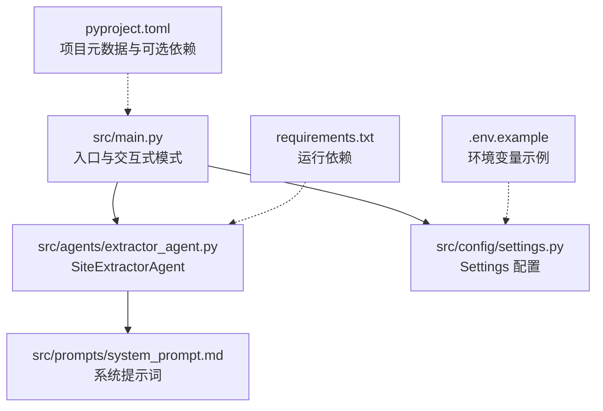
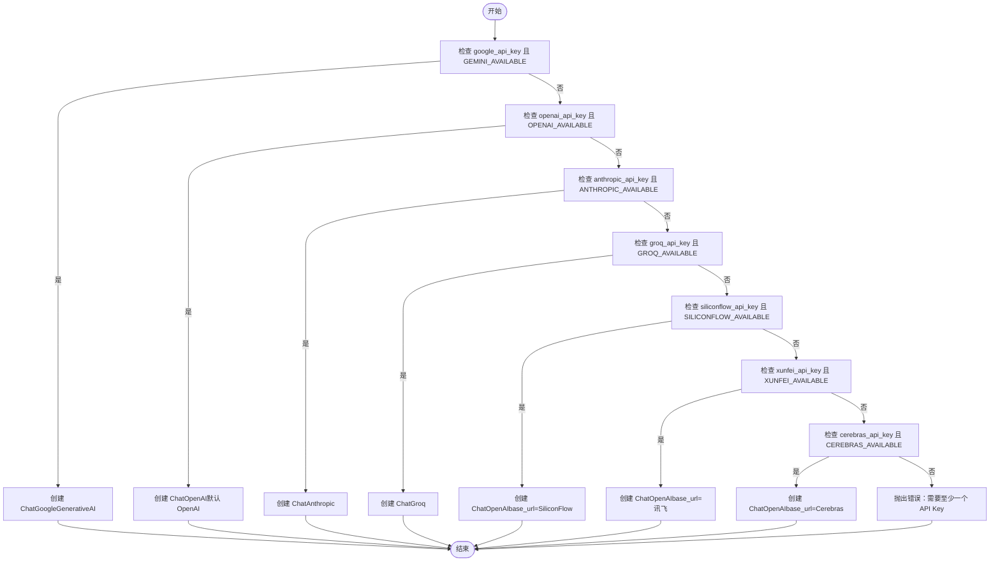
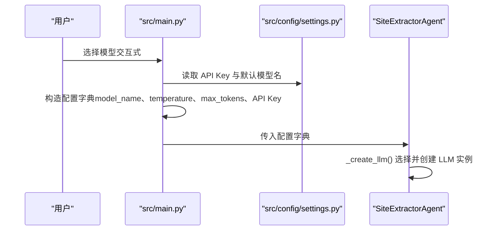
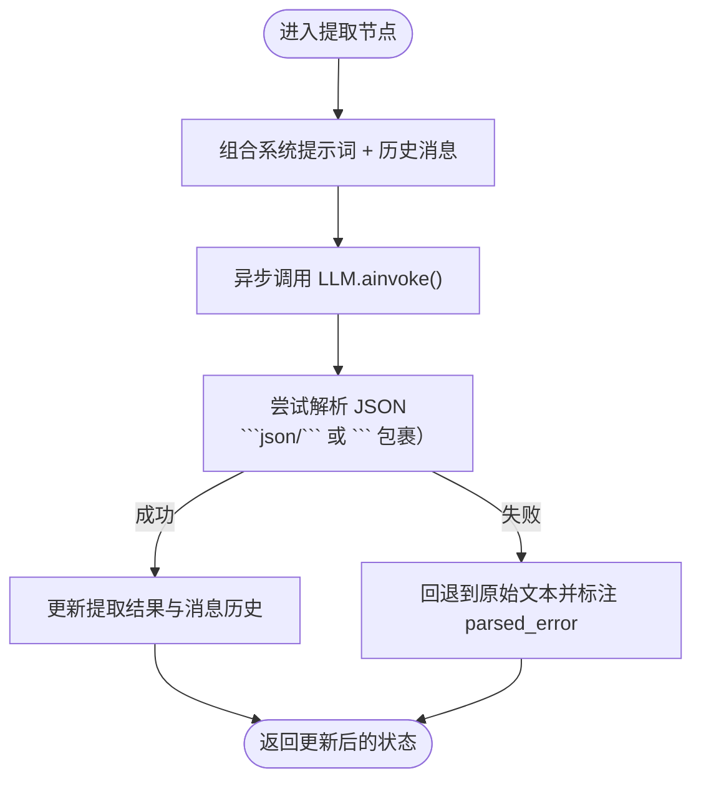
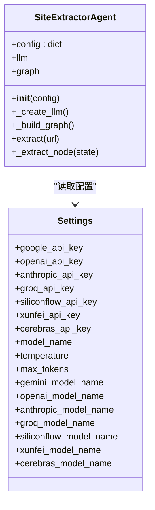
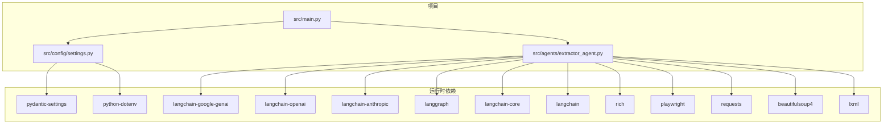

# 多模型支持架构

<cite>
**本文引用的文件**
- [src/agents/extractor_agent.py](file://src/agents/extractor_agent.py)
- [src/config/settings.py](file://src/config/settings.py)
- [src/main.py](file://src/main.py)
- [src/demo.py](file://src/demo.py)
- [src/prompts/system_prompt.md](file://src/prompts/system_prompt.md)
- [requirements.txt](file://requirements.txt)
- [pyproject.toml](file://pyproject.toml)
- [README.md](file://README.md)
- [tests/test_agent.py](file://tests/test_agent.py)
- [.env.example](file://.env.example)
</cite>

## 目录
1. [简介](#简介)
2. [项目结构](#项目结构)
3. [核心组件](#核心组件)
4. [架构总览](#架构总览)
5. [详细组件分析](#详细组件分析)
6. [依赖分析](#依赖分析)
7. [性能考虑](#性能考虑)
8. [故障排查指南](#故障排查指南)
9. [结论](#结论)
10. [附录](#附录)

## 简介
本文件围绕 Site Info Extractor Agent 的“多模型支持架构”进行系统化说明，重点覆盖以下方面：
- LLM 提供商的动态加载机制与可用性检查策略
- 模型工厂模式的实现原理与 _create_llm 的优先级选择与回退机制
- 不同 LLM 提供商的适配策略，尤其是 OpenAI 兼容 API 的统一处理（SiliconFlow、讯飞、Cerebras 等）
- 多模型支持架构图，展示模型选择流程与配置传递过程
- 模型切换的性能影响与最佳实践建议

## 项目结构
该项目采用分层与按功能域划分的组织方式：
- src/agents：Agent 实现与核心逻辑
- src/config：配置管理（Pydantic Settings）
- src/prompts：系统提示词资源
- src/main.py：命令行入口与交互式模式
- src/demo.py：演示脚本（直接调用 Google Gemini）
- tests：单元测试
- requirements.txt / pyproject.toml：依赖声明
- README.md：快速开始与使用说明
- .env.example：环境变量示例



图表来源
- [src/main.py](file://src/main.py#L1-L254)
- [src/agents/extractor_agent.py](file://src/agents/extractor_agent.py#L1-L330)
- [src/config/settings.py](file://src/config/settings.py#L1-L56)
- [src/prompts/system_prompt.md](file://src/prompts/system_prompt.md#L1-L212)
- [requirements.txt](file://requirements.txt#L1-L36)
- [pyproject.toml](file://pyproject.toml#L1-L75)
- [.env.example](file://.env.example#L1-L9)

章节来源
- [src/main.py](file://src/main.py#L1-L254)
- [src/agents/extractor_agent.py](file://src/agents/extractor_agent.py#L1-L330)
- [src/config/settings.py](file://src/config/settings.py#L1-L56)
- [requirements.txt](file://requirements.txt#L1-L36)
- [pyproject.toml](file://pyproject.toml#L1-L75)
- [README.md](file://README.md#L1-L101)

## 核心组件
- SiteExtractorAgent：负责动态加载 LLM 提供商、构建 LangGraph 工作流、执行提取任务与结果解析
- Settings：集中管理 API Key、模型名称、温度、最大令牌数等配置，并从 .env 文件加载
- main：交互式模式，收集可用模型并构造传入 Agent 的配置字典
- 提示词：系统提示词模板，用于指导 LLM 提取结构化信息

章节来源
- [src/agents/extractor_agent.py](file://src/agents/extractor_agent.py#L90-L194)
- [src/config/settings.py](file://src/config/settings.py#L9-L56)
- [src/main.py](file://src/main.py#L44-L182)
- [src/prompts/system_prompt.md](file://src/prompts/system_prompt.md#L1-L212)

## 架构总览
下图展示了多模型支持架构的关键流程：配置收集 → 动态导入与可用性检查 → 工厂方法选择 → OpenAI 兼容 API 统一适配 → LangGraph 工作流执行 → 结果解析与状态更新。

```mermaid
sequenceDiagram
participant CLI as "命令行/交互式入口<br/>src/main.py"
participant CFG as "配置管理<br/>src/config/settings.py"
participant AG as "SiteExtractorAgent<br/>src/agents/extractor_agent.py"
participant LLM as "LLM 实例<br/>ChatGoogleGenerativeAI/ChatOpenAI/ChatAnthropic/ChatGroq"
participant PROMPT as "系统提示词<br/>src/prompts/system_prompt.md"
CLI->>CFG : 读取 SettingsAPI Key、模型名、温度等
CLI->>AG : 构造配置字典model_name、temperature、max_tokens、API Key
AG->>AG : 动态导入检测GEMINI_AVAILABLE、OPENAI_AVAILABLE、ANTHROPIC_AVAILABLE、GROQ_AVAILABLE、SILICONFLOW_AVAILABLE、XUNFEI_AVAILABLE、CEREBRAS_AVAILABLE
AG->>AG : _create_llm() 优先级选择与回退
AG->>LLM : 创建对应 LLM 实例含 base_url 对 OpenAI 兼容 API
AG->>PROMPT : 加载系统提示词
AG->>AG : _build_graph() 构建 LangGraph 工作流
CLI->>AG : 调用 extract(url)
AG->>LLM : 异步调用 ainvoke(messages)
LLM-->>AG : 返回响应content
AG->>AG : 解析 JSON含
```json/``` 包裹与原始文本回退）
  AG-->>CLI: 返回提取结果（包含状态、URL、解析后数据或错误信息）
```

图表来源
- [src/main.py](file://src/main.py#L44-L182)
- [src/config/settings.py](file://src/config/settings.py#L9-L56)
- [src/agents/extractor_agent.py](file://src/agents/extractor_agent.py#L34-L194)
- [src/prompts/system_prompt.md](file://src/prompts/system_prompt.md#L1-L32)

## 详细组件分析

### 动态加载与可用性检查策略
- 在模块级别通过 try/except 检测各 LLM 提供商的可用性，并设置布尔标记位（如 GEMINI_AVAILABLE、OPENAI_AVAILABLE 等）。OpenAI 兼容的 SiliconFlow、讯飞、Cerebras 也被标记为可用，以便后续在工厂方法中统一走 OpenAI 兼容路径。
- 优点：避免在导入阶段抛出异常；在工厂方法中再根据配置决定是否创建实例，减少不必要的依赖加载。
- 影响：当缺少某提供商依赖时，该提供商不会出现在交互式模型选择中，也不会被工厂方法选中。

章节来源
- [src/agents/extractor_agent.py](file://src/agents/extractor_agent.py#L34-L75)

### 模型工厂模式与 _create_llm 优先级选择
- 工厂方法 _create_llm 的优先级顺序为：Google Gemini → OpenAI → Anthropic → Groq → SiliconFlow → 讯飞 → Cerebras。
- 选择依据：配置字典中是否存在对应的 API Key 且对应提供商可用。
- 回退机制：若当前分支无有效 API Key，则进入下一个分支；若所有分支均不可用，则抛出错误，提示至少需要一个 API Key。
- OpenAI 兼容 API 统一处理：SiliconFlow、讯飞、Cerebras 通过 ChatOpenAI 创建实例，并设置 base_url 指向各自服务端点，从而复用相同的参数与调用方式。



图表来源
- [src/agents/extractor_agent.py](file://src/agents/extractor_agent.py#L116-L194)

章节来源
- [src/agents/extractor_agent.py](file://src/agents/extractor_agent.py#L97-L194)

### OpenAI 兼容 API 的统一处理
- SiliconFlow、讯飞、Cerebras 均通过 ChatOpenAI 创建实例，仅在 base_url 上做差异化配置，从而实现参数与调用方式的统一。
- 这种策略的优势：
  - 降低适配成本：无需为每个提供商单独实现参数映射
  - 便于扩展：新增 OpenAI 兼容服务时只需增加可用性标记与 base_url
  - 保持一致性：调用链路一致，便于统一错误处理与日志记录

章节来源
- [src/agents/extractor_agent.py](file://src/agents/extractor_agent.py#L160-L185)

### 配置传递与交互式模型选择
- main 中根据 Settings 中的 API Key 决定可用模型列表，并将所选模型的 model_name 与 API Key 注入到配置字典中，随后传递给 SiteExtractorAgent。
- Settings 提供了各提供商的默认模型名，便于用户在未显式配置时也能获得合理默认值。



图表来源
- [src/main.py](file://src/main.py#L44-L182)
- [src/config/settings.py](file://src/config/settings.py#L9-L56)
- [src/agents/extractor_agent.py](file://src/agents/extractor_agent.py#L97-L115)

章节来源
- [src/main.py](file://src/main.py#L44-L182)
- [src/config/settings.py](file://src/config/settings.py#L9-L56)

### LangGraph 工作流与提取节点
- SiteExtractorAgent 使用 LangGraph 构建状态图，当前为单节点流程：提取 → 结束。
- 提取节点负责：
  - 组合系统提示词与历史消息
  - 异步调用 LLM
  - 解析响应（优先提取 ```json/``` 包裹的 JSON，其次尝试直接解析，最后回退到原始文本）
  - 更新状态（消息历史、提取结果、URL、状态码）



图表来源
- [src/agents/extractor_agent.py](file://src/agents/extractor_agent.py#L241-L330)
- [src/prompts/system_prompt.md](file://src/prompts/system_prompt.md#L1-L32)

章节来源
- [src/agents/extractor_agent.py](file://src/agents/extractor_agent.py#L195-L330)

### 类关系与依赖


图表来源
- [src/agents/extractor_agent.py](file://src/agents/extractor_agent.py#L90-L194)
- [src/config/settings.py](file://src/config/settings.py#L9-L56)

章节来源
- [src/agents/extractor_agent.py](file://src/agents/extractor_agent.py#L90-L194)
- [src/config/settings.py](file://src/config/settings.py#L9-L56)

## 依赖分析
- 运行时依赖：LangChain 生态（langchain、langchain-core、langgraph）、各提供商适配包（langchain-google-genai、langchain-openai、langchain-anthropic）、配置与环境（python-dotenv、pydantic、pydantic-settings）、异步与日志（aiohttp、rich）、浏览器与网络（playwright、requests、beautifulsoup4、lxml）。
- 项目脚本：提供命令行入口 site-extractor，指向 src/main:main。
- 可选开发依赖：pytest、pytest-asyncio、black、ruff、mypy。



图表来源
- [requirements.txt](file://requirements.txt#L1-L36)
- [pyproject.toml](file://pyproject.toml#L28-L47)
- [src/main.py](file://src/main.py#L20-L21)
- [src/agents/extractor_agent.py](file://src/agents/extractor_agent.py#L18-L26)

章节来源
- [requirements.txt](file://requirements.txt#L1-L36)
- [pyproject.toml](file://pyproject.toml#L28-L47)

## 性能考虑
- 模型选择与实例创建：
  - 通过动态导入与可用性标记避免不必要的依赖加载，减少冷启动开销。
  - OpenAI 兼容 API 统一走 ChatOpenAI，减少分支判断与重复代码，提升维护效率。
- 异步执行：
  - LLM 调用采用异步方式（ainvoke），有助于在高并发场景下提升吞吐。
- 结果解析：
  - 优先解析 ```json/``` 包裹的 JSON，失败时回退到原始文本，避免额外的序列化/反序列化开销。
- 网络与浏览器：
  - 使用 Playwright 加载页面，必要时可结合缓存与限速策略以降低外部依赖压力。
- 最佳实践建议：
  - 明确各提供商的默认模型与参数，减少频繁切换带来的不稳定。
  - 在生产环境中固定 base_url 与超时参数，避免因服务端点变更导致的性能波动。
  - 对于 OpenAI 兼容服务，尽量选择稳定可用的模型版本，避免频繁更换导致的 404/不兼容问题。

[本节为通用性能讨论，不直接分析具体文件]

## 故障排查指南
- 未检测到任何 API Key：
  - 现象：交互式模式无法启动或提示未找到可用模型。
  - 排查：确认 .env 文件已正确配置至少一个 API Key；参考 .env.example。
- 模型未找到或 404：
  - 现象：调用 LLM 时出现 404 NOT_FOUND。
  - 排查：尝试更换 Settings 中的默认模型名；某些模型需在提供商平台手动启用。
- JSON 解析失败：
  - 现象：提取结果包含 parsed_error 与 parse_error 字段。
  - 排查：检查 LLM 输出是否符合预期格式；必要时调整系统提示词。
- OpenAI 兼容服务连接失败：
  - 现象：SiliconFlow/讯飞/Cerebras 调用报错。
  - 排查：确认 base_url 正确；检查网络连通性与 API Key 权限。

章节来源
- [src/main.py](file://src/main.py#L235-L240)
- [src/config/settings.py](file://src/config/settings.py#L26-L42)
- [src/agents/extractor_agent.py](file://src/agents/extractor_agent.py#L299-L304)
- [src/agents/extractor_agent.py](file://src/agents/extractor_agent.py#L160-L185)
- [.env.example](file://.env.example#L1-L9)

## 结论
本项目通过“动态导入 + 工厂方法”的组合，实现了对多家 LLM 提供商的灵活支持，并以 OpenAI 兼容 API 为核心抽象，统一了 SiliconFlow、讯飞、Cerebras 等服务的接入方式。配合 LangGraph 的状态机式工作流与完善的配置管理，系统在可扩展性、可维护性与易用性之间取得了良好平衡。建议在生产环境中明确各提供商的默认配置与超时策略，并持续关注模型可用性与服务端点变化。

[本节为总结性内容，不直接分析具体文件]

## 附录
- 快速开始与安装步骤、环境变量配置、支持的模型列表与注意事项详见 README。
- 单元测试覆盖了浏览器工具初始化与 Agent 提取流程的基本行为，便于回归验证。

章节来源
- [README.md](file://README.md#L1-L101)
- [tests/test_agent.py](file://tests/test_agent.py#L1-L80)