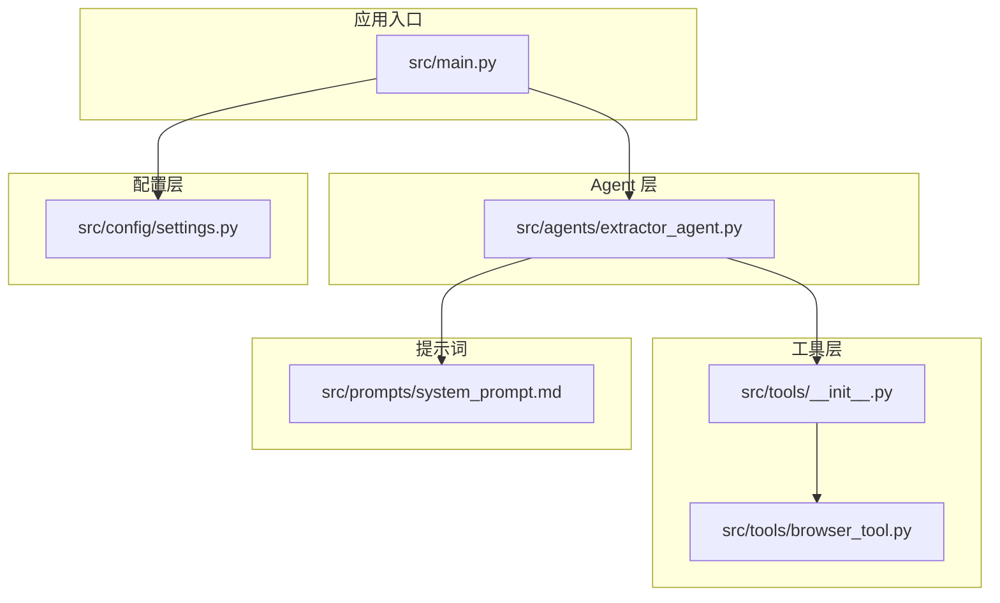
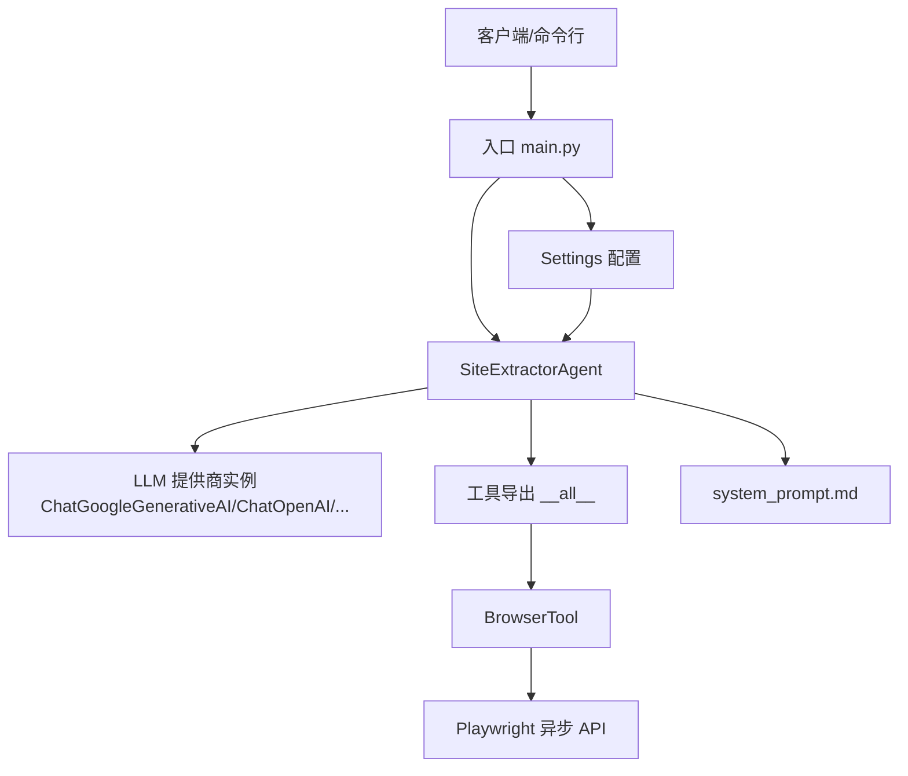
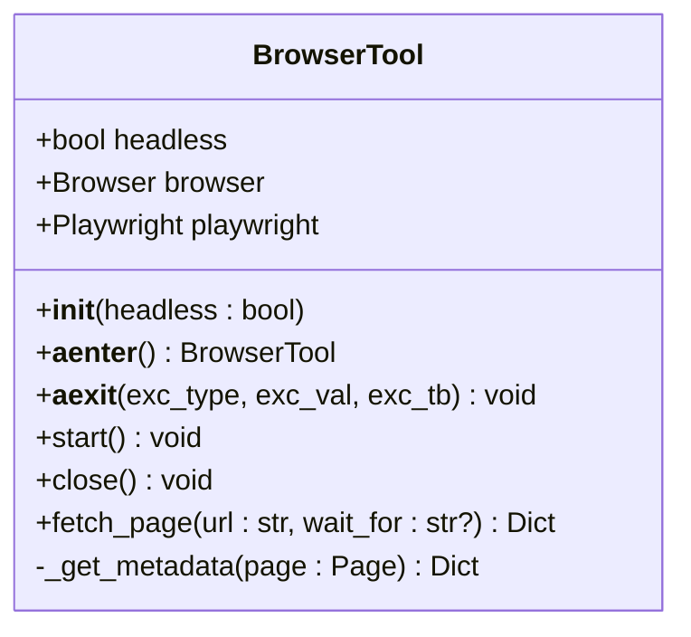
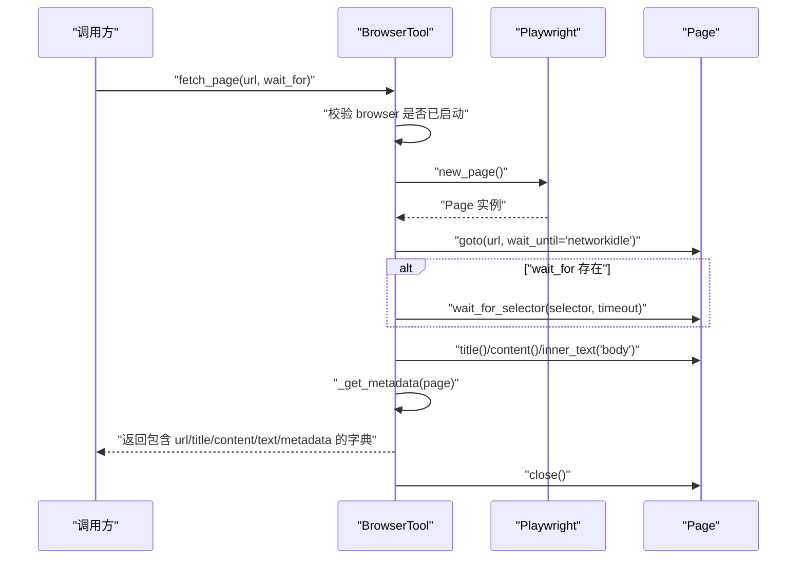
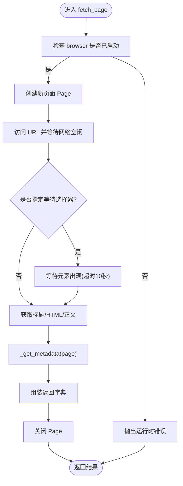
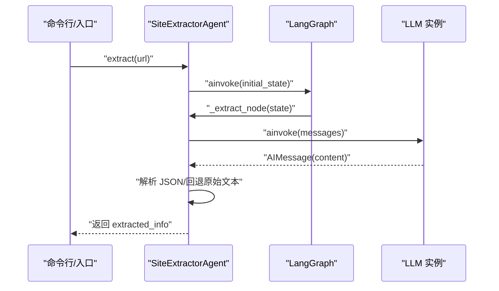
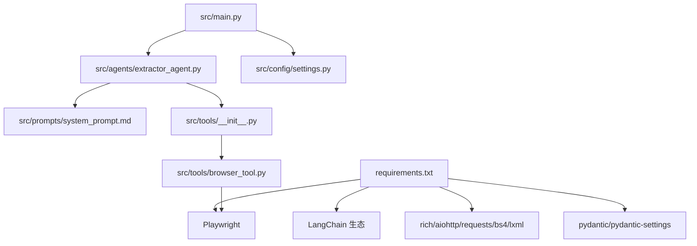

# 工具系统架构

<cite>
**本文引用的文件**
- [src/tools/browser_tool.py](file://src/tools/browser_tool.py)
- [src/tools/__init__.py](file://src/tools/__init__.py)
- [src/agents/extractor_agent.py](file://src/agents/extractor_agent.py)
- [src/main.py](file://src/main.py)
- [src/config/settings.py](file://src/config/settings.py)
- [src/prompts/system_prompt.md](file://src/prompts/system_prompt.md)
- [tests/test_agent.py](file://tests/test_agent.py)
- [requirements.txt](file://requirements.txt)
- [README.md](file://README.md)
</cite>

## 目录
1. [简介](#简介)
2. [项目结构](#项目结构)
3. [核心组件](#核心组件)
4. [架构总览](#架构总览)
5. [详细组件分析](#详细组件分析)
6. [依赖分析](#依赖分析)
7. [性能考虑](#性能考虑)
8. [故障排查指南](#故障排查指南)
9. [结论](#结论)
10. [附录](#附录)

## 简介
本文件面向 Site Info Extractor Agent 的“工具系统架构”，重点阐述 BrowserTool 类的设计原理与实现细节，包括 Playwright 集成的技术方案与异步网页访问机制；说明工具系统的模块化设计理念、工具与 Agent 的解耦与依赖注入；给出工具接口设计规范（方法签名、参数与返回值）；解释扩展性设计（新增工具与插件机制）；并提供架构图、序列图、流程图等可视化说明，最后总结性能优化策略与错误处理机制。

## 项目结构
该项目采用分层与按功能域划分的组织方式：
- src/agents：核心 Agent 实现与 LangGraph 工作流
- src/tools：工具集合（当前包含 BrowserTool）
- src/config：配置管理（Pydantic Settings）
- src/prompts：系统提示词（用于 LLM 提示工程）
- src/main.py：应用入口与交互式运行逻辑
- tests：单元测试（覆盖 Agent 与 BrowserTool）

图表来源
- [src/main.py](file://src/main.py#L1-L254)
- [src/agents/extractor_agent.py](file://src/agents/extractor_agent.py#L1-L330)
- [src/tools/__init__.py](file://src/tools/__init__.py#L1-L9)
- [src/tools/browser_tool.py](file://src/tools/browser_tool.py#L1-L108)
- [src/config/settings.py](file://src/config/settings.py#L1-L56)
- [src/prompts/system_prompt.md](file://src/prompts/system_prompt.md#L1-L212)

章节来源
- [README.md](file://README.md#L57-L72)
- [src/main.py](file://src/main.py#L1-L254)
- [src/agents/extractor_agent.py](file://src/agents/extractor_agent.py#L1-L330)
- [src/tools/__init__.py](file://src/tools/__init__.py#L1-L9)
- [src/tools/browser_tool.py](file://src/tools/browser_tool.py#L1-L108)
- [src/config/settings.py](file://src/config/settings.py#L1-L56)
- [src/prompts/system_prompt.md](file://src/prompts/system_prompt.md#L1-L212)

## 核心组件
- BrowserTool：基于 Playwright 的异步网页访问工具，负责启动/关闭浏览器、访问页面、等待元素、抓取页面基础信息与元数据。
- SiteExtractorAgent：基于 LangGraph 的状态机式 Agent，负责构建工作流、调用 LLM、解析响应、维护状态与错误处理。
- 配置系统：通过 Settings 统一管理 API Key、模型名称、温度、最大令牌数、浏览器模式等。
- 提示工程：system_prompt.md 定义了提取规则、输出格式与异常处理策略，指导 LLM 的行为。

章节来源
- [src/tools/browser_tool.py](file://src/tools/browser_tool.py#L10-L108)
- [src/agents/extractor_agent.py](file://src/agents/extractor_agent.py#L90-L330)
- [src/config/settings.py](file://src/config/settings.py#L9-L56)
- [src/prompts/system_prompt.md](file://src/prompts/system_prompt.md#L1-L212)

## 架构总览
整体架构采用“Agent + 工具”的解耦设计：
- Agent 仅负责状态管理、消息编排与 LLM 调用，不直接关心底层数据采集细节。
- 工具层封装具体能力（如 BrowserTool），向 Agent 暴露统一接口。
- 配置层集中管理外部依赖（API Key、模型、浏览器模式）。
- 提示工程通过 system_prompt.md 明确输出格式与提取规则，保证 LLM 行为一致。

图表来源
- [src/main.py](file://src/main.py#L1-L254)
- [src/agents/extractor_agent.py](file://src/agents/extractor_agent.py#L90-L330)
- [src/tools/__init__.py](file://src/tools/__init__.py#L1-L9)
- [src/tools/browser_tool.py](file://src/tools/browser_tool.py#L1-L108)
- [src/config/settings.py](file://src/config/settings.py#L1-L56)
- [src/prompts/system_prompt.md](file://src/prompts/system_prompt.md#L1-L212)

## 详细组件分析

### BrowserTool 设计与实现
BrowserTool 是工具系统的核心实现，具备以下特性：
- 异步生命周期管理：通过异步上下文管理器 start/close，确保浏览器与 Playwright 实例的正确启动与释放。
- 无头/有头模式：由构造参数 headless 控制，结合配置 settings.browser_headless。
- 页面抓取能力：支持访问 URL、等待元素、获取标题、HTML 内容、纯文本与元数据。
- 元数据提取：针对常见 SEO 元标签（如 description、keywords、og:*）进行抽取。

图表来源
- [src/tools/browser_tool.py](file://src/tools/browser_tool.py#L10-L108)

图表来源
- [src/tools/browser_tool.py](file://src/tools/browser_tool.py#L44-L81)

图表来源
- [src/tools/browser_tool.py](file://src/tools/browser_tool.py#L44-L81)
- [src/tools/browser_tool.py](file://src/tools/browser_tool.py#L82-L108)

章节来源
- [src/tools/browser_tool.py](file://src/tools/browser_tool.py#L10-L108)

### SiteExtractorAgent 的工作流与解耦设计
SiteExtractorAgent 基于 LangGraph 构建状态机式工作流，核心职责：
- LLM 供应商选择：根据配置与可用性动态选择 Google Gemini、OpenAI、Anthropic、Groq、SiliconFlow、讯飞或 Cerebras。
- 状态管理：使用 AgentState 维护 messages、extracted_info、url。
- 单节点提取流程：入口节点执行提取，完成后结束。
- 异步执行：graph.ainvoke 支持异步工作流。
- 错误处理：捕获 LLM 调用异常与 JSON 解析异常，返回结构化错误信息。

图表来源
- [src/agents/extractor_agent.py](file://src/agents/extractor_agent.py#L219-L330)

章节来源
- [src/agents/extractor_agent.py](file://src/agents/extractor_agent.py#L90-L330)

### 工具系统模块化与依赖注入
- 模块化：工具通过 src/tools/__init__.py 暴露统一导出，当前导出 BrowserTool。
- 依赖注入：Agent 通过配置字典传入模型参数与 API Key，内部动态创建 LLM 实例；BrowserTool 作为独立工具，可在后续扩展中以相同模式注入到 Agent 的工作流中。
- 解耦：Agent 仅依赖 LLM 接口与状态结构，不直接依赖具体工具实现；工具通过接口约定与 Agent 解耦。

章节来源
- [src/tools/__init__.py](file://src/tools/__init__.py#L1-L9)
- [src/agents/extractor_agent.py](file://src/agents/extractor_agent.py#L97-L194)

### 工具接口设计规范
- 方法签名
  - 构造函数：BrowserTool(headless: bool)
  - 生命周期：start()、close()、异步上下文管理器 __aenter__/__aexit__
  - 业务方法：fetch_page(url: str, wait_for: Optional[str] = None) -> Dict[str, Any]
- 参数传递
  - url：目标网页地址
  - wait_for：可选的元素选择器，用于等待页面关键元素出现
  - headless：控制浏览器是否以无头模式运行
- 返回值格式
  - 字典包含：url、title、content、text、metadata
  - metadata 为键值对，涵盖常见 SEO 元标签
- 错误处理
  - 若未启动浏览器而调用 fetch_page，抛出运行时错误
  - 页面访问与等待均在 try/finally 中确保 Page 被关闭

章节来源
- [src/tools/browser_tool.py](file://src/tools/browser_tool.py#L13-L56)
- [src/tools/browser_tool.py](file://src/tools/browser_tool.py#L44-L81)
- [src/tools/browser_tool.py](file://src/tools/browser_tool.py#L82-L108)

### 扩展性设计与插件机制
- 新工具添加步骤
  - 在 src/tools 下新增工具模块（例如 new_tool.py），实现统一接口（如 start/close/fetch_*）
  - 在 src/tools/__init__.py 中导出新工具（加入 __all__）
  - 在 Agent 的工作流或提示词中引用新工具（遵循统一方法签名）
- 插件机制
  - 通过配置与动态导入实现“插件式” LLM 提供商选择
  - 工具层可借鉴此模式，按需动态加载与注册工具
- 可扩展的提示工程
  - system_prompt.md 明确输出格式与提取规则，便于扩展新的提取维度

章节来源
- [src/tools/__init__.py](file://src/tools/__init__.py#L1-L9)
- [src/prompts/system_prompt.md](file://src/prompts/system_prompt.md#L105-L146)
- [src/agents/extractor_agent.py](file://src/agents/extractor_agent.py#L116-L194)

## 依赖分析
- 外部依赖
  - LangChain 生态：langchain、langchain-core、langgraph、langchain-google-genai、langchain-openai、langchain-anthropic
  - 工具与异步：playwright、aiohttp、rich
  - 配置与类型：pydantic、pydantic-settings、typing-extensions
  - 解析与 HTTP：requests、beautifulsoup4、lxml
- 内部依赖
  - main.py 依赖 settings 与 Agent
  - Agent 依赖提示词与工具导出
  - BrowserTool 依赖 Playwright 异步 API

图表来源
- [requirements.txt](file://requirements.txt#L1-L36)
- [src/main.py](file://src/main.py#L1-L254)
- [src/agents/extractor_agent.py](file://src/agents/extractor_agent.py#L1-L330)
- [src/tools/__init__.py](file://src/tools/__init__.py#L1-L9)
- [src/tools/browser_tool.py](file://src/tools/browser_tool.py#L1-L108)
- [src/config/settings.py](file://src/config/settings.py#L1-L56)
- [src/prompts/system_prompt.md](file://src/prompts/system_prompt.md#L1-L212)

章节来源
- [requirements.txt](file://requirements.txt#L1-L36)
- [src/main.py](file://src/main.py#L1-L254)
- [src/agents/extractor_agent.py](file://src/agents/extractor_agent.py#L1-L330)
- [src/tools/__init__.py](file://src/tools/__init__.py#L1-L9)
- [src/tools/browser_tool.py](file://src/tools/browser_tool.py#L1-L108)
- [src/config/settings.py](file://src/config/settings.py#L1-L56)
- [src/prompts/system_prompt.md](file://src/prompts/system_prompt.md#L1-L212)

## 性能考虑
- 异步与并发
  - BrowserTool 与 Agent 均采用异步实现，适合高并发场景
  - 建议在 Agent 层面控制并发度，避免同时打开过多浏览器实例
- 超时与等待
  - fetch_page 默认等待网络空闲；可选 wait_for 用于等待关键元素，超时 10 秒
  - 建议根据站点复杂度调整 wait_for 与超时策略
- 资源管理
  - 使用异步上下文管理器确保浏览器与页面及时释放
  - 配置 settings.browser_headless 以减少资源占用
- LLM 调用
  - system_prompt.md 明确输出格式，有助于减少 LLM 重试与修正成本
  - 控制 temperature 与 max_tokens，平衡质量与成本

[本节为通用性能建议，无需特定文件引用]

## 故障排查指南
- 浏览器未启动
  - 症状：调用 fetch_page 抛出运行时错误
  - 处理：先调用 start() 或使用异步上下文管理器
- 页面加载失败
  - 症状：返回空内容或元数据缺失
  - 处理：检查 wait_for 选择器是否正确；确认网络可达；适当增加等待时间
- LLM 解析失败
  - 症状：extract 返回 parsed_error 或包含 raw_response
  - 处理：检查 system_prompt.md 的输出格式；确保 LLM 返回 JSON 片段或纯文本
- API Key 缺失
  - 症状：Agent 初始化时报错，提示需要 API Key
  - 处理：在 .env 中配置相应提供商的 API Key，并确保安装对应依赖
- Playwright 未安装
  - 症状：运行时报错找不到浏览器
  - 处理：执行 playwright install

章节来源
- [src/tools/browser_tool.py](file://src/tools/browser_tool.py#L54-L56)
- [src/agents/extractor_agent.py](file://src/agents/extractor_agent.py#L299-L329)
- [src/agents/extractor_agent.py](file://src/agents/extractor_agent.py#L188-L193)
- [README.md](file://README.md#L23-L25)

## 结论
Site Info Extractor Agent 的工具系统以 BrowserTool 为核心，采用 Playwright 异步访问网页，结合 LangGraph 的状态机式工作流与统一的提示工程，实现了可扩展、可维护的网站信息提取体系。通过模块化与依赖注入，Agent 与工具解耦，便于未来扩展更多工具与 LLM 提供商。建议在生产环境中关注并发控制、超时策略与资源回收，以获得更稳定的性能表现。

[本节为总结性内容，无需特定文件引用]

## 附录

### API 定义与调用示例（路径参考）
- BrowserTool 构造与生命周期
  - [构造函数与异步上下文](file://src/tools/browser_tool.py#L13-L31)
  - [启动与关闭](file://src/tools/browser_tool.py#L32-L42)
- 页面抓取
  - [fetch_page 方法签名与返回值](file://src/tools/browser_tool.py#L44-L78)
  - [元数据提取](file://src/tools/browser_tool.py#L82-L108)
- Agent 提取流程
  - [extract 方法](file://src/agents/extractor_agent.py#L219-L239)
  - [_extract_node 方法](file://src/agents/extractor_agent.py#L241-L330)
- 配置与入口
  - [Settings 配置项](file://src/config/settings.py#L9-L56)
  - [main 启动与交互式模式](file://src/main.py#L44-L246)

章节来源
- [src/tools/browser_tool.py](file://src/tools/browser_tool.py#L13-L108)
- [src/agents/extractor_agent.py](file://src/agents/extractor_agent.py#L219-L330)
- [src/config/settings.py](file://src/config/settings.py#L9-L56)
- [src/main.py](file://src/main.py#L44-L246)