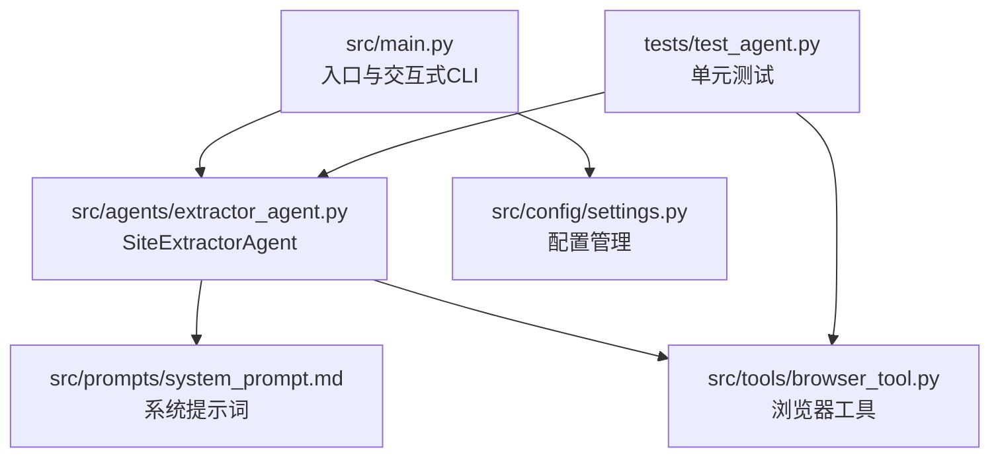
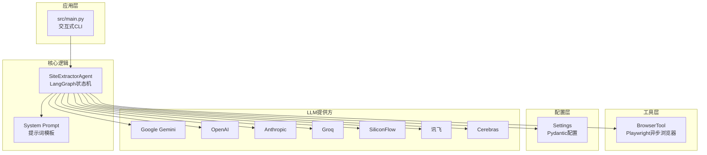
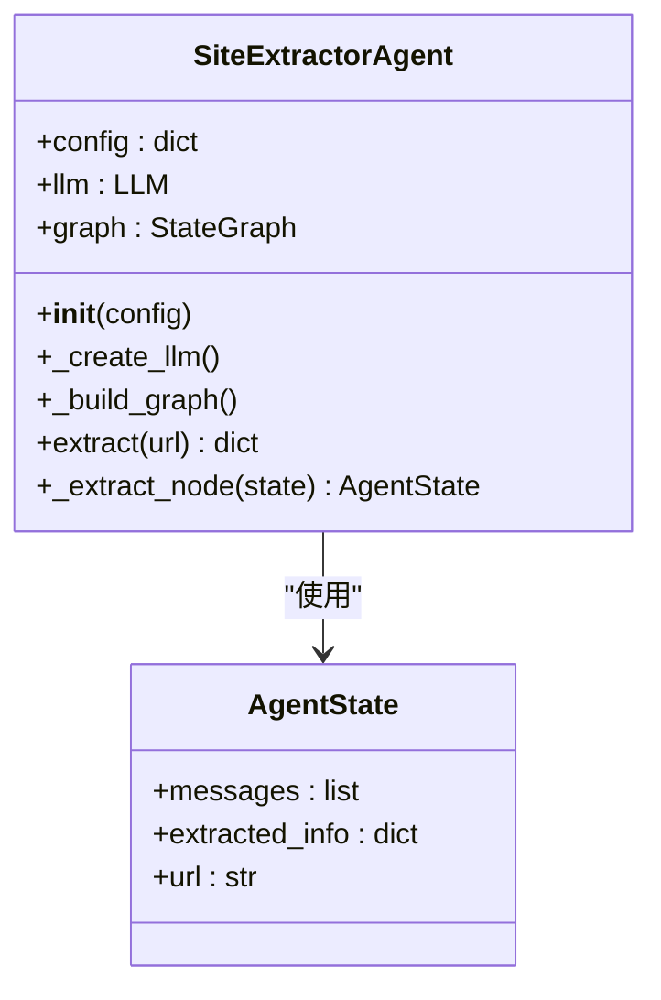
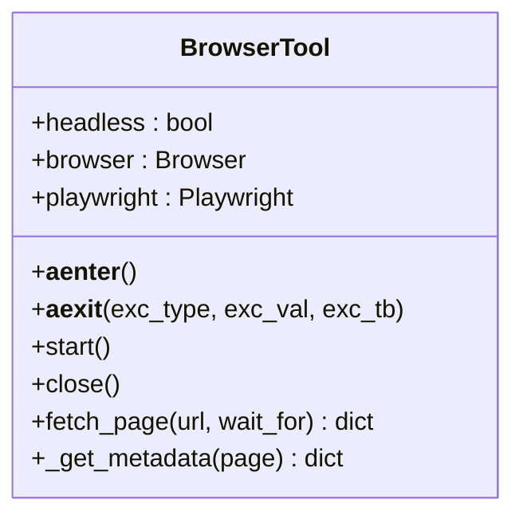
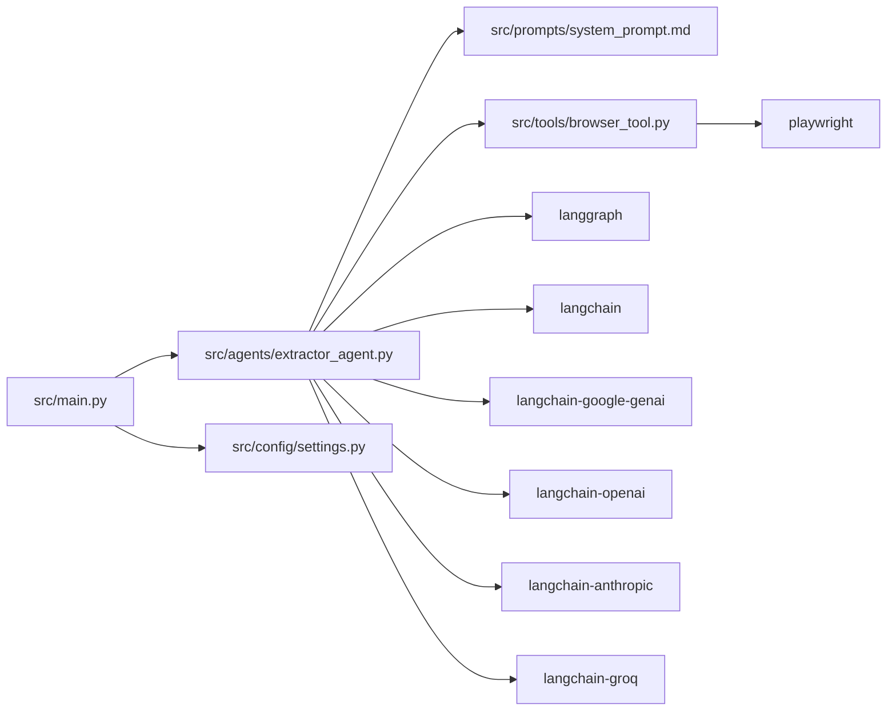
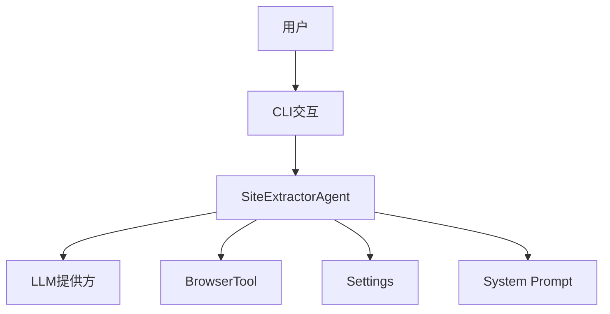
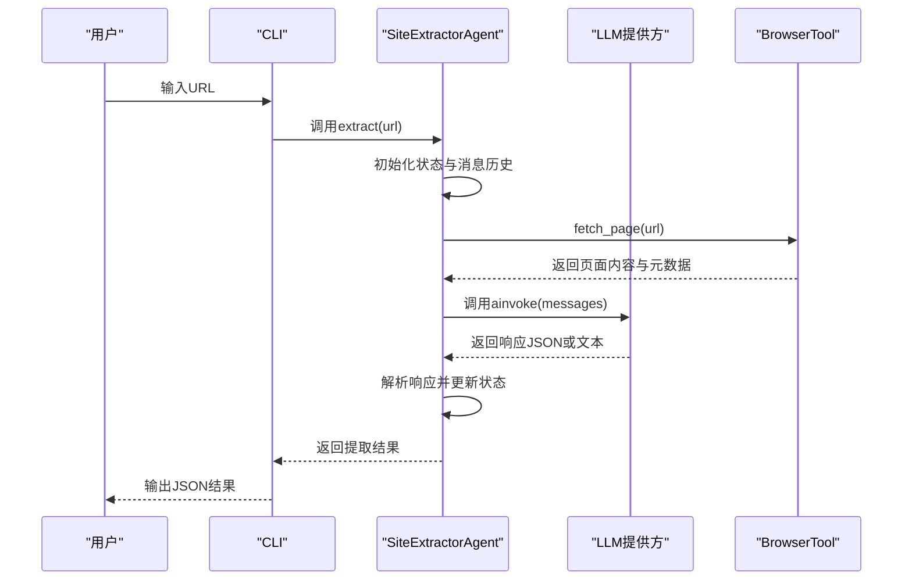
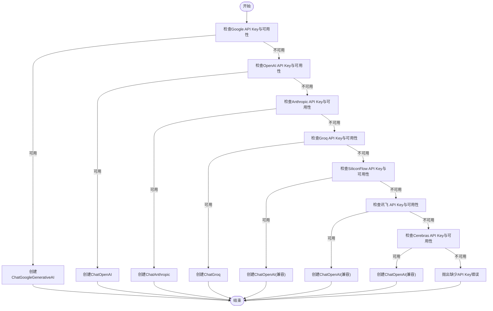

# 系统架构

<cite>
**本文引用的文件**
- [src/main.py](file://src/main.py)
- [src/demo.py](file://src/demo.py)
- [src/agents/extractor_agent.py](file://src/agents/extractor_agent.py)
- [src/tools/browser_tool.py](file://src/tools/browser_tool.py)
- [src/config/settings.py](file://src/config/settings.py)
- [src/prompts/system_prompt.md](file://src/prompts/system_prompt.md)
- [README.md](file://README.md)
- [requirements.txt](file://requirements.txt)
- [pyproject.toml](file://pyproject.toml)
- [tests/test_agent.py](file://tests/test_agent.py)
- [conftest.py](file://conftest.py)
</cite>

## 目录
1. [简介](#简介)
2. [项目结构](#项目结构)
3. [核心组件](#核心组件)
4. [架构总览](#架构总览)
5. [详细组件分析](#详细组件分析)
6. [依赖关系分析](#依赖关系分析)
7. [性能考量](#性能考量)
8. [故障排查指南](#故障排查指南)
9. [结论](#结论)
10. [附录](#附录)

## 简介
本项目是一个基于 LangChain 与 LangGraph 的“网站信息提取 Agent”系统，目标是通过多模型供应商支持与异步处理能力，实现从网页中提取结构化信息，并以统一的 JSON 格式输出。系统采用状态机式的 LangGraph 工作流，结合浏览器工具进行网页内容抓取与解析，支持多种 LLM 提供商（Google Gemini、OpenAI、Anthropic、Groq、SiliconFlow、讯飞、Cerebras），并通过配置模块集中管理 API Key、模型参数与浏览器行为。

## 项目结构
项目采用按功能域分层的模块化组织方式：
- src/main.py：应用入口与交互式 CLI，负责模型选择、运行时配置与用户交互。
- src/agents/extractor_agent.py：核心 Agent 实现，基于 LangGraph 的状态机工作流，负责构建 LLM、执行提取、解析响应与状态管理。
- src/tools/browser_tool.py：浏览器工具封装，基于 Playwright 的异步网页访问与内容提取。
- src/config/settings.py：配置管理，使用 Pydantic Settings 从 .env 文件加载 API Key 与模型参数。
- src/prompts/system_prompt.md：系统提示词模板，定义提取规则、输出格式与异常处理策略。
- tests/test_agent.py：单元测试，覆盖浏览器工具与 Agent 的基本行为。
- README.md、requirements.txt、pyproject.toml：项目说明、依赖清单与打包配置。

图表来源
- [src/main.py](file://src/main.py#L1-L254)
- [src/agents/extractor_agent.py](file://src/agents/extractor_agent.py#L1-L330)
- [src/tools/browser_tool.py](file://src/tools/browser_tool.py#L1-L108)
- [src/config/settings.py](file://src/config/settings.py#L1-L56)
- [src/prompts/system_prompt.md](file://src/prompts/system_prompt.md#L1-L212)
- [tests/test_agent.py](file://tests/test_agent.py#L1-L80)

章节来源
- [README.md](file://README.md#L57-L72)
- [src/main.py](file://src/main.py#L1-L254)
- [src/agents/extractor_agent.py](file://src/agents/extractor_agent.py#L1-L330)
- [src/tools/browser_tool.py](file://src/tools/browser_tool.py#L1-L108)
- [src/config/settings.py](file://src/config/settings.py#L1-L56)
- [src/prompts/system_prompt.md](file://src/prompts/system_prompt.md#L1-L212)
- [tests/test_agent.py](file://tests/test_agent.py#L1-L80)

## 核心组件
- SiteExtractorAgent：基于 LangGraph 的状态机 Agent，负责根据配置动态选择 LLM 提供商，构建工作流，执行提取并解析 LLM 响应。
- BrowserTool：基于 Playwright 的异步浏览器工具，提供页面访问、内容获取与元数据提取。
- Settings：集中管理 API Key、模型名称、温度、最大令牌数与浏览器模式等配置。
- System Prompt：定义提取规则、输出格式与异常处理策略，作为 LLM 的系统提示词。
- main：交互式 CLI，负责模型选择、配置构建与用户输入循环。

章节来源
- [src/agents/extractor_agent.py](file://src/agents/extractor_agent.py#L90-L194)
- [src/tools/browser_tool.py](file://src/tools/browser_tool.py#L10-L43)
- [src/config/settings.py](file://src/config/settings.py#L9-L56)
- [src/prompts/system_prompt.md](file://src/prompts/system_prompt.md#L1-L212)
- [src/main.py](file://src/main.py#L44-L228)

## 架构总览
系统采用“入口 CLI → Agent → LLM 提供商”的链路，同时在 Agent 内部通过 LangGraph 管理状态与流程。BrowserTool 作为外部工具被 Agent 使用，用于获取网页内容。配置由 Settings 统一注入，System Prompt 作为系统提示词参与 LLM 推理。

图表来源
- [src/main.py](file://src/main.py#L44-L228)
- [src/agents/extractor_agent.py](file://src/agents/extractor_agent.py#L90-L194)
- [src/tools/browser_tool.py](file://src/tools/browser_tool.py#L10-L43)
- [src/config/settings.py](file://src/config/settings.py#L9-L56)
- [src/prompts/system_prompt.md](file://src/prompts/system_prompt.md#L1-L212)

## 详细组件分析

### SiteExtractorAgent 组件分析
- 角色与职责
  - 动态选择 LLM 提供商：按优先级（Google Gemini → OpenAI → Anthropic → Groq → SiliconFlow → 讯飞 → Cerebras）尝试导入并实例化对应 LLM。
  - 构建 LangGraph 工作流：定义状态结构（消息历史、已提取信息、URL），添加单节点“extractor”，设置入口点并编译图。
  - 执行提取：初始化状态，调用图的异步执行，返回最终提取结果。
  - 提取节点逻辑：构建系统提示词与历史消息，调用 LLM，解析 JSON 响应，处理解析失败与异常情况，维护消息历史。
- 状态管理
  - AgentState：包含 messages、extracted_info、url 三个字段，用于在工作流中传递与累积信息。
- 多模型支持
  - 通过条件导入与工厂式选择，实现不同提供商的适配；OpenAI 兼容的提供商（SiliconFlow、讯飞、Cerebras）复用 ChatOpenAI。
- 错误处理
  - 解析失败时保留原始响应与错误信息；执行异常时构造错误 AIMessage 并返回错误状态。

图表来源
- [src/agents/extractor_agent.py](file://src/agents/extractor_agent.py#L77-L194)
- [src/agents/extractor_agent.py](file://src/agents/extractor_agent.py#L219-L330)

章节来源
- [src/agents/extractor_agent.py](file://src/agents/extractor_agent.py#L90-L194)
- [src/agents/extractor_agent.py](file://src/agents/extractor_agent.py#L195-L240)
- [src/agents/extractor_agent.py](file://src/agents/extractor_agent.py#L241-L330)

### BrowserTool 组件分析
- 角色与职责
  - 异步生命周期管理：通过 async with 支持启动与关闭 Playwright 与 Chromium 浏览器。
  - 页面抓取：访问 URL，等待网络空闲，可选等待特定元素出现，获取标题、HTML 内容、纯文本与元数据。
  - 元数据提取：收集 meta 标签中的 description、keywords、og:* 等常用字段。
- 异步设计
  - 所有方法均为异步，适合与 LangGraph 的异步执行配合。
- 错误处理
  - 若未启动浏览器而调用 fetch_page，抛出运行时错误，提示先启动。

图表来源
- [src/tools/browser_tool.py](file://src/tools/browser_tool.py#L10-L43)
- [src/tools/browser_tool.py](file://src/tools/browser_tool.py#L44-L108)

章节来源
- [src/tools/browser_tool.py](file://src/tools/browser_tool.py#L10-L43)
- [src/tools/browser_tool.py](file://src/tools/browser_tool.py#L44-L108)

### Settings 组件分析
- 角色与职责
  - 集中式配置：管理 API Key（Google、OpenAI、Anthropic、Groq、SiliconFlow、讯飞、Cerebras）、模型名称、温度、最大令牌数、浏览器模式等。
  - 环境变量加载：通过 .env 文件与 Pydantic Settings 自动解析。
- 设计特点
  - 使用 Pydantic Settings，具备类型安全与默认值管理。
  - 提供免费与付费模型的默认名称，便于快速上手。

章节来源
- [src/config/settings.py](file://src/config/settings.py#L9-L56)

### System Prompt 组件分析
- 角色与职责
  - 定义提取专家的角色与工作流程，明确必须与可选提取的信息项，规范输出格式与语言要求。
  - 提供 JSON 输出示例与异常处理策略，指导 LLM 在提取过程中遵循一致的结构化输出。
- 与 Agent 的协作
  - Agent 在提取节点中将系统提示词与历史消息组合后传给 LLM，确保输出符合预期格式。

章节来源
- [src/prompts/system_prompt.md](file://src/prompts/system_prompt.md#L1-L212)

### main 与 demo 组件分析
- main
  - 交互式 CLI：打印横幅与当前配置，检测可用模型并允许用户选择；构建配置字典；进入 URL 输入循环；调用 Agent 执行提取并输出 JSON 结果。
  - 异步非阻塞输入：使用 select 实现键盘输入的非阻塞轮询，提升用户体验。
- demo
  - 展示直接使用 Google Gemini 的方式，便于理解与对比 Agent 的多模型工厂模式。

章节来源
- [src/main.py](file://src/main.py#L26-L228)
- [src/demo.py](file://src/demo.py#L1-L51)

## 依赖关系分析
- 语言与框架
  - LangChain/LangGraph：构建 Agent 与工作流。
  - LLM 提供商适配：langchain-google-genai、langchain-openai、langchain-anthropic、langchain-groq。
  - 工具与实用库：playwright、requests、beautifulsoup4、lxml、aiohttp、rich。
  - 配置与环境：python-dotenv、pydantic、pydantic-settings。
- 模块间耦合
  - main 依赖 Settings 与 Agent；Agent 依赖 System Prompt 与 BrowserTool；BrowserTool 与 LLM 提供商无直接耦合，通过 Agent 的工厂式选择间接关联。
- 外部依赖与集成点
  - 各 LLM 提供商的 API Key 与模型名称由 Settings 注入；BrowserTool 与 Playwright 的异步生命周期与页面加载策略影响整体性能。

图表来源
- [src/main.py](file://src/main.py#L20-L21)
- [src/agents/extractor_agent.py](file://src/agents/extractor_agent.py#L116-L194)
- [src/tools/browser_tool.py](file://src/tools/browser_tool.py#L7-L21)
- [requirements.txt](file://requirements.txt#L1-L36)

章节来源
- [requirements.txt](file://requirements.txt#L1-L36)
- [pyproject.toml](file://pyproject.toml#L28-L47)

## 性能考量
- 异步处理架构
  - BrowserTool 与 Agent 的 LLM 调用均采用异步实现，适合高并发场景；main 中的非阻塞输入提升交互体验。
- 模型选择与回退
  - 优先使用 Google Gemini，若不可用则按顺序回退至 OpenAI、Anthropic、Groq、SiliconFlow、讯飞、Cerebras，减少因模型不可用导致的失败率。
- 浏览器模式
  - 默认无头模式，降低资源消耗；可通过配置切换为有头模式以便调试。
- I/O 与解析
  - 使用 Playwright 获取完整 HTML 与元数据，避免额外解析开销；JSON 解析失败时保留原始响应，减少重复请求。
- 并发与超时
  - 页面加载等待 networkidle，必要时等待指定元素；合理设置超时与重试策略可进一步提升稳定性。

[本节为通用性能建议，不直接分析具体文件]

## 故障排查指南
- 未检测到 API Key
  - 现象：交互模式无法启动或报错。
  - 处理：在 .env 文件中配置至少一个提供商的 API Key；参考 README 的环境变量配置说明。
- 模型不可用或 404
  - 现象：调用 LLM 时报模型未找到。
  - 处理：尝试更换模型名称；确认在对应平台已启用相应模型；参考 README 的模型支持列表。
- 页面加载失败或内容为空
  - 现象：提取结果为空或解析失败。
  - 处理：检查网络连接；适当增加等待时间；确认目标站点未启用强反爬机制；可尝试切换浏览器模式或更换提供商。
- 解析 JSON 失败
  - 现象：提取结果包含 parsed_error 字段。
  - 处理：检查 LLM 输出格式是否符合系统提示词；确保输出为 JSON 格式；必要时调整提示词或模型参数。
- 运行时错误（Browser 未启动）
  - 现象：调用 fetch_page 抛出运行时错误。
  - 处理：确保先调用 start() 或使用 async with 上下文管理器启动浏览器。

章节来源
- [src/main.py](file://src/main.py#L235-L239)
- [src/agents/extractor_agent.py](file://src/agents/extractor_agent.py#L187-L193)
- [src/prompts/system_prompt.md](file://src/prompts/system_prompt.md#L87-L104)
- [src/tools/browser_tool.py](file://src/tools/browser_tool.py#L54-L55)

## 结论
本系统通过 LangGraph 的状态机工作流与多模型工厂模式，实现了灵活、可扩展的网站信息提取能力。BrowserTool 提供稳定的异步网页访问能力，Settings 统一管理配置，System Prompt 明确输出规范。整体架构在保证易用性的同时，兼顾了性能与可维护性，适合在多 LLM 提供商与复杂提取场景下部署与扩展。

[本节为总结性内容，不直接分析具体文件]

## 附录

### 系统边界图

图表来源
- [src/main.py](file://src/main.py#L44-L228)
- [src/agents/extractor_agent.py](file://src/agents/extractor_agent.py#L90-L194)
- [src/tools/browser_tool.py](file://src/tools/browser_tool.py#L10-L43)
- [src/config/settings.py](file://src/config/settings.py#L9-L56)
- [src/prompts/system_prompt.md](file://src/prompts/system_prompt.md#L1-L212)

### 组件交互序列图（提取流程）

图表来源
- [src/main.py](file://src/main.py#L182-L212)
- [src/agents/extractor_agent.py](file://src/agents/extractor_agent.py#L219-L330)
- [src/tools/browser_tool.py](file://src/tools/browser_tool.py#L44-L80)

### 多模型支持与工厂模式流程图

图表来源
- [src/agents/extractor_agent.py](file://src/agents/extractor_agent.py#L116-L194)

### 部署拓扑与基础设施要求
- 基础设施要求
  - Python 版本：3.10+（推荐 3.11+）。
  - 依赖安装：通过 requirements.txt 或 pyproject.toml 安装 LangChain、LangGraph、Playwright 与相关工具库。
  - Playwright 浏览器：首次运行需安装浏览器二进制。
- 部署拓扑建议
  - 单机部署：适用于本地开发与小规模批量提取。
  - 容器化部署：将 CLI 作为入口服务，结合 LLM 提供商的 API Key 管理与限流策略。
  - 微服务化：将 Agent 与 BrowserTool 拆分为独立服务，通过异步消息队列调度提取任务，提高吞吐与弹性。
- 可扩展性考虑
  - 新增 LLM 提供商：在工厂方法中新增分支并引入对应 LangChain 适配器。
  - 新增提取工具：在 Agent 中扩展工具链，或通过插件化机制注入新工具。
  - 并发与限流：结合 aiohttp 与 LLM 提供商的速率限制，实现平滑的并发控制。

章节来源
- [README.md](file://README.md#L7-L25)
- [requirements.txt](file://requirements.txt#L1-L36)
- [pyproject.toml](file://pyproject.toml#L10-L13)