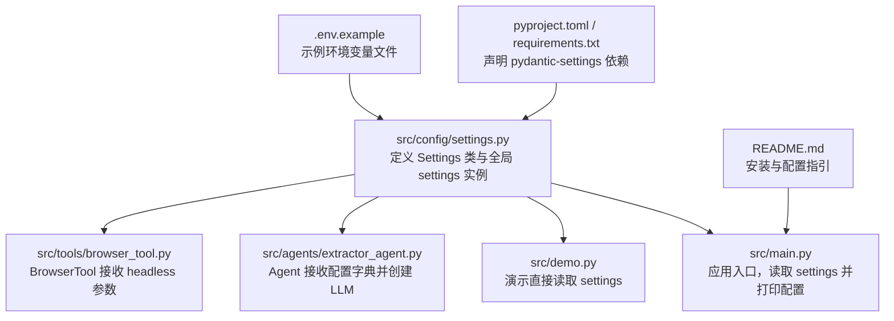
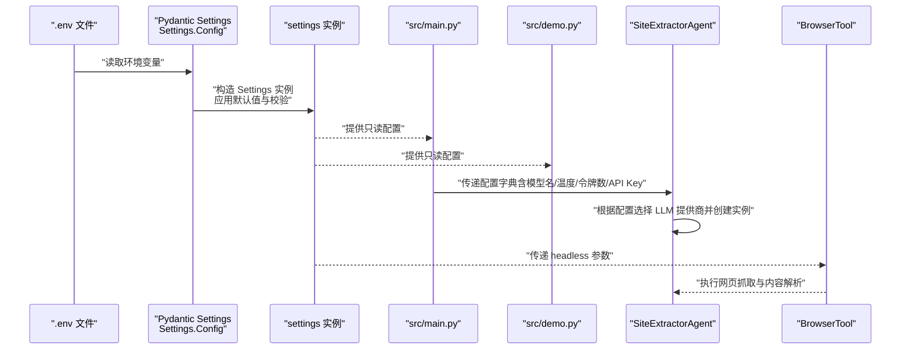
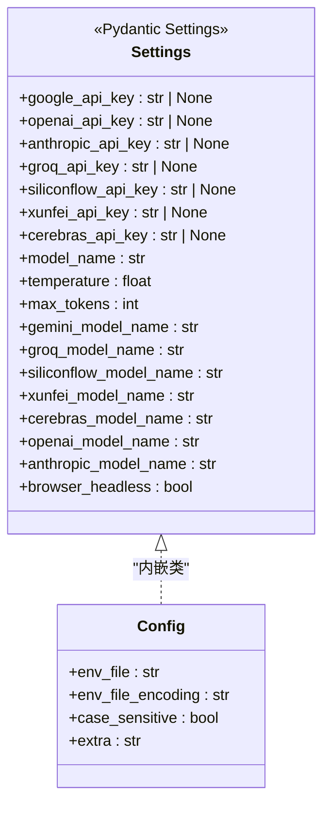
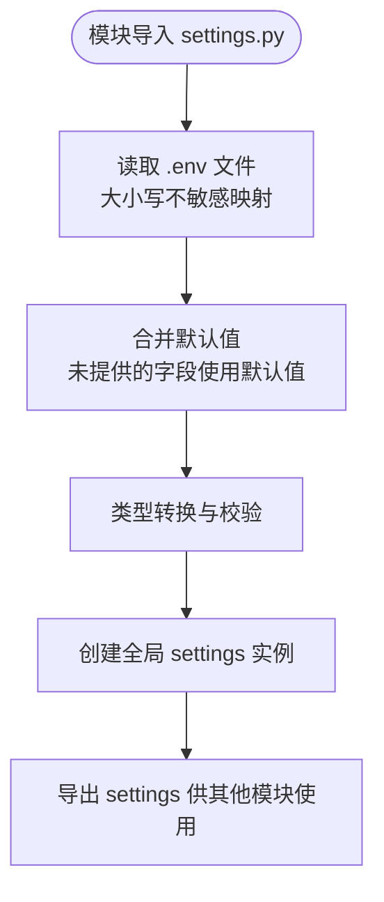
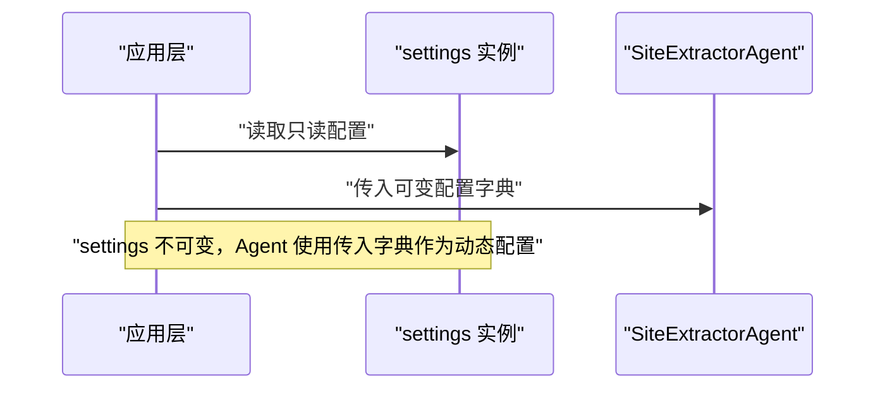
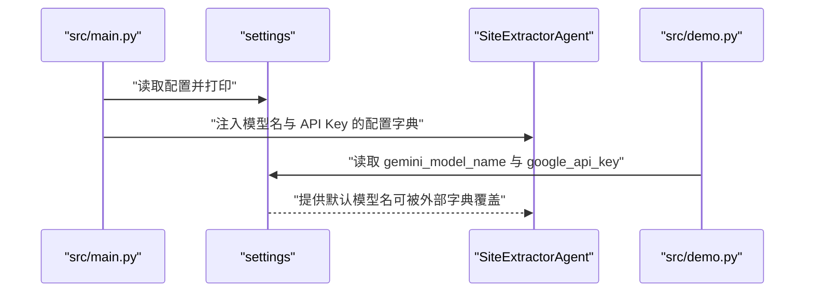
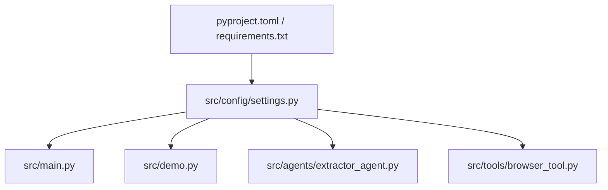

# 配置管理架构

<cite>
**本文引用的文件**
- [src/config/settings.py](file://src/config/settings.py)
- [src/main.py](file://src/main.py)
- [src/demo.py](file://src/demo.py)
- [src/agents/extractor_agent.py](file://src/agents/extractor_agent.py)
- [src/tools/browser_tool.py](file://src/tools/browser_tool.py)
- [pyproject.toml](file://pyproject.toml)
- [requirements.txt](file://requirements.txt)
- [.env.example](file://.env.example)
- [README.md](file://README.md)
- [tests/test_agent.py](file://tests/test_agent.py)
</cite>

## 目录
1. [简介](#简介)
2. [项目结构](#项目结构)
3. [核心组件](#核心组件)
4. [架构总览](#架构总览)
5. [详细组件分析](#详细组件分析)
6. [依赖关系分析](#依赖关系分析)
7. [性能考量](#性能考量)
8. [故障排查指南](#故障排查指南)
9. [结论](#结论)
10. [附录](#附录)

## 简介
本文件聚焦 Site Info Extractor Agent 的配置管理架构，系统性阐述 Settings 类的设计原理与 Pydantic 驱动的配置管理机制。文档覆盖类型安全设计（字段验证、默认值、继承）、配置文件加载流程（环境变量读取、合并与验证）、动态性设计（运行时修改与热更新能力边界）、以及安全性考虑（敏感信息保护与加密建议）。同时提供配置数据流向与处理流程的可视化图示，帮助开发者与运维人员快速理解与维护配置系统。

## 项目结构
配置系统位于 src/config/settings.py，通过 Pydantic Settings 从 .env 文件加载环境变量，并以类型安全的方式暴露给应用其他模块。主要文件与职责如下：
- src/config/settings.py：定义 Settings 类与全局 settings 实例，负责配置字段声明、默认值与环境文件配置
- src/main.py：应用入口，打印当前配置并驱动交互式模式
- src/demo.py：演示如何直接读取配置并调用 LLM
- src/agents/extractor_agent.py：Agent 使用配置字典进行 LLM 实例化
- src/tools/browser_tool.py：浏览器工具接收 headless 配置参数
- pyproject.toml / requirements.txt：声明 pydantic-settings 等依赖
- .env.example：示例环境变量文件
- README.md：安装与配置指引
- tests/test_agent.py：测试用例，验证配置在测试场景下的行为

图表来源
- [src/config/settings.py](file://src/config/settings.py#L1-L56)
- [src/main.py](file://src/main.py#L1-L254)
- [src/demo.py](file://src/demo.py#L1-L51)
- [src/agents/extractor_agent.py](file://src/agents/extractor_agent.py#L1-L330)
- [src/tools/browser_tool.py](file://src/tools/browser_tool.py#L1-L108)
- [pyproject.toml](file://pyproject.toml#L28-L47)
- [.env.example](file://.env.example#L1-L9)
- [README.md](file://README.md#L1-L101)

章节来源
- [src/config/settings.py](file://src/config/settings.py#L1-L56)
- [src/main.py](file://src/main.py#L1-L254)
- [src/demo.py](file://src/demo.py#L1-L51)
- [src/agents/extractor_agent.py](file://src/agents/extractor_agent.py#L1-L330)
- [src/tools/browser_tool.py](file://src/tools/browser_tool.py#L1-L108)
- [pyproject.toml](file://pyproject.toml#L28-L47)
- [.env.example](file://.env.example#L1-L9)
- [README.md](file://README.md#L1-L101)

## 核心组件
- Settings 类：集中声明所有配置字段，包含 API Key、模型参数、提供商特定模型名、浏览器模式等；通过 Config 内部类指定 env_file、编码、大小写敏感性与额外字段处理策略
- 全局 settings 实例：在模块加载时完成环境变量读取与校验，形成进程级只读配置对象
- 应用模块使用方式：
  - src/main.py 与 src/demo.py 直接读取全局 settings
  - SiteExtractorAgent 接收外部传入的配置字典，内部再按需读取 settings 中的默认模型名与 API Key
  - BrowserTool 接收 headless 参数，来自 settings 的 browser_headless 字段

章节来源
- [src/config/settings.py](file://src/config/settings.py#L9-L55)
- [src/main.py](file://src/main.py#L20-L41)
- [src/demo.py](file://src/demo.py#L15-L33)
- [src/agents/extractor_agent.py](file://src/agents/extractor_agent.py#L97-L114)
- [src/tools/browser_tool.py](file://src/tools/browser_tool.py#L13-L19)

## 架构总览
下图展示了配置数据从环境变量到应用模块的流向与处理流程，体现类型安全、默认值与环境变量加载的关键步骤。

图表来源
- [src/config/settings.py](file://src/config/settings.py#L46-L55)
- [src/main.py](file://src/main.py#L34-L41)
- [src/demo.py](file://src/demo.py#L15-L33)
- [src/agents/extractor_agent.py](file://src/agents/extractor_agent.py#L97-L114)
- [src/tools/browser_tool.py](file://src/tools/browser_tool.py#L13-L19)

## 详细组件分析

### Settings 类与类型安全设计
- 字段类型与默认值
  - API Key：字符串类型，允许 None，便于按需启用提供商
  - 模型通用参数：model_name（字符串）、temperature（浮点）、max_tokens（整数），均提供合理默认值
  - 提供商特定模型名：针对免费与付费提供商分别给出默认模型名，确保最小可用性
  - 浏览器模式：browser_headless（布尔），默认无头模式
- 配置继承与环境文件
  - Settings.Config 指定 env_file=".env"、env_file_encoding="utf-8"、case_sensitive=False、extra="ignore"
  - 通过 pydantic-settings 自动从 .env 文件映射到字段，忽略多余键，大小写不敏感
- 类型安全与校验
  - Pydantic 在实例化时进行类型转换与校验，保证字段类型一致性
  - 默认值在未提供环境变量时生效，减少运行期分支判断

图表来源
- [src/config/settings.py](file://src/config/settings.py#L9-L55)

章节来源
- [src/config/settings.py](file://src/config/settings.py#L9-L55)

### 配置加载流程与合并策略
- 环境变量读取
  - 由 pydantic-settings 基于 Settings.Config.env_file 从 .env 文件读取键值
  - 键名大小写不敏感，自动映射到 Settings 字段
- 默认值与合并
  - 若 .env 中未提供某字段，则使用 Settings 中声明的默认值
  - extra="ignore" 表示忽略 .env 中未声明的键，避免异常
- 验证与类型转换
  - Pydantic 在实例化时进行类型转换与校验，确保字段类型正确
- 运行时可见性
  - settings 实例在模块导入时完成加载，后续模块通过 from config.settings import settings 直接使用

图表来源
- [src/config/settings.py](file://src/config/settings.py#L46-L55)

章节来源
- [src/config/settings.py](file://src/config/settings.py#L46-L55)

### 动态性设计与热更新能力边界
- 运行时修改
  - settings 是一个不可变的 Pydantic 设置实例，一旦创建后其字段值不再变化
  - 若需“动态”切换配置，应在应用层以配置字典形式传入（如 SiteExtractorAgent 的构造参数）
- 热更新机制
  - 代码库未实现自动监听 .env 变更并重载 settings 的机制
  - 如需热更新，可在上层业务中实现定时轮询或文件监控，重新实例化 Settings 并替换全局引用（需谨慎处理并发与线程安全）

图表来源
- [src/config/settings.py](file://src/config/settings.py#L54-L55)
- [src/agents/extractor_agent.py](file://src/agents/extractor_agent.py#L97-L114)

章节来源
- [src/config/settings.py](file://src/config/settings.py#L54-L55)
- [src/agents/extractor_agent.py](file://src/agents/extractor_agent.py#L97-L114)

### 配置在应用中的使用
- 应用入口（src/main.py）
  - 打印当前配置表，展示 temperature、max_tokens、browser_headless 等
  - 交互式模式中根据 settings 中的 API Key 列举可用模型，并将所选模型的默认模型名与 API Key 注入配置字典后创建 Agent
- 演示脚本（src/demo.py）
  - 直接读取 settings.gemini_model_name 与 google_api_key，用于创建 LLM 实例
- Agent（src/agents/extractor_agent.py）
  - 接收外部配置字典，内部按优先级选择 LLM 提供商并创建实例
- 浏览器工具（src/tools/browser_tool.py）
  - 接收 headless 参数，来自 settings.browser_headless

图表来源
- [src/main.py](file://src/main.py#L34-L41)
- [src/main.py](file://src/main.py#L182-L182)
- [src/demo.py](file://src/demo.py#L15-L33)
- [src/agents/extractor_agent.py](file://src/agents/extractor_agent.py#L97-L114)

章节来源
- [src/main.py](file://src/main.py#L34-L41)
- [src/main.py](file://src/main.py#L182-L182)
- [src/demo.py](file://src/demo.py#L15-L33)
- [src/agents/extractor_agent.py](file://src/agents/extractor_agent.py#L97-L114)

### 安全性考虑
- 敏感信息保护
  - .env 示例文件明确标注 API Key 的重要性，且 README 指出 .env 已被 .gitignore 保护，避免误提交
  - 建议在生产环境中使用只读权限的 .env 文件，并限制日志输出中对敏感字段的打印
- 配置加密机制
  - 代码库未实现配置加密功能
  - 建议在 CI/CD 环境中使用密钥管理服务（如 Vault、AWS Secrets Manager）存储密钥，运行时解密注入 .env 或环境变量
  - 对于本地开发，可结合操作系统密钥链或第三方加密工具管理 .env 文件

章节来源
- [.env.example](file://.env.example#L1-L9)
- [README.md](file://README.md#L40-L44)

## 依赖关系分析
- 依赖声明
  - pyproject.toml 与 requirements.txt 均声明 pydantic-settings>=2.0.0，确保 Settings 类与环境变量加载能力
- 模块耦合
  - settings 实例被 src/main.py、src/demo.py、src/agents/extractor_agent.py 等模块使用
  - BrowserTool 通过参数接收 headless，降低对 settings 的直接依赖
- 外部集成
  - LLM 提供商的可用性通过导入条件判断，与配置系统解耦，避免因缺少依赖导致配置加载失败

图表来源
- [src/config/settings.py](file://src/config/settings.py#L1-L56)
- [src/main.py](file://src/main.py#L1-L254)
- [src/demo.py](file://src/demo.py#L1-L51)
- [src/agents/extractor_agent.py](file://src/agents/extractor_agent.py#L1-L330)
- [src/tools/browser_tool.py](file://src/tools/browser_tool.py#L1-L108)
- [pyproject.toml](file://pyproject.toml#L28-L47)
- [requirements.txt](file://requirements.txt#L10-L13)

章节来源
- [pyproject.toml](file://pyproject.toml#L28-L47)
- [requirements.txt](file://requirements.txt#L10-L13)
- [src/config/settings.py](file://src/config/settings.py#L1-L56)
- [src/main.py](file://src/main.py#L1-L254)
- [src/demo.py](file://src/demo.py#L1-L51)
- [src/agents/extractor_agent.py](file://src/agents/extractor_agent.py#L1-L330)
- [src/tools/browser_tool.py](file://src/tools/browser_tool.py#L1-L108)

## 性能考量
- 配置加载时机
  - settings 在模块导入时完成加载，属于一次性开销，对运行时性能影响极小
- 类型转换与校验
  - Pydantic 的类型转换与校验发生在实例化阶段，通常在应用启动时完成，不影响运行期请求处理
- 配置访问热点
  - settings 作为全局只读对象，访问成本低；若在高频路径中频繁读取，可考虑在局部作用域缓存常用字段值

## 故障排查指南
- 未检测到 API Key
  - 现象：应用入口提示未检测到任何 API Key
  - 排查：确认 .env 文件已复制并填写 GOOGLE_API_KEY 等必要字段
- 模型选择失败
  - 现象：交互式模式无法选择模型或抛出异常
  - 排查：检查对应提供商的 API Key 是否有效；确认对应 LLM 依赖是否安装
- 浏览器模式问题
  - 现象：无头模式与有头模式不符合预期
  - 排查：确认 settings.browser_headless 的值是否符合预期；检查 BrowserTool 的 headless 参数传递
- 配置未生效
  - 现象：修改 .env 后配置未更新
  - 说明：settings 实例不可变，需重启应用以重新加载 .env；或在上层实现热更新逻辑

章节来源
- [src/main.py](file://src/main.py#L235-L240)
- [src/main.py](file://src/main.py#L182-L182)
- [src/tools/browser_tool.py](file://src/tools/browser_tool.py#L13-L19)
- [src/config/settings.py](file://src/config/settings.py#L54-L55)

## 结论
Site Info Extractor Agent 的配置管理采用 Pydantic Settings 驱动，具备类型安全、默认值与环境变量加载等特性。Settings 类通过 Config 内部类统一管理环境文件、编码、大小写敏感性与额外字段处理策略；全局 settings 实例在模块导入时完成加载，为应用提供只读配置。应用层通过配置字典实现动态配置注入，满足不同提供商与模型的选择需求。当前未实现自动热更新，但可通过外部机制实现。安全性方面，.env 文件受版本控制保护，建议在生产环境引入密钥管理与加密策略。

## 附录
- 安装与运行
  - 参考 README 的安装与运行步骤，确保安装依赖并准备 .env 文件
- 依赖清单
  - pydantic-settings>=2.0.0 为配置系统核心依赖
- 测试参考
  - 单元测试验证了 BrowserTool 与 Agent 的基本行为，可作为配置使用场景的参考

章节来源
- [README.md](file://README.md#L11-L25)
- [pyproject.toml](file://pyproject.toml#L28-L47)
- [requirements.txt](file://requirements.txt#L10-L13)
- [tests/test_agent.py](file://tests/test_agent.py#L26-L66)