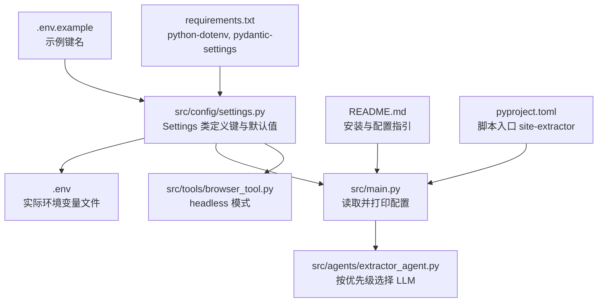
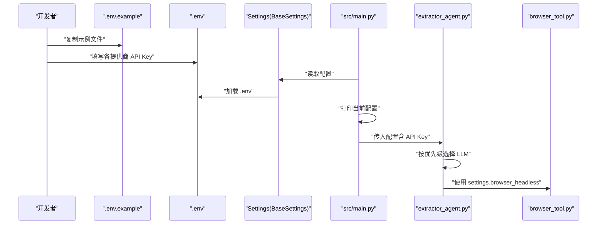
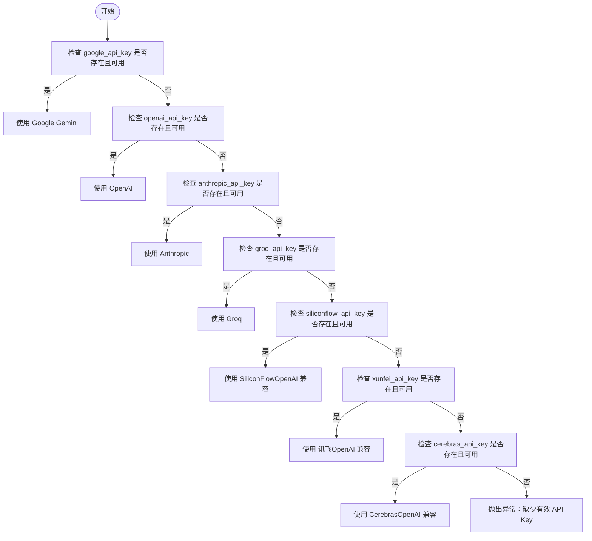
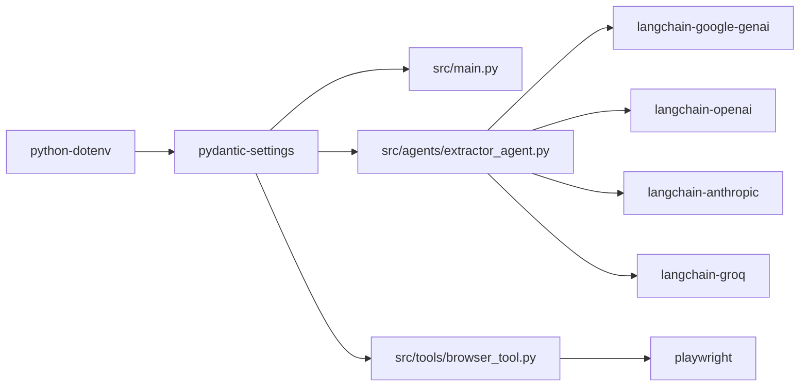

# 环境变量配置

<cite>
**本文引用的文件**
- [.env.example](file://.env.example)
- [src/config/settings.py](file://src/config/settings.py)
- [src/main.py](file://src/main.py)
- [src/agents/extractor_agent.py](file://src/agents/extractor_agent.py)
- [src/tools/browser_tool.py](file://src/tools/browser_tool.py)
- [README.md](file://README.md)
- [requirements.txt](file://requirements.txt)
- [pyproject.toml](file://pyproject.toml)
</cite>

## 目录
1. [简介](#简介)
2. [项目结构](#项目结构)
3. [核心组件](#核心组件)
4. [架构总览](#架构总览)
5. [详细组件分析](#详细组件分析)
6. [依赖关系分析](#依赖关系分析)
7. [性能考量](#性能考量)
8. [故障排查指南](#故障排查指南)
9. [结论](#结论)
10. [附录](#附录)

## 简介
本文件面向 Site Info Extractor Agent 的使用者与维护者，系统性说明环境变量的结构、加载顺序与优先级、以及针对不同 LLM 提供商（Google Gemini、OpenAI、Anthropic、Groq、SiliconFlow、讯飞、Cerebras）的配置方法。同时提供密钥安全存储、环境隔离、调试相关配置的最佳实践，并给出常见配置错误的排查步骤。

## 项目结构
围绕环境变量与配置的关键文件与职责如下：
- .env.example：示例环境变量文件，包含各 LLM 提供商的 API Key 键名
- src/config/settings.py：使用 Pydantic Settings 管理配置，定义键名、默认值与加载来源
- src/main.py：应用入口，打印当前配置、进行 API Key 可用性检查
- src/agents/extractor_agent.py：根据配置动态选择 LLM 提供商并创建 LLM 实例
- src/tools/browser_tool.py：浏览器工具，受 settings.browser_headless 影响
- README.md：快速开始与环境变量配置说明
- requirements.txt：运行时依赖，包含 python-dotenv、pydantic-settings
- pyproject.toml：项目脚本入口 site-extractor 指向 src/main:main

图表来源
- [.env.example](file://.env.example#L1-L9)
- [src/config/settings.py](file://src/config/settings.py#L9-L55)
- [src/main.py](file://src/main.py#L34-L42)
- [src/agents/extractor_agent.py](file://src/agents/extractor_agent.py#L116-L193)
- [src/tools/browser_tool.py](file://src/tools/browser_tool.py#L13-L19)
- [README.md](file://README.md#L27-L44)
- [requirements.txt](file://requirements.txt#L10-L13)
- [pyproject.toml](file://pyproject.toml#L58-L59)

章节来源
- [README.md](file://README.md#L27-L44)
- [requirements.txt](file://requirements.txt#L10-L13)
- [pyproject.toml](file://pyproject.toml#L58-L59)

## 核心组件
- 环境变量键名与用途
  - GOOGLE_API_KEY：Google Gemini 模型必需
  - OPENAI_API_KEY：OpenAI 模型可选
  - ANTHROPIC_API_KEY：Anthropic 模型可选
  - GROQ_API_KEY：Groq 模型可选
  - SILICONFLOW_API_KEY：SiliconFlow 模型可选
  - XUNFEI_API_KEY：讯飞模型可选
  - CEREBRAS_API_KEY：Cerebras 模型可选
- 默认模型与参数
  - model_name、temperature、max_tokens、browser_headless 等
  - 各提供商默认模型名称（如 gemini-2.5-flash、gpt-4o-mini、claude-3-5-sonnet-20241022 等）

章节来源
- [.env.example](file://.env.example#L1-L9)
- [src/config/settings.py](file://src/config/settings.py#L12-L44)
- [README.md](file://README.md#L83-L92)

## 架构总览
下图展示环境变量加载与应用的端到端流程：从 .env.example 到 .env，再到 Pydantic Settings 加载，最终由 Agent 与工具模块使用。

图表来源
- [.env.example](file://.env.example#L1-L9)
- [src/config/settings.py](file://src/config/settings.py#L46-L51)
- [src/main.py](file://src/main.py#L34-L42)
- [src/agents/extractor_agent.py](file://src/agents/extractor_agent.py#L116-L193)
- [src/tools/browser_tool.py](file://src/tools/browser_tool.py#L13-L19)

## 详细组件分析

### 环境变量结构与键名
- 键名设计遵循“LLM 提供商 + API_KEY”的统一命名，便于在配置层与代码层一致映射
- 示例文件中明确标注了各键的用途与是否必需（例如 Google Gemini 的 API Key 为必需）

章节来源
- [.env.example](file://.env.example#L1-L9)

### Settings 类与加载机制
- Settings 继承自 BaseSettings，通过 class Config 指定 env_file=".env"、编码为 utf-8、大小写不敏感、忽略额外字段
- 项目使用 pydantic-settings 与 python-dotenv，确保 .env 文件被自动加载
- Settings 实例 settings 在模块顶层创建，供其他模块直接导入使用

章节来源
- [src/config/settings.py](file://src/config/settings.py#L46-L55)
- [requirements.txt](file://requirements.txt#L10-L13)

### 应用入口中的配置展示与校验
- main.py 在启动时打印当前配置表（温度、最大令牌、浏览器模式）
- 对所有 LLM 提供商的 API Key 进行检查，若均为空则输出警告提示

章节来源
- [src/main.py](file://src/main.py#L34-L42)
- [src/main.py](file://src/main.py#L235-L240)

### LLM 提供商选择优先级
- 优先级顺序：Google Gemini → OpenAI → Anthropic → Groq → SiliconFlow → 讯飞 → Cerebras
- 选择依据：配置字典中是否存在对应 API Key 且对应 LLM 导入可用

图表来源
- [src/agents/extractor_agent.py](file://src/agents/extractor_agent.py#L116-L193)

章节来源
- [src/agents/extractor_agent.py](file://src/agents/extractor_agent.py#L116-L193)

### 浏览器工具与配置耦合
- BrowserTool 的 headless 参数来自 settings.browser_headless
- 无头模式默认开启，适合服务器环境；有头模式便于本地调试

章节来源
- [src/tools/browser_tool.py](file://src/tools/browser_tool.py#L13-L19)
- [src/config/settings.py](file://src/config/settings.py#L44)

### 不同 LLM 提供商的配置要点
- Google Gemini（必需键）
  - 使用 GOOGLE_API_KEY
  - 默认模型：gemini-2.5-flash
- OpenAI（可选键）
  - 使用 OPENAI_API_KEY
  - 默认模型：gpt-4o-mini
- Anthropic（可选键）
  - 使用 ANTHROPIC_API_KEY
  - 默认模型：claude-3-5-sonnet-20241022
- Groq（可选键）
  - 使用 GROQ_API_KEY
  - 默认模型：llama-3.3-70b-versatile
- SiliconFlow（可选键）
  - 使用 SILICONFLOW_API_KEY
  - 通过 OpenAI 兼容接口调用，base_url 指向 SiliconFlow
- 讯飞（可选键）
  - 使用 XUNFEI_API_KEY
  - 通过 OpenAI 兼容接口调用，base_url 指向讯飞
- Cerebras（可选键）
  - 使用 CEREBRAS_API_KEY
  - 通过 OpenAI 兼容接口调用，base_url 指向 Cerebras

章节来源
- [src/config/settings.py](file://src/config/settings.py#L28-L41)
- [src/agents/extractor_agent.py](file://src/agents/extractor_agent.py#L116-L193)

## 依赖关系分析
- 环境变量加载依赖
  - python-dotenv：从 .env 文件加载键值
  - pydantic-settings：将键值转换为强类型配置对象
- 运行时依赖
  - langchain-* 系列：提供各 LLM 提供商客户端
  - playwright：浏览器工具
  - rich：控制台输出与表格展示

图表来源
- [requirements.txt](file://requirements.txt#L10-L13)
- [src/agents/extractor_agent.py](file://src/agents/extractor_agent.py#L44-L74)
- [src/tools/browser_tool.py](file://src/tools/browser_tool.py#L6-L7)

章节来源
- [requirements.txt](file://requirements.txt#L10-L13)

## 性能考量
- 选择合适的默认模型与温度、最大令牌数，有助于减少请求耗时与成本
- 无头模式的浏览器工具更节省资源，适合批量任务
- 优先使用免费提供商（如 Google Gemini、Groq）以降低开销

## 故障排查指南
- 未检测到 API Key
  - 现象：启动时出现“未检测到 API Key”的警告
  - 排查：确认 .env 文件已复制并填写了至少一个提供商的 API Key
  - 参考：入口处的检查逻辑与提示
- 模型未找到（404 NOT_FOUND）
  - 现象：调用模型时报 404
  - 排查：尝试更换默认模型或在对应平台启用目标模型
  - 参考：README 中关于模型列表与启用说明
- 密钥格式错误或权限不足
  - 现象：认证失败或额度不足
  - 排查：核对密钥是否正确、是否在对应平台启用、是否具备相应配额
- 环境变量未生效
  - 现象：修改 .env 后配置未更新
  - 排查：确认 .env 文件位于项目根目录、编码为 UTF-8、大小写不敏感设置已启用
  - 参考：Settings.Config 的 env_file、env_file_encoding、case_sensitive

章节来源
- [src/main.py](file://src/main.py#L235-L240)
- [README.md](file://README.md#L89-L92)
- [src/config/settings.py](file://src/config/settings.py#L46-L51)

## 结论
通过 .env.example 明确的键名约定、Settings 的强类型配置与 pydantic-settings 的自动加载机制，项目实现了清晰、可维护的环境变量体系。结合 LLM 提供商的优先级选择与浏览器工具的无头模式，用户可在不同场景下灵活配置并稳定运行。

## 附录

### 环境变量加载顺序与优先级
- 加载顺序
  1) 读取 .env 文件（UTF-8 编码）
  2) 读取系统环境变量（大小写不敏感）
  3) 若两者冲突，系统环境变量会覆盖 .env 中的同名键
- 优先级
  - 系统环境变量 > .env 文件
  - Settings.Config.extra="ignore" 表示忽略未显式声明的键，避免误用

章节来源
- [src/config/settings.py](file://src/config/settings.py#L46-L51)

### 安全与最佳实践
- 将 .env 文件加入 .gitignore，避免提交到版本库
- 不要在代码或提交历史中暴露真实密钥
- 在 CI/CD 环境中使用受控的密钥注入方式
- 使用最小权限原则，仅授予必要的 API 权限

章节来源
- [README.md](file://README.md#L40-L44)

### 调试相关配置
- 日志与输出
  - 使用 rich 控制台输出配置表与运行信息
  - 交互模式下可实时看到提取结果与错误堆栈
- 浏览器模式
  - 通过 settings.browser_headless 控制是否使用无头模式
  - 有头模式便于本地调试页面行为

章节来源
- [src/main.py](file://src/main.py#L34-L42)
- [src/tools/browser_tool.py](file://src/tools/browser_tool.py#L13-L19)
- [src/config/settings.py](file://src/config/settings.py#L44)