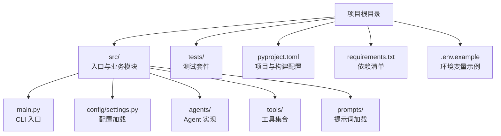
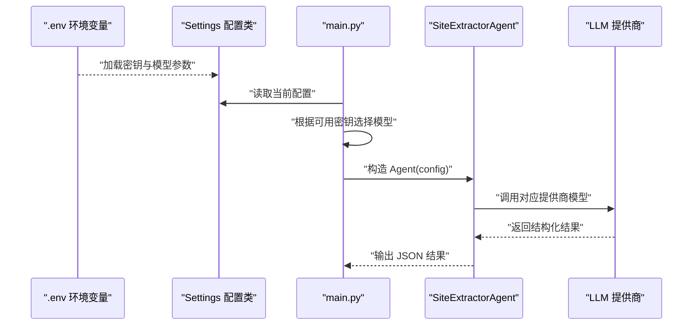
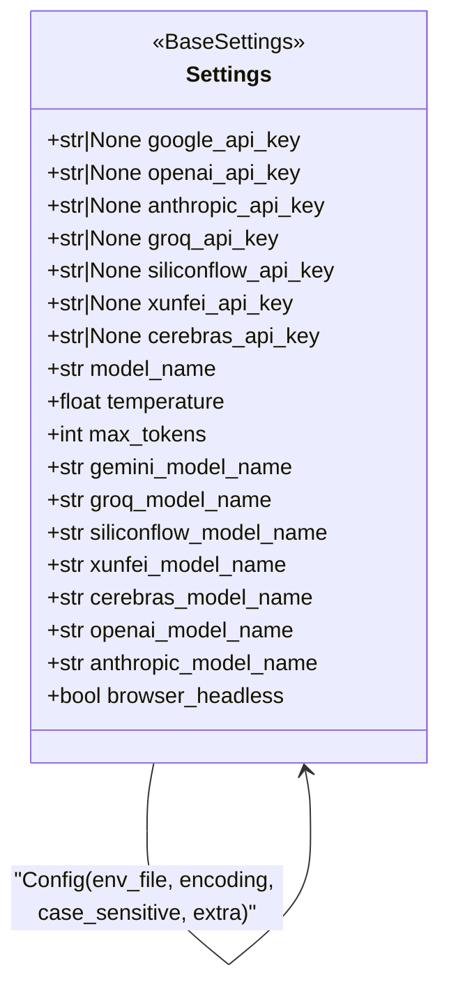
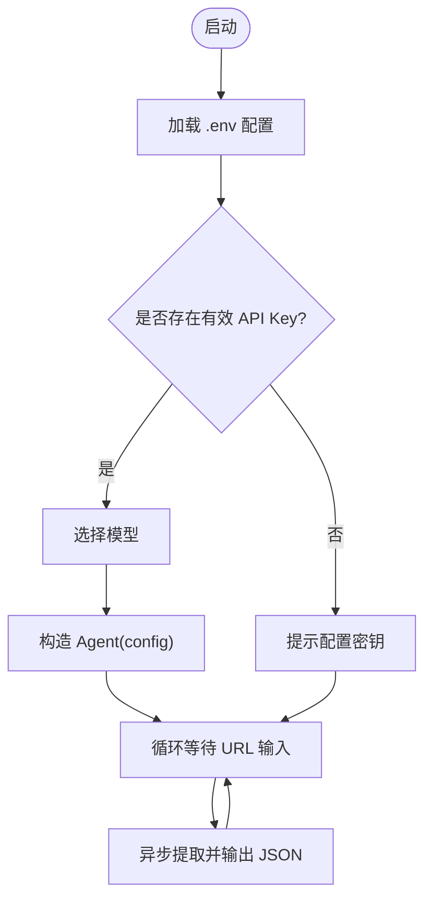
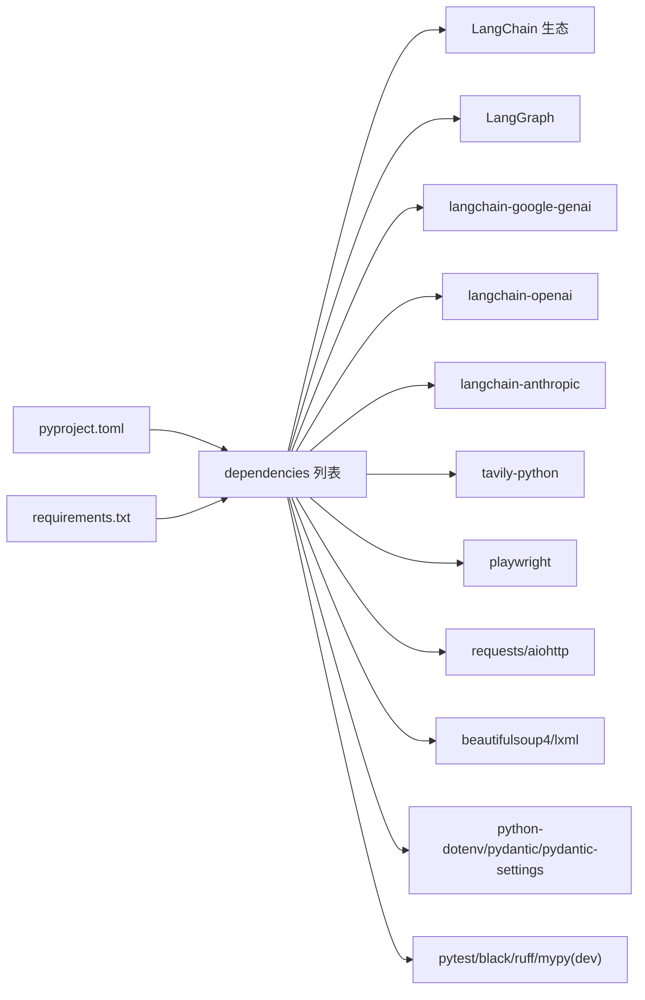

# 部署配置

<cite>
**本文引用的文件**
- [pyproject.toml](file://pyproject.toml)
- [requirements.txt](file://requirements.txt)
- [.env.example](file://.env.example)
- [src/config/settings.py](file://src/config/settings.py)
- [src/main.py](file://src/main.py)
- [README.md](file://README.md)
- [tests/test_agent.py](file://tests/test_agent.py)
- [conftest.py](file://conftest.py)
- [src/prompts/__init__.py](file://src/prompts/__init__.py)
</cite>

## 目录
1. [简介](#简介)
2. [项目结构](#项目结构)
3. [核心组件](#核心组件)
4. [架构总览](#架构总览)
5. [详细组件分析](#详细组件分析)
6. [依赖分析](#依赖分析)
7. [性能考虑](#性能考虑)
8. [故障排查指南](#故障排查指南)
9. [结论](#结论)
10. [附录](#附录)

## 简介
本文件面向 Site Info Extractor Agent 的部署配置，覆盖开发、测试、生产三类环境的配置差异与最佳实践；解释 pyproject.toml 中的项目配置（依赖、构建、元数据、脚本等）；提供容器化部署的环境变量与配置文件挂载建议；说明云平台（AWS/GCP/Azure）的环境变量配置要点；并给出配置热更新、动态配置、备份与版本管理的可行方案与建议。

## 项目结构
该项目采用“源码分层 + 配置集中”的组织方式：核心逻辑位于 src/ 下，配置通过 pydantic-settings 从 .env 加载；入口脚本通过命令行入口点运行；测试与开发工具在 requirements.txt 与 pyproject.toml 的 dev 依赖中定义。

图表来源
- [src/main.py](file://src/main.py#L1-L254)
- [src/config/settings.py](file://src/config/settings.py#L1-L56)
- [pyproject.toml](file://pyproject.toml#L1-L75)
- [.env.example](file://.env.example#L1-L9)

章节来源
- [README.md](file://README.md#L57-L72)
- [pyproject.toml](file://pyproject.toml#L1-L75)
- [requirements.txt](file://requirements.txt#L1-L36)

## 核心组件
- 配置加载与模型选择：应用通过 settings.py 中的 Settings 类从 .env 加载键值，并在主程序中根据可用 API Key 决定可选模型与默认参数。
- CLI 入口与交互：main.py 提供交互式模式，打印当前配置并按用户选择加载对应模型与密钥。
- 依赖与构建：pyproject.toml 定义构建后端、项目元数据、依赖、可选开发依赖与命令行脚本；requirements.txt 作为传统依赖清单存在。
- 测试与开发：tests/test_agent.py 与 conftest.py 提供基础测试与路径/警告配置。

章节来源
- [src/config/settings.py](file://src/config/settings.py#L9-L56)
- [src/main.py](file://src/main.py#L34-L246)
- [pyproject.toml](file://pyproject.toml#L5-L75)
- [requirements.txt](file://requirements.txt#L1-L36)
- [tests/test_agent.py](file://tests/test_agent.py#L1-L80)
- [conftest.py](file://conftest.py#L1-L20)

## 架构总览
下图展示从环境变量到运行时配置、再到模型选择与执行的整体流程。

图表来源
- [src/config/settings.py](file://src/config/settings.py#L9-L56)
- [src/main.py](file://src/main.py#L44-L246)

## 详细组件分析

### 配置模块（settings.py）
- 配置来源：通过 pydantic-settings 从 .env 文件加载，编码为 UTF-8，大小写不敏感，额外字段忽略。
- 关键配置项：
  - API Key：支持多家提供商的密钥字段，用于启用相应模型。
  - 模型名称与推理参数：统一的温度、最大令牌数，以及各提供商默认模型名。
  - 浏览器模式：是否以无头模式运行浏览器工具。
- 全局实例：settings 是单例，可在应用任意模块导入使用。

图表来源
- [src/config/settings.py](file://src/config/settings.py#L9-L56)

章节来源
- [src/config/settings.py](file://src/config/settings.py#L9-L56)

### CLI 入口与交互（main.py）
- 启动流程：打印横幅与当前配置表，检查是否存在任一 API Key，若无则提示配置。
- 模型选择：根据已配置的 API Key 动态列出可用模型，支持单选或多选分支。
- 执行提取：构造 SiteExtractorAgent，循环读取用户输入的 URL，异步执行提取并输出 JSON 结果。
- 信号处理：捕获中断信号，优雅退出。

图表来源
- [src/main.py](file://src/main.py#L230-L246)
- [src/main.py](file://src/main.py#L44-L228)

章节来源
- [src/main.py](file://src/main.py#L26-L246)

### 项目配置（pyproject.toml）
- 构建系统：使用 hatchling 作为构建后端。
- 项目元数据：名称、版本、描述、许可证、作者、关键字、分类等。
- 依赖：核心依赖（LangChain 生态、Playwright、HTTP/解析库、类型扩展等）。
- 可选依赖：开发工具（pytest、black、ruff、mypy）。
- 命令行脚本：注册 site-extractor 命令指向 src.main:main。
- 代码风格与静态检查：black、ruff、mypy 的规则与版本约束。

章节来源
- [pyproject.toml](file://pyproject.toml#L1-L75)

### 依赖清单（requirements.txt）
- 与 pyproject.toml 的 dependencies 子集一致，覆盖 LangChain 核心、提供商适配器、工具库、HTTP/解析、异步支持、日志与开发测试等。
- 作为传统安装方式的依赖清单存在。

章节来源
- [requirements.txt](file://requirements.txt#L1-L36)

### 环境变量示例（.env.example）
- 包含 Google、OpenAI、Anthropic 的 API Key 示例字段，强调安全存放与不在版本控制中提交。

章节来源
- [.env.example](file://.env.example#L1-L9)
- [README.md](file://README.md#L27-L44)

### 测试与开发（tests/test_agent.py、conftest.py）
- 测试：包含浏览器工具初始化与 Agent 初始化的基本测试，以及对提取流程的 Mock 测试骨架。
- 开发：抑制特定版本警告，注入项目根路径以便测试导入。

章节来源
- [tests/test_agent.py](file://tests/test_agent.py#L1-L80)
- [conftest.py](file://conftest.py#L1-L20)

### 提示词加载（src/prompts/__init__.py）
- 从提示词目录加载系统提示词，若文件不存在则回退到默认提示词文本。
- 便于在部署时通过挂载或替换提示词文件实现策略调整。

章节来源
- [src/prompts/__init__.py](file://src/prompts/__init__.py#L12-L30)

## 依赖分析
- 语言与运行时：Python >= 3.10；推荐 3.11+。
- 核心生态：LangChain/LangChain Core/LangGraph、Google/Anthropic/OpenAI 提供商适配器、Tavily 搜索、Playwright 浏览器、HTTP/解析与异步支持。
- 配置与类型：python-dotenv、pydantic、pydantic-settings、typing-extensions。
- 开发工具：pytest、pytest-asyncio、black、ruff、mypy。

图表来源
- [pyproject.toml](file://pyproject.toml#L28-L47)
- [requirements.txt](file://requirements.txt#L1-L36)

章节来源
- [pyproject.toml](file://pyproject.toml#L10-L47)
- [requirements.txt](file://requirements.txt#L1-L36)

## 性能考虑
- 模型选择与成本：不同提供商的模型默认值与价格差异较大，建议在生产中明确指定模型并限制 max_tokens 以控制成本与延迟。
- 浏览器模式：无头模式（headless=True）减少资源占用，适合容器化与云上部署。
- 异步与并发：利用 aiohttp 与异步接口提升网络请求效率；合理设置超时与重试策略。
- 缓存与预热：对频繁访问的目标站点可引入缓存层；首次加载 Playwright 二进制可能较慢，建议在镜像构建阶段完成安装。
- 日志与可观测性：结合 rich 输出与外部日志系统，区分 info/warn/error 级别，便于定位问题。

## 故障排查指南
- 未检测到 API Key：当所有提供商密钥均为空时，交互模式会提示配置。请确保 .env 中至少配置一个可用密钥。
- 模型不可用：若出现模型未找到错误，尝试切换到其他可用模型或在提供商平台启用相应模型。
- Playwright 二进制缺失：首次运行需安装浏览器驱动，可通过安装脚本完成。
- 版本兼容警告：针对特定 Python 版本与 Pydantic 的兼容性警告可按 conftest.py 与 demo.py 中的做法进行抑制或升级依赖。
- 测试失败：确保测试前已正确设置 PYTHONPATH 并安装 dev 依赖；必要时清理虚拟环境重新安装。

章节来源
- [src/main.py](file://src/main.py#L235-L240)
- [README.md](file://README.md#L89-L92)
- [conftest.py](file://conftest.py#L10-L15)
- [tests/test_agent.py](file://tests/test_agent.py#L18-L23)

## 结论
本项目通过 pydantic-settings 将环境变量与配置解耦，配合 pyproject.toml 的构建与依赖声明，形成清晰的开发与部署边界。生产环境建议明确模型与参数、启用无头浏览器、严格管理密钥与日志级别，并结合容器化与云平台的环境变量机制实现标准化部署。

## 附录

### 开发/测试/生产环境配置差异与最佳实践
- 开发环境
  - 使用 .env.example 生成本地 .env，仅配置必要密钥（如 GOOGLE_API_KEY）。
  - 可开启有头浏览器模式以便调试页面行为。
  - 安装 dev 依赖进行代码格式与静态检查。
- 测试环境
  - 使用最小化配置，仅启用一个提供商密钥用于回归测试。
  - 在 CI 中固定 Python 版本与依赖范围，确保一致性。
- 生产环境
  - 通过云平台或容器编排系统的机密管理服务注入密钥，避免硬编码。
  - 固定模型名称与推理参数，避免因默认值变更导致的行为漂移。
  - 启用无头模式与合理的超时/重试策略，降低资源消耗。

### pyproject.toml 项目配置要点
- 构建与元数据：名称、版本、许可证、分类器、关键字等。
- 依赖与可选依赖：核心依赖与开发工具。
- 命令行脚本：site-extractor 指向 src.main:main。
- 代码风格：black、ruff、mypy 的规则与目标版本。

章节来源
- [pyproject.toml](file://pyproject.toml#L5-L75)

### 容器化部署建议
- 环境变量传递
  - 使用 DOCKER ENV 或 compose 的 environment 字段注入密钥与模型参数。
  - 将 .env 映射为只读卷，或通过机密管理服务注入。
- 配置文件挂载
  - 将提示词目录挂载为卷，便于在不重建镜像的情况下更新提示词。
- 运行命令
  - 使用 pyproject.toml 中注册的命令入口运行应用。
- 体积优化
  - 在多阶段构建中仅保留运行时依赖，减少镜像体积。

### 云平台部署要点（AWS/GCP/Azure）
- AWS
  - 使用 Systems Manager Parameter Store 或 Secrets Manager 注入密钥。
  - 在 ECS/EKS 中通过 Task Definition/Deployment 的 secrets 字段映射。
- GCP
  - 使用 Secret Manager 存储密钥，通过 Workload Identity 在 GKE 中拉取。
- Azure
  - 使用 Key Vault 存储密钥，通过托管身份在 AKS 中拉取。

### 配置热更新与动态配置
- 环境变量热加载：在容器编排中通过滚动更新触发 Pod 重启以加载新 .env。
- 配置文件热加载：监听提示词目录变化并重新加载；对模型参数建议通过重启生效。
- 动态路由与开关：在应用内增加特性开关与模型切换接口（需在业务层扩展）。

### 配置备份与版本管理
- 备份策略
  - 将 .env 与提示词目录纳入版本控制的“示例/模板”文件，不存储真实密钥。
  - 使用机密管理服务的版本能力保存密钥历史。
- 版本管理
  - 通过 Git 分支与标签管理不同环境的配置模板。
  - 对提示词与系统参数变更建立变更记录与审批流程。