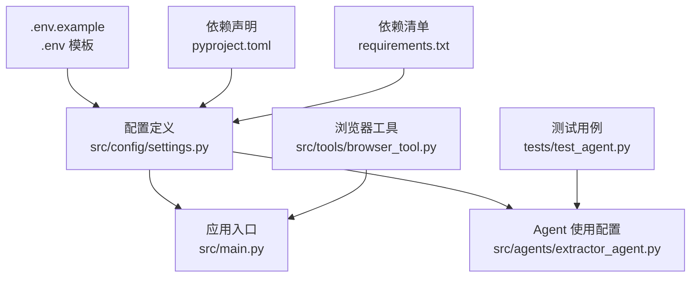
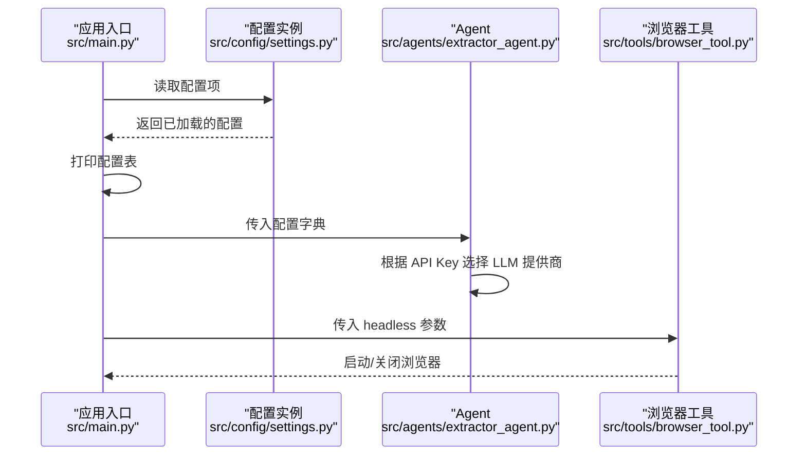
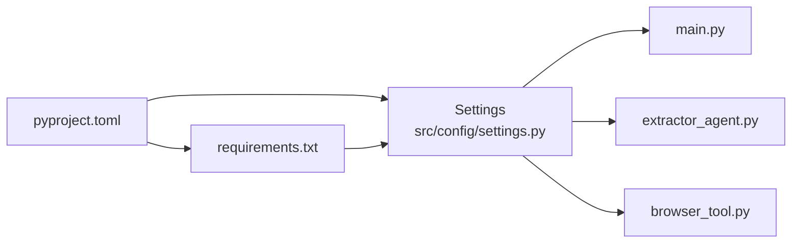
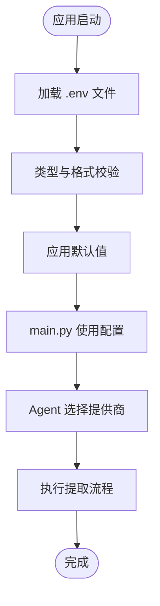

# 配置管理

<cite>
**本文引用的文件**
- [settings.py](file://src/config/settings.py)
- [.env.example](file://.env.example)
- [pyproject.toml](file://pyproject.toml)
- [requirements.txt](file://requirements.txt)
- [main.py](file://src/main.py)
- [extractor_agent.py](file://src/agents/extractor_agent.py)
- [browser_tool.py](file://src/tools/browser_tool.py)
- [test_agent.py](file://tests/test_agent.py)
- [conftest.py](file://conftest.py)
</cite>

## 目录
1. [简介](#简介)
2. [项目结构](#项目结构)
3. [核心组件](#核心组件)
4. [架构总览](#架构总览)
5. [详细组件分析](#详细组件分析)
6. [依赖关系分析](#依赖关系分析)
7. [性能考量](#性能考量)
8. [故障排查指南](#故障排查指南)
9. [结论](#结论)
10. [附录](#附录)

## 简介
本文件面向 Site Info Extractor Agent 的配置管理，系统化说明环境变量与配置文件的组织方式、Settings 类的设计与实现、配置项优先级与覆盖规则、以及在不同部署环境下的最佳实践。同时给出配置验证与错误处理机制的说明，并提供配置迁移与版本兼容性的指导。

## 项目结构
配置相关的关键文件与职责如下：
- 配置定义与加载：src/config/settings.py
- 示例环境变量模板：.env.example
- 项目依赖与脚本：pyproject.toml
- 依赖清单：requirements.txt
- 应用入口与配置展示：src/main.py
- Agent 使用配置：src/agents/extractor_agent.py
- 浏览器工具参数来源：src/tools/browser_tool.py
- 测试与配置使用：tests/test_agent.py、conftest.py

图表来源
- [settings.py](file://src/config/settings.py#L1-L56)
- [main.py](file://src/main.py#L1-L254)
- [extractor_agent.py](file://src/agents/extractor_agent.py#L1-L330)
- [.env.example](file://.env.example#L1-L9)
- [pyproject.toml](file://pyproject.toml#L1-L75)
- [requirements.txt](file://requirements.txt#L1-L36)
- [browser_tool.py](file://src/tools/browser_tool.py#L1-L108)
- [test_agent.py](file://tests/test_agent.py#L1-L80)

章节来源
- [settings.py](file://src/config/settings.py#L1-L56)
- [.env.example](file://.env.example#L1-L9)
- [pyproject.toml](file://pyproject.toml#L1-L75)
- [requirements.txt](file://requirements.txt#L1-L36)
- [main.py](file://src/main.py#L1-L254)
- [extractor_agent.py](file://src/agents/extractor_agent.py#L1-L330)
- [browser_tool.py](file://src/tools/browser_tool.py#L1-L108)
- [test_agent.py](file://tests/test_agent.py#L1-L80)
- [conftest.py](file://conftest.py#L1-L19)

## 核心组件
- Settings 类：集中定义所有配置项，使用 Pydantic v2 的 pydantic-settings 进行环境变量加载与类型校验。
- 环境变量模板：.env.example 提供 API Key 与可选配置项的命名参考。
- 应用入口：main.py 展示当前配置并根据 API Key 可用性引导用户选择模型。
- Agent：extractor_agent.py 通过传入的 config 字典使用具体提供商的 API Key 与模型名。
- 浏览器工具：browser_tool.py 接收 headless 参数，来源于 Settings 的 browser_headless。

章节来源
- [settings.py](file://src/config/settings.py#L9-L55)
- [.env.example](file://.env.example#L1-L9)
- [main.py](file://src/main.py#L34-L42)
- [extractor_agent.py](file://src/agents/extractor_agent.py#L97-L115)
- [browser_tool.py](file://src/tools/browser_tool.py#L13-L19)

## 架构总览
配置加载与使用的关键流程：
- 启动时，Settings 从 .env 文件加载键值对，按字段类型进行转换与校验。
- 应用入口读取 settings 并打印当前配置；根据 API Key 的存在与否决定交互模式可用性。
- Agent 在构造时接收 config 字典，内部根据 API Key 与可用性动态选择 LLM 提供商。
- 浏览器工具根据 settings.browser_headless 决定是否以无头模式启动。

图表来源
- [main.py](file://src/main.py#L34-L42)
- [settings.py](file://src/config/settings.py#L9-L55)
- [extractor_agent.py](file://src/agents/extractor_agent.py#L97-L115)
- [browser_tool.py](file://src/tools/browser_tool.py#L13-L19)

## 详细组件分析

### Settings 类设计与实现
- 继承自 pydantic_settings.BaseSettings，具备自动从环境变量加载、类型转换与校验的能力。
- 配置项分类：
  - API Key：google_api_key、openai_api_key、anthropic_api_key、groq_api_key、siliconflow_api_key、xunfei_api_key、cerebras_api_key（均为可空字符串）。
  - 模型通用配置：model_name、temperature、max_tokens。
  - 各提供商特定模型名：gemini_model_name、groq_model_name、siliconflow_model_name、xunfei_model_name、cerebras_model_name、openai_model_name、anthropic_model_name。
  - 浏览器配置：browser_headless（布尔值）。
- 配置类 Config：
  - env_file 指向 .env。
  - env_file_encoding 使用 utf-8。
  - case_sensitive 设为 False，便于大小写不敏感匹配。
  - extra 设置为 "ignore"，忽略未显式声明的字段，提升灵活性。
- 全局实例 settings 在模块加载时创建，供应用各处直接导入使用。

章节来源
- [settings.py](file://src/config/settings.py#L9-L55)

### 环境变量与 .env 文件
- .env.example 提供了示例键名，包括：
  - GOOGLE_API_KEY（必填，用于 Google Gemini）
  - OPENAI_API_KEY（可选）
  - ANTHROPIC_API_KEY（可选）
- 实际加载行为由 Settings.Config.env_file 指定为 .env，运行时需确保同目录存在 .env 文件且包含上述键值。
- 注意：.env.example 仅作为模板，实际生效取决于 .env 文件中的实际值。

章节来源
- [.env.example](file://.env.example#L1-L9)
- [settings.py](file://src/config/settings.py#L46-L51)

### 配置项优先级与覆盖规则
- 优先级（从高到低）：
  1) 环境变量（来自 .env 文件，经 Settings 加载）
  2) 代码默认值（Settings 中的字段默认值）
- 覆盖规则：
  - 若 .env 中提供了某键，则其值会覆盖代码默认值。
  - 若 .env 中缺少某键，将回退到代码默认值。
  - Settings.Config.extra="ignore" 表示未显式声明的环境变量会被忽略，不会影响已声明字段。
- 交互模式中的配置展示与选择：
  - main.py 会打印当前配置项（如 temperature、max_tokens、browser_headless），并根据 API Key 的存在与否提示用户选择可用的模型。
  - 选择后，main.py 会将所选提供商的模型名与 API Key 注入到 config 字典中传递给 Agent。

章节来源
- [settings.py](file://src/config/settings.py#L46-L55)
- [main.py](file://src/main.py#L34-L42)
- [main.py](file://src/main.py#L235-L240)

### 配置验证与错误处理
- 类型与格式验证：
  - Settings 使用 Pydantic v2 的类型注解与 pydantic-settings 自动进行类型转换与校验。
  - 例如：temperature 为浮点数、max_tokens 为整数、browser_headless 为布尔值。
- 运行时错误处理：
  - main.py 在未检测到任何 API Key 时输出警告提示。
  - extractor_agent.py 在未提供有效 API Key 时抛出异常，明确列出所需 Key。
  - 浏览器工具在未启动的情况下调用 fetch_page 会抛出运行时错误。
- 测试中的配置使用：
  - 测试通过传入包含 model_name 与 google_api_key 的 config 字典来初始化 Agent，验证初始化与提取流程。

章节来源
- [main.py](file://src/main.py#L235-L240)
- [extractor_agent.py](file://src/agents/extractor_agent.py#L187-L193)
- [browser_tool.py](file://src/tools/browser_tool.py#L54-L55)
- [test_agent.py](file://tests/test_agent.py#L43-L47)

### 不同部署环境的配置示例与最佳实践
- 开发环境（本地开发）：
  - 在项目根目录创建 .env 文件，填写 GOOGLE_API_KEY（必填）与可选的 OPENAI_API_KEY、ANTHROPIC_API_KEY 等。
  - 可将 browser_headless 设为 False 以便观察浏览器行为。
- 测试环境：
  - 使用最小化配置，至少提供 GOOGLE_API_KEY 以启用 Gemini 提供商。
  - 可通过环境变量覆盖默认模型名与温度，便于一致性测试。
- 生产环境：
  - 严格限制 .env 文件权限，避免泄露 API Key。
  - 优先使用付费提供商（如 OpenAI、Anthropic）以获得更稳定的响应质量与配额。
  - 将 browser_headless 设为 True，减少资源占用。
  - 通过 CI/CD 注入环境变量，避免硬编码在仓库中。

章节来源
- [.env.example](file://.env.example#L1-L9)
- [settings.py](file://src/config/settings.py#L43-L44)
- [pyproject.toml](file://pyproject.toml#L58-L59)

### 配置迁移与版本兼容性
- 依赖版本：
  - pydantic >= 2.8.0，pydantic-settings >= 2.0.0，确保使用 pydantic-settings 的 BaseSettings。
  - python-dotenv >= 1.0.0，保证 .env 文件正确加载。
- 版本升级建议：
  - 升级 pydantic 时注意 v1 与 v2 的差异，确保使用 pydantic-settings 的新 API。
  - 如需保留旧版兼容，可在 pyproject.toml 中锁定版本范围。
- 迁移步骤：
  - 保持 Settings 字段命名与类型不变，避免破坏现有 .env 键名。
  - 新增字段时提供合理默认值，并在 Config 中维持 env_file 指向 .env。
  - 在 main.py 或 Agent 初始化处增加必要的兼容性检查与降级逻辑。

章节来源
- [requirements.txt](file://requirements.txt#L10-L13)
- [pyproject.toml](file://pyproject.toml#L28-L47)

## 依赖关系分析
- 配置依赖链：
  - Settings 依赖 pydantic-settings（BaseSettings）。
  - 应用入口与 Agent 依赖 Settings 实例。
  - 浏览器工具依赖 Settings 的 browser_headless。
- 外部依赖：
  - python-dotenv 用于加载 .env。
  - pydantic 与 pydantic-settings 提供类型与配置校验。
  - LangChain 生态（langchain、langchain-google-genai、langchain-openai、langchain-anthropic、langchain-groq）用于 LLM 提供商接入。

图表来源
- [pyproject.toml](file://pyproject.toml#L28-L47)
- [requirements.txt](file://requirements.txt#L10-L13)
- [settings.py](file://src/config/settings.py#L9-L55)
- [main.py](file://src/main.py#L20-L21)
- [extractor_agent.py](file://src/agents/extractor_agent.py#L97-L115)
- [browser_tool.py](file://src/tools/browser_tool.py#L13-L19)

章节来源
- [pyproject.toml](file://pyproject.toml#L28-L47)
- [requirements.txt](file://requirements.txt#L10-L13)
- [settings.py](file://src/config/settings.py#L9-L55)
- [main.py](file://src/main.py#L20-L21)
- [extractor_agent.py](file://src/agents/extractor_agent.py#L97-L115)
- [browser_tool.py](file://src/tools/browser_tool.py#L13-L19)

## 性能考量
- 配置加载成本极低，通常在应用启动阶段一次性完成。
- 通过 Settings.Config.extra="ignore" 可避免无关环境变量带来的解析开销。
- 在生产环境中，建议将 .env 文件权限设为只读，减少不必要的文件系统访问。
- 选择合适的模型与温度参数可平衡速度与准确性；默认 temperature=0.0 有助于稳定与快速响应。

## 故障排查指南
- 未检测到 API Key：
  - 现象：main.py 输出警告提示未检测到 API Key。
  - 处理：在 .env 中填写至少一个可用的 API Key，或在交互模式中选择已配置的提供商。
- 选择模型时报错：
  - 现象：extractor_agent.py 抛出异常，提示需要提供某个 API Key。
  - 处理：确认对应提供商的 API Key 已正确配置，且对应依赖已安装。
- 浏览器工具报错：
  - 现象：调用 fetch_page 抛出运行时错误，提示浏览器未启动。
  - 处理：确保先调用 start() 或使用异步上下文管理器启动浏览器。
- 配置未生效：
  - 现象：修改 .env 后配置未变化。
  - 处理：确认 .env 文件路径与名称正确，且 Settings.Config.env_file 指向同一文件；重启应用以重新加载配置。

章节来源
- [main.py](file://src/main.py#L235-L240)
- [extractor_agent.py](file://src/agents/extractor_agent.py#L187-L193)
- [browser_tool.py](file://src/tools/browser_tool.py#L54-L55)
- [settings.py](file://src/config/settings.py#L46-L51)

## 结论
本项目的配置管理以 Settings 为核心，结合 .env 文件与 Pydantic v2 的 pydantic-settings 实现类型安全与灵活加载。通过清晰的配置项分类、合理的默认值与覆盖规则，以及在入口与 Agent 中的正确使用，能够满足开发、测试与生产的多样化需求。建议在生产环境中严格管理 .env 权限与 API Key，遵循版本兼容策略，并在 CI/CD 中统一注入环境变量，确保配置的一致性与安全性。

## 附录
- 配置项一览（字段名与用途）
  - API Key：google_api_key、openai_api_key、anthropic_api_key、groq_api_key、siliconflow_api_key、xunfei_api_key、cerebras_api_key
  - 模型通用：model_name、temperature、max_tokens
  - 各提供商模型名：gemini_model_name、groq_model_name、siliconflow_model_name、xunfei_model_name、cerebras_model_name、openai_model_name、anthropic_model_name
  - 浏览器：browser_headless
- 关键流程图（配置加载与使用）

图表来源
- [settings.py](file://src/config/settings.py#L9-L55)
- [main.py](file://src/main.py#L34-L42)
- [extractor_agent.py](file://src/agents/extractor_agent.py#L116-L193)