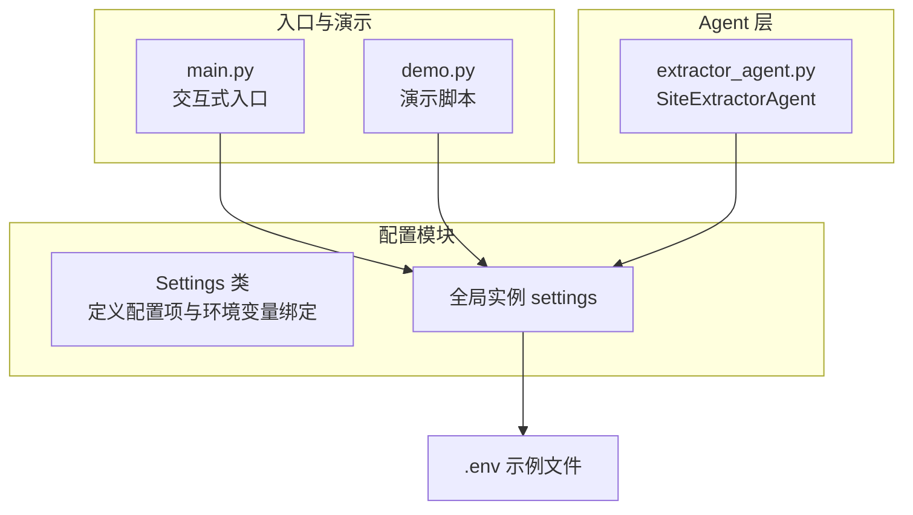
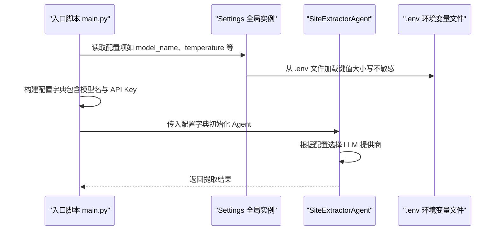
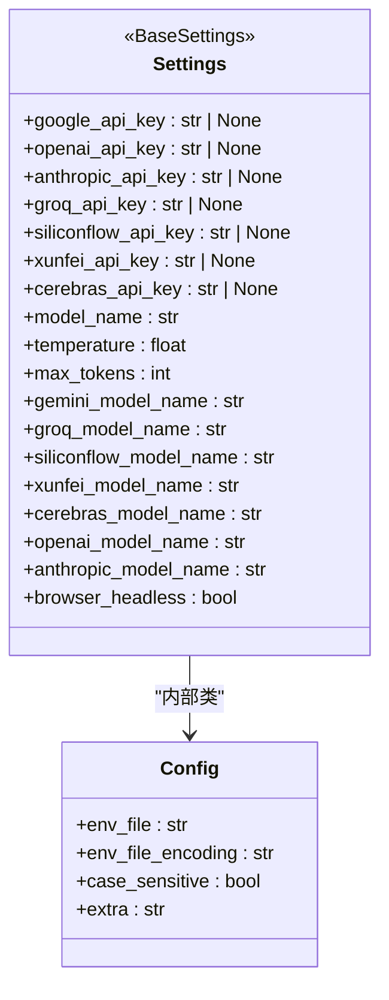
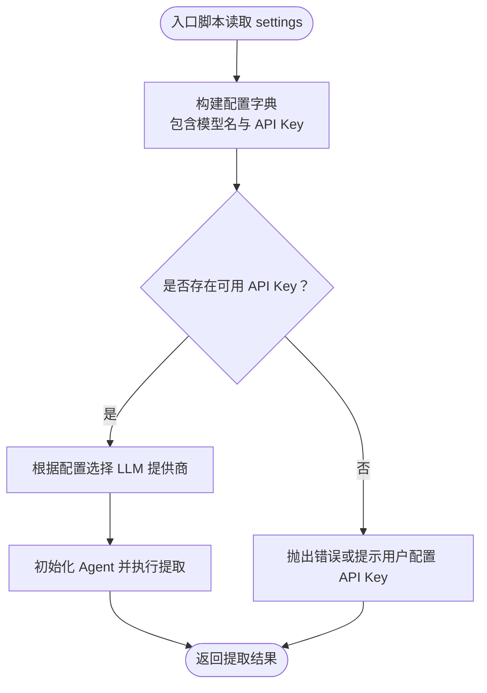
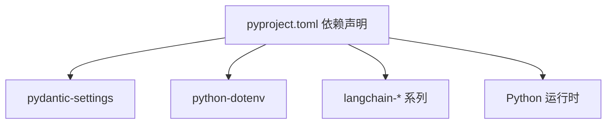

# 配置类设计

<cite>
**本文引用的文件**
- [settings.py](file://src/config/settings.py)
- [main.py](file://src/main.py)
- [demo.py](file://src/demo.py)
- [extractor_agent.py](file://src/agents/extractor_agent.py)
- [pyproject.toml](file://pyproject.toml)
- [README.md](file://README.md)
- [.env.example](file://.env.example)
- [test_agent.py](file://tests/test_agent.py)
</cite>

## 目录
1. [简介](#简介)
2. [项目结构](#项目结构)
3. [核心组件](#核心组件)
4. [架构总览](#架构总览)
5. [详细组件分析](#详细组件分析)
6. [依赖分析](#依赖分析)
7. [性能考虑](#性能考虑)
8. [故障排查指南](#故障排查指南)
9. [结论](#结论)
10. [附录](#附录)

## 简介
本文件围绕 Site Info Extractor Agent 的配置类设计进行系统化说明，重点聚焦于 Settings 类的实现原理与使用方式。内容涵盖：
- 使用 Pydantic 的配置管理机制与类型验证
- 配置项的定义、默认值与环境变量绑定
- 继承关系与扩展方式（新增配置项与自定义验证）
- 与环境变量的映射、类型转换与必填项检查
- 在系统中的作用及与 Agent、入口脚本等组件的交互
- 使用示例、最佳实践与常见问题排查

## 项目结构
配置类位于配置模块中，通过全局实例对外提供统一访问；入口脚本与演示脚本均直接引用该实例；Agent 在运行时根据配置字典动态选择 LLM 提供商。

图表来源
- [settings.py](file://src/config/settings.py#L9-L55)
- [main.py](file://src/main.py#L20-L21)
- [demo.py](file://src/demo.py#L15-L15)
- [extractor_agent.py](file://src/agents/extractor_agent.py#L97-L114)
- [.env.example](file://.env.example#L1-L9)

章节来源
- [settings.py](file://src/config/settings.py#L1-L56)
- [main.py](file://src/main.py#L1-L254)
- [demo.py](file://src/demo.py#L1-L51)
- [extractor_agent.py](file://src/agents/extractor_agent.py#L1-L330)

## 核心组件
- Settings 类：集中定义所有配置项，包括 API Key、模型参数、提供商特定模型名、浏览器配置等，并通过内部 Config 类声明环境变量文件与编码等行为。
- 全局实例 settings：在模块加载时创建，供其他模块直接导入使用。
- 环境变量绑定：通过 pydantic-settings 的 BaseSettings 自动从 .env 文件读取键值，键名遵循约定命名规则（大小写不敏感），并自动进行类型转换与校验。

章节来源
- [settings.py](file://src/config/settings.py#L9-L55)

## 架构总览
Settings 类作为配置中心，贯穿应用生命周期：
- 入口脚本在启动时打印当前配置并据此构建 Agent 的初始配置字典
- Agent 在运行时根据配置字典选择合适的 LLM 提供商
- 演示脚本直接使用 settings 获取模型名与 API Key

图表来源
- [main.py](file://src/main.py#L34-L182)
- [settings.py](file://src/config/settings.py#L46-L51)
- [extractor_agent.py](file://src/agents/extractor_agent.py#L97-L193)

## 详细组件分析

### Settings 类实现与类型验证
- 继承关系：Settings 继承自 pydantic_settings.BaseSettings，从而获得从环境变量加载配置的能力与类型验证。
- 配置项定义：以类型注解与默认值的形式声明，例如 API Key 字段为可空字符串，模型参数字段具有明确的默认值。
- 内部 Config 类：用于控制环境变量文件位置、编码、大小写敏感性与额外字段处理策略。

图表来源
- [settings.py](file://src/config/settings.py#L9-L51)

章节来源
- [settings.py](file://src/config/settings.py#L9-L55)

### 环境变量绑定机制
- 键名映射：Settings 中的字段名与 .env 文件中的键名一一对应，且大小写不敏感。
- 类型转换：BaseSettings 会自动将字符串类型的环境变量转换为声明的类型（如整数、浮点数、布尔值）。
- 必填项检查：对于非可空类型，若 .env 中缺失对应键，将在实例化时触发校验错误；可空类型则允许缺失。
- 编码与额外字段：通过 Config 控制 .env 文件编码与多余字段的处理策略。

章节来源
- [settings.py](file://src/config/settings.py#L46-L51)
- [.env.example](file://.env.example#L1-L9)

### 配置类的扩展方式
- 新增配置项：在 Settings 类中添加新的字段（带类型注解与默认值），即可自动纳入环境变量绑定范围。
- 自定义验证规则：可在 Settings 上添加自定义方法或使用 Pydantic 的验证装饰器实现复杂校验（如字段间互斥、组合条件等）。当前代码未显式添加自定义验证，但框架已具备扩展能力。
- 分组组织：按功能分组（API Key、模型参数、提供商特定模型、浏览器配置）有助于维护与阅读。

章节来源
- [settings.py](file://src/config/settings.py#L12-L44)

### 配置类与系统组件的交互
- 入口脚本：读取 settings 的模型参数与浏览器配置，构建 Agent 的初始配置字典，并根据 API Key 的可用性动态选择 LLM 提供商。
- Agent：接收配置字典，依据其中的 API Key 与模型名选择对应的 LLM 提供商实例。
- 演示脚本：直接使用 settings 获取 Google 模型名与 API Key，用于演示 LLM 调用。

图表来源
- [main.py](file://src/main.py#L48-L182)
- [extractor_agent.py](file://src/agents/extractor_agent.py#L97-L193)

章节来源
- [main.py](file://src/main.py#L34-L182)
- [extractor_agent.py](file://src/agents/extractor_agent.py#L97-L193)

### 使用示例与最佳实践
- 配置实例化与验证
  - 直接导入 settings 即可访问所有配置项；首次访问时会从 .env 文件加载并进行类型转换与校验。
  - 若缺少必要键，将在实例化阶段报错；可通过补充 .env 文件解决。
- 配置更新
  - 全局实例 settings 为不可变对象，建议通过修改 .env 文件后重启进程使新配置生效。
  - 如需在运行时覆盖部分配置，可在入口脚本中构建配置字典并传入 Agent，实现局部覆盖。
- 最佳实践
  - 将敏感信息（API Key）置于 .env 文件中，避免硬编码。
  - 明确区分“通用模型参数”和“提供商特定模型名”，便于在不同提供商之间切换。
  - 保持 .env 文件与代码分离，确保安全与可移植性。

章节来源
- [settings.py](file://src/config/settings.py#L46-L55)
- [main.py](file://src/main.py#L34-L182)
- [demo.py](file://src/demo.py#L22-L33)

## 依赖分析
- 依赖库
  - pydantic-settings：提供 BaseSettings，实现从环境变量加载配置与类型验证。
  - python-dotenv：配合 pydantic-settings 读取 .env 文件。
  - langchain-* 系列：根据配置选择不同的 LLM 提供商。
- 版本与兼容性
  - 项目声明了 pydantic 与 pydantic-settings 的版本范围，确保配置类功能稳定。
  - 由于 Python 3.14 与 Pydantic V1 的兼容性问题，入口脚本与测试脚本中均抑制了相关警告。

图表来源
- [pyproject.toml](file://pyproject.toml#L28-L47)

章节来源
- [pyproject.toml](file://pyproject.toml#L28-L47)
- [main.py](file://src/main.py#L17-L18)
- [test_agent.py](file://tests/test_agent.py#L10-L15)

## 性能考虑
- 配置加载时机：settings 在模块导入时一次性加载并缓存，后续访问无需重复 IO。
- 类型转换开销：BaseSettings 的类型转换在实例化时完成，通常可忽略不计。
- 环境变量读取：.env 文件仅在初始化时读取一次，运行期无额外开销。

## 故障排查指南
- 未检测到 API Key
  - 现象：入口脚本提示未检测到 API Key。
  - 排查：确认 .env 文件中是否正确设置了对应键（如 GOOGLE_API_KEY、OPENAI_API_KEY 等）。
- 模型未找到或 404 错误
  - 现象：调用 LLM 时出现模型未找到错误。
  - 排查：尝试更换 settings 中的提供商默认模型名，或在 .env 中提供正确的 API Key。
- 类型转换错误
  - 现象：实例化 settings 时报类型错误。
  - 排查：检查 .env 中对应键的值是否符合声明类型（如整数、浮点数、布尔值）。
- 大小写敏感问题
  - 现象：键名不生效。
  - 排查：Settings 的 Config 已设置大小写不敏感，确保键名与字段名一致。

章节来源
- [main.py](file://src/main.py#L235-L240)
- [README.md](file://README.md#L89-L92)
- [settings.py](file://src/config/settings.py#L46-L51)

## 结论
Settings 类通过 pydantic-settings 实现了简洁、可靠的配置管理，具备以下优势：
- 统一的配置入口与类型安全
- 与环境变量的无缝绑定与自动类型转换
- 清晰的分组与扩展能力
- 与 Agent、入口脚本的自然协作

在实际使用中，建议遵循“配置外置、类型明确、最小暴露”的原则，结合 .env 文件与运行时配置字典实现灵活可控的系统行为。

## 附录
- 环境变量示例与用途
  - GOOGLE_API_KEY：Google Gemini 模型所需密钥
  - OPENAI_API_KEY：OpenAI 模型所需密钥
  - ANTHROPIC_API_KEY：Anthropic 模型所需密钥
  - 其他提供商密钥：按需配置

章节来源
- [.env.example](file://.env.example#L1-L9)
- [README.md](file://README.md#L27-L50)