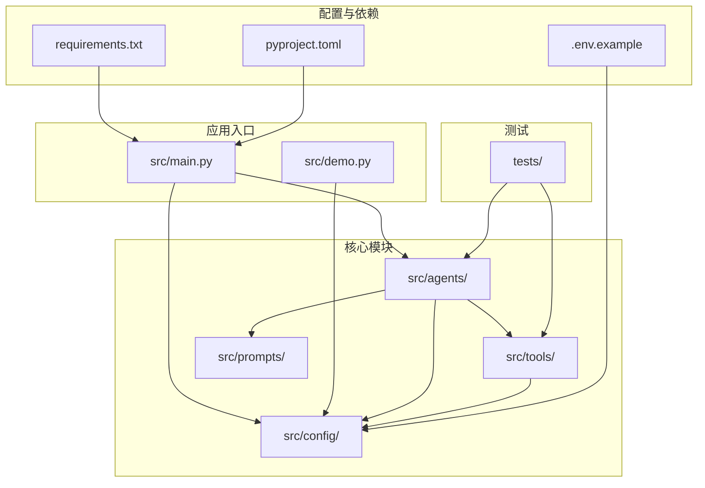
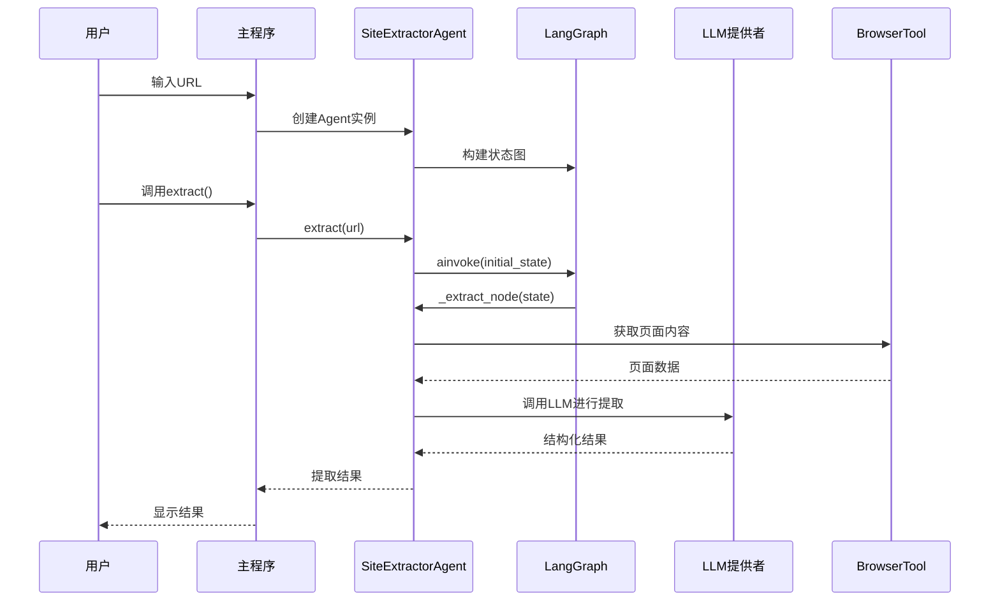
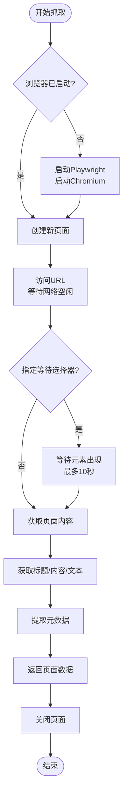
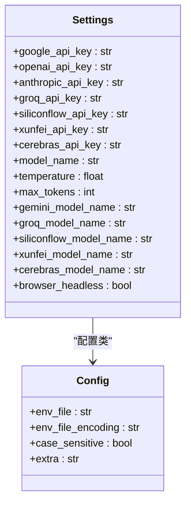
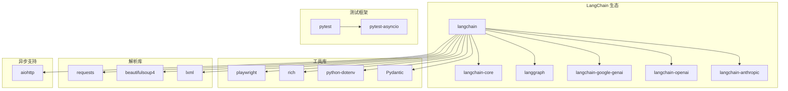

# 项目概述

<cite>
**本文档引用的文件**
- [README.md](file://README.md)
- [src/main.py](file://src/main.py)
- [src/demo.py](file://src/demo.py)
- [src/agents/extractor_agent.py](file://src/agents/extractor_agent.py)
- [src/tools/browser_tool.py](file://src/tools/browser_tool.py)
- [src/config/settings.py](file://src/config/settings.py)
- [src/prompts/system_prompt.md](file://src/prompts/system_prompt.md)
- [requirements.txt](file://requirements.txt)
- [pyproject.toml](file://pyproject.toml)
- [tests/test_agent.py](file://tests/test_agent.py)
- [.env.example](file://.env.example)
</cite>

## 目录
1. [简介](#简介)
2. [项目结构](#项目结构)
3. [核心组件](#核心组件)
4. [架构总览](#架构总览)
5. [详细组件分析](#详细组件分析)
6. [依赖关系分析](#依赖关系分析)
7. [性能考虑](#性能考虑)
8. [故障排除指南](#故障排除指南)
9. [结论](#结论)
10. [附录](#附录)

## 简介
Site Info Extractor Agent 是一个基于 LangChain 和 LangGraph 构建的智能网站信息提取 Agent 系统。该项目的核心价值在于通过多模型支持、异步处理和可扩展的工具系统，为用户提供稳定、高效的网页信息提取能力。系统支持多种 LLM 提供商（Google Gemini、OpenAI、Anthropic、Groq、SiliconFlow、讯飞、Cerebras），能够从复杂网页中提取结构化信息，并提供友好的交互式体验。

该项目的设计理念强调：
- **多模型支持**：统一抽象不同 LLM 提供商的 API 接口
- **异步处理**：充分利用现代异步编程提升性能
- **可扩展性**：模块化设计便于添加新功能和工具
- **用户体验**：提供直观的交互界面和详细的配置选项

## 项目结构
项目采用清晰的分层架构，按照功能模块进行组织：



**图表来源**
- [src/main.py](file://src/main.py#L1-L254)
- [src/agents/extractor_agent.py](file://src/agents/extractor_agent.py#L1-L330)
- [src/tools/browser_tool.py](file://src/tools/browser_tool.py#L1-L108)

**章节来源**
- [README.md](file://README.md#L57-L72)
- [src/main.py](file://src/main.py#L1-L254)

## 核心组件
项目由四个核心组件构成，每个组件都有明确的职责分工：

### 1. SiteExtractorAgent（主代理）
负责协调整个提取流程，管理状态机和 LLM 交互。支持多种 LLM 提供商的动态切换，具备完善的错误处理机制。

### 2. BrowserTool（浏览器工具）
基于 Playwright 实现的异步网页抓取工具，支持无头/有头模式，提供页面内容获取、元数据提取等功能。

### 3. 配置管理系统
使用 Pydantic Settings 管理应用配置，支持环境变量注入和默认值设置。

### 4. 系统提示词管理
集中管理提取任务的系统提示词，定义提取规则、输出格式和质量要求。

**章节来源**
- [src/agents/extractor_agent.py](file://src/agents/extractor_agent.py#L90-L330)
- [src/tools/browser_tool.py](file://src/tools/browser_tool.py#L10-L108)
- [src/config/settings.py](file://src/config/settings.py#L9-L56)
- [src/prompts/system_prompt.md](file://src/prompts/system_prompt.md#L1-L212)

## 架构总览
系统采用事件驱动的状态机架构，结合异步编程模式：



**图表来源**
- [src/main.py](file://src/main.py#L210-L212)
- [src/agents/extractor_agent.py](file://src/agents/extractor_agent.py#L219-L239)
- [src/tools/browser_tool.py](file://src/tools/browser_tool.py#L44-L80)

系统架构的关键特点：
- **状态管理**：使用 LangGraph 实现状态机式的工作流管理
- **异步执行**：所有 I/O 操作均采用异步模式
- **插件化设计**：支持动态加载不同的 LLM 提供商
- **错误恢复**：完善的异常处理和错误恢复机制

## 详细组件分析

### SiteExtractorAgent 组件分析
SiteExtractorAgent 是系统的核心控制器，实现了完整的提取工作流：

```mermaid
classDiagram
class SiteExtractorAgent {
-config : dict
-llm : BaseChatModel
-graph : StateGraph
+__init__(config)
-_create_llm()
-_build_graph()
+extract(url) dict
-_extract_node(state) AgentState
}
class AgentState {
+messages : Sequence[BaseMessage]
+extracted_info : dict
+url : str
}
class BrowserTool {
-headless : bool
-browser : Browser
-playwright : Playwright
+__aenter__()
+__aexit__()
+start()
+close()
+fetch_page(url, wait_for) dict
-_get_metadata(page) dict
}
SiteExtractorAgent --> AgentState : "管理状态"
SiteExtractorAgent --> BrowserTool : "使用工具"
SiteExtractorAgent --> "LLM提供者" : "动态加载"
```

**图表来源**
- [src/agents/extractor_agent.py](file://src/agents/extractor_agent.py#L77-L330)
- [src/tools/browser_tool.py](file://src/tools/browser_tool.py#L10-L108)

#### LLM 提供商支持
系统支持七种不同的 LLM 提供商，按优先级顺序选择：

1. **Google Gemini**（首选）
2. **OpenAI**（备选）
3. **Anthropic**（备选）
4. **Groq**（备选）
5. **SiliconFlow**（备选）
6. **讯飞**（备选）
7. **Cerebras**（备选）

每种提供商都有对应的配置参数和默认模型选择。

#### 提取流程控制
提取流程采用状态机模式，包含以下步骤：
1. 初始化状态（设置 URL 和消息历史）
2. 调用 LLM 进行信息提取
3. 解析 LLM 响应为结构化数据
4. 处理提取结果或错误状态
5. 更新消息历史和状态信息

**章节来源**
- [src/agents/extractor_agent.py](file://src/agents/extractor_agent.py#L90-L330)

### BrowserTool 组件分析
BrowserTool 提供了强大的网页抓取能力，基于 Playwright 实现：



**图表来源**
- [src/tools/browser_tool.py](file://src/tools/browser_tool.py#L44-L80)

BrowserTool 的核心功能包括：
- **异步生命周期管理**：支持 async 上下文管理器
- **页面内容获取**：标题、HTML 内容、纯文本
- **元数据提取**：描述、关键词、OpenGraph 标签
- **错误处理**：运行时错误检测和异常抛出

**章节来源**
- [src/tools/browser_tool.py](file://src/tools/browser_tool.py#L10-L108)

### 配置管理系统分析
配置系统采用 Pydantic Settings 提供强类型配置管理：



**图表来源**
- [src/config/settings.py](file://src/config/settings.py#L9-L56)

配置系统的特性：
- **环境变量支持**：自动从 .env 文件加载配置
- **类型安全**：Pydantic 提供运行时类型检查
- **默认值管理**：为每个配置项提供合理默认值
- **可扩展性**：易于添加新的配置项

**章节来源**
- [src/config/settings.py](file://src/config/settings.py#L9-L56)

## 依赖关系分析
项目依赖关系清晰，遵循松耦合设计原则：



**图表来源**
- [requirements.txt](file://requirements.txt#L1-L36)
- [pyproject.toml](file://pyproject.toml#L28-L47)

**章节来源**
- [requirements.txt](file://requirements.txt#L1-L36)
- [pyproject.toml](file://pyproject.toml#L1-L75)

## 性能考虑
系统在设计时充分考虑了性能优化：

### 异步处理优势
- **非阻塞 I/O**：所有网络请求和文件操作均为异步
- **并发执行**：支持多个提取任务并行处理
- **资源复用**：浏览器实例和 LLM 连接的高效管理

### 缓存和重用策略
- **浏览器缓存**：Playwright 自动处理浏览器缓存
- **LLM 会话**：长连接减少握手开销
- **状态复用**：LangGraph 状态机避免重复计算

### 内存管理
- **及时释放**：异步上下文确保资源正确释放
- **分页处理**：大型页面内容分块处理
- **错误隔离**：单个任务失败不影响整体系统

## 故障排除指南
常见问题及解决方案：

### LLM API Key 配置问题
**症状**：启动时报错提示缺少 API Key
**解决方法**：
1. 复制 `.env.example` 为 `.env`
2. 在 `.env` 文件中填入相应的 API Key
3. 确认 API Key 格式正确且有效

### 模型不可用问题
**症状**：出现模型未找到错误（404 NOT_FOUND）
**解决方法**：
1. 尝试使用其他可用模型
2. 检查模型是否需要在相应平台手动启用
3. 查看官方文档确认模型可用性

### 浏览器启动失败
**症状**：Playwright 无法启动浏览器
**解决方法**：
1. 确保已安装 Playwright 浏览器：`playwright install`
2. 检查系统依赖是否满足
3. 尝试禁用无头模式进行调试

### 性能问题
**症状**：提取速度慢或内存占用高
**解决方法**：
1. 调整 `max_tokens` 参数
2. 适当提高 `temperature` 值
3. 检查网络连接稳定性

**章节来源**
- [README.md](file://README.md#L27-L50)
- [src/main.py](file://src/main.py#L235-L240)

## 结论
Site Info Extractor Agent 是一个设计精良的智能网站信息提取系统，具有以下突出优势：

### 技术优势
- **多模型支持**：统一抽象不同 LLM 提供商的差异
- **异步架构**：充分利用现代异步编程提升性能
- **可扩展设计**：模块化架构便于功能扩展
- **健壮性**：完善的错误处理和恢复机制

### 实用价值
- **易用性**：提供友好的交互式界面
- **灵活性**：支持多种提取策略和配置选项
- **可靠性**：经过测试验证的功能稳定性
- **安全性**：环境变量管理确保密钥安全

### 发展前景
项目为后续功能扩展奠定了良好基础，包括：
- 更丰富的提取规则和策略
- 支持更多 LLM 提供商
- 增强的错误诊断和日志系统
- 更完善的测试覆盖

## 附录

### 支持的模型列表
系统支持以下 LLM 模型：

| 提供商 | 默认模型 | 其他可用模型 |
|--------|----------|--------------|
| Google Gemini | gemini-2.5-flash | gemini-1.5-flash, gemini-1.5-pro, gemini-pro |
| OpenAI | gpt-4o-mini | gpt-4o, gpt-3.5-turbo |
| Anthropic | claude-3-5-sonnet-20241022 | claude-3-opus-20240229 |
| Groq | llama-3.3-70b-versatile | - |
| SiliconFlow | tencent/Hunyuan-MT-7B | 多种模型可选 |
| 讯飞 | Qwen3-1.7B | - |
| Cerebras | gpt-oss-120b | - |

### 环境变量配置
基本配置项：
- `GOOGLE_API_KEY`：Google Gemini API Key（必需）
- `OPENAI_API_KEY`：OpenAI API Key（可选）
- `ANTHROPIC_API_KEY`：Anthropic API Key（可选）
- `GROQ_API_KEY`：Groq API Key（可选）
- `SILICONFLOW_API_KEY`：SiliconFlow API Key（可选）
- `XUNFEI_API_KEY`：讯飞 API Key（可选）
- `CEREBRAS_API_KEY`：Cerebras API Key（可选）

**章节来源**
- [README.md](file://README.md#L83-L92)
- [.env.example](file://.env.example#L1-L9)